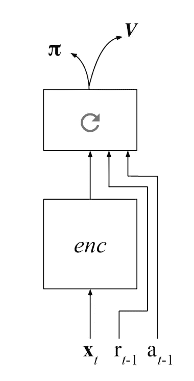
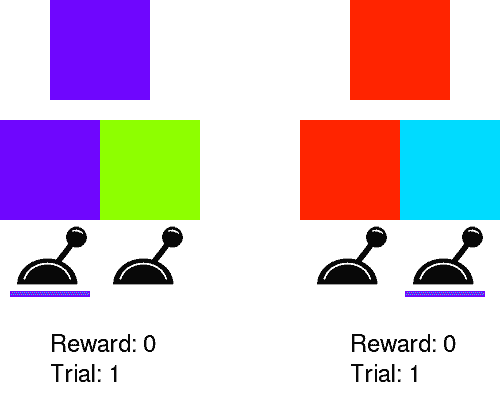
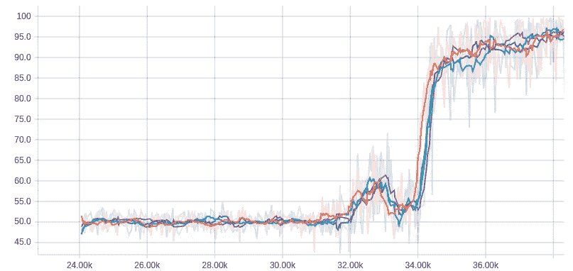
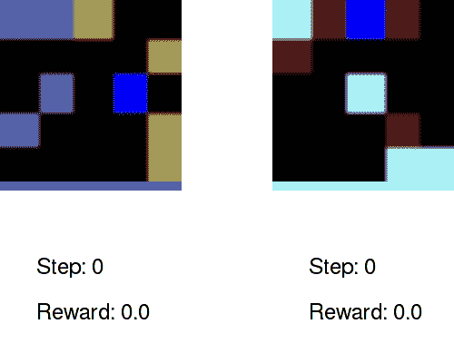

# 学习策略的学习策略 Tensorflow 中的元强化学习(RL)

> 原文：<https://medium.com/hackernoon/learning-policies-for-learning-policies-meta-reinforcement-learning-rl%C2%B2-in-tensorflow-b15b592a2ddf>

强化[学习](https://hackernoon.com/tagged/learning)为训练智能体解决世界上的问题提供了一个框架。然而，这些药物的局限性之一是一旦训练后它们就变得不灵活。他们能够 ***学习一个策略*** 来解决一个特定的问题(形式化为[【MDP】](https://en.wikipedia.org/wiki/Markov_decision_process))，但是那个学到的策略在新的问题中往往是无用的，甚至是相对相似的问题。

想象一个最简单的智能体:一个被训练来解决一个双臂强盗任务的智能体，其中一只手臂总是提供积极的奖励，而另一只手臂总是不提供奖励。使用任何 RL 算法，如 [Q-Learning](/emergent-future/simple-reinforcement-learning-with-tensorflow-part-0-q-learning-with-tables-and-neural-networks-d195264329d0#.wumdmxvwr) 或[策略梯度](/@awjuliani/super-simple-reinforcement-learning-tutorial-part-2-ded33892c724#.ubzle1w4z)，代理可以快速学会总是选择具有正回报的手臂。在这一点上，我们可能会忍不住说，我们已经建立了一个代理，可以解决双臂土匪的问题。但是我们真的做到了吗？如果我们把我们训练有素的代理人交给它一个几乎相同的强盗问题，除了手臂的值被交换之外，会发生什么？在这个新的设置中，代理的表现会比随机差，因为它会简单地选择它以前认为是正确的手臂。在传统的 RL 范例中，我们唯一的办法是在这个新的强盗上训练一个新的代理，在另一个新的任务上训练另一个新的代理，等等。

如果这种再培训是不必要的呢？如果我们可以让代理 ***学习一个策略来学习新策略*** 会怎么样？这样的代理可以被训练来解决不仅仅是一个单独的强盗问题，而且可以解决将来可能遇到的所有类似的强盗问题。这种学习策略的方法被称为元强化学习(Meta-RL)，它是该领域中最令人兴奋和最有前途的最新发展之一。

在 Meta-RL 中，一个基于 RNN 的代理被训练来学习动态地利用问题的结构。这样做，它可以学习解决新问题，而不需要重新训练，只需要调整它的隐藏状态。描述 Meta-RL 的原著是由[王静莹](https://twitter.com/janexwang)和她在 DeepMind 的同事们去年在他们的论文中发表的: [*学习强化学习*](https://arxiv.org/abs/1611.05763) 。我强烈建议查看那篇原始文章，以深入了解算法的开发。事实证明，这个想法也是由 OpenAI 和伯克利的团队独立开发的，并在他们最近的论文 [*RL2:通过慢速强化学习*](https://arxiv.org/abs/1611.02779) *进行快速强化学习中进行了描述。*自从我第一次通过 DeepMind 论文熟悉这些概念以来，这就是我在设计自己的实现时遵循的概念。

在这篇文章中，我想首先描述如何用执行元增强学习的能力来扩充 A3C 算法。接下来，我将展示如何使用它来解决某些问题，对于这些问题，元策略可以应用于解决 MDP 族，而无需再培训。该模型的一个 [Tensorflow](https://hackernoon.com/tagged/tensorflow) 实现以及每个实验的代码可以在这个 GitHub Repo: [Meta-RL](https://github.com/awjuliani/Meta-RL) 获得。

## 制作元代理

Meta-RL 系统中的关键成分是递归神经网络(RNN)。这种体系结构的循环性质允许代理学习元策略，因为它可以根据新的输入随时调整输出。如果最后一点听起来很熟悉，这正是神经网络的传统反向传播训练过程所可能实现的。相反，在这里，我们将训练 RNN 学会通过改变隐藏状态来调整自己，而不是对每个新任务都需要反向投影或其他外部调整干预。为了实现这一点，我们需要的不仅仅是网络的标准*状态- >动作*设置。除了观察`x(t)`之外，我们还会把之前的奖励`r(t-1)`和之前的动作`a(t-1)`喂给 RNN。有了这三样东西，网络就可以把以前的状态-动作对和它们的奖励联系起来，这样就可以相应地调整未来的动作。作为旁注，我们不需要向 RNN 提供先前的观察`x(t-1)`，因为它已经在先前的时间步看到了它！添加`r(t-1)`和`a(t-1)`可以让代理始终了解其行动的全貌以及他们在任务中的成功。

The general Meta-RL framework when adapting from A3C.

幸运的是，A3C 算法已经完成了 Meta-RL 的一半。由于它从 RNN 开始，我们只需要向网络提供额外的`r(t-1)`和`a(t-1)`输入，它就能够学习执行元策略学习！

## 元实验

在描述我进行的实验之前，我想谈谈 Meta-RL 工作的场景和不工作的场景。Meta-RL 不是魔法，我们不能在 Pong 上训练代理，让他们在没有重新训练的情况下玩 Breakout(至少目前是这样)。这里成功的关键是，我们有兴趣学习一种政策，以便在类似的 MDP 或强盗家庭中学习一种政策。因此，在土匪的情况下，有可能学习一种元策略，用于学习一族看不见的双臂土匪问题。只要问题的基本逻辑保持不变，这同样适用于学习上下文强盗、网格世界、3D 迷宫等等。

测试我们代理的最简单的方法是使用本文开头描述的双臂土匪问题。在这种情况下，没有观察值`x`。相反，作者添加了一个时间步长输入`t`,它允许网络维护任务中的时间概念。我在所有的实验中也使用了这个额外的`t`输入。

土匪的性质如下:随机选择的一条手臂以概率`p`提供+1 的奖励，否则提供 0 的奖励。另一只手臂以概率`1-p`提供+1 奖励。以这种方式，两臂彼此反向相关，找到一臂的某些信息也提供了另一臂的信息。对人类来说，一个理想的策略是每只手臂都试几次，然后找出哪只手臂更常提供+1 奖励。这实质上是我们希望代理学习的元策略。

在实验中，每一集包括 100 次试验。经过 20，000 次训练，元代理能够在未知的测试集环境中快速灵活地调整其策略。正如您在下图(右图)中看到的，仅经过几次尝试，就发现并利用了最佳手臂。这与没有额外元使能输入(左)的代理相反，它在整个事件中随机行动，积累很少奖励。

Trained meta-A3C agent performance on random test-set bandits **without (left)** and **with (right)** additional `r(t-1)` and a(t-1) inputs. Top numbers indicate reward probability. Blue indicates agent action selection. Green bars indicate cumulative reward over episode.

**Rainbow Bandit*s****—尝试元策略学习的下一个逻辑步骤是添加状态输入`x`，以允许基于观察的动作。对于这种情况，我创建了一个 bandit，其中观察到的状态是由两种随机颜色组成的 2 像素图像。其中一种颜色在剧集开始时设置为“正确”，对应的手臂会一直提供+1 的奖励。另一种颜色总是对应于奖励 0。在一集(100 次试验)期间，这两种颜色在每次试验中以随机顺序并排显示。相应地，提供奖励的手臂会随着颜色的变化而变化。这一次，一个理想的策略不仅仅是尝试双臂，而是学习奖励跟随颜色，并发现两种颜色中的哪一种提供奖励。经过 30，000 次训练，Meta-RL 代理学会了解决这些问题的正确策略。*

**

*Trained meta-A3C agent performance on random test-set rainbow bandits **without (left)** and **with (right)** additional `r(t-1)` and a(t-1) inputs. Top color indicated reward giving arm. Blue bar indicates agent action selection.*

*有趣的是，如果我们在这项任务的训练中查看性能曲线，我们会发现一些意想不到的东西(至少对我来说)。与大多数曲线不同，在大多数曲线中，总体趋势是平滑连续的，性能有所提高，但这里有一个单独的不连续跳跃。在 5000 集左右的时间里，代理人从随机表现到近乎完美的表现。*

**

*There seems to be a discrete jump in performance as the agent’s behavior changes from random action to employing a successful strategy.*

*直觉上，这对于任务来说是有意义的，因为你要么是在应用策略，在这种情况下会获得近乎完美的表现，要么不是，在这种情况下，随着时间的推移，表现处于偶然水平。这本身并不显著，但对我来说，令人信服的是，代理人事先已经训练了几个小时，慢慢调整重量，没有明显的行为变化。然后，所有的事情突然“咔嚓”一声到位，一个全新的行为模式出现了。这与心理学家在儿童发展的认知能力中发现的情况类似。某些认知技能，如物体持久性，似乎是发展过程中的离散变化，但它们是由大脑连线的持续变化所支撑的。这些类型的涌现行为被作为[动态系统理论](https://en.wikipedia.org/wiki/Dynamical_systems_theory) [认知方法](https://www.amazon.com/Mind-Life-Biology-Phenomenology-Sciences/dp/0674057511/)的一部分进行研究，看到类似的现象出现在 RL 代理的环境中是令人兴奋的！*

***彩虹网格世界*s***——对于最后的实验，我想在一个完整的 MDP 环境中测试一个元代理，还有什么比早期教程中使用的网格世界更好的呢？在这个环境中，代理由小网格中的蓝色方块表示。代理可以上下左右移动，在正方形 5x5 环境中移动。在环境中，有随机放置的一种颜色的方块，在接触时提供+1 奖励，以及相同数量的随机放置的另一种颜色的方块，提供 0 奖励。就像《彩虹大盗》中的情况一样，这里的颜色是模糊的，因为通过随机选择每集的颜色，MDP 变成了 MDP 家族。最佳策略是检查其中一个方块，并发现它是否提供奖励。如果是这样，那么那个颜色的方块应该是给定情节的目标。如果不是，那么另一种颜色表示奖励。每一集由 100 个步骤组成，经过 30，000 次训练，元代理学习到了这个最优策略的近似值。*

**

*Meta-A3C agent performance on random test-set grid worlds **without (left)** and **with (right)** additional `r(t-1)` and a(t-1) inputs. Colored bar below grid indicates reward-giving goals, and is importantly not part of network input.*

***Beyond—** 在他们的 DeepMind 论文中，作者讨论了利用 Meta-RL 进行 3D 迷宫学习(在论文中进一步讨论)，以及另一项旨在模拟灵长类动物认知实验的 3D 任务。整篇论文非常值得一读，我推荐给那些对算法的细节感兴趣的人，以及他们进行的一系列实验的确切性质。我希望将来能够看到这项技术在各种任务中的应用。人工智能的一个长期目标是训练能够灵活适应环境并以安全有效的方式“移动”学习的智能体。Meta-RL/RL 是朝着这个方向迈出的激动人心的一步。*

*我希望这个演练和实验已经给出了一些关于 Meta-RL 的能力的直觉，以及它适用的地方。如果你想在自己的项目中使用 Meta-RL，请随意分享或贡献给我的 [Github 库](https://github.com/awjuliani/Meta-RL)！*

*如果你想关注我关于深度学习、人工智能和认知科学的文章，请在 Medium @ [Arthur Juliani](https://medium.com/u/18dfe63fa7f0?source=post_page-----b15b592a2ddf--------------------------------) 或 twitter [@awjliani](https://twitter.com/awjuliani) 上关注我。*

*请考虑 [*捐赠*](https://www.paypal.com/cgi-bin/webscr?cmd=_donations&business=V2R22DV4XSR5Y&lc=US&item_name=Arthur%20Juliani%27s%20Deep%20Learning%20Tutorials&currency_code=USD&bn=PP%2dDonationsBF%3abtn_donateCC_LG%2egif%3aNonHosted) 来帮助支持未来的教程、文章和实现。任何贡献都非常感谢！*

******

> *[黑客中午](http://bit.ly/Hackernoon)是黑客如何开始他们的下午。我们是 AMI 家庭的一员。我们现在[接受投稿](http://bit.ly/hackernoonsubmission)并乐意[讨论广告&赞助](mailto:partners@amipublications.com)机会。*
> 
> *如果你喜欢这个故事，我们推荐你阅读我们的[最新科技故事](http://bit.ly/hackernoonlatestt)和[趋势科技故事](https://hackernoon.com/trending)。直到下一次，不要把世界的现实想当然！*

**