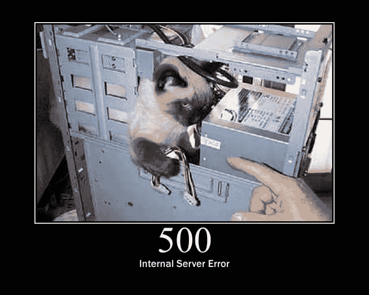
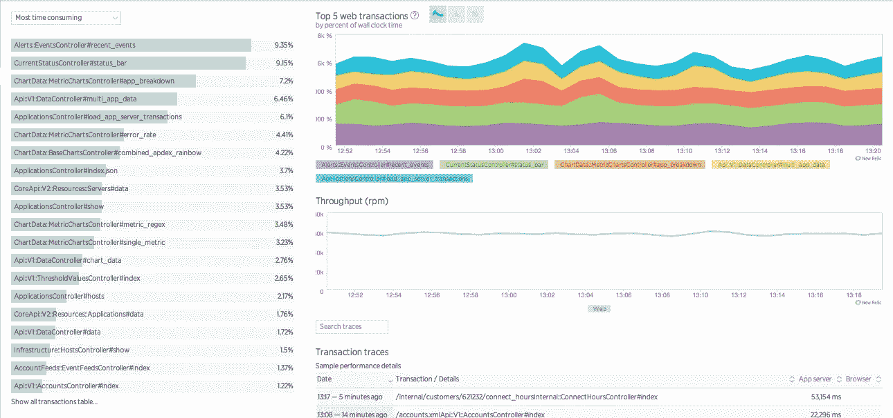
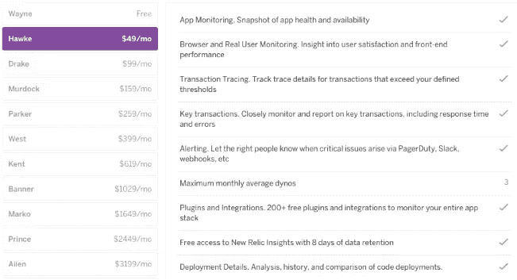
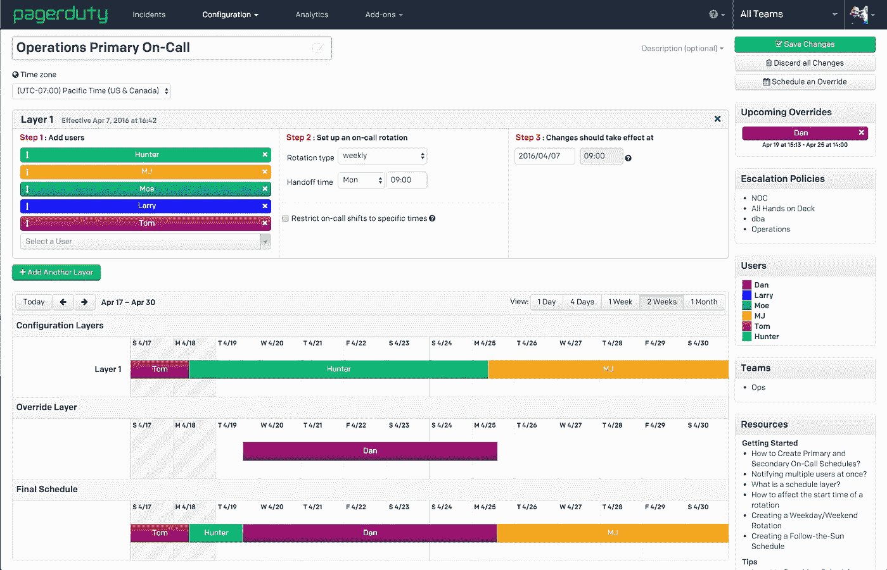

# 更少的单元测试更多的日志

> 原文：<https://medium.com/hackernoon/less-unit-tests-more-logs-8acbfedc24a0>

这是系列“[从零开始建立在线市场](https://hackernoon.com/building-an-online-marketplace-from-scratch-introduction-738839e4e76)”的第 4 部分。一系列关于如何快速设计和交付现代商业应用程序的文章。在这篇文章中，我们将详细阐述系统早期的平台监控和错误处理。



[https://http.cat](https://http.cat)

**的前三篇文章关注于如何快速构建系统的核心，以及如何有效地迭代，同时考虑到经常变化的业务需求**。作为一名想成为 CTO 的人，在阅读完本讲座后，你应该能够加速并自动化基本的订单管理流程。[管理层](https://hackernoon.com/tagged/management)和[营销](https://hackernoon.com/tagged/marketing)/客户服务/运营团队已经很感激将痛苦从平凡的体力工作中解脱出来，给他们一些时间来发挥创造力。

但是，正如你所想象的，快速软件交付涉及到偷工减料，或者我应该说，“边角案例”。您将自己和您的软件团队置于被来自外部和内部用户的大量意外错误攻击的风险之中；想想:未处理的表单数据、重复的订单、误删除的记录、来自大鱼客户端的超级重要的请求，这样的例子不胜枚举。突然之间，你从其他部门拿走的手工工作到了你的盘子里。现在，如何修复它？

一些软件保守主义者会说:“用厚厚的单元测试安全网覆盖你的蹩脚代码，你就能摆脱未实现的死角”。说起来容易做起来难？我们的观点是，在这个阶段添加单元测试没有什么意义。首先，代码变化如此频繁，以至于测试在下一周或者有时在一天内就会过时。第二，测试驱动的软件开发需要纪律和过程。它们需要时间。像 Manufaktura 这样的早期企业没有时间。

因此，**让我们看看你可以利用什么方法来减少团队中的错误处理工作，更重要的是，毕竟提高了服务质量**。我们将首先描述低挂水果，在最后一节，当谈到重量级监控工具时，为您指出正确的方向。

# 日志

## 统一结构

统一的日志记录结构对于错误处理是非常宝贵的。对于像 Manufaktura 这样的商业应用程序，我敢说它比任何测试集合都节省你(作为一个开发者)更多的时间，不管它们是单元测试还是端到端测试。但是，当您的业务逐渐成熟时，这对安全和开发团队也是有益的。


有一些关于伐木的[好的](https://logmatic.io/blog/beyond-application-monitoring-discover-logging-best-practices/) [资源](https://www.loggly.com/ultimate-guide/)，所以给他们一个彻底的阅读。除此之外，我们希望根据我们的经验列出最重要的规则:

*   每个 dev 都使用相同的统一日志结构
*   每个日志都有唯一的上下文标识符；您可以使用时间戳、业务组件、用户 ID、订单 ID、web 会话 ID 等。)
*   每个开发人员都特别关注详细的错误记录
*   它让你开始测量最重要/最流行的特性的执行时间；当规模达到时，它可能是有用的

详细的错误记录示例:

```
logger.error(“[EmailService] Email not sent — Order: %s Account: %s Message: %s Error: %j Stack: %j”, order.Id, account.Id, error, error, error && error.stack);
```

## 日志聚合器

现在，让我们看看为什么这些规则如此重要。如果没有一种简单的方法来分析日志，那么日志记录就没有什么意义。一种方法是将您的日志转储到服务器上的文件中，通过 ssh 登录，并使用您最喜欢的 bash 咒语进行浏览。但是这可能很耗时，并且分析本身可能不直观。还有，你得自己管理存储问题。

另一种方法是在任何流行的开源工具的基础上建立一个深度日志聚合器；[麋鹿](https://www.digitalocean.com/community/tutorials/how-to-install-elasticsearch-1-7-logstash-1-5-and-kibana-4-1-elk-stack-on-ubuntu-14-04)和格雷洛在这里特别相关。但是同样，设置和托管需要时间，特别是如果你没有 Linux 向导的话。此外，警报不是现成的，您必须配置和维护另一个软件包。

我希望你们带走的关键是警醒。能够定义关键错误消息并得到通知是早期系统可持续监控系统的基础。

想象一下，如果您可以选择哪些错误对您真正重要，如果您可以在格式良好的电子邮件或专用的 Slack 通道中获得错误上下文，将会节省多少时间。

那么，我们如何快速获得电子邮件/时差/短信提醒呢？答案是:我们将采用一个 SaaS 平台(您可能已经在我们的系列文章中注意到了这个模式)。

在过去几年中，日志聚合器市场已经成熟。你可以从[众多工具](https://dzone.com/articles/top-10-log-management-tools-1)中选择一个。然而，我们发现日志条目对我们的大多数项目来说是最好的。我们已经用了 3 年多了，它完全物有所值。为什么是日志条目？因为除了警报模块，它还提供了其他几个节省时间的功能，如:

*   用于搜索的类似 SQL 的查询语言
*   [聚合活尾搜索](https://docs.logentries.com/docs/live-tail)
*   日志的自定义标记
*   支持多个 PaaS (heroku addon)和 IaaS
*   能够聚合来自不同应用程序/服务的日志


让我们回到警报上来。使用日志条目创建电子邮件通知非常简单。您只需使用内置过滤器或正则表达式定义一个标签，然后定义哪个标签应该发送电子邮件以及谁会收到它。值得注意的是，你还可以调节频率。


在像 Manufaktura 这样的在线市场业务中，首席技术官会收到关于预期和意外错误的通知:

*   **预期**——有时你知道某个特定的情况还没有实现(因为优先级*)，但这种情况很少发生，简单的手动数据库更新就足够了。你只需要尽早得到通知。
*   **意外的** —所有其他的事情，比如服务器响应 500 或者超时

*正如我们在以前的帖子中提到的，区分哪些案例应该首先实现，哪些特性应该发布，这本身就是一项技能。学习它的唯一方法是艰难的——通过经验。好消息是，有了错误提示，您就有了一个方便的工具来减少错误选择的影响。

# 即插即用监控工具

想象一下，您可以获得一个复杂的应用程序性能控制面板，包括以下指标:

*   **请求总数**
*   **交易执行时间**
*   **数据库查询执行时间**
*   **全球延迟**

只需要写几行代码。这可以通过大量的应用性能 SaaS 工具来实现。其中最流行和最成熟的是新遗迹。它支持许多编程语言，并且已经发展了数百个集成，包括数据库、浏览器、基础设施、移动专用插件。但同时也很贵。这就是为什么看一看[替代方案](https://stackshare.io/performance-monitoring)是有好处的。



无论如何，在早期阶段你不需要大部分的新遗迹特征。你可以带着 APM 模块到处走。如果你在 heroku 上运行你的平台，New Relic 有一个有趣的 49 美元的提议给你:



New Relic 的另一个优点是警报模块。与日志条目警报类似，您可以订阅预期的意外情况。比如您的应用程序还无法处理的流量峰值。这为您提供了一种在麻烦真正袭来之前做出反应的方式，例如，您可以针对流量增加的时段扩大基础架构，或者尝试将作业排队并在稍后处理。

# 警报管理

## 传呼机职责

基本的 LogEntries 和 NewRelic 通知在电子邮件上运行。对于这两个工具，您还可以通过 webhooks 添加一个松弛通道。不幸的是，这些在你睡觉的时候没什么用。您的平台可能有一两个您甚至一分钟都不想停止的超级关键业务流程。

[传呼机职责](https://www.pagerduty.com/)处理此事。它给你短信/推送通知提醒，起价每月 9 美元。如果您想要添加电话呼叫提醒，或者如果您想要为您的团队应用随叫随到的调度规则，价格就会上涨。例如，您可以让传呼机值班人员首先呼叫汤姆，如果他不接电话(向传呼机值班人员承认他做出了反应)，它将呼叫迪克，最后呼叫哈里。

此外，当你进入他们的[集成](https://www.pagerduty.com/integrations)页面时，你会在 200 多个其他连接器中找到 LogEntries 和 New Relic。集成和[分类支持](https://www.pagerduty.com/features/event-intelligence-and-automation/)为您提供了一种将特定错误与负责任的开发人员联系起来的简单方法。



# 摘要

这 3 个 SaaS 监控工具是早期在线业务中物有所值的投资。配置和托管不需要专门的管理员，他们都为小团队提供服务(LogEntries $39，New Relic $49，PagerDuty $ 9)。您得到的是无价的——减少了开发团队的手工工作，提高了服务质量。有了这么厚的安全网，我们的 Manufaktura 准备开发更多的动力功能。在下一篇文章中，我们将解决其中之一— **电子邮件和短信通信**。

现在，随着功能数量的增长，基础设施也在膨胀，来自 SaaS 监控提供商的账单也在膨胀。这时，您可能需要重新考虑您的监控工具集，并使用自托管的开源产品。这些是一些市场领导者:

*   普罗米修斯系统和服务监控系统。它以给定的时间间隔从配置的目标收集度量，评估规则表达式，显示结果，并在观察到某个条件为真时触发预警。
*   [Grafana](https://github.com/grafana/grafana) —允许您查询、可视化、提醒和了解您的指标，无论它们存储在哪里(与 Prometheus 完美集成)。
*   [Consul](https://www.consul.io/) —一个用于发现和配置基础设施中的服务以及管理健康检查的工具。
*   [ELK](https://www.digitalocean.com/community/tutorials/how-to-install-elasticsearch-logstash-and-kibana-elk-stack-on-ubuntu-14-04) —基于 ElasticSearch、LogStash 和 Kibana 的集中式日志系统
*   [Graylog](https://github.com/Graylog2/graylog2-server) —另一个日志管理，需要 ElasticSearch 和 MongoDB

*最初发布于*[*www . voucherify . io*](https://www.voucherify.io/blog/less-unit-tests-more-logs)*。*