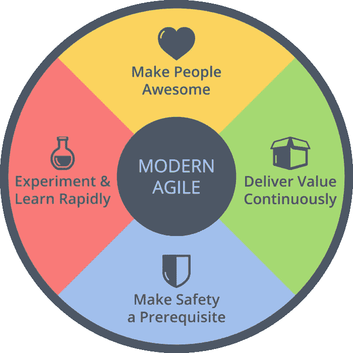

# 让团队自己解决

> 原文：<https://medium.com/hackernoon/let-teams-figure-it-out-eefbf1a44ae8>

## 持续改进，选择方法，以及真正重要的东西

在这篇文章中，我将描述一个开始持续改进冒险的团队。我的描述会引发一些问题。我将试着回答这些问题，并以为什么我认为这很重要来结束。

这与我前几天在推特上发表的一篇文章略有关联(回到石器时代，当时的限制是 140 个字符):

我花了一些时间来思考我想得到的东西。它遇到了团队应该只是弥补实践。我不是这个意思(大多数人会立刻认为这是浪费时间)。

## 团队

以这样一个团队为例:1)有持续改进的动力，2)有组织的长期支持，3)对自己所处的环境(个人、团队和公司)有一个大致的概念。

他们花一些时间——在工作时间——读一些书(“嘿，其他人是如何应对这个挑战的”和“专业知识和高性能是什么样子的”)，并共同决定尝试 Scrum 以及一些与极限编程相关的所谓“技术实践”。一些技术实践是反直觉的，但迹象表明有潜在的好处。

他们抓住了你马上会学到的要点:经验过程控制(透明度、检查和适应)。

这似乎是一个合理的起点，因为不缺乏免费的学习材料。作为对 Scrum 的一个微小的(但可以接受的)修改，他们同意轮换 Scrum Master 的角色，并与分配到团队的 UX 设计师分享产品负责人的角色。他们也摒弃了用故事点来衡量“冲刺承诺”的想法，决定只坚持“冲刺目标”,包括一些部署到产品中的内聚功能。

团队开始学习。他们分成两人一组，这两人一组对各自的主题领域进行为期 3 天的学习/研究。那周晚些时候，他们进行了一系列合作教学活动。这是没有“正常工作”的一周，但这是值得花的时间。

周五下午，在整理了他们工作协议的第一份草案(当然是要修改的)后，他们在墙上贴了几样东西:一个跟踪他们工作和持续改进实验的看板，一个展示他们朝着 *awesome(高质量、客户价值、小批量和个人技能发展)*前进的可视化展示，以及一张他们在研究时在网上找到的现代敏捷海报。

下一周他们开始…

## 问题

至此，你们中的一些人会说…

> 但是，但是，但是，但是，但是…

我能听到你。那么我们来谈谈你的问题:

**这是一个超级理想的情况。从来不是这样的！管理层很少给予这种支持。他们希望看到立竿见影的效果和/或需要“实施”变革。**

JC:有意思。也许这就是为什么 2/3 的变革努力失败了？也许缺乏支持在某种程度上与缺乏自我激励有关？最后，如果你想成功，难道不应该先打好基础吗？如果这是阻碍因素，那就引入一些管理教练。

持续改进是一种投资。这需要时间和专注。另一种观点认为，创造持续改进的条件是管理层的工作，而不是他们自己去推动。

你不能那样做 Scrum。至少派个人去领证吧？

JC:你是在告诉我，一个由积极上进的人组成的*团队*——在每个城市都有聚会，有数百本可用的书籍和数千个可用的视频(以顶级从业者为特色)—不能自学两天的认证吗？如果这是真的，我们就没有希望去学习*那些真正复杂的东西*我们必须学会才能保持竞争力。

**一般人没有这种“心态”。大多数人只是想被告知该做什么。**

JC:嗯。也许那个观点(虽然有时是真的？)是问题的一部分？那会神奇地消失吗？如果你的系统依赖于人们被告知该做什么，并告诉其他人该做什么，那就做好行动非常缓慢的准备。

**但是如果他们不知道牛逼是什么样子呢？**

JC:你真的是在告诉我一个有网络连接的人不知道更好的是什么样子吗？某处？而且，如果团队对找出更好的样子不感兴趣，那会告诉我们他们成功的机会是什么呢？此外，如果业务本身没有令人敬畏的愿景(例如，他们喋喋不休地谈论可预测性，而没有提到客户、结果或优势)，那么你可能会有其他问题。从那里开始。

如果他们选错了东西怎么办？

JC:他们会适应的。请记住，我们一次只能处理这么多变化。因此，一开始你选择“所有正确的东西”的可能性很低，更不用说同时了解所有的东西了。

约翰，不可能每个人都是专家！似乎你在贬低经验和专业知识。

JC:第一点:正确，但是任何人都可以成为学习者(尤其是被这项工作吸引的熟练的问题解决者)。学习者知道何时寻求帮助，最终自己也会成为专家。培养学习和持续改进的文化是基础。

到第二点，先说几个问题。

您的内部是否有人是专家，并且经历过比组织和/或团队的当前状态更好的事情？酷毙了。邀请他们与团队一起工作。假设你不知道。嗯，这是个问题。也许你应该雇一些全职教练。这很难吗？好吧，酷，请一些有经验的外部教练。

我完全尊重经验和专业知识。但是不要雇佣它，当 80%的问题存在于团队之外时，把它分配给“团队”(我从我认识的专家那里反复听到这种说法)。我见过非常高绩效的团队，充满了在高绩效团队中有着良好记录的个人，在没有先决条件的情况下悲惨地失败了。

## 那又怎样？

这个思考练习的好处在于。

我不认为有人从 XP 的“非技术”部分开始，Scrum，“从你所在的地方开始”(看板方法)，或者甚至从工具/实践菜单中的一些突变的本土选择，真的有什么不同。关注技术实践确实很重要，但是与你是否进行冲刺、故事点、是否有一个 Scrum 大师等是正交的。

重要的是…

1.  对持续改进的内在承诺(人们必须真正想要，并从中获得乐趣)
2.  组织的长期支持(包括建立和维护心理安全、限制工作进展等的承诺)。)
3.  对“棒极了”在他们的上下文中可能是什么样子的总体感觉(假设他们对“棒极了”的*感觉映射到以某种方式向客户交付持续的价值)*

关于[方式]与[方式]的争论似乎忽略了一个重要的问题。

我们不是苹果对苹果说话。Scrum 强加于一个团队，嫁接于一种项目文化，只关注团队层面，并与肤浅的 awesome 愿景联系在一起，这与一个团队选择持续改进以向客户交付更多价值，将安全作为先决条件，并被给予带宽让*做持续改进所需的艰苦工作*是非常不同的。巧合的是，同意尝试 Scrum 和 XP 实践。非常非常不同。

这就是为什么你可以看到拥有高绩效团队的公司以不同的方式实践。这些方法是为手头的问题定制的，组织鼓励持续改进的文化。

作为一个社区，我们需要更好地解释原因，并解释起作用的首要原则。我们也需要对自己诚实。如果团队没有本质上的参与(小写和大写的“t”)，没有什么实质性的事情会发生。当然，安装精益、敏捷和通常理解的敏捷(又名 Scrum)是有钱的，但如果组织的操作系统处于积极开发中，它会有所帮助。我们的目标需要实现弹性和真正的敏捷性，而不是依赖于规定的方式。