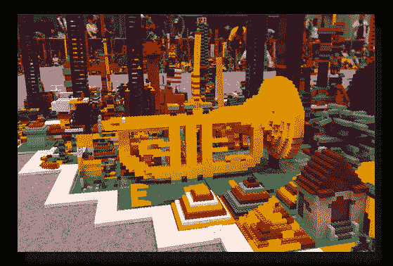
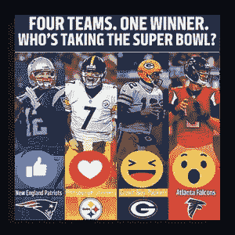
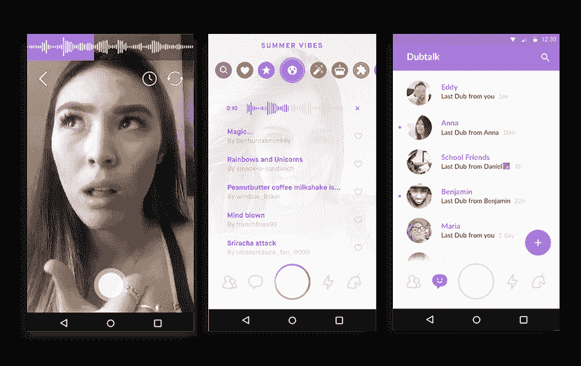
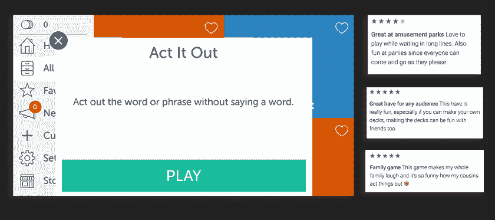
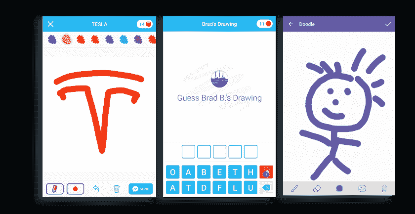
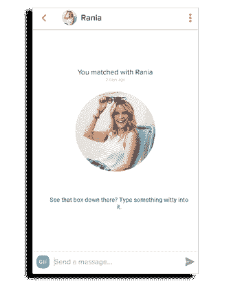
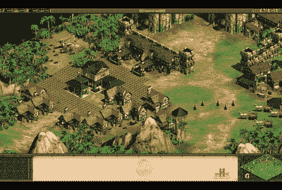
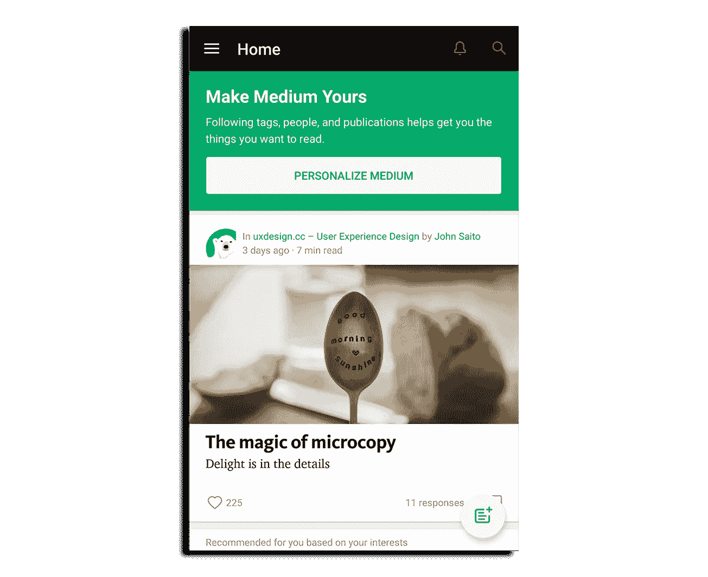
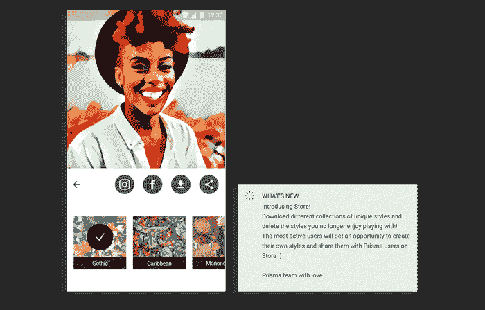

# 利用自由和创造力来影响移动应用的留存率

> 原文：<https://medium.com/hackernoon/leveraging-freedom-and-creativity-to-impact-retention-in-mobile-apps-83992476d6ae>

当希望让用户参与到应用程序或产品中时，一个很好的方法就是给他们创造的自由。当人们被允许有创造力时，他们会更多地参与到产品中，一旦这种创造力变得社会化，一切都会变得有趣，更不用说高度上瘾了。此外，当人们在应用程序的使用中不局限于预定义的路径或动作时，给他们额外的选择甚至绝对的自由可以激发他们对应用程序的兴趣。

# 有创造力的人

人天生就是有创造力的生物。创造力在潜意识里给人一种满足感，并抓住参与者的注意力。当人们被给予变得有创造力的选择时，他们可以提供问题的解决方案，并使任务变得有趣。这种满足感让用户参与到这个过程中。

> “创造力是一种我离不开的药物” *—塞西尔·B·戴米尔*

我有机会亲眼目睹这种创造性的感觉如何被用来吸引人们的注意力，并让他们参与到一项特定的事业中:在进行一个交互式安装项目时，我的团队必须创造出一些东西来激励人们回收电池。基于这个概念，我们决定创造一个魔笛，人们可以简单地通过将电池扔进笛孔来创作音乐。当这个装置[被放置在镇上最大的购物中心](https://www.youtube.com/watch?v=CWaohwfCD_A)时，真的令人惊讶地看到，不仅是孩子，还有成年人都排队等待在回收时创作自己的音乐作品的机会！回收不再无聊，而是一个有趣的互动游戏。

[乐高](http://www.lego.com/)是一个很好的例子，说明利用创造力是多么有趣和令人上瘾。有了乐高，人们可以用许多不同的方式连接和组装部件，创造不同的结构、建筑、车辆或任何激发他们想象力的东西。基于这一理念，乐高帝国应运而生，并成为最受欢迎的品牌之一。乐高超越了年龄和时间，而且很可能会持续很长一段时间。

如果你想知道人们是否有创造力，让我们看看脸书。不久前，脸书在“喜欢”按钮中推出了表情符号。不久之后，许多人用这些作为投票机制。记得在附近见过这样的东西吗？

# 为乐趣而创造——社会方面

那么，这也适用于应用程序吗？在应用程序中利用人们的创造力可以真正吸引人们，让他们的使用变得有趣和有挑战性。所有这一切，当它涉及多个用户以及社交媒体时，真的可以让一个应用程序脱颖而出。

这个概念的一个很好的例子是 Dubmash 应用程序。Dubmash 应用程序允许用户创建自己的视频和对口型同步不同的歌曲，使这个过程变得非常有创意和有趣，特别是在与朋友和其他玩家分享结果时。

哑剧怎么样？我们都熟悉古老的哑剧游戏。如前所述，当创造力与社会机制相结合时，乐趣才能真正开始。乐趣带来了大量的用户，也使他们成为忠实的玩家。这解释了像[字谜](https://play.google.com/store/apps/details?id=com.fatchicken007.headsupcharades2)这样的应用程序的广泛应用。在这个应用程序中，用户可以获得不同主题的特定单词，他们在向队友描述这些单词时最具表现力和创造力，从而获胜。

著名的猜图游戏遵循同样的概念。在这个游戏中，用户发挥创造力，向其他玩家画出特定的单词，让他们猜这个单词是什么。我们都经历过。很好玩，很有竞争力，很容易上瘾。[的 Draw something 应用](https://play.google.com/store/apps/details?id=com.omgpop.dstfree)利用了这个概念。在这个应用程序中，用户必须在一个令人上瘾的、创造性的无尽的社会循环中猜测其他人在画什么。

同样的概念也应用在了 [Viber](http://viber.com/) messenger 应用程序中。在聊天中撰写信息时，用户可以发送涂鸦，让交流变得更有趣。

# 创造上瘾的创造力

利用创造力在产品中创造上瘾的用户在应用程序世界中并不罕见。一个很好的例子就是 [Tinder](https://www.gotinder.com/) 。在 Tinder 应用程序(或任何其他约会应用程序)中，用户可以选择喜欢或不喜欢一个人，如果双方都喜欢对方，那么他们就可以开始聊天。绝对的目标是在现实生活中遇到那个人。不过，开始聊天真的很有挑战性。这需要大量的创造性思维来抓住对方的注意力。就像现实生活一样。一个用户的个人资料可能每天会有几十个匹配，但是把其中一个变成一个真实的现场约会取决于他们的创造力。这个挑战非常容易让人上瘾！

但是对于那些不能采取额外步骤或者根本没有创造力的人呢？嗯，有许多应用程序利用这一点，并分享“创意线”来启动这一过程(是的，到处都有商机)。一个简单的应用商店搜索就会显示有多少这样的应用。

# 作为权力的自由

没有人喜欢被告知该做什么。大多数人甚至不喜欢遵循已经为他们预先定义好的道路。给用户一种感觉(即使事实并非如此),让他们觉得他们有能力按照自己的方式做事，以利用应用的价值，可以让他们进一步参与进来。

让用户自由发挥他们的创造力是一种非常普遍的方法。它已经在游戏中使用多年了。游戏设计师没有给用户具体的步骤，而是让他们发挥创造力，在游戏中有多种选择。我们来看看[模拟城市](http://www.simcity.com/)的例子。不是每个人都能以同样的方式升级。扮演市长的玩家首先会得到一张空白地图，他必须用提供的预算来扩张城市。这是一个展示你创造力的绝好机会！其他游戏(如[帝国时代](https://www.ageofempires.com/))也是这种方法的很好的例子。用户在游戏中定义他们自己的策略和创造力，他们可以通过多种不同的方式获得胜利。这种方法让用户上瘾，他们最终会玩上几个小时，因为他们的进度与他们的策略的创造性有关。

给用户使用的自由总是会带来新的方法，以保持他们参与的方式来实现目标。个性化是可以给予用户的这种自由的一部分。这类似于上面提到的帝国时代游戏中的自由定义策略或自由构建任何东西的乐高概念。它可以让你创建你想要的东西，并按照你的意愿定制它，以便在应用程序中使用。你可以在脸书、Twitter、Medium、Instagram 等社交平台上看到这一点。人们每天访问他们，检查他们的时间表或墙壁。你有没有想过你的时间线到底是什么？自从你加入了这个平台，在你与这个平台的日常互动中，你可以自由地定制和关注任何你想关注的人。或多或少，你的墙是你根据自己的兴趣或需求创造的拼图。这两个个性化的应用程序接触点是每天吸引你回来的原因。

当我们最初开始从事 Pollfish 的工作时，我们的目标是从传统的调查转移到一个更具移动吸引力的环境，在移动应用中。在设计产品时，我们决定一个吸引移动用户的调查应该只包括单项选择和多项选择问题，我们称之为“封闭式”问题。我们决定，我们不应该使用用户可以键入他们所想的任何内容的开放式问题，因为我们认为没有人会费心在手机屏幕上打字。我们没有意识到我们实际上将用户限制在几个预定义的选项上。我仍然记得我们决定改变这一切的那一天。对我们来说，这简直是一种顿悟。在如何使用我们的平台以及如何提供关于产品问题的实际反馈方面，消除限制并给予用户自由导致了巨大的反馈，增加了完成率以及在[未来](https://hackernoon.com/tagged/future)调查中的保留率。消除这些障碍，让用户自由，带来了用户在平台上的参与和投入的显著增加。

[Prisma 应用](https://prisma-ai.com/)是一个很好的例子，说明了如何将创造力、社交机制和选择自由结合起来，才能让一款应用获得高度参与和感兴趣的用户的成功。Prisma 是一个通过使用 AI 将照片转换为绘画的应用程序。这是通过让用户能够从一组预定义的过滤器中进行选择来实现的。有了 Prisma，任何人都可以成为艺术家！在最近的一份声明中，Prisma 现在允许用户自由创建自己的滤镜，然后将它们应用到自己的照片上。这可以被看作是利用上述概念，并给予用户自由来表达他们自己的创造力，然后与他人分享成果。

总之，人类天生是高度创造性的生物。投资创意并将其与社交机制相结合，可以让事情变得有趣和令人上瘾，并真正推动应用内参与。被允许有创造力、做出选择和采取主动的用户，他们会喜欢你要求他们参与的任何任务或过程。消除障碍，让用户自由，这是能够带来改变的潜在秘诀。大多数时候，这并不意味着你在损害你最初的应用程序设计。感知就是一切，如果用户认为自己是应用程序中的决定力量，这肯定会有所帮助。允许应用程序中的创作自由是优秀应用程序设计不可或缺的一部分。

> [黑客中午](http://bit.ly/Hackernoon)是黑客如何开始他们的下午。我们是 [@AMI](http://bit.ly/atAMIatAMI) 家庭的一员。我们现在[接受投稿](http://bit.ly/hackernoonsubmission)，并乐意[讨论广告&赞助](mailto:partners@amipublications.com)机会。
> 
> 如果你喜欢这个故事，我们推荐你阅读我们的[最新科技故事](http://bit.ly/hackernoonlatestt)和[趋势科技故事](https://hackernoon.com/trending)。直到下一次，不要把世界的现实想当然！

