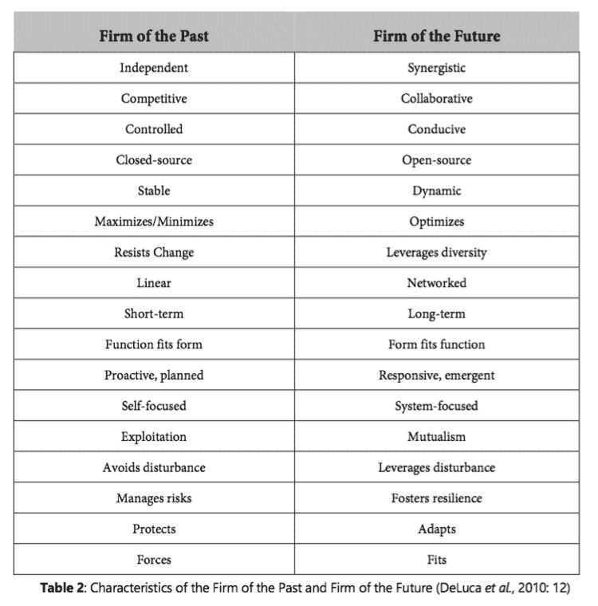

# 生活中的协作经验可以改变业务

> 原文：<https://medium.com/hackernoon/lifes-collaborative-lessons-transform-business-aa1f4348fd27>

> 企业有三种选择:
> 1 .碰壁
> 2。优化并延迟碰壁
> 
> 3.重新设计以增强恢复能力—同时优化现有网络，同时拥抱颠覆性创新并与合作伙伴协作。
> 
> 道恩万斯，耐克全球供应链总监，哈钦斯(2011 年)

活在引发向基于共享空间的协作经济过渡的问题中，描述了来自第三个地平线的变革性创新。这是 H3[第三地平线]今天已经存在但分布不均的一个例子。我们的经济和货币体系的根本转变正变得必要，如果不是不可避免的话。【这是摘自[设计再生文化](http://www.triarchypress.net/designing-regenerative-cultures.html)。如果您想了解变革性创新的 3 地平线框架，请点击这里的。]

因此，今天的企业如何能够在今天的条件下采取行动，同时进行自身转型和经营所处经济环境的转型？变革型创新(H2+)企业必须在当前经济中具有可行性*和*同时转变其参与的业务生态系统。

目前市面上有太多颠覆性的绿色科技解决方案。我们如何避免 H2——最终将被第一地平线捕捉到的路径和创新，以保持“业务照常”？即使在当前的经济条件下，再生企业也有着直接而多样的经济机会。我们如何选择真正具有变革意义的创新，引领我们走向第三个地平线和再生文化？我们的目标是创建支持双赢解决方案、系统健康和为人类和地球服务的协作网络的企业。

定义再生生命系统的基本模式是基于系统的所有不同参与者之间的主要协作关系的整体系统健康的出现。这种体系中的竞争关系到更有效地为整个体系服务，而不是谁以牺牲集体利益为代价来获取短期利益，从而损害所有人的长期利益。

在 [*全息经济学*](https://transitionconsciousness.wordpress.com/holonomics/) *:人类和地球至关重要的商业中，*作者认为“我们经常对竞争有一个错误的看法，将这个词及其意义与竞争联系在一起，一个比另一个生存”。他们继续说道:“的确，一个竞争过程可能会导致其中一个参与者的失败，但是，从系统的角度来看，这是整个进化过程的一部分”(Robinson & Moares Robinson，2014: 214)。

并非所有的竞争互动都会对整个系统的健康产生有害影响，正如并非所有的合作都会导致再生系统。回想一下我们自己的生活，有多少次未能实现某个目标会在短期内导致失望，并对我们真正的天赋及其更有效的长期应用有更深刻的理解？健康的竞争教会个人参与者如何恰当地参与，以及如何最好地运用他们独特的技能和知识来优化整个系统。在以合作为主的系统中，某些形式的竞争对所有参与者都有好处。

总的来说，在一个再生的社会生态系统中，企业和个人通过培养[协作优势](/@designforsustainability/collaboration-and-empathy-as-evolutionary-success-stories-4e7cfd12e5c8)来最有效地实现他们的目标，这种协作优势是通过以协同的方式将以前分离或竞争的参与者联系起来而产生的——将未满足的需求与闲置或新的能力联系起来，这样每个人都是赢家。通过偏爱非零和(双赢)关系而非零和(双赢)关系，生活向日益复杂的方向发展(见 Wright，2001)。[协作是生命整合多样性的主要进化策略。](/age-of-awareness/lifes-economy-is-primarily-based-on-collaborative-rather-than-competitive-advantage-e7c5f55466fd)

加强合作(三赢)网络优化了系统，并建立了社会、生态和经济资本。它使系统为破坏性事件做好准备。随着经济、政治、文化和生态变化的“完美风暴”愈演愈烈，强大的合作网络比孤立的个人或企业更能经受住未来的变化。

经受住未来动荡的时代是关于嵌入开放信息交换的广阔网络，以既定的方式保持竞争“健康”——支持优化整个系统。这种网络基于重视协同和共生的合作关系，确保信息和相互支持快速流动，使我们能够以弹性应对，适当适应，并在必要时共同转型。

地球生命支持系统的健康和未来以及人类的未来正处于危险之中。基于“他们反对我们”思想的竞争策略只会延迟我们的集体反应，并证明对所有人都有害。在游戏的这个阶段，要么整个生命获胜，我们稳定并逆转全球平均气温上升，阻止生物多样性的迅速丧失，要么谁也没有赢。所有的竞争胜利都是短暂的。今天的企业必须为全人类和整个生活服务，否则它将无法有效地为自己服务(中期或长期)。

变革型企业基于生态学的观点，即整体的优化提供长期的利益，而孤立部分的最大化只会导致短暂的、可疑的“成功”。

合作商业和再生商业生态系统将成为第三个地平线的新主流。受生态启发的合作企业能够改变整个商业生态系统和它们所处的经济体系。我们如何创建这样的企业？关于创造有利于生活的条件的商业，生活能教会我们什么？“创造性创新的仿生学”(BCI)的联合创始人贾尔斯·哈钦斯解释道:

> [大自然的商业原则]旨在创造有利于合作、适应性、创造性、地方适应性、多功能性和反应能力的商业条件；从而促进组织从僵化、管理严格的等级制度向充满活力的组织演变，在不断变化的商业、社会经济和环境条件下蓬勃发展。懂得如何将这些自然原则融入到产品、流程、政策和实践中的组织，会在快速变化的时代为自己及其商业生态系统创造更大的财富，在多变的商业环境中蓬勃发展而不是灭亡。受自然启发的组织是有弹性的、优化的、适应性的、基于系统的、以价值观为导向的和支持生命的。
> 
> 贾尔斯·哈钦斯(2012:80–83)

BCI 网络中的合作者使用了仿生研究所开发的“[生命原则](https://biomimicry.net/the-buzz/resources/designlens-lifes-principles/)”列表(见第 6 章)，并将其转化为“未来公司的一套商业原则”，旨在“提供一个框架，指导成功转型为受自然启发的[…]商业”(同上:81)。以下是[《商业的本质》](https://thenatureofbusiness.org/about-the-author/) (2013)和 Hutchins 邀请我们探讨的一些问题，因为我们的目标是转变商业，以支持具有再生经济体系的再生文化的出现:

我们的企业如何学会将变化和干扰视为机遇，而不是威胁？

**我们如何重组以分散、分配和多样化整个企业的知识、资源、决策和行动？**

**我们如何才能创造一种商业文化，促进人员、关系、想法和方法的多样性？**

我们如何通过使形式适合功能、在功能和响应中嵌入多样性，以及从简单的组件和模式构建复杂多样的产品和服务来优化我们的工作？

**我们如何通过适当的信息反馈循环、整合的循环流程以及对资源可用性变化的灵活响应，打造更具适应性的业务？**

**我们如何通过促进社区内、能源、信息和通信网络内的协同作用，支持我们的业务及其社会生态环境的复原力，从而实现有效的循环资源利用？**

**通过将价值观作为取得积极成果的核心驱动力，尊重和衡量有价值的东西，而不是重视被衡量的东西，我们的企业如何为更广泛的社会生态系统做出贡献？**

**通过利用信息和创新而不是能源和材料来支持生命建设活动，在个人和生态系统之间创建相互支持的健康生成关系，并制造对环境无害和对社会有益的产品，我们的企业如何才能真正恢复活力？**

在舒马赫学院的 18 个月里，我第一次有幸置身于这类问题被公式化和探索的环境中。自 2001 年以来，我看到生态灵感设计和创新的文化变革性文化基因从边缘传播到商业、政府、学术界，最重要的是，传播到世界各地的社区。生物、生态和系统的见解可以为可持续和再生企业的设计和创造提供信息。这不是一个新的见解，但我们终于开始采取行动。

二十多年来，需要灵感的商业领袖已经能够求助于探索可持续商业的*什么*和*如何*问题的有见地的书籍。大多数提供了 Horizon 2 的视角，并暗示了 Horizon 3 的各种愿景。以下是许多出版物中的一部分，这些出版物有助于将这些见解带入董事会:

**商业领袖推荐读物** *《改变过程》斯蒂芬·斯密德亨尼著，1992 年
《商业生态学》保罗·霍肯著，1993 年
恩斯特·乌尔里希·冯·魏茨泽克、阿莫里&亨特·洛文斯著，1997 年
卡尔-亨里克·罗伯特著《自然之步》，1997 年
艾伦·阿特基森著《相信卡珊德拉》，1999 年
雷·安德森著《中期修正》 2000 年
《从摇篮到摇篮》作者:威廉·麦唐纳和迈克尔·布朗加特，2001 年
《在场》作者:p·圣吉、o·沙默、j·贾沃斯基&贝蒂·苏·弗劳尔斯，2005 年
《从绿色到金色》作者:丹尼尔·c·埃斯特和安德鲁·s·温斯顿，2006 年
《系统中的思考》作者:多内拉·梅多斯，2008 年
《理论 U》作者:c·奥托·沙默，2009 年
2010 年
阿莫里·洛文斯的《重新发明火焰》，2011 年
约翰·艾尔金顿的《Zeronauts》，2012 年
威廉·麦唐纳和迈克尔·布朗加特的《上升周期》，2013 年
贾尔斯·哈钦斯的《商业的本质》，2012 年
；西蒙·罗宾逊和玛利亚·莫阿雷斯·罗宾逊的《全息经济学》，2014 年
；瑞安·霍尼曼的《B 公司手册》，2014 年*

其中一些书更侧重于第二个地平线的商业创新和实践，而另一些则探索第三个地平线的“未来意识”。[这份书单是根据[设计再生文化](http://www.triarchypress.net/designing-regenerative-cultures.html)的印刷版本编辑的。]我们正处于学习如何创建可再生企业、创造有益于生活的条件的初级阶段。

企业可以成为向再生文化转变的强大催化剂，我们既需要 H2+型的颠覆性创新，也需要 H3 式的变革性创新。商业领袖们认识到，在一个资源有限的世界里，制造浪费是一种我们再也负担不起的奢侈。

随着越来越多的人开始意识到与“照常营业”相关的附带损害，各地的客户都在选择逐渐淘汰纯粹的“股东利润最大化”模式的业务，相反，他们正在创造新的“为了社会和生态利益”的业务模式。

在一个快速变化的世界中，没有人有确定的答案，但至少商业领袖现在开始“思考问题”——为再生的未来创造垫脚石。

“主流”中充满希望的变化的第二个地平线标志包括:报告“自然资本依赖”而不仅仅是碳足迹的新一代可持续发展指标，由市场领导者 Trucost；管理工具，如 PUMA 的'[环境损益账户](http://about.puma.com/en/newsroom/corporate-news/2011/november/puma-completes-first-environmental-profit-and-loss-account-which-values-impacts-at-145-million-euro)'(与 Trucost 共同开发)；[循环经济 100 网](https://www.ellenmacarthurfoundation.org/ce100)；麦肯锡呼吁*资源革命* (Heck &罗杰斯，2014)；许多解决方案显示——以蓝色经济为例(Pauli，2010 年)、ask nature(T15)和伦理市场(T17)；营利性商业模式([计划 C](http://www.plan-c.eu/bmix/) ，2014 &博肯*等人*，2014)；[世界可持续发展工商理事会的*愿景 2050*](http://www.wbcsd.org/Overview/About-us/Vision2050) (世界可持续发展工商理事会，2010)；[CDP](https://www.cdp.net/es)与财富 500 强公司和投资者的合作(CDP，2015)；[B-团队【2015】[参见:](http://bteam.org/about/)[我们指的是商业联盟](https://www.wemeanbusinesscoalition.org) ]

截至 2016 年 1 月， [B-Corporation](http://www.bcorporation.net) 已经认证了来自 42 个国家和 130 个行业的 1，577 家企业为全球公益承诺力量(B-Corporation，2015)。要找到如何将你的企业转变为 B-Corp 并从许多好的例子中学习，看看瑞安·霍尼曼的新书(2014)。

随着我们周围环境、技术、社会和经济的加速变化，商业世界正在迅速变化。变化不仅仅是对外力的反应；一个关键的心理驱动因素是更深层次的转变，激发人们对有意义的工作和改变世界的渴望。完成工作意味着从工作的有意义的影响中获得满足感，而不仅仅是赚更多的钱。一起，我们可以找到问的意义:

真正可再生的企业会是什么样子？

**我们如何创建一个能够恢复生态系统功能、再生生物生产力、改善社会团结和协作、提高社区和生态系统健康和福祉的企业？**

未来的[公司](http://businessinspiredbynature.com/pdf/Brochure_Business_Inspired_by_Nature.pdf)探索了企业和组织为了适应不断变化的世界以及为了更好地适应自然模式而将经历的重大变革。图 26(下图)展示了从线性控制层级向更灵活的协作网络转变的本质。

同一份报告下页的表格比较和对比了过去的公司(经典的 Horizon 1 业务)和未来的公司(整合了适应性和再生性业务生态的 H2+甚至 H3 业务)。

过去的 H1 公司是在由分离的[叙事](/@designforsustainability/the-why-will-guide-the-what-and-the-how-11523af97cf6)主导的思维模式中创建的，而未来的 H3 公司将是相互融合的[叙事](/@designforsustainability/the-why-will-guide-the-what-and-the-how-11523af97cf6)的表达，认识到合作和再生的需要，作为在复杂和动荡的世界中绘制通向未知未来的路径的有效策略。

…

【这是节选自[设计再生文化](http://www.triarchypress.net/designing-regenerative-cultures.html)的一个分章节，Triarchy 出版社出版，2016。]

—

如果你喜欢这个帖子，**请鼓掌**记住，如果你非常喜欢，你可以鼓掌**多达 50 次**；-)!

**丹尼尔·克里斯蒂安·瓦尔**——在面临多重危机的情况下催化变革性创新，为可再生整体系统设计、可再生领导力以及可再生发展和生物区域再生教育提供建议。

国际知名书籍[设计再生文化](https://www.triarchypress.net/drc.html?source=post_page---------------------------)的作者

**请考虑成为赞助人来支持我正在进行的工作:**

 [## 丹尼尔·克里斯蒂安·沃尔正在创造支持再生文化和区域再生的内容…

### 亲爱的潜在支持者，自从《设计再生文化》在 2016 年初出版以来，我一直在分享它…

www.patreon.com](https://www.patreon.com/DanielChristianWahl?fan_landing=true) 

Nested Wholeness — what is you business in service to?