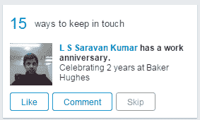

# LinkedIn 的新用户界面证明它不知道自己对用户的价值

> 原文：<https://medium.com/hackernoon/linkedins-new-ui-proves-it-doesn-t-know-it-s-value-to-users-7535df767cc7>

在我看到 LinkedIn 的新用户界面之前，我正准备写一篇关于转换漏斗的文章。打开 LinkedIn 给了我 30 秒的休息时间。这是完美的，因为我会分心一小会儿，但不要被太多的内容所诱惑，如[脸书](https://hackernoon.com/tagged/facebook)上的视频。偶尔，我会发信息。简而言之，它对我的价值在于它没有太大的价值。

无论如何，我以一个全新的用户界面受到了网站的欢迎，而这个界面随后遭到了严厉的批评。表面问题很明显:

*   这种彻底的改变让用户感到不舒服。严重破坏用户现有的使用模式会让他们在“重新学习”时感到沮丧。这对于用户不频繁的网站来说没什么问题，比如电子商务商店，大多数用户都是第一次看到用户界面，但对于经常使用的网站来说就不一样了，比如 LinkedIn。
    脸书在渐进式改革方面做得非常出色。例如，趋势主题已经被温和地引入到右上角，但是期望它最终在你的新闻提要中占据显著位置。
*   页面加载时间太慢了。当用户第一次到达站点时，除了一个加载屏幕之外，没有什么可以看的。现在的惯例是让资产逐渐出现，以便用户的大脑有东西可以处理，直到想要的内容到达。
    刚到餐厅时喜欢面包。

用户最终会习惯新的 UI，工程团队可以修复加载时间。但我感到沮丧，因为这个用户界面是一个明显的迹象，表明 LinkedIn 在向用户提供价值方面倒退了一步。

# 将网络活动移至通知

纪念日曾经是右上角的一个提要，用户需要点击“跳过”才能看到更多。

The old LinkedIn work anniversary (taken from Google Images)

大多数 LinkedIn 用户有 500+个连接，这意味着用户每天登录一次，平均会有 1.5 到 2 个通知等待他们。以前，通知仅限于一个人的个人资料，通常每周出现一次。

这里的关键要点是 LinkedIn *降低了通知的价值。通知的惯例是通知你与你有关的事情。但是 LinkedIn 在我的屏幕上方放了一个大大的红色数字，*只是为了告诉我时间已经过去了*。*

更糟糕的是，现在这与其他通知具有同等价值。有人在我写的帖子上分享他们的观点，或者在包含有用信息的帖子上给我贴标签，现在就像我的网络中的一个远方成员在一家我从未听说过的公司工作了两年一样，得到了同等的视觉关注。

当一个产品试图抓住你的注意力，却什么也不给你看的时候，这是一个滑坡。当然，发送通知会导致更多人查看、祝贺或喜欢他人的工作纪念日。这对参与度指标来说非常好。但是每次你请求用户的关注而没有用价值来补偿他们，你就降低了他们下次关注你的可能性。

# 强迫你去分析页面

以前，将鼠标悬停在 feed 中链接的个人资料上会显示用户及其当前角色的大照片，现在这些信息都消失了。

这感觉就像一个黑客强迫我的个人资料页面。知道某人当前的角色为我的新闻订阅源上的活动添加了上下文，现在我需要转到个人资料页面来获取该上下文。

这是 LinkedIn 推动参与度的又一次尝试。我们花更多的时间在个人资料页面上，这创造了浏览量，反过来又为他们提供了通知，助长了这种无意义参与的循环，对任何人都完全没有价值。没有为用户创造价值，参与度只是一个虚荣的衡量标准。在识别术语中，我们简单地称之为“统计填充”。

# LinkedIn 中的价值在哪里？

到目前为止，我一直对 LinkedIn 持批评态度，但我真的相信它为持久的业务奠定了基础。

LinkedIn 已经成功地将全球员工的简历放到网上，让每个人都能看到，作为一种招聘工具，它的潜力是巨大的。在招聘人员方面，LinkedIn 可以利用这一点，继续鼓励企业发布招聘广告，并鼓励招聘人员用它来联系候选人。

对于用户来说，LinkedIn 已经变成了一个无用的激励帖子和迷因的来源。用 Snapchat 的方式给用户带来内容还不算太晚。因为用户的简历在网上，LinkedIn 对他们的了解远远超过 Snapchat 对其用户的了解。我仍然希望我的 LinkedIn feed 将充满来自可信出版物的信息内容和我的网络对它们的看法。

如果 LinkedIn 想要持续下去，对富裕用户群的深刻见解和参与是一个不容错过的机会。

> [黑客中午](http://bit.ly/Hackernoon)是黑客如何开始他们的下午。我们是 [@AMI](http://bit.ly/atAMIatAMI) 家庭的一员。我们现在[接受投稿](http://bit.ly/hackernoonsubmission)，并乐意[讨论广告&赞助](mailto:partners@amipublications.com)机会。
> 
> 如果你喜欢这个故事，我们推荐你阅读我们的[最新科技故事](http://bit.ly/hackernoonlatestt)和[趋势科技故事](https://hackernoon.com/trending)。直到下一次，不要把世界的现实想当然！

