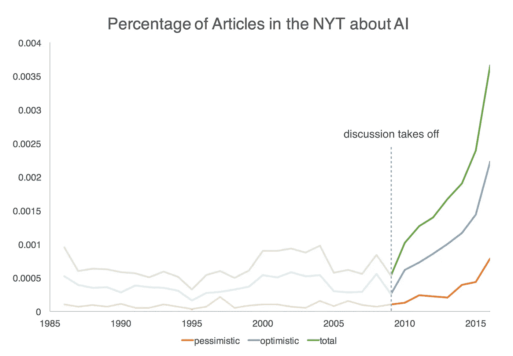
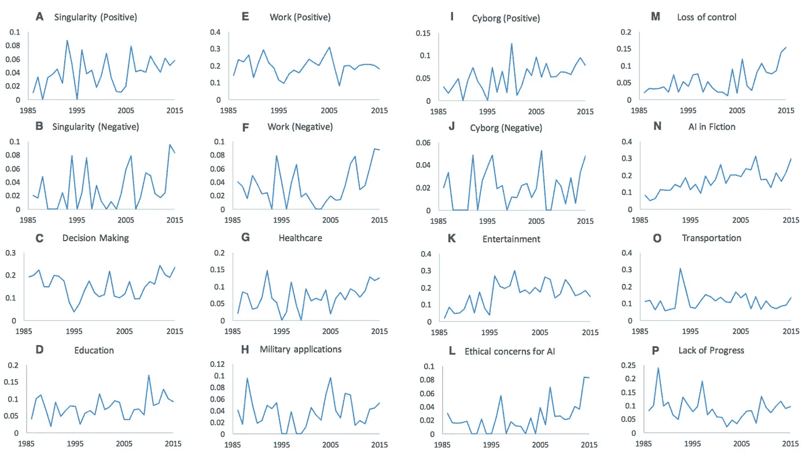

# 公众对人工智能看法的长期趋势

> 原文：<https://medium.com/hackernoon/long-term-trends-in-the-public-perception-of-artificial-intelligence-6b1512fdd7ac>

人工智能有很长的繁荣和萧条周期历史。

在人工智能繁荣时期，资金通过大学和工业实验室流动，推动了承诺的进步，这些进步听起来往往像魔法，如果不是灵丹妙药的话。极端乐观在该领域的早期尤为普遍。例如，在 1960 年，人工智能的先驱[希尔伯特·西蒙](https://www.wikiwand.com/en/Herbert_A._Simon)提出“*机器将能够在 20 年内做任何人能做的工作，*”这一主张在 1961 年得到了该领域创始人[马文·明斯基](http://web.media.mit.edu/~minsky/)的响应。

尽管自那时以来已经取得了一些进展——最近的突破是在[神经网络](http://www.nature.com/nature/journal/v521/n7553/full/nature14539.html)方面，这是一种受大脑生物结构启发的机器[学习](https://hackernoon.com/tagged/learning)形式——今天的领先研究人员倾向于对人工智能在短期内的潜力更加谨慎。脸书的人工智能研究主任 Yann LeCun 的观点代表了该领域大多数计算机科学家的观点:

> 如果我们能在不久的将来造出具有老鼠智力的机器，我们会感到困惑，但我们离那还很远。

然而，这种观点并不普遍，尤其是在这个领域之外的人当中。例如，埃隆·马斯克和斯蒂芬·霍金认为人工智能可能很快就会强大到足以对人类构成生存威胁。其他人，如谷歌常驻未来学家雷·库兹韦尔(Ray Kurzweil)，则看好技术奇点的可能性，这是一个(字面上)难以想象的技术增长时期，将永远改变人类社会。有证据表明，这些更极端的观点在公众想象中扮演了一个过大的角色。

无论如何，人工智能研究人员确实认为该领域正在经历另一次繁荣，我们最近进行的一项研究提供了一些支持这一印象的数据。在[公众对人工智能看法的长期趋势](https://arxiv.org/pdf/1609.04904.pdf)(与 [Eric Horvitz](http://research.microsoft.com/en-us/um/people/horvitz/) 的论文将出现在 AAAI 2017 上)中，我们发现近年来新闻中报道人工智能的文章比例大幅增加(图 1)。例如，按占发表文章总数的百分比计算，2016 年《纽约时报》讨论人工智能的文章是 2009 年的四倍多。

Figure 1: Coverage of artificial intelligence in the New York Times has exploded since late 2009\. The y-axis represents the percentage of A.I. articles published in the New York Times for a given year.

## 为什么理解人们对人工智能的看法很重要？

公众的希望和担忧可以转化为监管活动，并产生严重的影响。例如，一些人最近建议政府应该[监管人工智能发展](https://www.theguardian.com/technology/2014/oct/27/elon-musk-artificial-intelligence-ai-biggest-existential-threat)以防止生存威胁。其他人认为[种族定性](https://www.propublica.org/article/breaking-the-black-box-how-machines-learn-to-be-racist?word=Trump)隐含在机器学习算法中，违反了现行法律。更广泛地说，如果公众对人工智能的期望与技术上的可能相差太远，我们可能会迎来另一个人工智能的冬天，这是一个由强烈的热情和高期望带来的破灭的希望导致的衰退时期。

为了了解公众对人工智能的讨论是如何随着时间的推移而演变的，我们进行了一项研究，分析了《纽约时报》发表的超过 30 年的新闻文章。这些新闻文章特别有用，因为它们提供了一个追溯到遥远过去的公众舆论和参与的信号。

除了衡量人工智能讨论的水平，我们的研究还给新闻文章贴上了乐观主义和悲观主义的标签，区分那些暗示人工智能将帮助人类(例如，通过提供更好的医疗保健)的文章和那些暗示人工智能将伤害人类(例如，通过裁员)的文章。我们发现，尽管对个别话题的看法发生了变化——例如，越来越担心人工智能对工作的负面影响——但随着时间的推移，乐观和悲观的总体水平或多或少保持平衡(图 1)。

为了生成这些分析的数据，我们雇佣了[众包工作者](https://en.wikipedia.org/wiki/Crowdsourcing)([机械土耳其人](https://www.mturk.com/mturk/welcome)众包平台上的人类)来阅读和注释《纽约时报》在 1985 年至 2016 年间发表的超过 300 万篇故事的段落。然后，这些注释告知了人工智能相关文章中悲观和乐观的程度，以及其他主题的流行程度，如人工智能对工作或交通的影响，或对人工智能失控的恐惧。

该研究跟踪了其中 16 个主题随时间的变化(图 2)，如“人工智能将对工作产生负面影响”或“人类将失去对人工智能的控制。”

Figure 2: Hopes and concerns from 1986 to 2016\. In recent years, we see an increase in concern that humanity will lose of control of AI, and hope for the beneficial impact of AI on healthcare.

## 那么，我们在这些主题中发现了什么趋势呢？

也许我们最令人惊讶的发现是，近年来，对失去人工智能控制权的恐惧变得更加普遍——与 20 世纪 80 年代人工智能文章的比例相比，增加了两倍多(图 2M)。例如，[科学家担心机器可能比人类聪明](http://www.nytimes.com/2009/07/26/science/26robot.html)在 2009 年提出了这个问题:

> 一群计算机科学家正在辩论是否应该对可能导致人类对基于计算机的系统失去控制的研究进行限制，这些系统承担着越来越多的社会工作量，从发动战争到与客户在电话上聊天。

对人工智能的伦理担忧也变得越来越普遍(图 2L)，部分原因是类似的生存担忧，但也是无人驾驶汽车必须做出的更实际的决定。例如，文章[人工智能作为一种威胁](https://www.nytimes.com/2014/11/06/fashion/artificial-intelligence-as-a-threat.html) (2014)讨论了这种担忧，认为如果没有道德，机器可能会做出糟糕的决定:

> 第一个，也是更近的将来的恐惧，是我们开始创造能像人类一样做决定的机器，但是这些机器没有道德，而且可能永远不会有。

这些趋势通常表明，越来越多的公众相信，研究人员可能很快就有能力建造危险的人工智能系统。

从更乐观的角度来看，人工智能可以改善医疗保健的希望也呈上升趋势(图 2G)。例如，2003 年的一篇文章[称，英特尔和老年痴呆症研究小组联手](http://www.nytimes.com/2003/07/25/business/technology-intel-and-alzheimer-s-group-join-forces.html):

> 对于病情更严重的患者，研究人员提出了一种可能性，即系统使用人工智能技术来确定一个人是否记得一整天都在喝水。

对人工智能缺乏进展的担忧近年来也有所减少，尽管最近有所上升(图 2P)。这种担忧在 1988 年达到顶峰，当时正值最重要的人工智能冬季开始。一个早期的例子出现在[一个新的行政长官在象征](http://www.nytimes.com/1988/05/24/business/business-people-a-new-chief-executive-is-named-at-symbolics.html)被任命，从当年 5 月开始:

> 总的来说，人工智能行业正在经历一场**裁员**，挫折源于它未能兑现承诺，制造能够像人一样识别物体或推理的机器。

有趣的是，最近许多讨论缺乏进展的文章都提到了过去那些失败的承诺。这样的引用是一种元讨论的形式，关于过高的期望在该领域先前的挫折中所起的作用。

在其余的趋势中，对人工智能对人类工作的影响的积极看法已经变得不太常见(图 2F)，而消极看法则急剧增加(图 2E)。人工智能对教育的希望增加了(图 2D)，对人工智能与人工智能融合的积极看法也增加了(图 2I)，人工智能在书籍和电影中的流行也增加了(图 2N)。

## 这些发现中有什么可操作的吗？

我们看到的一些不和谐令人不安。人工智能专家越来越怀疑该领域近期取得突破性进展的潜力，但公众对这种进展的风险的担忧近年来有所增加。公众认知和现实之间的这种冲突如果得不到纠正，最终可能导致破坏性后果(例如，通过对人工智能研究实施考虑不周的监管)。

然而，其他日益增长的担忧，如人工智能对工作或军事应用的负面影响，是基于我们社会面临的直接问题。这些担忧可能会更直接地影响到人工智能应用的公共政策。

除了这些狭隘的问题，很明显，我们正在经历一场比以往任何时候都要大得多的人工智能繁荣。在这种情况下，监测该领域的发展及其对社会的潜在影响比以往任何时候都更加重要。这个目标尤其由人工智能百年研究(AI100)引领，该组织旨在研究和预测这种社会影响，并于 2016 年发布了第一份[公开报告](https://ai100.stanford.edu/2016-report)。

然而，新技术的影响通常难以预料。了解公众对一项技术的想法——不管这种观点是否基于现实——可能是一个关键因素。计算分析，比如我们在这里提出的方法，提供了一种大规模测量这种观点的强有力的方法。

> [黑客中午](http://bit.ly/Hackernoon)是黑客如何开始他们的下午。我们是 [@AMI](http://bit.ly/atAMIatAMI) 家庭的一员。我们现在[接受投稿](http://bit.ly/hackernoonsubmission)并乐意[讨论广告&赞助](mailto:partners@amipublications.com)机会。
> 
> 如果你喜欢这个故事，我们推荐你阅读我们的[最新科技故事](http://bit.ly/hackernoonlatestt)和[趋势科技故事](https://hackernoon.com/trending)。直到下一次，不要把世界的现实想当然！

