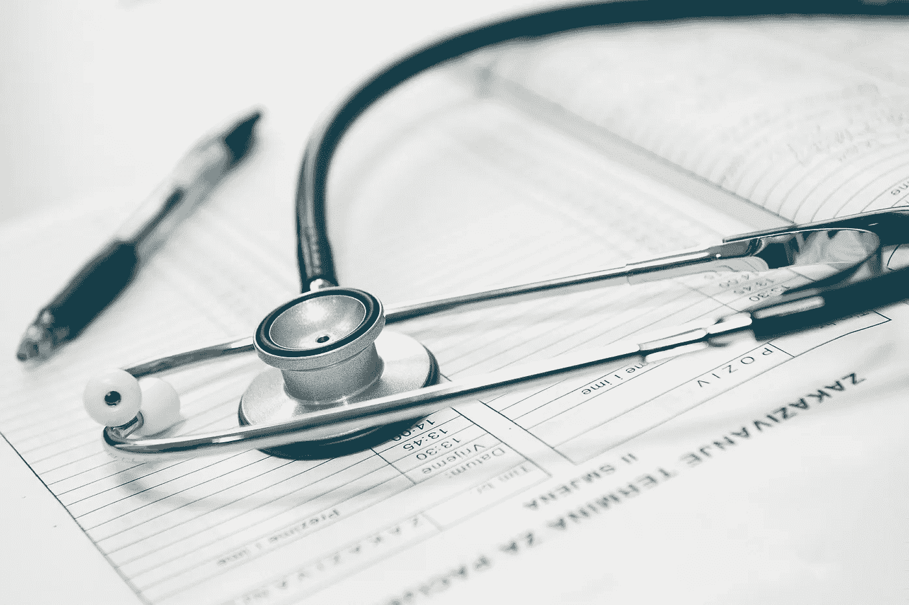

# 回顾 2012 年健康科技的预测:它们有多准确？

> 原文：<https://medium.com/hackernoon/looking-back-at-healthtech-predictions-in-2012-how-accurate-were-they-885236cdcbcc>

1903 年，密歇根储蓄银行行长告诉亨利·福特的律师不要投资福特汽车公司，他说“马在这里呆着，但汽车是一种新奇的事物，一种时尚”。历史上充斥着现在看来可笑的错误预测。在技术领域尤其如此。从西方联盟预测电话有太多的缺点，不能被认真地认为是一种交流方式”到达里尔·扎努克 1964 年的预测，电视将持续六个月，因为人们会厌倦每晚盯着一个盒子。

每年都有大量文章发表，预测在特定时期内将改变医疗保健的趋势。我喜欢做的一件事是在这些文章发表若干年后再读一遍，看看它们有多准确。2012 年 1 月 1 日，Tech Crunch 发表了一篇名为“将在 2012 年改变医学的 6 大健康技术理念”的文章。那篇文章写了将近六年，我不禁问自己这个问题；在这中间的六年里，这些预测有多准确，这些趋势在多大程度上改变了医疗保健？

**趋势一:人工智能**

列出的第一个趋势是人工智能。文章预测，人工智能将“为患者和临床医生提供诊断和决策支持”。这一预测在很大程度上被证明是正确的，因为诊断是人工智能在医疗保健领域取得巨大进步的领域。这方面的例子包括为 Kehmesoft 开发的 DataArt 的专业助手和在纽约使用的 IBM 的 Watson 计算机。这两个系统都利用越来越常见的方法，将症状与以前病例的庞大数据库进行比较，以提供潜在的诊断。该系统可能不会像作者预测的那样，因为它们只是真正提供第二种意见来帮助医生，而不是自主做出具体的充分证明诊断。

有一个领域是可以预测的，那就是它将会使皮肤病学等领域非中介化。我们还没有完全实现。越来越多的高街痣诊所开放仍然依赖于照片技术，虽然这是现在很先进的，这是由专家提出专业意见的审查。这些领域的预期去中介化仍然遥遥无期。

**趋势二:远程医疗**

这篇文章完全正确的一个方面是我们将与医生沟通的方式，假设远程医疗是未来。NHS 最近推出的全科医生项目最终认可了这一点。这项服务为患者提供了在两小时内通过电话视频聊天免费看 NHS 全科医生的机会。在私人医疗保健领域，类似的概念正在蓬勃发展，尤其是 push doctor 以及现在的医疗保健集团和 i-GP。这篇文章可能没有预料到的是，从咨询到言语治疗，远程医疗将在许多医疗保健领域得到发展。这方面的例子包括网络治疗，它彻底改变了语言治疗，为偏远地区的人们提供了获得这种服务的途径，否则他们将不得不跋涉数小时。

**趋势三:移动应用**

这篇文章坚持认为，手机将越来越多地用于跟踪医疗指标。这方面的例子几乎数不胜数。组织投入大量精力开发这类工具。DataArt 非常重视这种技术，尤其是在其业务 Orange 的开发和技术部门。这包括一个被称为心跳率的系统，它使用视频处理算法来测量心率，而无需身体接触。它通过使用手机上的摄像头来检测用户脸上的红色像素，以传播血压率。

大数据的预期使用不仅在医疗保健领域蓬勃发展，而且几乎在每个领域都是如此，特别是在已经讨论过的诊断领域。基于健康的社交网络的预测增长也已经实现，一个社交网络可用于几乎每一种你能想到的医疗状况。

**趋势三:3D 医疗定向**

考虑到这篇文章是在六年前写的，这在技术领域是一个相当长的时间，所做的预测在很大程度上已经成为现实。唯一可能还很遥远的领域是 3D 医学定向领域，这篇文章假设这一领域会比现在领先一点。虽然一些预测可能没有预测的那么远，例如某些医学领域的非中介化，但这通常是对未来预测的一种令人印象深刻的尝试，看看尚未实现的预测是否会在该出版物十周年之际实现，这将是一件有趣的事情。这样的文章不仅仅是时间填充器，在很多方面是一个时间胶囊，没有硬币和邮票这样的物理时间标记，而是更有趣的东西，人类的思想。

*由朱莉·佩尔塔担任，
业务发展总监，* [*数据艺术*](http://dataart.com/)

*最初发布于 2017 年 9 月 26 日*[*www . health care . digital*](https://www.healthcare.digital/single-post/2017/09/26/Looking-Back-at-HealthTech-Predictions-in-2012-How-Accurate-Were-They)*。*