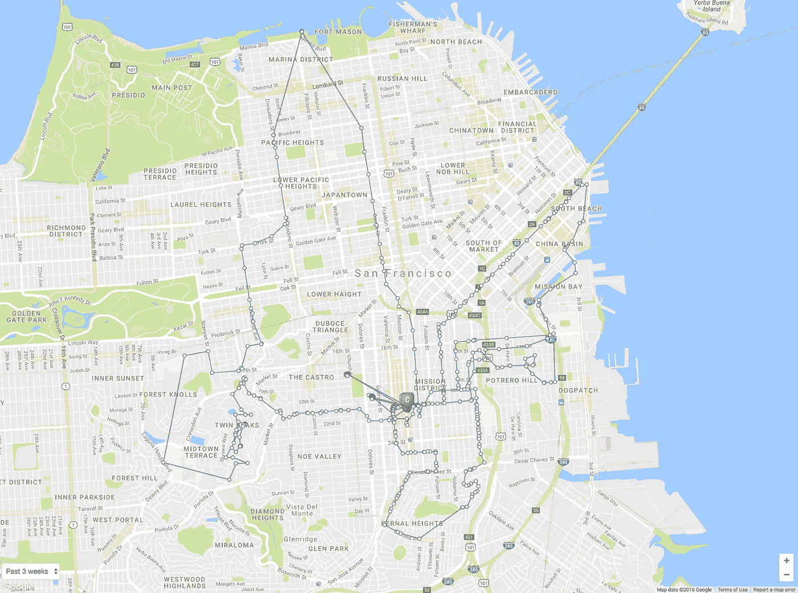
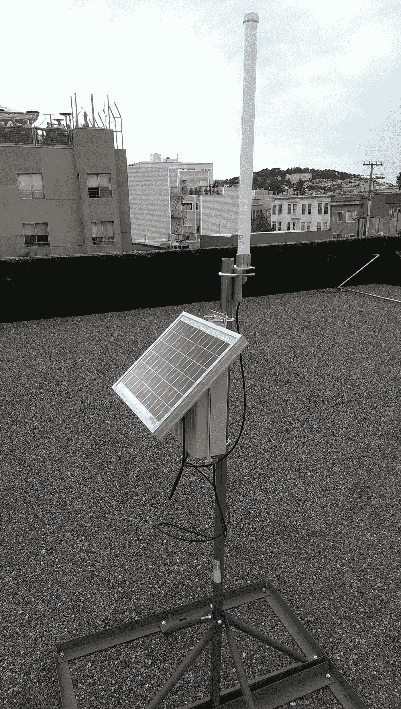
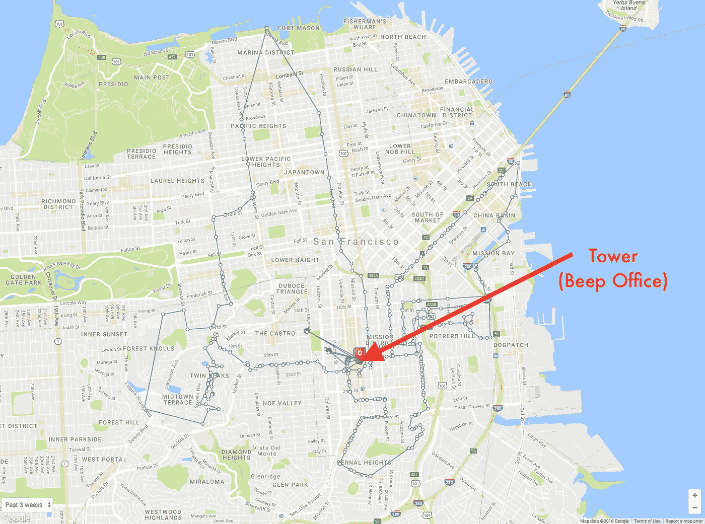
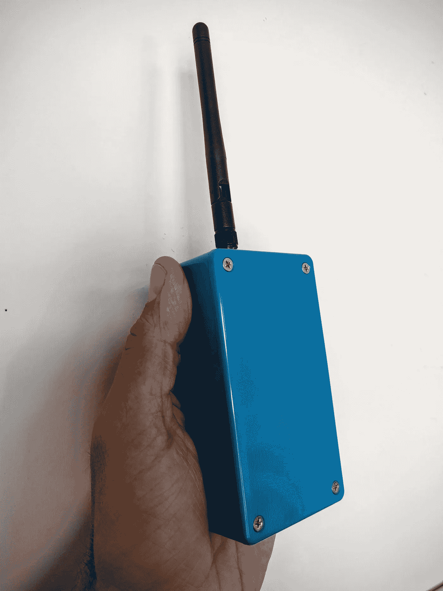
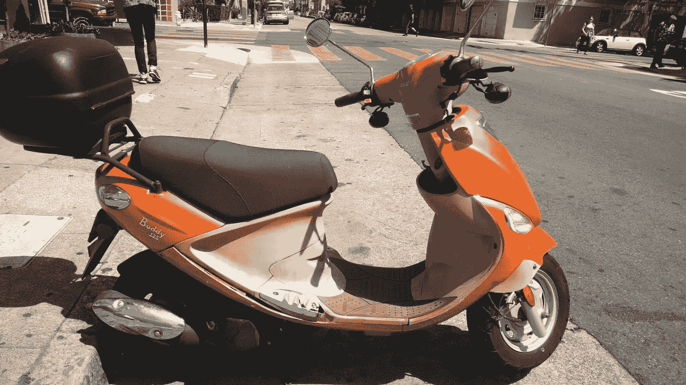
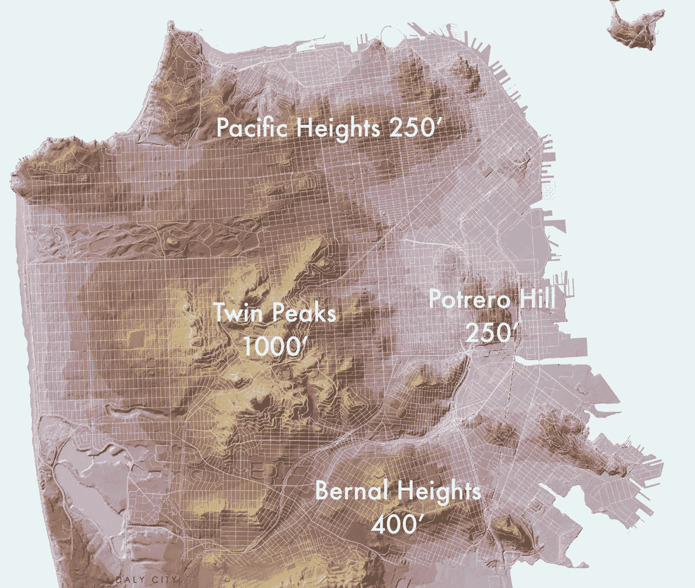
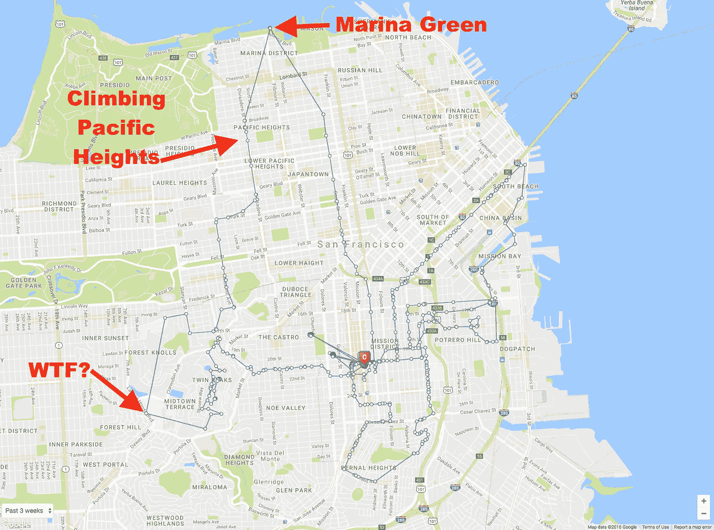
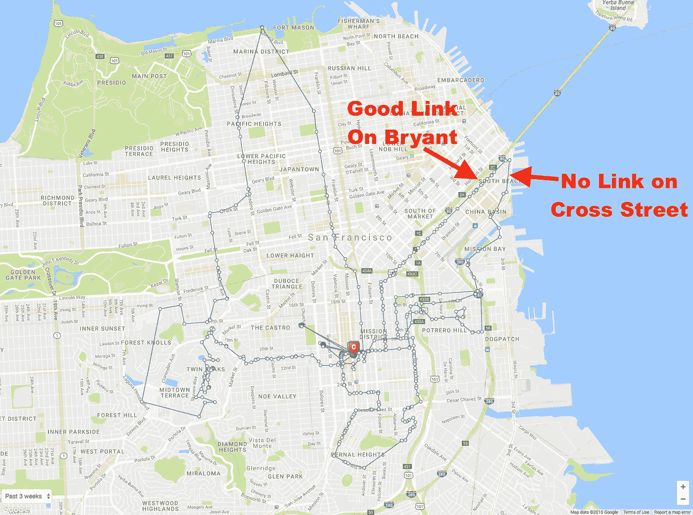

# 劳拉的无线范围是香蕉。旧金山物联网蜂窝初探。

> 原文：<https://medium.com/hackernoon/loras-wireless-range-is-bananas-a-first-look-at-cellular-for-iot-in-san-francisco-d5298eec42f3>

在 [Beep](http://www.beepnetworks.com) 的时候，我们花了一年时间研究一种新的远程无线[技术](https://hackernoon.com/tagged/technology)，叫做 [LoRa](https://hackernoon.com/tagged/lora) ，专门为物联网设计。

LoRa 是不同的，因为尽管它像 Wi-Fi 一样工作在无执照的频谱上，但它在非常长的范围内工作。因此，一个接入点可以覆盖数英里，而不是仅仅覆盖一个家庭。这意味着您可以非常轻松地在整个企业园区部署无线传感器，或者通过一个接入点跟踪大型站点上的资产。

它还支持物联网的多个接入点或塔，即类似蜂窝的网络。

你可能不相信我的话，当我说*英里*的范围。你还不应该。每年都有新的无线技术出现，声称其覆盖范围大得离谱，但在现实世界中却行不通。制造商兜售基于无干扰的视线部署的范围。这一切都很好，但是对于大多数现实世界的部署来说是不相关的。

(顺便说一句，我们知道 LoRa 部署在加利福尼亚州农村有一个非常高的塔，可以达到 100 英里的视距。但是说真的，谁在乎呢？)

我们一直在旧金山测试我们的系统，由于干扰(许多其他无线电)和拓扑结构(许多山丘)，旧金山可能是美国最难建立无线网络的地方。但是我们的传感器仍然有几英里的范围。

我们希望分享一些关于网络质量的更详细的数据，这些数据将在稍后发布。首先，这是一张地图，描绘了我骑着摩托车走的路线，测试了我们的传感器的范围和我们办公室屋顶上的一座塔。这当然不科学，也不代表高质量的报道。但我们发现这是一个有趣的快照，并认为我们应该分享。如果你正在测试劳拉收音机，我们希望你也能这样做。(我们甚至很快就会有可以用于测试的硬件。)

首先，让我们快速浏览一下这次旅行。在我解释清楚之前，这可能没有什么意义，所以请继续读下去。

好吧，我们来分析一下。

这是“塔”这是我们的劳拉网关——相当于一个手机信号塔。它有一个 6dB 增益的天线，这个是太阳能的，只是为了好玩。它在我们两层办公室的屋顶上。我们旁边的两栋建筑都比我们的高，所以这不是一个很好的位置，但也不错。就当是 B+网站吧。

“Tower” on the top of Beep Networks HQ, 21st and Mission

这是它在地图上的位置。

现在，测试设置。我把这个传感器放在我的背包里，它的大鞭状天线(约 3 dB 增益)挂在旁边。

蓝盒子里是一个工作在 27 dBm (500 mW)的 LoRa 无线电。这比标准的现成 LoRa 收音机的功率要高得多——我们用功率放大器来增强信号。(它仍然在 FCC 的限制范围内，只是设计稍微复杂一点。最大化范围是我们在 Beep 所做的一部分。)

传感器被设置成大约每 10 秒发送一次位置信息。它只传输一次，所以如果一个包丢失了，它不会显示在地图上(在标准的 [LoRaWAN](https://www.lora-alliance.org/What-Is-LoRa/Technology) 设置中，如果你没有收到确认，你会重新传输几次，但我们关闭了它)。

**所以地图上的每个圆圈都是传感器获得 GPS 定位并将其位置传回我们发射塔的一个点。**连接这些点的线显示了它们被接收的顺序，但它并没有显示实际经过的路径。如果您看到许多点彼此相邻，这表明大多数数据包正在通过。如果您看到没有点的间隙，则该区域没有数据包通过。

这并不是网络覆盖的全貌。这是一个非常宽容的考验，真的。对于覆盖测试，我们关注错误率(未收到的包的百分比+收到的有错误的包的百分比/发送的包的总数)。你总是会丢失一些数据包，这没什么，wi-fi 也是这样。你只需要有足够高的比例，就可以考虑你的网络所覆盖的区域。

最好把这看作是范围的测试，而不是覆盖面的测试。但是我跑题了。

好的，继续:**交通**。我们过去常常步行，但那不够快。骑自行车翻山越岭让人筋疲力尽。进入，完美的范围测试运输车辆:巴迪 125 踏板车。

我骑着摩托车向西绕过双峰，然后向北到码头，再回来。然后在市场南部的巨人体育场附近。然后向南绕过伯纳尔高地，测试我们当地所有的山丘。

如果你不熟悉旧金山，我们有很多山。我们在一个相对平坦的地方，米申社区，但是在任何方向不到一英里的地方都有小山。

Source: [Mike Ernst](http://www.mikeernst.net/portfolio/san-francisco-topography-map/).

结果很有趣。这是地图，有数据点。

首先，我们来看看城市的最末端。那是滨海绿地，在旧金山的北部边缘。我在那里呆了几分钟，无线连接的质量很糟糕，追踪器传输的大多数数据包都丢失了。但是有几个通过了。

令人惊讶的是所有的数据包都通过了。说真的，那有 **3.7 英里远，还有一座 250 英尺高的山**挡着路。那个信号不可能穿过地球，它一定是被什么东西反弹回来了。

更神奇的是，看看地图上标记为 **WTF** 的点。现在，说清楚一点，我在森林山巡游了大约 10 分钟，只有一个包裹通过了。但它不应该。那是在双峰的另一边，基本上是旧金山中部的一座小山，大约有 1000 英尺高。

认为这些联系是侥幸的。你当然不能指望他们。但是——哇。看到极端是很有趣的。

另一方面，在标有“攀登太平洋高地”的地方，我正沿着太平洋高地的南坡骑行。那不是我们塔的视线范围，但也不是太远。你可以看到有很多点，尽管我巡航得很快，所以那里的链接质量还不错。爬上一座小山有很大的不同。

让我们看看一个更有趣的地方:SoMa。

这离我们的塔有 2.7 英里。沿途很平坦，但沿途有很多高楼(5-10 层)。

当我沿着布莱恩特街向水边巡航时，连接非常好。科比是一条开阔的道路，虽然它一点也不像视线，但有足够的开阔空间让无线电信号四处传播。我一到了河边，拐了个弯，就失去了联系(注意，除了与另一条大路相交的地方，恩巴凯德罗沿线没有点)。

言下之意是，当信号通过 T2 的 T3 大楼时效果并不好，但是当有一条宽阔的街道时，它会很好地绕过 T5 大楼。所以，在一个基于网格的城市里，沿着*大道*你可能有几英里的路程，但是在*街道*上就更少了。或者类似的东西。

网络覆盖再次成为城市拓扑和布局的函数，就像收音机的规格表一样。这是一场本地比赛。

**有兴趣自己试试吗？**我们正在开发我们屋顶上的网关版本，加上一个全球定位系统跟踪器套件，让您可以进行类似的测试。大约一个月后会准备好。

我们很想看看你在你的城市能走多远。只需将您的电子邮箱地址写在这里，我们会及时通知您:www.beepnetworks.com

> [黑客午间](http://bit.ly/Hackernoon)是黑客们下午的开始。我们是 [@AMI](http://bit.ly/atAMIatAMI) 家族的一员。我们现在[接受提交](http://bit.ly/hackernoonsubmission)并很高兴[讨论广告&赞助](mailto:partners@amipublications.com)的机会。
> 
> 如果你喜欢这个故事，我们推荐你阅读我们的[最新科技故事](http://bit.ly/hackernoonlatestt)和[趋势科技故事](https://hackernoon.com/trending)。直到下一次，不要把世界的现实想当然！

