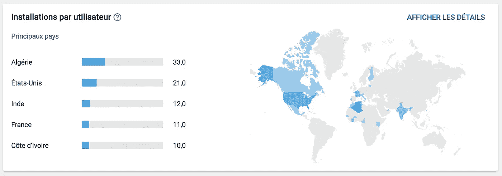
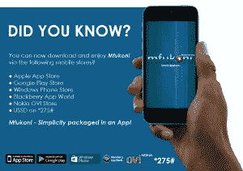
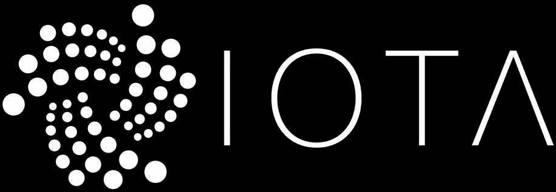
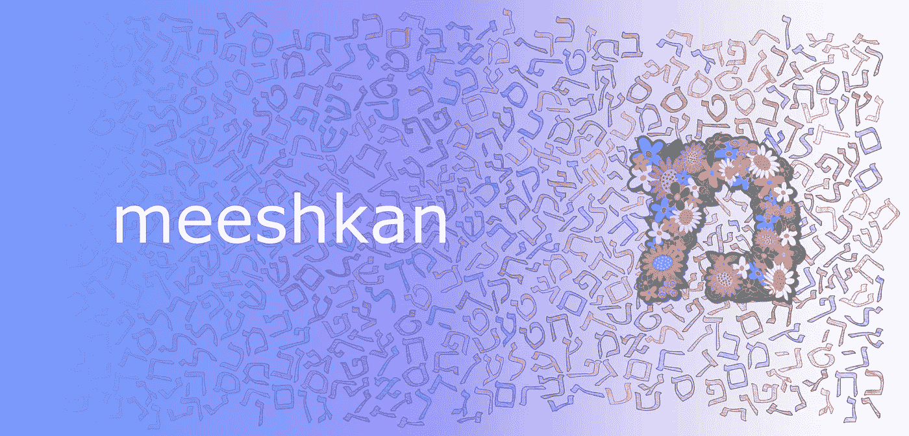

# 非洲的机器学习

> 原文：<https://medium.com/hackernoon/machine-learning-in-africa-cc3912cf1aac>

*TL；博士:阿尔及利亚人和科特迪瓦人正在踢一些主要机器学习的屁股！*

本月早些时候，我与一位来自科特迪瓦的朋友分享了 Meeshkan 机器学习服务，他的第一反应是“你必须在非洲传播这个信息。”我是热情的忠实信徒，他是真诚的热情，所以我们尝试了一下。我们最初在科特迪瓦、塞内加尔、阿尔及利亚和摩洛哥四个国家开展了小规模的广告活动。这些活动带来的有机增长比我们在欧洲或北美看到的任何事情都更有希望。为什么？以下是一些思考。

**米什坎——简介**

Meeshkan 是一项物联网服务，人们可以将几乎任何设备转换为执行分布式机器学习任务的客户端。人们按使用设备的时间付费。Meeshkan 目前处于公开测试阶段。你可以在这里下载应用程序[并查看](https://play.google.com/store/apps/details?id=com.meeshkan.android)[meeshkan.com](https://meeshkan.com)了解更多信息。

**非洲的手机文化**

Meeshkan 公测版的第一批用户来自非洲，占我们当前用户群的 50%以上。光阿尔及利亚就占了 33%！

The Meeshkan Public Beta in Africa

与任何小公司一样，很难确定自己数据中的趋势与更多全球现象之间是否存在统计意义上的显著关系。话虽如此，米什坎在非洲的早期采用并不令人惊讶，这有几个原因。请注意，这些原因来自我个人的研究以及与朋友和同事的讨论，但我们团队中没有人对非洲经济有足够的了解。我有兴趣听听别人是怎么想的！

正如美国有线电视新闻网报道的那样，非洲人拥有手机有很大的动力。对许多非洲人来说，它们是收听调频广播的渠道，是手电筒，是医疗保健的生命线，也是一个没有强大有形基础设施的大陆的银行。

银行文化特别有趣，也许是与米什坎早期采用最有关联的一种。例如，杰伊·罗森加德在哈佛大学肯尼迪中心发表的一篇 2016 年[论文](https://www.google.fi/url?sa=t&rct=j&q=&esrc=s&source=web&cd=1&ved=0ahUKEwjRtqiX-v7WAhXEUhQKHcl5D6sQFgglMAA&url=https%3A%2F%2Fresearch.hks.harvard.edu%2Fpublications%2FgetFile.aspx%3FId%3D1416&usg=AOvVaw0o6mjl53cHiJ5ylvmWivg8)显示，2014 年，肯尼亚人获得金融账户的比例从 45%跃升至 75%。经济学家从[发来的一份报告称，通过手机在内罗毕叫出租车比在纽约更容易。](https://www.economist.com/blogs/economist-explains/2013/05/economist-explains-18)[《赫芬顿邮报》的戴安娜·布拉泽尔](https://www.huffingtonpost.com/footnote/how-mobile-banking-is-tra_b_12944438.html)称这种现象为“跃进”——跳过中间技术，直接进入艺术状态

An advertisement for mfukoni, a popular banking app in Kenya.

从理论上讲，一个已经跃进移动银行的大陆应该已经成熟，可以跃进连接买家和卖家的移动市场，这就是 Meeshkan。然而，像 PayPal 和 Stripe 这样的流行解决方案只为有限数量的国家提供支付服务，这些国家几乎都是人均 GDP 排名前三分之一的国家。因此，在我看来，移动优先的文化不足以解释早期的采用率。一个主要因素可能是米什坎对加密货币的使用。

**加密货币**

非洲货币单位是出了名的不稳定，加密货币成为寻求保护资产的个人的可行替代方案是有道理的。然而，这只是一种猜测——我无法用任何研究来证实这一点。我在这方面的大部分探索来自 cryptoafrica.com 的博客。然而，创业公司已经开始在这个想法上对冲他们的赌注。例如，KodePay 是一家总部位于肯尼亚的初创公司，它将区块链货币引入当地市场。他们报告说，他们已经与肯尼亚银行建立了伙伴关系。

Meeshkan currently uses Iota as its cryptocurrency of choice.

作为一款物联网应用，Meeshkan 交易 Iota，这是一种分布式账本加密货币，允许无费用纳米交易。这是通过将工作证明附加到交易本身来完成的，其中每个交易必须批准另外两个交易才能被批准。Meeshkan 最近批准了与非洲物联网卖家在 Iota 中的第一笔交易，尽管我们在非洲批准的交易比其他大陆少。因此，虽然非洲似乎表面上已经成熟，可以进行加密货币革命，但我们还有很多工作要做，以向我们的非洲用户群宣传 Iota 和加密货币。我们正在努力工作，希望在未来的博客文章中能有好消息。

**好奇心**

所有这一切中最有趣的部分是，迄今为止，我们收到的唯一显示出对机器学习和/或服务好奇的电子邮件和推文来自非洲。我们被问到“什么是机器学习”、“机器会接管世界吗”、“人们通过机器学习能赚多少钱”等等问题。我们给这些人提供了各种在线资源，并对这些大问题给出了我们自己的适度回答。

The first tweet mentioning Meeshkan ever came from Africa! Effusive joy and minor debauchery ensued after seeing this.

所有这一切让我开始思考 Meeshkan 能否将网络上的*CPU/GPU 卖家*转化为*CPU/GPU 买家*？意思是，服务能否煽动人们成为机器学习的实践者？这对于 Meeshkan 来说会非常酷，因为我们很贪婪，希望系统中有更多的买家。但是对人类来说，这甚至会更酷，因为它将打破第一世界对机器学习的霸权，使所有人都可以使用它。

因此，在 Meeshkan Android 应用的下一个版本中，我们将提供一个标签，人们可以在那里探索机器学习。这个标签指向两个资源:一个机器学习趋势新闻的 RSS 和一个人们可以学习的开创性的吴恩达课程的链接。我们将收集分析数据，以了解这些选项有多受欢迎，如果我们发现它们被广泛使用，我们将探索该服务如何将 Meeshkan 物联网用户转化为 Meeshkan(非)机器学习者。

