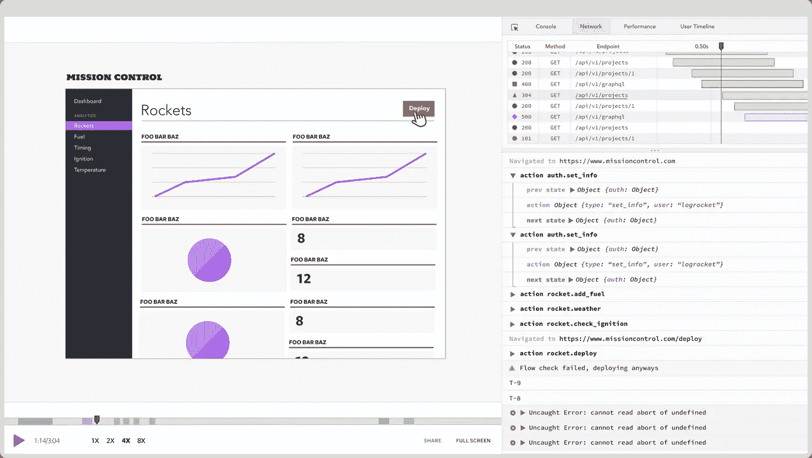

# 再次快速反应[第 2 部分]:你为什么更新

> 原文：<https://medium.com/hackernoon/make-react-fast-again-part-2-why-did-you-update-43a89dc96b10>


React 通常非常快，但是很容易犯小错误，导致性能问题。缓慢的组件安装、深度的组件树和不必要的渲染周期很快会让应用程序感觉很慢。

幸运的是，有很多工具可以帮助诊断性能问题，有些工具甚至是内置的。在本系列中，我们将重点介绍让 React 应用程序快速运行的工具和技术。每个帖子还会有一个互动的，有趣的演示！

# 问题:不必要的渲染周期

影响 React 性能的最常见问题之一是不必要的渲染周期。默认情况下，无论父组件何时渲染，React 组件都会重新渲染，即使它们的道具没有改变。

例如，如果我有这样一个简单的组件:

```
class DumbComponent extends Component {
  render() {
    return <div> {this.props.value} </div>;
  }
}
```

有这样一个父组件:

```
class Parent extends Component {
  render() {
    return <div>
      <DumbComponent value={3} />
    </div>;
  }
}
```

每当父组件渲染时，`DumbComponent`将重新渲染，尽管其属性没有改变。

一般来说，如果`render`运行，虚拟 DOM 没有变化，这是一个浪费渲染周期，因为`render`方法应该是纯的，没有任何副作用。在大规模的 React 应用程序中，检测发生这种情况的位置可能很棘手，但幸运的是，有一个工具可以提供帮助！

# 为什么更新？


`why-did-you-update`是一个挂钩 React 并检测潜在不必要的组件渲染的库。它检测组件的`render`方法何时被调用，尽管它的属性没有改变。

## 设置

1.  使用 npm 安装:`npm i --save-dev why-did-you-update`
2.  将此片段添加到您的应用中的任意位置:

```
import React from 'react'if (process.env.NODE_ENV !== 'production') {
  const {whyDidYouUpdate} = require('why-did-you-update')
  whyDidYouUpdate(React)
}
```

**注意**这个工具在本地开发中很棒，但是要确保在生产中禁用它，因为它会降低你的应用程序的速度。

## 了解输出

`why-did-you-update`在应用运行时监控应用，并记录可能发生不必要更改的组件。它可以让你在一个渲染周期之前和之后看到它认为可能是不必要的道具。

# 修复不必要的渲染

一旦你发现应用程序中有不必要的重复渲染的组件，有一些简单的修复方法。

## 使用纯组件

在上面的例子中，`DumbComponent`是其道具的纯函数。即组件只需要在其道具发生变化时重新渲染即可。React 内置了一种特殊类型的组件，称为`PureComponent`，正是针对这种用例。

而不是从 React 继承。组件，使用 React。像这样的纯组件:

```
class DumbComponent extends PureComponent {
  render() {
    return <div> {this.props.value} </div>;
  }
}
```

然后，组件只会在它的道具实际改变时重新渲染。就是这样！

注意`PureComponent`做了一个肤浅的道具比较，所以如果你使用复杂的数据结构，它可能会错过一些道具变化，不会更新你的组件。

## 实现 shouldComponentUpdate

`shouldComponentUpdate`是当`props`或`state`发生变化时，在`render`之前调用的组件方法。如果`shouldComponentUpdate`返回 true，将调用`render`，如果返回 false，则不执行任何操作。

通过实现这个方法，您可以指示 React 避免重新渲染一个给定的组件，如果它的属性没有改变的话。

例如，我们可以在上面的哑组件中实现`shouldComponentUpdate`,如下所示:

```
class DumbComponent extends Component {
  shouldComponentUpdate(nextProps) {
    if (this.props.value !== nextProps.value) {
      return true;
    } else {
      return false;
    }
  }render() {
    return <div>foo</div>;
  }
}
```

# 演示！

为了演示`why-did-you-update`，我在 Code Sandbox 上的 TodoMVC 应用程序中安装了这个库，Code Sandbox 是一个在线 React 游乐场。打开浏览器控制台，添加一些 TODOs 来查看输出。

[https://codesandbox.io/s/xGJP4QExn](https://codesandbox.io/s/xGJP4QExn)

请注意，应用程序中的一些组件进行了不必要的渲染。尝试实现上述技术，以防止不必要的渲染。如果操作正确，控制台中应该没有来自`why-did-you-update`的输出。

# 调试生产中的性能问题

`why-did-you-update`只在本地开发有效。如果您有兴趣了解生产应用程序中的性能问题，请尝试 [LogRocket](https://logrocket.com) 。



LogRocket 是一个前端日志工具，可以让你回放问题，就像它们发生在你自己的浏览器中一样。LogRocket 不需要猜测错误发生的原因，也不需要向用户询问截图和日志转储，而是让您重放会话以快速了解哪里出错了。

LogRocket 让你的应用程序记录性能计时、Redux 动作/状态、日志、错误、带有头+主体的网络请求/响应以及浏览器元数据。它还记录页面上的 HTML 和 CSS，甚至可以重建最复杂的单页面应用程序的像素级完美视频。

[](https://logrocket.com/) [## JavaScript 应用程序的日志记录和会话重放

### LogRocket 帮助您了解影响用户的问题，以便您可以重新开始构建优秀的软件。

logrocket.com](https://logrocket.com/) 

# 结论

`why-did-you-update`是一个方便的工具，用于检测潜在的不必要的组件重渲染，帮助你使你的应用程序性能更好。

因为`why-did-you-update`只在开发中工作，所以请查看[日志火箭](https://logrocket.com)，以诊断生产中的错误和性能问题。

要了解更多 React 性能技巧，请查看本系列的第 1 部分和第 3 部分:

[](https://blog.logrocket.com/make-react-fast-again-part-1-performance-timeline-f7f39f676f58) [## 再次快速反应[第 1 部分]:性能时间表

### React 通常非常快，但是很容易犯小错误，导致性能问题。慢速分量…

blog.logrocket.com](https://blog.logrocket.com/make-react-fast-again-part-1-performance-timeline-f7f39f676f58) [](https://blog.logrocket.com/make-react-fast-again-part-3-highlighting-component-updates-6119e45e6833) [## 再次快速反应[第 3 部分]:突出组件更新

### React 通常非常快，但是很容易犯小错误，导致性能问题。慢速分量…

blog.logrocket.com](https://blog.logrocket.com/make-react-fast-again-part-3-highlighting-component-updates-6119e45e6833) 

*很难保持前端开发的最新状态。加入我们的每周邮件列表，了解新的工具、库和最佳实践，帮助你构建更好的应用:*

[](http://bit.ly/HackernoonFB)[](https://goo.gl/k7XYbx)[](https://goo.gl/4ofytp)

> [黑客中午](http://bit.ly/Hackernoon)是黑客们下午的开始。我们是 [@AMI](http://bit.ly/atAMIatAMI) 家庭的一员。我们现在[接受投稿](http://bit.ly/hackernoonsubmission)并乐意[讨论广告&赞助](mailto:partners@amipublications.com)机会。
> 
> 如果你喜欢这个故事，我们推荐你阅读我们的[最新科技故事](http://bit.ly/hackernoonlatestt)和[趋势科技故事](https://hackernoon.com/trending)。直到下一次，不要把世界的现实想当然！

