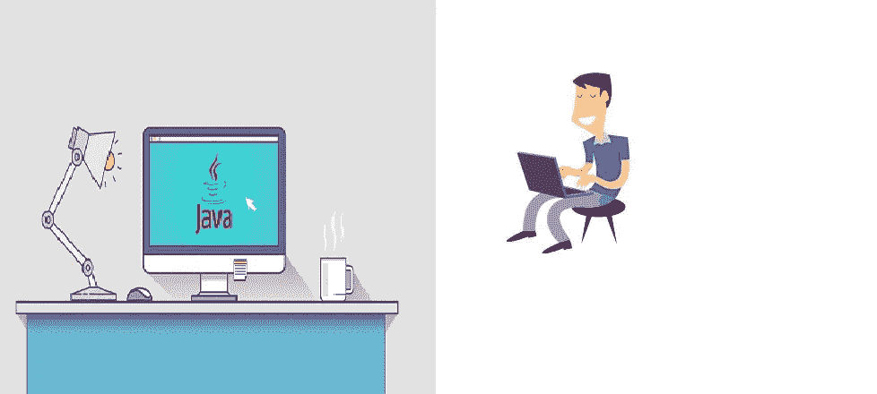

# 让 Java 开发者的生活更轻松:ModRun vs . Jigsaw 项目

> 原文：<https://medium.com/hackernoon/making-life-easier-for-java-devs-modrun-vs-project-jigsaw-747094d114a4>

在[之前的帖子](https://hackernoon.com/modrun-java-classloading-made-easy-1dfd0d64f780#.ams4oy2xb)中，我们基本上介绍了 [ModRun](https://github.com/nanosai/modrun) 作为一个 Java 类加载器，能够直接从 Maven 仓库加载和运行类，并在运行时解析依赖关系。今天，我们将更进一步，将 [ModRun](https://github.com/nanosai/modrun) 作为一款有用的多功能工具，帮助 Java 开发人员发布、(卸载)、安装、运行和升级 Java 应用，同时解决一些所谓的“T6 项目拼图”还没有解决的问题(据我们所知)。

如果你是一个 Java 开发者，我们不需要提醒你安装和运行 Java 应用程序的挑战和麻烦。是的，有几个模型试图解决这个问题，但在我们看来，它们都没有真正成功地使 Java 应用程序的安装和启动像我们应该用 [ModRun](https://github.com/nanosai/modrun) 做的那样简单。尤其是当您使用各种服务的最新版本来更新多台服务器时。

在我们继续之前，我们将把 [ModRun](https://github.com/nanosai/modrun) 的定义扩展为一个 Java 应用程序安装器/启动器/类加载器，它可以直接从 Maven 存储库中加载和运行模块。另一种描述 ModRun 的方式是把它看作 Java 应用程序的 NPM 或 RPM。现在我们已经扩展了 ModRun 的定义，让我们与您分享随着项目的成熟，我们计划如何在未来几周/几个月内解决以下问题:

*   Java 应用程序的发布。
*   从远程存储库安装 Java 应用程序。
*   运行存储在本地 Maven 存储库中的 Java 应用程序。
*   升级 Java 应用程序。
*   卸载 Java 应用程序。

## Java 应用程序的发布

由于 ModRun 可以直接从 Maven 资源库下载应用程序，所以开发人员发布 Java 应用程序所需要做的就是将其 Maven 工件(JAR 文件)发布到 Maven 资源库。ModRun 可以从那里下载它，解析它的依赖项并下载它们。

将应用程序发布到 Maven 存储库使得发布非常标准化和小。开发人员只需上传他们的应用程序的 JAR 文件，假设所有的依赖项都已经存储在 Maven 存储库中。

**安装 Java 应用程序**

如前所述，ModRun 将能够直接从 Maven 仓库下载应用程序的 JAR 文件。ModRun 将 JAR 文件本地存储在对应于本地 Maven 存储库的位置(JAR 和 POM 文件的目录结构和位置相同)。这使得应用程序及其依赖项的安装非常标准化。

将应用程序 JAR 文件及其依赖项保存在本地 Maven 存储库结构中，可以很容易地同时安装应用程序的多个版本。

## 运行 Java 应用程序

一旦 Java 应用程序的 JAR 文件位于本地 Maven 存储库结构中，ModRun 就可以从那里加载并运行应用程序。所有需要做的就是给 ModRun 本地 Maven 存储库目录的路径，以及要运行的 groupId、artifactId、artifactVersion 和 main 类，加上应用程序需要的任何其他命令行参数。

使用 ModRun 运行 Java 应用程序使得类路径非常简单。类路径中只需要 ModRun 的 JAR 文件。应用程序工件及其依赖项都在运行时解析，并使用 ModRun 的特殊类加载器结构加载。

ModRun 特殊的类加载器结构可以在运行时解析和加载 Maven 工件的依赖关系。类加载器结构能够将一个模块(工件)的依赖关系与其他工件的依赖关系隔离开来。这意味着可以将同一个工件的不同版本加载到内存中，甚至是在同一个应用程序中(只要满足某些条件)。ModRun 还可以将同一个应用多次加载到同一个 JVM 中(或者不同的应用)，并使它们彼此完全隔离。从安全角度来说很好！:)

## 升级 Java 应用程序

用 ModRun 升级一个 Java 应用程序并不比一开始安装它更难！新版本是从远程 Maven 仓库下载的，并与任何新的依赖项一起安装在本地。

## 卸载 Java 应用程序和依赖项

当 ModRun 在本地 Maven 存储库结构中安装工件时，它会跟踪哪些工件是应用程序，哪些只是依赖关系。通过这种方式，ModRun 可以轻松卸载一个应用程序，或者一个应用程序的特定版本。

卸载应用程序后，ModRun 可以遍历整个本地 Maven 存储库结构，并找出哪些依赖项不再被任何应用程序引用。然后也可以删除这些依赖项(如果将来需要，它们总是可以很容易地再次下载)。

# 魔龙大战竖锯

ModRun 解决了一些与 Java 9 中的 Jigsaw 项目相同的问题。然而，Jigsaw 没有解决工件版本控制，也没有提供标准化的 Java 应用程序/模块存储库结构，也没有提供标准化的安装和卸载程序(据我们所知)。ModRun 提供了所有这些！ModRun 当然适用于 Java 8，我们将确保它也适用于 Java 9。

最后，除了上面几节中描述的特性，我们还有许多关于 ModRun 的其他想法。例如，保持大型服务器网格与相同的 Java 应用程序保持同步的特性(**例如微服务**)，或者成组升级服务器(alpha 服务器、beta 服务器等)。

## **ModRun GitHub 资源库**

ModRun 是开源的(Apache license 2.0)，可以在 [GitHub 这里](https://github.com/nanosai/modrun)找到。如果你喜欢它，请随时查看并开始使用它，还有一些由我们的联合创始人兼首席技术官 Jakob Jenkov 在 [Nanosai](http://www.nanosai.com) 写的[教程](http://tutorials.jenkov.com/modrun/index.html)。

> [黑客中午](http://bit.ly/Hackernoon)是黑客如何开始他们的下午。我们是阿妹家庭的一员。我们现在[接受投稿](http://bit.ly/hackernoonsubmission)并乐意[讨论广告&赞助](mailto:partners@amipublications.com)机会。
> 
> 如果你喜欢这个故事，我们推荐你阅读我们的[最新科技故事](http://bit.ly/hackernoonlatestt)和[趋势科技故事](https://hackernoon.com/trending)。直到下一次，不要把世界的现实想当然！

