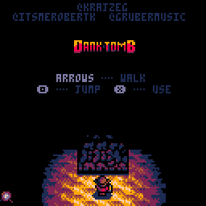
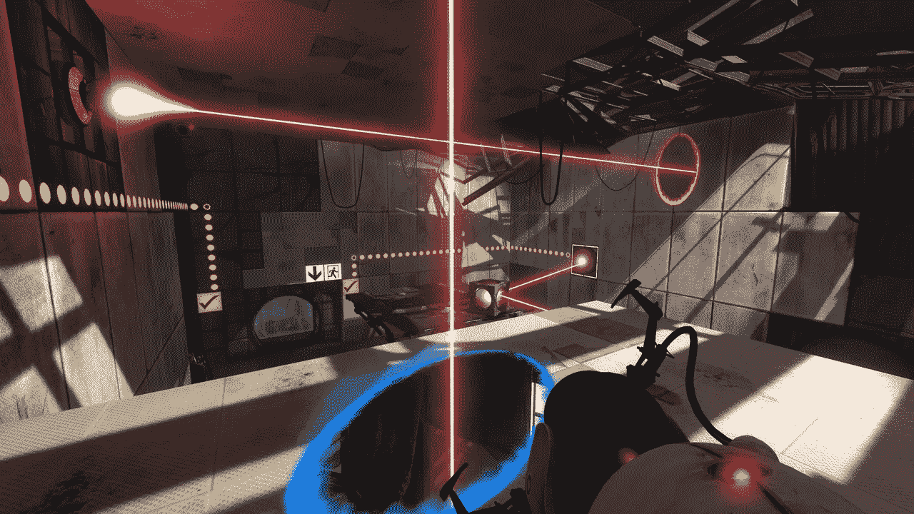
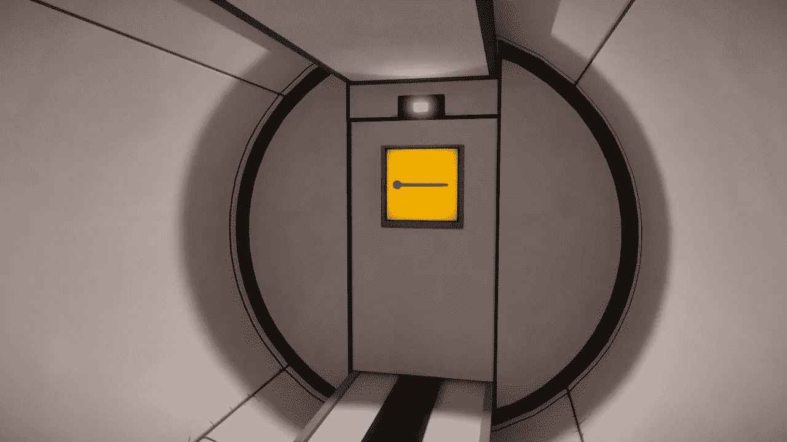
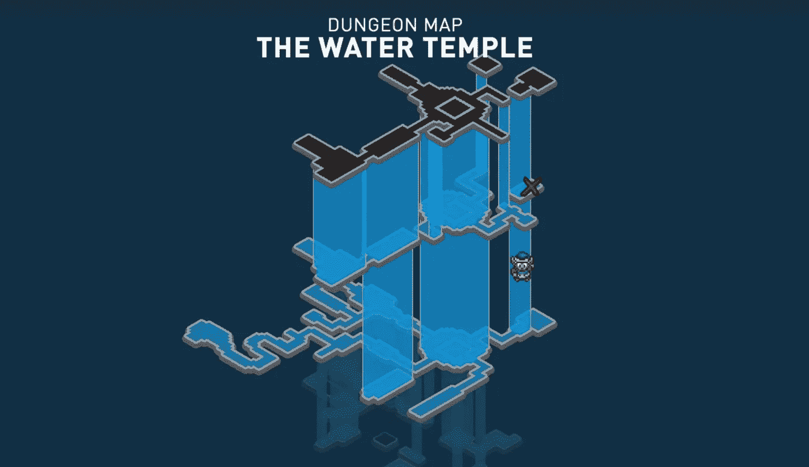
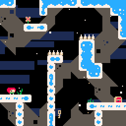
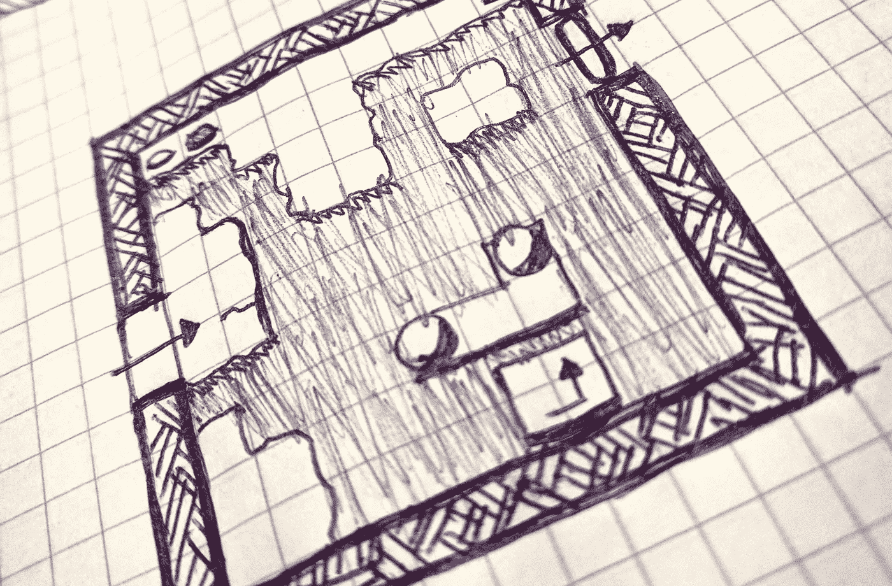

# 给你出难题

> 原文：<https://medium.com/hackernoon/making-puzzles-hard-on-you-bd2102fa4105>

## 如何让困难变得有趣？

在过去的几个月里，我一直在开发我的第二款 [PICO-8](http://lexaloffle.com/pico-8.php) 游戏:阴森森的坟墓。这个游戏的核心理念来自于一个[实时灯光演示](https://www.lexaloffle.com/bbs/?tid=28785)。因为我是从视觉开始的，所以我不得不寻找合适的机制来匹配它们。我考虑了恐怖主题和一些其他方法，然后决定采用自上而下的视角，类似于旧塞尔达游戏的地下城。

Dank Tomb in all its glory.

[谜题](https://hackernoon.com/tagged/puzzle)游戏的生死取决于它们的学习曲线，以及在太容易和太难之间达成微妙的平衡。偏离一个方向太远，你最终会因为无聊或沮丧而失去球员。

预先知道我正在开发一个非常有限的系统，我意识到 Dank Tomb 的内容将会很少。我必须充分利用每个房间和每个谜题，不能在难度曲线的任何一个方向上犯太多错误。

这让我思考了很多关于益智游戏的本质——到底是什么让拼图变得难，是什么让拼图变得有趣，以及这两者之间的关系。今天我想和你分享这些想法。

## 让生活变得艰难

每当一个想法必须实现时，总有人要想出一个[设计](https://hackernoon.com/tagged/design)。日常用品的工业设计，应用程序的 UI 设计，游戏的关卡设计。

游戏设计是一种非常奇怪的野兽——在某种程度上，它与其他类型的设计完全相反。在设计微波炉或手机应用程序时，易用性同等重要。当人们描述你的产品时，“有挑战性”并不是你真正想听到的词。

A rather elaborate design for an elevator call button.

然而在游戏中，*挑战*是至关重要的组成部分。游戏设计者故意在玩家的道路上设置障碍。玩家以克服它们为乐。这在益智游戏中尤其明显——如果在现实生活中使用电梯像在《传送门》中一样困难，我们可能都会选择走楼梯。

## 疯狂的方法

要让益智游戏有趣，它必须是困难的。作为一名设计师，我的目标是挑战你，而不是打败你。这有点像浪漫:我必须在一开始迷惑你，但也巧妙地引导你走向正确的解决方案，以在你最终得到它时给你那纯粹的喜悦。

但是困难是一个复杂的话题，一个难题是困难的并不总是意味着同样的事情。为了更好地理解拼图是如何运作的，我从马克·罗斯沃特那里获得了灵感，他是《魔法 T0:聚会 T1》的首席设计师。

一度，魔术师 R&D 很难控制他们的游戏有多复杂，这让新玩家觉得很难玩。马克试图发现这个问题的根本原因，并最终确定了三种不同的认知负荷来源:理解复杂性、棋盘复杂性和策略复杂性。这导致了处理它们的解决方案——你可以在他的[优秀文章](http://magic.wizards.com/en/articles/archive/making-magic/new-world-order-2011-12-02)中找到细节。

马克的方法启发我为益智游戏尝试了类似的事情:确定在设计益智游戏时我们引入了哪些难度来源，以及使用每种来源的好处、缺点和危险。

## 理解困难——理解游戏

这是尝试新游戏或机制时遇到的第一种困难。**理解难度**是玩家脑海中突然出现的第一个问题:“这是如何工作的？”。

假设我们有一个基于激光和镜子的游戏。墙上还有一个类似传感器的东西。这里做什么很明显，但是我们仍然需要学习如何做。你能把激光转过去吗？镜子可以推或者旋转，还是固定在原地？光束的颜色重要吗？如果你穿过光束，激光会杀死你吗？

在许多现代游戏中，这种困难被视为一种必要的邪恶，并推出了丰富的教程来对抗它。有时候也是唯一的办法——很多力学很难单纯靠探索发现，没有别的办法教控制。

但是学习教程也有它的问题。他们的工作方式是给玩家讲授游戏机制，并期望他们全部记住。正如“讲座”这个词所暗示的，这不仅不真实，而且不可靠。如果人们自己发现了解决方案，而不是被告知该做什么，他们会更容易学会。

但我们必须以某种方式教球员。如果我们不能直接告诉他们该做什么，他们就会被迫简单地尝试一些事情，直到事情有所进展。这不是问题，只要我们设计游戏来适应它。

No instructions, but it’s not exactly rocket science.

如何做到这一点的一个很好的现代例子是*证人*。你在一个封闭的地方开始游戏，门上有一个谜题，没有解释如何解决它。考虑到其设计的一些特性，这不是问题:

*   目标很明确:房间里唯一的东西就是门
*   **位置安全:**没有时间压力，没有敌人需要担心，没有失败的可能
*   这个谜题非常简单:可以在没有任何信息的情况下找到正确的答案
*   **机械师很直观:**给你一些可以画画的东西和一个迷宫，你首先想到的就是画一条路
*   **它迫使你学习:**除了学习规则，别无他法

解决这个难题教会你这个游戏的核心机制——有图案的面板必须被激活。一旦激活它们，你就画出一条通往出口的路径。随后的谜题建立在这个基础上，但基本思想适用于这个游戏中的大多数谜题。

证人成功地教会了我们规则，尽管他没有提供一个字的解释。为了在我们自己的游戏中复制它的成功，我们必须总结和复制使它成功的五个因素:

*   **保持专注:**将玩家锁定在一个小位置，让目标清晰
*   **为实验提供安全的环境:**没有干扰
*   **保持简单:**制作显示规则所需的最小拼图
*   **让它变得直观:**让猜测你的棋子的行为变得容易
*   使它详尽无遗:确保解决这个难题的唯一方法是学习你期望它教给你的所有规则

让我们把这个应用到激光的例子中。用镜子来偏转光束是一个非常直观的想法，但是我们仍然需要考虑其他的条件。所以我们决定把玩家锁在一个小房间里(保持专注)，里面有*一个*激光器、*一个*镜子(保持简单)，没有其他东西(安全环境)。我们的激光器是固定的，但可以旋转，而镜子既可以推动也可以旋转。拼图应该要求执行所有这些动作，以便正确地教授基础知识(穷举)。

在我们的游戏中，当玩家穿越激光束时，它也会杀死玩家。我们可以试着把这个也包括在介绍性的谜题中，但是那会把事情搞得一团糟，并且使最初的谜题失去焦点。或许最好设计一个单独的谜题来教这个，而只教那个。

## 概念上的困难——超越基础

在向我们的玩家展示了游戏的基本规则之后，我们可以开始构建这些知识了。两种主要方法中的第一种是引入概念难度***:*迫使玩家以新的方式使用他们现有的知识。**

**玩家遇到一个有激光和镜子，但没有传感器的房间。他们意识到这不是一个标准的“引导光束到传感器”难题。很快就变得很明显，要穿过房间，镜子必须用来形成一条清晰的路径——否则，光束会杀死你。**

**这是一个新的概念，如果是一个简单的概念，玩家必须想出解决这个难题。控制每个组件的规则已经很清楚了:激光杀人，镜子偏转光束。你只需要把你已经知道的事实联系起来就能得到解决方案。**

**这是概念难度的核心:让玩家对他们已经知道的东西提出新的用途。这种类型的困难是不断积累的。一旦玩家解决了一个概念性的难题，其背后的概念就成为他们游戏知识的一部分。在未来的谜题中使用它不再增加任何难度。**

**我将再次使用目击者来说明概念难度的想法，因为这是一个在袖子上自豪地穿着它的结构的游戏。这个游戏中的拼图通常是成套的。每组中的第一个面板要求你想出一个新概念，比如意识到拼图中的路径与附近的树相对应。**

****

**The branches of this tree seem to match the shape of the puzzle. Probably a coincidence.**

**这种类型的难度对游戏来说是很大的。解开谜题会带来令人满意的“啊哈！”时刻，并保持稳定的新概念流保持游戏新鲜。**

**但也有不好的一面:这些谜题可能是危险的二进制。根据定义，解决这些问题需要一瞬间的洞察力，很容易设计一个变成三分钟盯着屏幕，然后最终得到它，然后在五秒钟内完成它。适度的话，这可能会很有趣，但是如果屏幕上唯一发生的事情就是角色无所事事的动画，这很快就会变得很无聊。**

**更糟糕的是，玩家很容易被这样的谜题困住。如果玩家陷入困境时唯一的出路是盯着拼图看更长时间，那么这个玩家很有可能已经离开并在玩另一个游戏了。**

**为了避免落入这个陷阱，这种类型的谜题应该仔细设计，允许实验——推推东西，摆弄旋钮，尝试东西。如果这样的实验能产生一些提示，那是最好的:一个可能被随机发现的部分解决方案，或者一个失败的非解决方案，它揭示了需要避免什么。这一层的地理位置也有助于突出重要的东西，利用灯光或战略性放置的壁架为镜子指出正确的位置。**

**这样，那些在脑海中立即解决问题的人仍然可以去做，并获得所有的好处——他们不需要实验，也不会注意到你的暗示。与此同时，那些陷入困境的人有办法摆脱困境，努力找到解决办法。**

## **组合困难——数量有它自己的质量**

**概念难度要求你想出一个新的想法，而组合难度只使用已知的概念，但要求一次将它们应用到更多的事情上。**

**我们可以用激光、镜子和传感器建造一个非常标准的房间。这是我们激光游戏的标准谜题设计——没什么新鲜的。但是这一次，我们将每样放入五个。**

**突然间，这个难题有了新的方面。你需要弄清楚哪个镜子配哪个光束。用于一束激光的镜子会阻挡另一束激光，使得定位更加困难。你还必须找出正确的顺序——如果你一开始就选择了错误的光束，它可能会阻挡你到达另一面镜子的路径。**

**这是证人向我们阐述的另一个观点。正如我在前面提到的，这个游戏中的谜题是成套的。这类谜题中的第一个通常会教给我们一些新的东西。下面的只是提供*更多的*。更大的图案要填充，更长的路径要绘制，更多的事情要记住。**

****

**If putting the puzzles side-by-side like this “they’re all based on the same rules” obvious, I don’t know what would**

**这种方法比引入一个新概念要安全得多。基本上不存在玩家陷入绝望的危险。所有元素都是已知的量，它们的工作原理是清楚的。只需要找到正确的动作顺序。**

**这里的陷阱在于过于依赖这种方法。由于这些谜题没有引入任何新的东西，连续解决第四个谜题会让人觉得是工作而不是乐趣。游戏变得陈旧，玩家退出。你可以把事情推到多远也是有限制的——在你的拼图中放太多移动的棋子，玩家将无法跟踪所有的棋子。**

**这两个问题的解决方案是适度使用组合难度。只要它保持令人满意，就增加拼图，然后切换到一个新的想法，或根据不同的想法散布拼图，以保持新鲜。**

## **认知困难——永远不要忘记**

**组合难度是关于难题的可能性空间的大小。**认知难度**是关于一种更字面上的尺寸:时间和空间上的实际尺寸。**

**假设你遇到一个房间，房间里有一个激光器，墙上有三个洞。把激光对准他们似乎没什么作用，所以你过一会儿就放手，进一步探索。十分钟后，你在楼层的不同部分发现一个相似的房间。这一次，有三个孔和一个光传感器，但没有激光。这形成了跨越多个房间的元拼图。**

**当你读到它时，它并不完全是火箭科学:找出哪个孔可以进入传感器，去激光室，正确瞄准，返回传感器室，完成。但是在实际的游戏玩法上就没那么简单了。**

**在参观这两个房间的过程中，你可能参观了另外十个房间，解决了另外五个谜题，看了三个过场动画，并且很可能完全忘记了十五分钟前你看到的洞。它甚至可能发生在昨天*，*如果你刚刚从一个保存的状态开始。这就是意识困难的来源——在正确的时间记住正确的事情。**

**这种类型的谜题可以令人满意，因为它给你的关卡提供了更大的位置感——大型的跨地图谜题有助于将游戏世界变成一个有凝聚力的整体，而不是一系列不连贯的挑战。**

**但是这里也有一些重大的危险。第一，这种类型的拼图失败时，失败*硬*。当你错过了一个关键线索时，唯一的出路就是重新探索你已经去过的地方，努力找到一些东西。如果你不知道你在找什么，那就只是随意走走，直到你找到合适的东西，没有人特别喜欢这种典型的“我被卡住了”的体验。**

**第二，即使你记住了所有的事实，仍然存在回溯的问题。如果解决方案中涉及的房间离得很远，解决谜题*将会*花费很多时间——花在检查你已经去过的房间上的时间。一些玩家对此已经建立了一种容忍，而另一些玩家会在第一次被要求返回时愤怒地退出。**

**有几种方法可以解决这个问题。你可以让参加元拼图的房间令人难忘，而且挨得很近。您可以通过引入快捷方式来限制回溯。你可以在玩家的地图上高亮显示“有趣”的房间，甚至可以提供一个巨大的箭头为他们指出正确的方向。但这些都是掩盖问题的创可贴。**

**但是还有另一个解决方案，一个反其道而行之的方案:把元拼图做得非常大，成为游戏整个部分的主题。一个墙上有三个洞的房间比一个占据整层楼、各种输入、输出、管道和阀门遍布整层楼的闪亮的大机器更容易被错过。这样一个精心制作的谜题吸引了很多人的注意力，并且很容易让人记住。**

**最著名的游戏是《塞尔达传说》。这些游戏喜欢把整个地下城变成一个大拼图，要求你把关卡颠倒过来或者砸碎柱子以使天花板坍塌。**

**也许最著名的塞尔达地下城就是《T4》中的水神庙。它的特点是阀门可以让你控制整个地下城的水位。每个设置都允许您访问以前无法到达的通道，同时阻止其他通道。弄清楚这一切，并让你的方式是非常有益的。**

****

**The only indication this is not a sewer map is that Link doesn’t usually feature in them. (image from a [Boss Keys](https://www.youtube.com/watch?v=6LO8Z1DkDqc) episode, courtesy of Mark Brown)**

**然而，即使是水神庙——如何做好这种元谜题的主要例子——也是两极化的。一些人喜欢它，另一些人讨厌回溯和由纯粹的范围引起的缓慢速度。任天堂在后来的游戏中改变了他们的设计理念，制作了更多快捷方式、更少回溯和更简单元谜题的地下城——很大程度上是因为这个问题，人们可能会认为。**

## **执行困难——实践与理论有何不同**

**最后一种困难来自不同的领域。执行难度不在于解决方案有多难，而在于在游戏中执行有多难。**

**这种类型的难度更多的是关于灵活性而不是智力，并且在整个游戏中通常是相当稳定的。这款游戏在这种规模上的定位定义了它所属的确切类型以及它想要触及的目标受众。**

**许多纯益智游戏的特点是完全没有执行难度。一旦你找到了解决方法，你就可以按照自己的速度来做，不需要技巧。这是一个有效的选择，一些玩家更喜欢这样的游戏，但也有一些警告。**

**如果这个难题很复杂，那么执行解决方案的过程可能需要一段时间。鉴于执行解决方案是微不足道的，游戏有趣的部分已经在玩家的脑海中发生了。发生在屏幕上的部分是一个预先确定的结论，只需要向游戏证明你解决了它。这只是过场动画的一个升级，从长远来看会让游戏变得无聊。**

**这种滑动比例的另一个极端最好的例子是像 *N* 、*超级肉仔*或[塞莱斯特](https://www.lexaloffle.com/bbs/?tid=2145) 这样的平台。很多技能型的平台游戏，其实就是变相的混合型益智游戏。难题在于找到正确的跑步、跳跃、爬墙和其他移动的顺序，这是让你到达目的地所需要的。**

****

**Getting there is as hard as figuring out ***how****.***

**即使你知道解决方案，在这些游戏中也很难在正确的时机实现它。如果你的游戏的重点是谜题而不是动作，那可能不是很明智——你可能会让更注重大脑的观众感到沮丧。**

**我认为执行难度最重要的一点是，你可以选择任意的难度——只要它在整个游戏中相对稳定。如果你决定完全没有灵巧的元素——好吧，有人会喜欢的！如果你有很多，也有人会崇拜*和*。**

**危险的是在一个游戏中混合这两种方法。你这样做的唯一结果是疏远两个群体，喜欢动作的人对缓慢的谜题感到厌烦，而铁杆谜题爱好者对动作序列感到厌烦。**

**同样重要的是，不要将执行难度混入其他类型的难题中。我从早期的 Dank Tomb 游戏测试中得到的最常见的反馈是，解决一个复杂的难题却因错过所需的最后一跳而被杀死是多么令人沮丧。**

## **现在都在一起**

**所以，我有五种不同的方法来理解我的益智游戏有多难。太好了，但是它们有什么用呢？**

**主要的好处是给一个概念命名更容易推理。当我们的设计出现问题时，我们经常会感觉到它，但是如果没有一个合适的框架来思考它，就很难*找到原因*。关注难度类型对拼图设计的某些方面很有帮助。**

****

**That’s how a design for a Dank Tomb room begins.**

**我现在可以有意识地问自己——我试图提出哪种类型的挑战？一旦我明白了这一点，它会帮助我保持专注。如果我的目标是做一个概念性的拼图，我知道我应该保持组件的数量很少。我还会反复检查这个谜题的实验难度，以及设计中是否嵌入了足够的提示。**

**另一件要记住的事情是一次增加一种类型的难度。如果我在引入一个新概念后迅速增加概念和组合的难度，我就冒着把游戏的学习曲线变成一堵砖墙的风险。还是轻轻的做比较好。首先是一个让组合空间更大的房间，然后是另一个关注新想法的房间。**

**除了关注单个谜题，用这些术语思考还有助于关注游戏的整体设计。对于《潮湿的坟墓》,我决定把重点放在概念难度上，因为这似乎最适合在这样一个小游戏中创造广度的感觉。知道这种类型的困难的警告，我不得不仔细地排列拼图，以确保每个概念在使用之前都有适当的介绍。我特意把其他类型的困难混合在一起。概念上的困难是主要的焦点，但是我用基于不同原理的房间来点缀它，以吸引玩家大脑的不同部分。**

**这些类别在游戏测试中也很有用。如果你看到一个球员在挣扎，你可以问自己:这里的问题是什么？玩家是不是少了一个*概念*？让我们给谜题添加提示吧！他们是否很难确定正确的行动顺序？可能会降低组合的复杂性。他们对一条规则有困难，因为你没有正确地教它？确保应该教它的位置完成了它的工作，并且在正确的时间出现！或者你知道，加上一条——有时你会完全错过一些事情，因为这些规则对你来说是有意义的。**

## **包扎**

**正如设计中的许多事情一样，当谈到保持困难的乐趣时，很难提供铁一般的规则和明确的答案。我所能提供的是新的*工具*来帮助我们理解是什么让游戏成功，以及什么可以被调整以使它们变得更好。**

**你对哪些类型的困难应该优先考虑，他们的问题是什么，以及如何应对这些问题的回答可能都与我的不同。我仍然希望不管它们是什么，我的文章能帮助你找到它们！**

**如果你想看看我是如何将我的想法付诸实践的，Dank Tomb 的测试版可以通过我的 Patreon 页面获得——这也有助于撰写更多的文章。成为赞助人是我写新东西时得到通知的好方法，但是你也可以在[媒体](/@krajzeg)或[推特](https://twitter.com/krajzeg)上关注我！**

**在那之前，愿你玩的所有游戏都充满挑战和乐趣！**

***这篇文章的存在要感谢我的*[*pat reon*](https://patreon.com/krajzeg)*支持者:Tomasz Bylina，Adam Kwapiń ski 和许多其他人。***