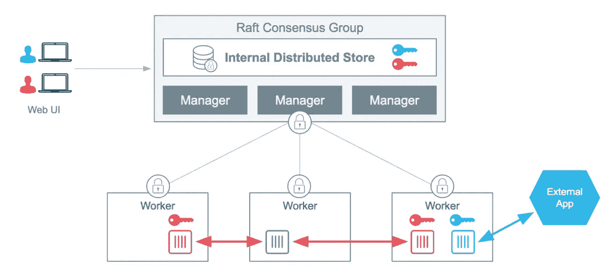

# Docker Swarm 中的秘密管理

> 原文：<https://medium.com/hackernoon/managing-secrets-in-docker-swarm-6da766f1357d>

**免责声明**:我首先为[semaphoreci.com 社区博客](https://semaphoreci.com/community/tutorials/managing-secrets-in-docker-swarm)写了这篇文章，它属于谁，它在[by-NC-sa 4.0 license](https://creativecommons.org/licenses/by-nc-sa/4.0/)下分享在这个博客中。

# 介绍

Docker 改变了开发、测试和运行软件的方式，这就是为什么软件工程师和公司应该培养新的习惯并遵循最佳实践。另一方面，像 Docker Swarm、K8S 或 Mesos 这样的编排技术也在根据行业需求而变化。安全管理，包括 Docker Swarm 中的秘密管理，是对这些变化的反应之一。

使用 Docker 和编排工具时，遵循安全最佳实践非常重要。软件变得越来越分散，随着新的开发模式(例如微服务架构)的兴起，软件组件之间的通信正在采用新的模式，如基于消息的通信。

在生产环境中，运行不同服务的容器可能会交换一些关键信息。当将软件部署到不同的环境中时，很明显，在开发环境中存储像生产密码这样的关键信息不是一个好的做法。在很多情况下，我们会注意到需要一个标准化的接口来访问机密。

数据中心操作系统、Kubernetes 和其他编排技术拥有自己的集成机密管理解决方案。在本教程中，我们将探索 Docker 本机秘密管理。

# 在群体模式下管理秘密

在本教程的这一部分，我们将了解如何使用 Docker Secrets 创建、附加和旋转敏感数据。

# Docker 秘密是如何工作的

从 1.13 版本开始，Docker 用户可以在集群中使用 Docker 秘密。Docker Swarm 中的管理者作为权威代表来协调秘密管理。

秘密可以是密码、密钥、证书、敏感的环境数据或开发人员想要保护的任何其他自定义数据，例如数据库名称、管理员用户名等。

Docker Secrets 只在群体模式下可用，所以独立容器不能使用该功能。Swarm 模式允许您集中管理敏感数据和消息，以安全的方式加密和传输它们，并且只传输给需要访问它们的容器(最小特权原则)。

当用户向群集群添加新的秘密时，该秘密被使用 TLS 连接发送到管理器。

注意: **TLS 是一种加密协议，通过提供通信加密、隐私和数据完整性来提供网络上的通信安全性。**



为了使所有管理器更新新的秘密，当一个管理器节点接收到该秘密时，它用 256 位密钥将其保存到 Raft 存储器中。

# 创造一个秘密

为了了解一切是如何工作的，让我们创建一个新的 Docker 机器:

```
```
docker-machine create --driver virtualbox secrets-testing> Running pre-create checks...
> (secrets-testing) Default Boot2Docker ISO is out-of-date, downloading the latest release...
> (secrets-testing) Latest release for github.com/boot2docker/boot2docker is v17.05.0-ce
> (secrets-testing) Downloading /home/eon01/.docker/machine/cache/boot2docker.iso from [https://github.com/boot2docker/boot2docker/releases/download/v17.05.0-ce/boot2docker.iso...](https://github.com/boot2docker/boot2docker/releases/download/v17.05.0-ce/boot2docker.iso...)
> (secrets-testing) 0%....10%....20%....30%....40%....50%....60%....70%....80%....90%....100%
> Creating machine...
> (secrets-testing) Copying /home/eon01/.docker/machine/cache/boot2docker.iso to /home/eon01/.docker/machine/machines/secrets-testing/boot2docker.iso...
> (secrets-testing) Creating VirtualBox VM...
> (secrets-testing) Creating SSH key...
> (secrets-testing) Starting the VM...
> (secrets-testing) Check network to re-create if needed...
> (secrets-testing) Waiting for an IP...
> Waiting for machine to be running, this may take a few minutes...
> Detecting operating system of created instance...
> Waiting for SSH to be available...
> Detecting the provisioner...
> Provisioning with boot2docker...
> Copying certs to the local machine directory...
> Copying certs to the remote machine...
> Setting Docker configuration on the remote daemon...
> Checking connection to Docker...
> Docker is up and running!
> To see how to connect your Docker Client to the Docker Engine running on this virtual machine, run: docker-machine env secrets-testing
```
```

您应该看到创建的机器使用:

```
```
docker-machine ls > NAME              ACTIVE   DRIVER       STATE     URL                         SWARM   DOCKER        ERRORS
> secrets-testing   -        virtualbox   Running   tcp://192.168.99.100:2376           v17.05.0-ce
```
```

让我们看看机器变量:

```
```
docker-machine env secrets-testing> export DOCKER_TLS_VERIFY="1"
> export DOCKER_HOST="tcp://192.168.99.100:2376"
> export DOCKER_CERT_PATH="/home/eon01/.docker/machine/machines/secrets-testing"
> export DOCKER_MACHINE_NAME="secrets-testing"```
```

如果一切正常，我们可以将当前的 shell 会话连接到新机器:

```
```
eval "$(docker-machine env secrets-testing)"
```
```

我们现在可以启动一个 Swarm 集群来运行我们的测试。使用创建的机器的 IP 地址，初始化 Swarm:

```
```
docker swarm init --advertise-addr 192.168.99.100
```
```

您应该会看到类似如下的内容:

```
```
> Swarm initialized: current node (sqd5o5vj5c2r9gn53jd1uc4ig) is now a manager.
>
> To add a worker to this swarm, run the following command:
>
>     docker swarm join \
>     --token SWMTKN-1-0atbw3c3geeyievi62dkgrw03pauh93rhfz41mdveo21ei1fb6-abf6azeaezaea \
>     192.168.99.100:2377
>
> To add a manager to this swarm, run 'docker swarm join-token manager' and follow the instructions.
```
```

我们的经理已创建，您可以创建新的机器并添加您选择的新经理或工人。

现在，让我们创建一个新的随机 Docker 秘密。虽然将使用`date |md5sum|awk '{print $1}'`创建密码，但 Docker 密码是使用以下命令创建的:

```
docker secret create [OPTIONS] SECRET file|-
```

我们可以运行一个命令来创建 Docker 密码:

```
```
date |md5sum|awk '{print $1}' | docker secret create my_secret -
> qk4k9adgri6b3ubjua9nca5fp
```
```

创建的秘密被称为`my_secret`。

当你输入`docker secret ls`时，你可以看到使用过的秘密:

```
```
> ID                          NAME                CREATED              UPDATED
> qk4k9adgri6b3ubjua9nca5fp   my_secret           About a minute ago   About a minute ago
```
```

qk4k9adgri6b3ubjua9nca5fp 是最近创建的秘密的随机且唯一的标识符。

如果您想了解更多关于`my_secret`的信息，您可以使用:

```
docker secret inspect  my_secret
```

您将看到一个 JSON 输出，其中包含不同的其他信息，比如创建或更新日期。

```
```
> [
>     {
>         "ID": "qk4k9adgri6b3ubjua9nca5fp",
>         "Version": {
>             "Index": 10
>         },
>         "CreatedAt": "2017-05-22T13:25:23.815462834Z",
>         "UpdatedAt": "2017-05-22T13:25:23.815462834Z",
>         "Spec": {
>             "Name": "my_secret",
>             "Labels": {}
>         }
>     }
> ]
```
```

我们的秘密现在储存在加密的木筏日志里。

# 消费码头机密

让我们创建一个新的服务，它将使用创建的秘密(`my_secret`)。

```
docker service create --name my_test_app --secret my_secret eon01/infinite
```

eon01/infinite 是我为这种使用 Alpine 运行无限循环的测试创建的 Docker 映像。

现在，我们有了一个使用秘密 my_secret 的名为`my_test_app`的运行服务。我们可以用`docker service ls`甚至`docker ps`来查看。

```
```
docker ps> CONTAINER ID        IMAGE                   COMMAND                  CREATED             STATUS              PORTS               NAMES
> db38ae5f19fa        eon01/infinite:latest   "/bin/sh -c 'tail ..."   10 minutes ago      Up 10 minutes                           my_test_app.1.cc71i2rm0cl6pghn7z5ht7b98
```
```

只有创建的服务在使用密码，因为我们的服务运行一个容器，只有这个容器可以看到这个秘密。换句话说，当一个秘密被附加到一个服务上时，只有这个服务和它的任务可以访问这个敏感数据。这个秘密现在存储在`/run/secrets/my_secret`下的一个临时文件系统(tmpfs)中

Tmpfs 是许多类 Unix 操作系统上的临时文件存储工具，存储在易失性内存中，而不是永久存储设备中。

因为我们的容器 id 是 db38ae5f19fa，所以我们可以使用以下命令检查 tmpfs 内容:

```
```
docker exec -it db38ae5f19fa cat /run/secrets/my_secret> 21ac8406497dded57ceafb7767e53633
```
```

如果您为相同的服务创建了其他秘密，您可以在`/run/secrets/<secret_name>`下的相同目录中找到它们

# 分享码头工人的秘密

为了了解如何在两个应用程序之间共享敏感数据，我们可以创建一个名为 my_other_test_app 的新服务，并将创建的秘密发送给它。在我们的示例中，my_other_test_app 将使用相同的密码，但使用不同的名称(my_other_secret):

```
```
docker service create --name my_other_test_app --secret source=my_secret,target=my_other_secret,mode=0400 eon01/infinite
```
```

我们已经将模式设置为共享秘密(0400)，但是也可以添加其他选项，如 UID 或 GID。让我们进入容器内部验证 create secret 的内容:

```
```
docker exec -it 51fe104e416b cat /run/secrets/my_other_secret
```
```

并且我们会发现与之前的命令`docker exec -it db38ae5f19fa cat /run/secrets/my_secret`相同的输出是第一个秘密 21ac 8406497 dded 57 ce AFB 7767 e 53633。

# 循环码头机密

轮换密码等敏感数据是一项安全最佳实践，使用 Docker Swarm Secrets 功能是可行的。

首先创建一个新的秘密:

```
```
date |md5sum|awk '{print $1}' | docker secret create my_new_secret -
```
```

之后，旧的密码应该被删除，并用新的密码更新，这是在一个命令中完成的:

```
docker service update --secret-rm my_secret --secret-add  source=my_new_secret,target=my_secret  my_test_app
```

如果你想验证，你会发现旧的秘密(在我的例子中是 21 AC 8406497 dded 57 ce AFB 7767 e 53633)现在有了新的值:

```
docker exec -it 5152ba89ea7f cat /run/secrets/my_secret
```

你也可以检查新的秘密:

```
```
docker secret inspect my_new_secret> [
>     {
>         "ID": "loame64czkbto3z87s37iy2ds",
>         "Version": {
>             "Index": 34
>         },
>         "CreatedAt": "2017-05-22T14:03:46.627206229Z",
>         "UpdatedAt": "2017-05-22T14:03:46.627206229Z",
>         "Spec": {
>             "Name": "my_new_secret",
>             "Labels": {}
>         }
>     }
> ]
```
```

# 结论

我们已经在 Swarm 中看到了一个原生特性，它是在意识到秘密管理有多么重要之后，在 Docker 1.13 中引入的。

Docker CLI 和 API 的所有最新版本都支持这一特性，但仅限于 Swarm 模式，在这种模式下，机密存储在相关 Swarm 集群的 Raft 日志中，并存储在容器内的临时文件系统中。

Docker 的秘密管理是有用的:敏感数据是不可变的，不会写入磁盘，也不会以明文形式发送到网络。其他编排技术，如 Kubernetes，有不同的安全和秘密管理模型。如果安全性在您的项目中很重要，您应该比较这些不同的模型，并选择最适合您的模型。

# 连接更深

如果你对这篇文章产生了共鸣，你可能会对我的书感兴趣:[无痛码头工人:**解锁码头工人的力量&其生态系统**](http://painlessdocker.com/) 。

您还可以订阅 [DevOpsLinks](http://devopslinks.com) : **一个在线社区，由来自世界各地&热情的 DevOps、系统管理员&开发人员**和[发布的](http://shipped.devopslinks.com/) : **一份关注容器&编排的独立时事通讯。**

你可以在 [Twitter](https://twitter.com/eon01) 上找到我，也可以查阅其他书籍，比如[salt stack For devo PS](http://saltstackfordevops.com):**极其快速简单的 IT 自动化和配置管理。**


如果你喜欢这篇文章，请推荐并分享给你的追随者。

[](http://bit.ly/HackernoonFB)[](https://goo.gl/k7XYbx)[](https://goo.gl/4ofytp)

> [黑客中午](http://bit.ly/Hackernoon)是黑客如何开始他们的下午。我们是 [@AMI](http://bit.ly/atAMIatAMI) 家庭的一员。我们现在[接受投稿](http://bit.ly/hackernoonsubmission)，并乐意[讨论广告&赞助](mailto:partners@amipublications.com)机会。
> 
> 如果你喜欢这个故事，我们推荐你阅读我们的[最新科技故事](http://bit.ly/hackernoonlatestt)和[趋势科技故事](https://hackernoon.com/trending)。直到下一次，不要把世界的现实想当然！

