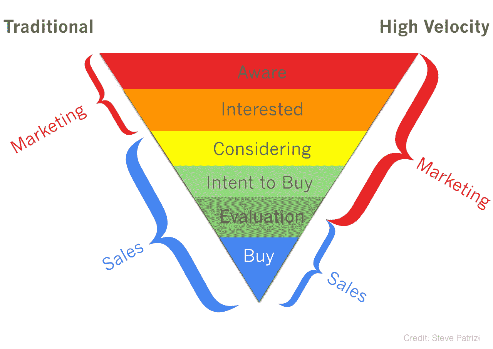

# 工程师市场营销 101:功能介绍

> 原文：<https://medium.com/hackernoon/marketing-101-for-engineers-ee9e7fcb1a51>

## 你为什么需要营销，它实际上能做什么

*编程注意事项:这个帖子是一系列关于 GTM 主题的不确定长度中的 n 个，主要针对* [*初创企业*](https://hackernoon.com/tagged/startup) *人员，主要是领导，主要来自非 GTM 背景。末尾有一个列表。*

# **为什么营销**

*   我们需要语言来谈论我们所建造的东西
*   我们需要让产品出现在一些特定的人群面前
*   我们需要让那些人相信这是值得考虑和尝试的
*   我们需要为这些人提供一种方法来概念化、分类，并将我们的产品与他们可能花费时间、注意力和金钱的其他东西进行比较
*   我们需要告诉或向人们展示(我们认为)产品的重要之处
*   我们需要给人们我们希望他们在谈论它时使用的词语
*   我们需要这个词来传播
*   我们需要划清我们是什么和我们肯定不是什么的界限
*   我们需要赚钱来维持经营，为我们的员工和他们的家人提供衣食和健康保险

# **从功能上讲**

[营销](https://hackernoon.com/tagged/marketing)的根本目的是把人变成顾客。还有其他目的，但任何其他措施都是错误的措施。你的营销努力最终会转化为收入吗？如果他们没有，停止。明确自己在做什么，为什么要做。

一个更小的观点是，营销的目的是产生合格的销售线索，销售转化为收入。

一个更小的观点是，营销的目的是产生印象、流量和注册，产品将这些转化为用户，产品和/或销售将这些转化为收入。

一个更小的观点是，营销的目的是做 PR，comms，和 events。

一个更小的观点是，营销的目的是买广告。

如果你从纯功能的角度来看营销，它看起来有点像这样。

[From First Round’s: So You Think You’re Ready to Hire a Marketer? Read This First.](https://firstround.com/review/so-you-think-youre-ready-to-hire-a-marketer-read-this-first/)

正如你所看到的，市场营销是一个广泛的学科。让我们从漏斗的角度来看，大致从上到下…

## **认知度(上)**

有时品牌、公关和沟通被称为“企业营销”。

***烙印***

代表公司、其产品以及我们在世界上的地位的信息、文字、符号、颜色、字体、风格、语调等是什么，因为我们希望与我们互动的人能够理解它们。

包括但不限于:

*   公司名称、标语、锅炉(简短描述)等
*   使命、愿景、价值观声明
*   雇主品牌:公司如何被视为一个工作场所
*   产品命名
*   视觉识别:标志、颜色、字体、正式的使用指南等

*我们如何在世界上说话，我们对谁说话，我们在哪里说话，我们如何传播信息。【在[阅读更多关于工程师的 PR 101](https://hackernoon.com/pr-101-for-engineers-7cd116cc5347)。]*

*包括但不限于:*

*   *建立和维护与新闻媒体、记者、博客等的关系*
*   *向记者推销故事*
*   *撰写新闻稿和其他正式的公开交流*
*   *确保面试*
*   *保护署名:文章或博客文章是由我们的人写的，但是发表在其他人的平台上，比如 [InfoQ](https://www.infoq.com/)*
*   *确保活动中的演讲时间和运行演讲者程序*
*   *为从事各种公共宣传的员工提供编辑、后勤、演讲者培训和其他支持*
*   *危机管理(它自己的专长):当非常糟糕的事情发生时，该做什么，怎么说话*
*   *投资者关系(它自己的专长):精心策划与投资者的沟通和互动，通常只是大型机构或上市公司的一个专门角色*
*   *分析师关系(它自己的专长):与行业分析师进行沟通和互动，通常在大型组织中只有一个专门的角色*

***收购部分 1 又名需求/销售线索生成(顶部)***

*有时 DG 会向企业营销部门汇报。有时 DG 会向产品营销部门汇报。大多数情况下，它有自己的职能组织，与公司和产品营销对等。*

****【已付(入站)】****

*我们可以在哪里花钱找到合适的人，他们会来我们的网站，填写表格并给我们他们的电子邮件地址，开始免费试用，下载应用程序等等？*

*包括但不限于:*

*   *搜索广告(SEM)*
*   *横幅广告*
*   *广告网络*
*   *网站、博客、时事通讯、视频频道、播客等的赞助*
*   *活动营销:赞助、摊位和举办活动(它自己的专长)*
*   *间接付钱让人做事，例如注册并获得一件“免费”t 恤！*
*   *直接为人们做事付费，例如参加本次调查可获得一张价值 10 美元的礼品卡*
*   *购买“影响力”:你可以雇佣不同可疑程度的“影响者网络”和“专业”影响者，从机器人农场到特定领域的合法人士*
*   *推荐项目:直接或间接付钱给别人，让他们推荐其他人*
*   *创建、测试和跟踪各种“优惠”来激励产生潜在客户的行为，例如上面的免费试用 t 恤*
*   *创建、测试和跟踪行动号召(CTA):比如“免费试用”vs“30 天免费试用”vs“开始”vs“阅读此博客”等等*
*   *创建、测试和跟踪广告和 CTA 的登录页面目标*

****【有机/未付(入境)】****

*我们可以做哪些没有报酬的事情(我猜)会和上面的有报酬的事情一样？是的，这是一个愚蠢的区别，更多的是与工作职能和会计有关，而不是其他任何东西。*

*包括但不限于:*

*   *搜索优化(SEO)*
*   *内容营销(它自己的专长):编写和/或编辑和/或项目管理来自组织所有渠道的所有内容，如博客、时事通讯、播客、视频、信息图表等*
*   *在活动中演讲(演讲者项目):通过优点或可取性，而不是通过付费来进行*
*   *跑步活动:聚会、研讨会等*
*   *“影响”影响力:与在我们关心的领域有合法地位的人识别、建立关系，并产生对我们产品的积极感受，这样他们就有希望经常提到我们*
*   *推荐计划:要求人们(潜在客户或客户)推荐其他人，而不支付他们，这可能只是发生在产品本身的事情，从来不需要人的互动*
*   *创建、测试和跟踪各种免费的“优惠”来激励潜在客户的行为，如门控内容*
*   *创建、测试和跟踪行动号召(CTA):比如“免费试用”vs“30 天免费试用”vs“开始”vs“阅读此博客”等等*
*   *创建、测试和跟踪有机搜索结果的登录页面目标*

***出站 ***

*我们不是以某种方式给我们带来潜在客户，而是如何走出去，找到他们，并向他们推销。这既是销售责任，也是营销责任。*

*包括但不限于:*

*   *列出购买/建立的公司以及要推介的公司名称*
*   *电子邮件活动(温暖和寒冷)*
*   *致电营销活动(冷)*
*   *事件营销*
*   *活动赞助/展位*
*   *现场营销*

****现场营销****

*专门支持销售团队及其工作的领域、地理位置或“领域”划分的市场营销(指此处陈述的一切)。*

*包括但不限于:*

*   *事件营销*
*   *特定于现场的出站电子邮件和电话营销活动*

****行业/垂直营销****

*专门针对某个特定垂直行业或行业的营销(指这里所述的一切)。*

*有时候“场”是在行业边界上分裂的，行业营销==场营销。*

****合作伙伴/渠道营销****

*我们还可以与哪些公司建立合作伙伴关系，以获得他们的扩音器、资金和人员，从而接触到我们自己无法接触到的受众，或者如果没有合作伙伴的认可，我们就没有令人信服的故事？或者只是把他们的顾客带到美国的 T2。*

*包括但不限于:*

*   *联合公关*
*   *联合*支付*的东西*
*   *连带*未付*的东西*
*   *产品集成*
*   *联合“解决方案”:双方的软件、硬件和服务作为一个或多或少集成的包出售，通常在一个合同载体中提供，但有时不提供*
*   *推荐和销售的回扣*

*有时，合作伙伴关系是一个足够大的业务驱动力，以至于合作伙伴/渠道成为一个独立的组织，拥有自己的营销、销售、销售工程、支持、法律等人员。*

## ***收购第二部分又名对价和转换(中底)***

****产品营销****

*产品营销是一个广泛的学科。粗略地说，这是一种漏斗中部活动，尽管根据公司的不同，它会一直到达漏斗的顶部(开展活动和领导需求挖掘活动)和底部(充当销售工程师)。有时，它接管了许多通常被认为是品牌、沟通甚至产品管理的活动。*

*包括但不限于:*

*   *信息:用于描述公司(与品牌完全重叠)和产品、特性、功能、价值等的所有词语。，适用于所有需要的媒体和场所——包括产品本身的提示、工具提示和菜单项名称*
*   *定位:将公司和产品置于市场环境中，决定如何陈述相对于其他供应商的竞争地位*
*   *销售支持:为销售人员提供他们与客户打交道时使用的语言和材料，包括通话脚本、数据表、异议处理和行动手册，以及为销售工程师提供产品/功能方面的技术培训*
*   *分析师关系*
*   *公共关系*
*   *需求/潜在客户支持:提供或审查所有内容、信息等。，用于登录页面、广告、CTA 等*
*   *竞争情报(它自己的专长):密切关注竞争对手(现有的和新出现的)，他们在说什么，他们在做什么，并让组织的其他人了解情况*
*   *市场情报(自己的专长):密切关注行业的发展，尤其是公司所处的特定生态系统，这些发展对公司在市场上取得成功的能力有(或可能有)重大影响*
*   *定价和包装(它自己的专长)—考虑到竞争和市场形势，找出如何最好地给产品定价，如何将它们包装成不同的层次*
*   *文档和技术写作(自己的专业)*
*   *客户营销(有时是自己的专长，见下文)*
*   *技术营销(有时是自己的专长，见下文)*
*   *产品—收集客户反馈，建立和维护产品路线图，协调产品发布*

****【技术营销】(又名产品营销也又名销售工程)****

*这基本上是产品营销的技术层面，有时与销售工程是一回事。*

*包括但不限于:*

*   *创建和演示*
*   *撰写并验证产品、功能等的所有技术说明*
*   *销售支持*
*   *销售工程培训*
*   *客户培训*

****客户营销****

*将客户转化为营销。*

*包括但不限于:*

*   *所有相关媒体中的案例研究和证明*
*   *保护客户证明资料*
*   *在活动中帮助顾客创作并展示他们的作品*
*   *鼓励顾客写下他们对我们产品的体验*
*   *为客户提供一个说话或写作的平台*

****社区****

*建立和维护用户和合作伙伴社区。一般来说，这是面向开源的公司和/或用户非常喜欢的公司做的事情，他们希望为 meetups、hackathons 等提供支持。否则，它往往是某个专注于其他事情的人的众多责任之一。*

*包括但不限于:*

*   *举办聚会、黑客马拉松和会议等活动*
*   *运行论坛、闲置团队等*
*   *为用户组、聚会和社区发起的其他事件或活动提供资金、后勤和其他支持*
*   *建立和运行正式的冠军项目、技术顾问委员会、客户委员会等*
*   *缓和事物*

*有时社区报告进入营销。有时候不会。这真的取决于公司如何看待什么是社区，以及创建或支持社区的目的是什么。*

## ***逐客户收购第 X 部分，即基于客户的营销【ABM】(自上而下)***

*基本上，所有的营销都是针对特定的潜在客户/客户——通常这是为了支持像沃尔玛、WPP 或 JPMC 这样的客户的“捕鲸”。*

## ***收购部分 Millenials aka 增长(自上而下)***

**增长是一个有点模糊的术语，它归结为增长，或者说增加漏斗的速度。该术语源于以消费者为导向的产品驱动型公司，在这些公司中，绝大多数潜在用户与公司的互动都是通过产品/网站/应用程序进行的，而创造/发现“病毒式传播”、“T4 飞轮”或“网络效应”的行为是为此目的而设计和优化用户体验的一项功能。**

**增长通常被认为是它自己的学科，有时是它自己的业务线，它有自己的营销、产品、工程和运营人员，他们试验和 A/B 测试用户体验的所有方面，从而导致转化和扩展，以及推荐营销等事情。**

**在我这种对着天空挥舞拳头的老头心态中，这不是一门学科。这是一个专门的漏斗团队，通常由产品部门领导，像独立运营单位一样运行。但是每一代人都需要感到特别。你的斗篷也是。**

## ****营销运营(自上而下)****

**营销运营(和销售运营)是运行漏斗的技术和运营方面。这包括选择、购买、构建、运营、扩展和替换(必要时)所有与营销(有时是销售)相关的技术和流程。**

**包括但不限于:**

*   **广告购买、测试、扩展**
*   **营销自动化:电子邮件自动化、营销活动构建、销售线索归属、营销活动归属、销售线索路由、CRM 集成、数据清理**
*   **销售自动化或 CRM:呼叫路由、销售线索路由、销售线索归属、活动归属、营销自动化集成、数据清理**
*   **列表构建和购买**
*   **报告:KPI 建立、调整、跟踪、可视化和报告生成**

## **设计(自上而下)**

**主要是平面和网页设计，从我们的网站和登陆页面到我们的会议展位和赠品都需要。**

**需要设计技能的东西包括但不限于:**

*   **视觉识别**
*   **“营销”网站:网站中不是产品或应用程序的部分**
*   **所有类型的广告**
*   **登录页面**
*   **信息图表**
*   **图表、动画、背景、吉祥物等**
*   **赃物:衬衫、贴纸、袜子、手提包、钢笔等**
*   **会议展位图形、结构、标志等**

**能做营销工作的好设计师和做产品工作的好设计师一样难找。**

## **体验营销又称事件营销(自上而下)**

**“体验式”来自消费品牌和奢侈品的世界，我们试图为人们(可能已经是也可能不是顾客)精心打造一种特殊的体验，以产生兴趣、忠诚度、品牌联想等。**

**一个很好的例子就是[彩色工厂](http://www.colorfactory.co)。**

# ****什么时候开始****

**一旦我们开始考虑建造一个东西，我们就开始寻找它在世界上的位置:如何谈论，它是为谁做的，它在和什么竞争。**

**所以营销从一开始就开始了，而且它*从未停止*。**

# ****如何****

**不管是好是坏，大部分市场营销都是广为人知的。这需要大量的体力劳动、大量的反复试验和不断的实验。**

**我们发现的任何起作用的东西，最终都会停止作用，或者只会在一定范围内起作用。战术经常变化。它们也容易堆积，所以我们添加新的比淘汰旧的更频繁。**

**与软件工程的许多方面相比，市场营销具有不同的风险特征。像感知这样的东西，一旦建立起来，就不是那么容易修复或调试(或原谅)的。销售线索可能会被“烧掉”,而且可能永远不会给你第二次机会。一旦记者把你放在一个特定的竞争桶里，他们可能永远不会把你从那个桶里拿出来。**

**我认为这并不难，因为这需要大量的工作。**

## **本系列中的文章(和模板)**

*   **[工程师营销 101:功能介绍](/@aneel/marketing-101-for-engineers-ee9e7fcb1a51)**
*   **[工程师营销 102:打造漏斗](/@aneel/marketing-102-for-engineers-ddf3b7fa61e6)**
*   **[面向工程师的营销 201:信息传递&定位](/@aneel/marketing-201-for-engineers-b28147fdb59d)**
*   **[面向工程师的营销 202:发布](/@aneel/marketing-202-for-engineers-launching-9437aa0e4961)**
*   **[工程师市场营销 203:销售支持](/@aneel/marketing-203-for-engineers-sales-enablement-e47662ca996a)**
*   **工程师市场营销 204:创造需求**
*   **[工程师营销 301:战略&策划](/@aneel/marketing-301-for-engineers-strategy-planning-2e4473fcc879)**
*   **工程师的营销 302:雇佣营销人员**
*   **[面向工程师的营销 303:定价框架](/@aneel/marketing-303-for-engineers-pricing-frame-aa71c8860a2b)**
*   **[工程师营销 401:GTM 阶段](/@aneel/marketing-401-for-engineers-stages-of-going-to-market-6adcedc64e17)**
*   **[面向工程师的营销 402:诊断&故障排除](/@aneel/marketing-402-for-engineers-diagnostics-troubleshooting-d946a337c258)**
*   **[工程师营销 403:解答创始人常见问题](/@aneel/marketing-403-for-engineers-office-hours-bf4d2d0b5f56)**
*   **[工程师销售 101:功能介绍](/@aneel/sales-101-for-engineers-6fcd1b49cffa)**
*   **[针对工程师的 PR 101](/@aneel/pr-101-for-engineers-7cd116cc5347)**
*   **[工程师分析师关系 101](/@aneel/analyst-relations-for-startups-101-ea9338cb13ed)**
*   **[基本消息模板【谷歌文档】](https://docs.google.com/document/d/1neA71qCSeV3xH1Dpbtcy67m3v2ETmmB_Qq02ckkKUiQ/edit?usp=sharing)**
*   **[基本漏斗指标模板【谷歌表单】](https://docs.google.com/spreadsheets/d/11r4tHm_es6Tl4DItNUc_KzNdyvrmbbRmb38CJPLCvRU/edit?usp=sharing)**
*   **[基本发布时间表模板【谷歌文档】](https://docs.google.com/document/d/13Zscb5sX9ggjpWf05Ka-oj5wulC3Kb9z0LyMEQesnzM/edit?usp=sharing)**
*   **[基本战斗卡模板【谷歌文档】](https://docs.google.com/document/d/1dOCKhE1Ufmwp7bXeQTBCkST7NPwiCPJ2oyWEdpQut1g/edit?usp=sharing)**
*   **[详细战斗卡模板【谷歌文档】](https://drive.google.com/open?id=1EC3Lq6Z_IVrZKR4-jHgnc5-e3krZw4bA5Z-HAOJlH10)**
*   **[基本营销日历模板【谷歌表单】](https://docs.google.com/spreadsheets/d/1nXr0IqwnhQsUi_D83ecPXsIyDdiTkpNZ66piRkayPsA/edit?usp=sharing)**
*   **[基本营销阶梯模板【谷歌表单】](https://docs.google.com/spreadsheets/d/17EfTQp_21WomJ9cwiM4ian9M2QRcbM17_d3DilGNThY/edit?usp=sharing)**

## **阅读清单和资源**

*   **托马斯·东古兹(顶部的图像来自那里)**
*   **Bob Tinker: GTM Fit [Talk](https://www.youtube.com/watch?v=IsuZzi-Hm3A&list=PLcnNOJoVRnjUmenBf9bAFE2qIxhSgECvx&index=2) 和 [Slides](https://www.slideshare.net/SurvivalToThrival/go-to-market-fit-summit)**
*   **[第一轮:公关&营销杂志](https://firstround.com/review/pr-and-marketing/)**
*   **[第一轮:所以你认为你已经准备好雇佣营销人员了？先看这个。](https://firstround.com/review/so-you-think-youre-ready-to-hire-a-marketer-read-this-first/)**
*   **[特伦·格里芬](https://25iq.com/)**
*   **[成长黑客社区](https://growthhackers.com/posts)**
*   **[Kissmetrics 博客](https://blog.kissmetrics.com/)**
*   **[HubSpot 博客](https://blog.hubspot.com/)**
*   **[优化博客](https://blog.optimizely.com/)**
*   **[具体化博客](https://blog.reifyworks.com/)**
*   **[初创公司❤客户](http://startupsheartcustomers.com/)**
*   **[创业营销剧本](http://www.startupmarketingplaybook.com/)**
*   **啊哈！营销策略模板**
*   **[GrokSpark 产品信息模板](https://docs.google.com/spreadsheets/d/183FyklQaBzJh1ZZRvdNKS8TJmVfRm7weTSj4Hb27o8k/edit#gid=409433448)**
*   **[拍摄卷发营销模板](https://www.shootthecurlmarketing.com/?s=template)**
*   **啊哈！营销计划模板**