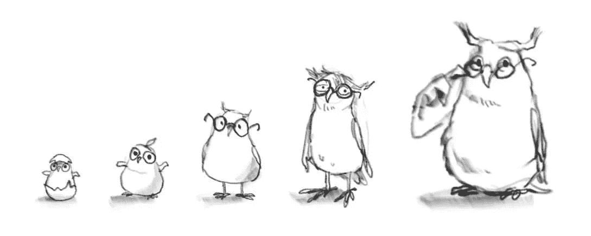

# 数学、思维模式和情感设计

> 原文：<https://medium.com/hackernoon/math-mindset-and-emotional-design-686aa7d270b4>

## 如何提高数学课的情感成果

Art by Lars Munk

数学应该是学校里最容易的课程。它不是。相反，数学已经成为许多学生害怕的科目。

在学习数学的时候，最有可能的情感结局就是学生学会恐惧数学。这尤其成问题，因为数学首先是理解或描述其他科学世界的工具，冒着负面情绪污染其他教育领域的风险。如果你因为害怕数学而讨厌它，你可能不会喜欢物理或经济学。

一项针对西班牙格拉纳达大学学生的研究(2008)显示，各院系 60%的学生患有数学焦虑症。请记住，尽管有这种焦虑，这些学生还是参加了学术教育，所以对于那些较早离开教育系统的人来说，这个比例可能会更高。

这种情况既可怕又迷人。可怕是因为没有人希望这种结果，也没有人希望它继续下去。令人着迷，因为这是一个非常重要而且显然很难解决的问题。这些就是我创建数学游戏公司的原因。

# 数学应该很容易教

数学规则简单、优雅且定义明确。这个系统是一个规则系统，对学生和老师来说应该非常简单。另一方面，语言有规则，有大量的例外和大量的特殊情况。体育和音乐对精确度有很高的要求，例如身体运动和地理，历史和生物有无穷的细节需要考虑，以及这些系统实体之间复杂的相互作用。

与那些科目相比，数学应该容易些。代数的基本规则不应该花一年多的时间来学习。然而，这不是我们在教室里看到的。一些学生马上就明白了，但是大多数人都在努力，很多人都被落下了。

# **数学思维**

一个简单而强大的提高数学成绩和减少焦虑的工具是使用*思维*。思维定势法是由斯坦福大学心理学教授卡罗尔·德韦克提出的。它不会自己修复数学，但它是一个重要且容易实现的实践。

心态是一个对学生行为有巨大影响的简单概念。事实证明，人们既可以有*固定心态*也可以有*成长心态*。

思维定势固定的人认为自己的能力固定在某个水平。他们认为他们无法超越目前的水平。他们逃避挑战，更有可能在考试中作弊以提高分数。

成长心态人们相信他们的能力是流动的，可以成长。他们更有可能接受更艰难的挑战，并通过让自己经历失败和随后的学习来提高考试成绩。所以，简而言之，这就是开放学习的心态。

# 心态是流畅的

心态的有趣之处在于，人们可以改变自己的心态。心态是流畅的，你甚至可以改变其他人的心态。考虑一下这个:

卡罗尔·德韦克进行了一项实验，她要求学生们完成一项具有挑战性的任务。她把小组分成了两个随机选择的小组。一组因为他们的努力而受到表扬。另一组因为他们的聪明而受到表扬。然后，她问每个人是否愿意接受另一项挑战。结果令人难以置信。

那些因努力而受到表扬的学生热切地接受进一步的挑战。这些学生有着成长的心态。那些因聪明而受到表扬的学生拒绝了额外的挑战。这些学生有着*固定的思维模式*。

令人惊奇的是，卡罗尔·德韦克仅仅通过表扬努力而不是品质就让学生们进入了他们的思维模式。设定高标准在教学中很重要，但同样重要的是，即使没有达到绩效标准，也要表扬真正的努力，因为这可以培养最终实现这些目标的动机。

 [## 心态:成功的新心理学

### 现在更新了新的研究-这本书改变了数百万人的生活，是一份完美的毕业礼物。几十年后…

www.amazon.com](https://www.amazon.com/Mindset-Psychology-Carol-S-Dweck/dp/0345472322) 

# 需要如何开始的灵感？

在我们的数学游戏 [Digit Dare](https://www.facebook.com/DigitDare/) 中，你可以看到我们是如何在数学中实现思维定势的。这个游戏是关于在时间用完之前解决数学问题。

在游戏中，让玩家产生进步感是至关重要的。建立这种感觉的通常方式是奖励玩家的游戏进展。我们敢反过来做这件事。每当玩家在一个问题上失败，她就会被带到一个屏幕上，在那里她的努力会得到回报。她越努力，得到的分数就越多。这些点然后被用来打破一个鸡蛋。当学生努力失败时，一只小猫头鹰从蛋中孵化出来。在每次失败中成长——就像学生一样。

这不是通常奖励学生或球员的方式。学生通常首先根据他们的表现进行测试和评判。很多数学游戏也是这样。他们给正确答案三颗星——这很好，表现最终很重要，但他们根本不奖励努力，而努力是表现更好的关键。

猫头鹰只有在玩家失败的时候才会出现。通过这种方式，游戏用一个有意义的故事来奖励努力，这个故事讲述了决心和毅力如何将猫头鹰从一只虚弱的猫头鹰宝宝成长为一只强大而自信的动物——反映了学生最初对数学的脆弱性，并展示了一条通往精通的道路。

猫头鹰的故事还不止这些。它把数学和情感联系起来。这非常重要，因为情绪很重要。如果觉得数学很重要，就会激发学生的学习动机，提高对数学的热情，降低数学焦虑的风险。

# 数学中的情感——运动中的数学

作为一名教师，你可以很容易地从数学课上破解学生的情感成果。简单地与学生谈论他们与数学有关的情感。如果他们表现出焦虑、自我怀疑和缺乏动力，你应该谈论这些情绪，向他们展示这些是正常和完全有效的情绪。把它们写在黑板上或者让学生写在他们的个人数学日志上。

下一步是给他们练习，表扬他们的努力。任何你感到舒服的练习- [工具](https://hackernoon.com/tagged/tool)都是好的，但是选择一个让你专注于学生的体验而不是练习[管理](https://hackernoon.com/tagged/management) (Digit Dare 最适合这个)。在这个过程的这一部分，你可能想暂缓引入新的材料。试着向他们展示他们可以进步，成长是努力的必然结果，表扬也是如此。

确保你通过重复理解这一点:成长和赞扬是努力的必然结果。错误和失误仅仅是努力和学习机会的证明。

一旦进步开始显现，你可以再做一次情绪发现，谈论对数学和动机的感受变化。当学生掌握了第一套练习，你可以最后一次重温他们的情绪。蔻驰向他们表达他们成长了多少，努力如何将负面情绪转化为正面情绪。

你应该不断地为情绪处理留出时间，慢慢地让这个过程内化在学生身上。几个月后，学生们只需要一个快速的提醒就能注意到他们的感受，并集中精力去实现他们的目标。

# 这有用吗？

我希望这个观点有用。如果有请点赞，讨论，分享。你可以通过分享这篇文章和尝试我们的第一个游戏数字挑战来支持我提高情感数学成绩的努力。

Digit Dare 适用于 [android](https://play.google.com/store/apps/details?id=com.perseveregames.get9) 现在 [iphone](https://itunes.apple.com/dk/app/get9/id1129147540?mt=8)