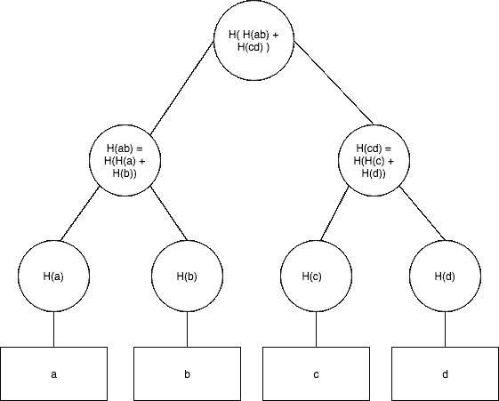

# 默克树游戏攻略

> 原文：<https://medium.com/hackernoon/merkle-tree-introduction-4c44250e2da7>

## 一个引人入胜的数据结构的简要纲要

A Merkle tree, as present in a typical blockchain

本文旨在概述 Merkle Tree 的基本数据结构，并作为与 Merkle Tree 相关的更高级主题的起点。

我在 Coursera 上比特币和加密货币技术课的时候，学到了如何使用基于哈希的数据结构来验证对等系统中数据的完整性。类中提到的核心数据结构之一是 [Merkle Tree](https://brilliant.org/wiki/merkle-tree/) ，它在[比特币](https://hackernoon.com/tagged/bitcoin) [区块链](https://hackernoon.com/tagged/blockchain)中使用，以一种非常有效地节省空间和时间的方式来验证交易的存在(稍后将介绍更多内容！).直到我对 Merkle Tree 做了更深入的研究，我才意识到这个数据结构是多么丰富多彩，于是我决定自己构建一个 Merkle Tree 的示例[。](https://github.com/evankozliner/merkle-tree)

> 如果你想知道是不是应该去上比特币和数字加密货币技术课，可以看看我的感想。

# 说明

构建之后，Merkle Tree 看起来如下所示:

A basic Merkle Tree. I’ve abbreviated the middle nodes as H(cd) and H(ab) respectively, but without this shorthand the root hash could also be called H(H(H(a) + H(b)) + H(H(c) + H(d)))

*a、b、c、*和 *d* 是一些数据元素(文件、公钥/私钥、JSON 等)，而 *H* 是一个散列函数。如果你不熟悉，散列函数就像某块数据的“数字指纹”，它把数据映射到一个简单的字符串，其他数据映射到同一个字符串的概率就很低。每个节点都是通过散列树中其“父节点”的级联来创建的。大家会注意到这里的 Merkle 树是一个二叉树，大部分 Merkle 树都是二进制的，但 Ethereum 等平台上也有[非二进制 Merkle 树](https://blog.ethereum.org/2015/11/15/merkling-in-ethereum/)。在这里，我们将只涵盖二元情况，因为它是目前为止最常见的。

构造树的方法是:取相同高度的节点，连接它们的值，并对结果进行哈希处理，直到找到根。如果在树完成之前只剩下一个节点，则需要处理一个特殊情况，但除此之外，树的构造稍微简单一些(在实现部分中对此有更多说明)。

一旦构建完成，就可以只使用*来审计数据*根散列在对数时间内的叶子数(这也被称为 Merkle-Proof)。审计的工作方式是重新创建包含从根到被审计数据的分支。在上面的例子中，如果我们想要审计 *c* (假设我们有根散列)*，*，我们将需要得到 H(d)和 H(H(a) + H(b))。我们将散列 *c* 以获得 H(c)，然后将 H(c)与 H(d)连接并散列，然后将结果与 H(H(a) + H(b)连接并散列。如果结果是与根散列相同的字符串，这将意味着 *c* 确实是 Merkle 树中数据的一部分。

在诸如 torrenting 的情况下，另一个对等体将提供该段数据， *c，* H(d)，以及 H(H(a) + H(b))。如果你担心这种方法的安全性，回想一下，在散列函数中，计算上不可能找到一些 *e* 使得 H(e) = H(c)。这意味着只要根哈希是正确的，对手就很难对他们提供的数据撒谎。

输出某些数据的身份验证路径就像重新创建通向根的分支一样简单。当在数字签名方案中使用 Merkle 树时，遍历整个树以产生叶子和它们各自的认证数据变得重要，并且这实际上可以在对数时间内完成。本文中描述了一些聪明(但复杂)的算法来实现这一点。

# 选定的实施方法

你可以在这里找到代码[的完整版本](https://github.com/evankozliner/merkle-tree)。我将解释大部分的树创建和审计方法。注意， *build_tree* 和 *_audit* 方法都是来自一个更大的类的实例方法。

构建树的工作方式是将树叶添加到堆栈中，并检查堆栈中顶部的两个节点是否高度相同。当它们是时，节点有一个“子节点”(它们的两个散列的连接的散列)，当它们不是时，一个新节点被附加到栈中。当最后两个节点的高度不同时，需要处理小边的情况。

上面的方法在单节点的情况下会失败，因为不满足任何条件，所以为了完整起见，我添加了一个小方法来处理这个问题。

这是本文解释部分描述的审计过程。在公共审计方法中检查一些先决条件，这就是为什么我把大部分逻辑放在这个私有版本中。

# 应用程序

由于 Merkle 树在区块链应用中的使用，它最近得到了很多关注。在许多对等(P2P)系统中(不仅仅是区块链！)个人需要能够从不受信任的对等点请求数据，并提供一些证据证明那些对等点发送给他们的是他们所请求的真实内容的一部分。torrent 就是这个问题的一个例子:当你下载一个 torrent 时，你会收到其他人在线“播种”这个 torrent 的文件，但是你怎么能确定这些文件真的是你试图下载的一部分，而不是垃圾或恶意软件呢？Merkle 树可以验证从您的对等点接收的数据，以解决这个信任问题。

类似的问题也适用于比特币和以太坊等加密货币:如果有人声称在某些交易中，另一个对等体向他们支付了费用，网络上的节点如何才能验证交易是否真的发生了？一种选择是，节点可以存储曾经发生的每个事务的全部历史，然而，就该节点的时间和空间成本而言，这是禁止的。Merkle 树提供了一种为网络上的节点节省时间和空间的解决方案。通过从每个块中的事务数据创建 Merkle 树，可以在对数时间而不是线性时间审计事务。此外，它为一些比特币客户打开了大门，他们可以通过只存储 Merkle 树的根来节省空间:不需要存储比特币历史上发生的每一笔交易，这是一个巨大的价值！

除了区块链和托雷茨，Merkle Trees 还可以在任何需要有效检测不一致性的系统中使用:

*   认证机构(ca)使用 Merkle 树作为[证书透明性](https://www.certificate-transparency.org/what-is-ct)的一种手段。这里，公钥和私钥对被视为 Merkle 树的叶子。这是 CA 用来防止一个 CA 可能“欺诈”并试图在域的所有者不知道该认证的情况下认证该域的一种机制。
*   高度可伸缩的数据库，如 [Apache Cassandra](http://cassandra.apache.org/) 和 [Dynamo DB](https://aws.amazon.com/dynamodb/) 处理网络上副本数据库的故障。这一过程被称为“反熵”，在 Apache Cassandra 博客[和亚马逊 Dynamo DB 论文](https://docs.datastax.com/en/cassandra/3.0/cassandra/operations/opsRepairNodesManualRepair.html)[中有较深入的描述。](http://www.allthingsdistributed.com/files/amazon-dynamo-sosp2007.pdf)
*   [RSA 的数字签名替代方案](http://citeseerx.ist.psu.edu/viewdoc/download?doi=10.1.1.84.9700&rep=rep1&type=pdf)。在这种情况下，Merkle 树的根充当公钥，各个节点用作一次性签名。最近，人们做了更多的工作来推进这种技术，因为理论上它可以抵抗量子计算攻击(不像 RSA，它是当今大多数公钥加密的动力)。

Merkle 树的应用确实很多，它们在任何特定领域的应用都可能是一整篇博客文章的主题。我希望这是一个合理的介绍。

如果你还有任何问题或者只是想聊天，你可以通过我的 evankozliner@gmail.com 联系我，或者在推特上给我发消息:@evankozliner。

编辑:添加和修复一个图像，修复错别字，对基本的例子也做了一些澄清