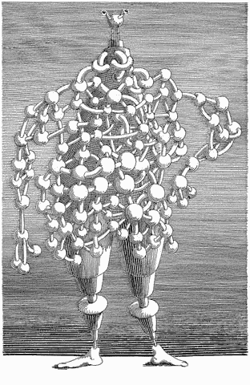

# 迁移到一个单一的存储库，而不会冻结代码

> 原文：<https://medium.com/hackernoon/migration-to-a-monolithic-repository-without-the-code-freeze-b8f302066314>

## 我们最近将 10 个项目迁移到了一个单独的 [Voucherify](https://voucherify.io/?utm_campaign=tech&utm_medium=Post&utm_source=medium) git 库。这里有一个简短的备忘录，说明我们为什么引入新方法，以及我们如何在不阻塞功能交付管道的情况下进行转换。



*by Daniel Mróz from The Cyberiad*

# 为什么是 monolith

2 年的凭证式[开发](https://hackernoon.com/tagged/development)给了我们足够的时间让我们的代码库成长为一个单独的项目，并成为一些相互关联的服务。自然地，在构建我们的平台的过程中，我们注意到在几个地方使用了越来越多的代码——通常称为“ *commons”。*到目前为止，我们只是在需要的地方复制了代码。这显然是最快的方法，我们故意选择它，因为我们的开发团队迭代速度很快。

但是有时候复制和维护 *commons* 会变得很麻烦，实际上会降低迭代速度。记住所有使用 util 的地方的负担太重了。因此，我们集思广益如何解决这个问题，实际上最终有两个解决方案。

第一个是创建一个模块库。例如，将项目包装到 NPM 模块中，引入版本化方案，并建立私有模块库。尽管这种方法有一些无可争议的好处，但它并不是 100%适合我们的情况。以下是我们会议的要点:

*   有这么多回购，有人必须学会如何维护(并这样做)NPM 回购。借助整体式回购，不存在依赖性[管理](https://hackernoon.com/tagged/management)问题，无需手动升级模块版本
*   monolith 让代码审查变得更加容易
*   在源代码树和项目中导航也变得更加容易
*   测试和连续交付变得更加容易——您知道在提交 X 时您有一个一致的状态

基本上，决定采用 mono 路径是为了解决“公共”问题，并将迭代速度保持在相同的水平。此外，我们仍然是一个小而精的团队——事实上，我们只做一个项目。这就是为什么我们的开发人员不太可能浪费时间去理解不相关的代码。恰恰相反，每个人都应该关注每一个变化。出于同样的原因，我们不需要引入任何访问控制措施。

因此，我们一致认为这是一个好的举措，然后我们开始考虑如何以一种不阻碍正在进行的开发的方式来执行过渡。

# 迁移过程

过渡结果超级顺利。我们保留了提交历史，即使提交散列没有改变。这可以用一个 git 命令来实现——git 子树[*。该过程看起来如下:*](https://git-scm.com/book/en/v1/Git-Tools-Subtree-Merging)

**1。**将回购放入单个回购中。

```
git subtree add --prefix=project-a git@github.com:voucherify/project-a.git mastergit subtree add --prefix=project-b git@github.com:voucherify/project-b.git master...
```

**2。**改变部署过程，使其能够正确处理新的“commons ”( docker file、Procfile 和 shell 脚本中的变化，我不会在本文中讨论；如果你感兴趣，请在评论中告诉我)。

**3。**更新同时推送的变更。

```
git subtree pull --prefix=project-a git@github.com:voucherify/project-a.git mastergit subtree pull --prefix=project-b git@github.com:voucherify/project-b.git master
```

**4。**正在进行的工作将提交给特定回购协议的开发人员分支机构(此外，为了简单起见，我们将所有等待的拉请求合并到 master)。

**5。**从多个回购协议中迁移分支，以项目 a 存储库为例。

```
export BRANCHES=$(cat <<HERE
development-branch-1
development-branch-2
development-branch-3
development-branch-4
HERE
)for branch in $BRANCHES
do
    echo “============== copying ${branch} ============= “
    git checkout master
    git checkout -b $branch
    git subtree pull --prefix=project-a git@github.com:voucherify/project-a.git $branch
    git push -u origin $branch
    git checkout master
done
```

**6。与此同时，开发人员克隆新的整体存储库，并相应地重新配置 ide。**

**7。**当一个“合并主”给出一个信号，表明他已经迁移了所有的开发人员分支时，开发人员可以用下面的命令检查远程分支:

```
git checkout -b branch_name origin/branch_name
```

**8。**就这样，Voucherify 从现在开始运行在 monolithic repository 上。

# 总结和未来的增强

我们执行迁移已经一个月了。通过让易于维护的实用程序唾手可得，团队提高了生产率。他们也很高兴只有一个 IDE 实例在运行，而不是 5 个(尽管浏览搜索结果变得有点困难)。现在，下一个改进是提取更多的“commons ”,这将使构建功能更快:像 commons-auth 或其他业务相关的东西这样的模块。

*原载于*[*www . voucherify . io*](https://www.voucherify.io/blog/migration-to-a-monolithic-repository-without-the-code-freeze)*。*