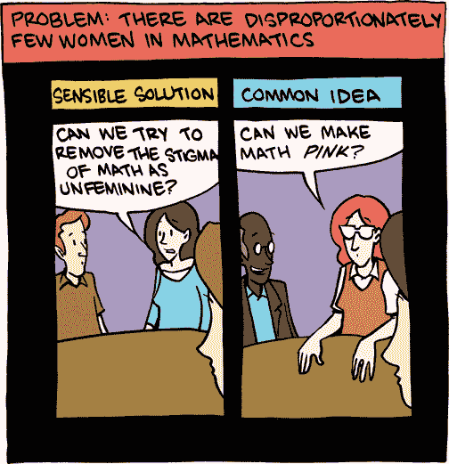
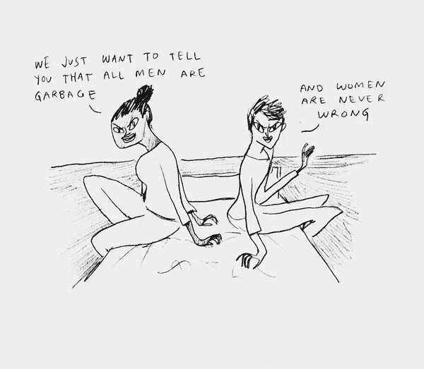

# 注意差距:科技领域的女性

> 原文：<https://medium.com/hackernoon/mind-the-gap-women-in-tech-3396df9935d4>

## 从软件工程师的办公桌上

现在，比以往任何时候都有更多的女性成为老板和母亲，养家糊口的人和面包师，但是通往科技职业的道路仍然是少有人走的路。这不是因为缺乏激励；公司渴望技术技能，这些职位的薪水达到了历史最高水平。然而，尽管计算机科学和其他 STEM 领域提供了机会，但从事这些领域的女性人数仍然很少。尽管所有的目光都集中在这个问题上，但对于正在发生的事情，应该如何处理，以及“它”是什么，仍有许多困惑和分歧。

大多数关于这个话题的研究表明，问题不在于女性本身——女性*希望*进入科技行业——而是性别歧视文化、以男性为主的环境和有偏见的做法。这可以解释为什么只有 26%的计算机科学学位毕业生和 12%的 T4 工程学位毕业生是女性。而且，令所有人尴尬的是，这些数字并没有好转。关于科技行业女性的对话已经变得陈腐和没有方向了吗？我们把矛头指向了男人、女人、教育者和管理者，但是每个人都有责任，没有人愿意承担责任，政治迫害还在继续。

尽管关于这个话题的研究、调查和猜测数量惊人，但仔细观察后，性别差距很快就开始感觉像一个一维问题，其中兄弟文化是主要问题，女性被迫要么忍受，要么离开。在这种过于简单的情况下，男人是问题所在，科技行业让他们长时间不受不良行为的影响是错误的。虽然一个有效的论点——毕竟，总有一两个不受约束的混蛋喜欢破坏所有人的生活——但这不是全貌，然而关于这个话题的所有其他观点和理论都被淹没在大量的概括中，其中女性是受害者，父权制是她们的压迫者。

这些概括的问题是双重的。首先，它描绘了对科技行业普通女性将会面临的不切实际的期望，以及为了成功她必须忍受什么。

*   科技行业的女性将与厌恶女性的男性一起工作，他们不尊重她的智慧。
*   从事科技行业的女性很可能成为性骚扰的受害者。
*   从事科技行业的女性在晋升和奖金方面会被她的男同事所忽略。
*   科技行业的女性[必须弱化自己的女性特质，成为“男人中的一员”。](/@claryschneider/i-m-one-of-the-guys-c003d90c4a7c#.mo1ne4gbo)

这只是“科技女性”口号的一个例子，这一口号经常主导关于性别差距的对话。这并不是说女性不应该意识到这些情况和她们可能面临的压力，但是女性绝对不应该觉得自己注定要被这些情况所困扰。这就引出了一般化的第二个问题:自我实现预言。

普遍存在压倒性的二分法；一方面，女性被告知，在她们的领域里，她们和男性一样有能力、聪明、有价值；从另一个角度来看，他们是一个被忽视、被忽视、没有代表的群体，没有能力改变现状。随着如此多的注意力集中在女性在[技术](https://hackernoon.com/tagged/technology)中遇到的问题上，女性很容易变得*过于*敏锐地意识到自己如何符合这些狭隘的定义。她是摇滚明星还是受害者？显然，我们需要重新思考我们如何设定期望。其他领域的成功女性可能会想，“我聪明，我有能力，我擅长我所做的，所以我成功。”然而，科技行业的女性通常将她们的成功归因于机遇(“我是幸运儿之一”)，因为她们相信自己的故事是一个异数或异常现象。同样，在技术领域没有找到成功或满足感的女性也很快转向这些概括，以此来理解她们的不快乐。不幸的是，作为一个社会，我们给人的印象是，失败和困难是任何试图在科技世界建立自己职业生涯的女性的常态。

但所有这些肯定不是凭空产生的。恐怖故事是真实的；[性骚扰和徇私发生](/absurdist/the-stories-of-women-in-tech-that-we-may-never-hear-7379f502fb52)。这些都是不管什么行业，女性都应该担心的问题。如果我们要“修复”技术，不言而喻，解决任何问题的第一步是承认问题的存在。我毫不怀疑，宣传妇女在技术领域面临的问题的目的是提高认识和促进积极的变化。但本应是一件好事的结果却是“我们对他们”心态的兴起，在这种心态下，性别成为唯一重要的区别。我们不再以个人为基础来看待科技文化中的问题，而是将一切都分成性别问题，这让我们不得不以过于简单的刻板印象来思考问题。比如:女人需要更多的鼓励。女人没有归属感。[女性更关心对社会有益的职业。](http://www.nytimes.com/2015/04/27/opinion/how-to-attract-female-engineers.html)[女人需要其他女人](http://www.huffingtonpost.com/cassie-slane/how-mentoring-may-be-the-_b_4717821.html) [引路](https://www.themuse.com/advice/you-cant-be-what-you-cant-see-how-to-get-more-women-in-tech)。

正如问题是从性别的角度来定义的一样，解决方案也有类似的指导。

Courtesy of [SMBC](http://www.smbc-comics.com/)

关于弥补性别差距的文献很快就得出概括的，有时是彻头彻尾的性别歧视的结论，即女性需要什么才能成功。我看到有人再次争辩说科技公司和计算机实验室的装饰是罪魁祸首。如果女性的工作空间过于沉闷或男性化，她们怎么能对工程师和程序员感到舒服呢？当然，这有助于对抗许多人对科技的男性刻板印象，但让更多女性进入 STEM 的解决方案不会像免费化妆和粉色办公室窗帘那样简单。然而，更令人不安的是，有些人认为事实确实如此。他们认为，如果我们至少能让科技行业看起来更像是一个欢迎女性的地方，那么我们就会有更多女性走进这扇门。然而，退回到性别刻板印象正是我们想要避免的行为。技术角色女性化只是性别歧视硬币的另一面。正是因为这个原因,“女性在 __”会议、活动和集会让我如此担忧。他们继续推动这种“我们对他们”的思维模式，而不是让女性融入并从内部创造有机的文化变革。这场运动有成为兄弟文化的积极抗衡的危险，创造了一个类似的顺从和疏远的女权主义文化，典型的时尚是，“要么你和我们在一起，要么反对我们。”

Courtesy of Kate Beaton — Enjoy the full comic [here](http://www.harkavagrant.com/index.php?id=341)

这种性别差异的另一个副作用是，人们普遍认为女性有着相同的经历。毕竟我们都是一样的，对吧？当然，在现实中，“科技女性”的定义是多种多样的。它超越了程序员和工程师的范畴，涵盖了所有以某种身份在科技公司工作的女性。困难就变成了试图解决一个至少应该是两个独立对话的问题。第一，在技术文化环境中工作的非技术专业女性的存在。第二是女性在技术岗位上的稀缺。这种区别很重要，因为每个群体都有自己的挣扎和担忧。虽然技术女性和非技术女性的现实是重叠的，但我不认为一个人代表一个群体纯粹因为性别是最终的约束因素而发言是公平的。

作为一名软件工程师，我个人意识到，关于“技术领域的女性”的讨论可能根本不能反映女性软件工程师的观点和经历。我和其他科技界的女性坐在一起，感到无法理解。我遇到过科技行业以外的其他女性对我不够“亲女性”的敌意。我也多次被问及如何处理来自男性同龄人的歧视和压力，基于我必须经常忍受的假设。我的经历是这种错误印象的结果，即所有女性都必须面临同样的挑战，无论她们在行业中的地位和其他因素如何，尽管这些因素可能会很难考虑(即她们不完全适合调查)，但不应被忽视。简而言之，以性别优先的方式接近“差距”扼杀了有利于便利的富有成效的讨论。

恐怕在我们追求性别平等的过程中，我们已经变得过于肤浅，迷失在追逐兔子的过程中，而不是专注于重要的事情:培养对技术的真正兴趣，促进该领域令人兴奋的新进展，并鼓励在追求这些目标的过程中进行合作。科技领域的性别差距与其说是个问题，不如说是其他问题的征兆。这些数字不仅表明了对女性的性别歧视或不公正，也表明了围绕个人责任的更复杂的社会问题。解决方案最终归结为个人看到过去的性别，并寻求改善整个科技行业，而不仅仅是女性。这意味着让个人对自己的行为或有时对自己的不作为负责。大声说出来，不是反对男女，而是反对职场的不公平。取消专为任何性别设计的活动。做一个导师，不仅仅是对女性，而是对所有人。不要因为一个人符合或不符合刻板印象而羞辱他。最重要的是，不要把比率作为衡量科技行业“健康”的一种方法。

这不是一件容易的事。比买粉色的办公室窗帘难多了。或者组织会议。或者进行调查。或者雇佣更多的女性。

如果我们要“修复”技术，我们需要负责任的*成年人*，而不是继续沿着我们目前的道路分配责任，造成不必要的恐慌和恐惧，并专注于绷带解决方案。

如果我能从这篇文章中鼓励一个有抱负的科技人的话，那就是:如果你喜欢，那就去做。技术没有性别，也没有偏见——编译器会把我的代码和男人的代码一视同仁。互联网[的管道](https://hackernoon.com/tagged/internet)不会根据键盘后面用户的身份来区分数据包。没有什么能阻止你学习、黑客和创造美好的事物。我们都有责任让技术成为一个伟大的工作领域，因为毕竟，一个团队的好坏取决于其个人的素质。也许是时候我们开始对一次一个人地改善科技文化感兴趣，而不是太关注性别多样性了。我相信我们最终会看到我们的 50/50，但让我们以正确的方式去做。