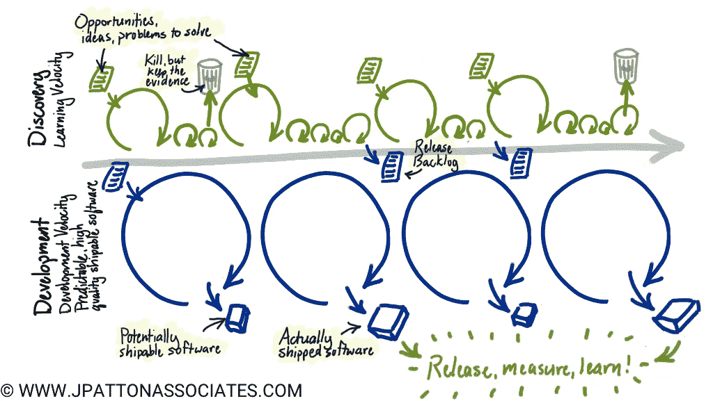

# 注意产品交付

> 原文：<https://medium.com/hackernoon/mind-the-product-delivery-1b6153ed25c0>

## 为什么交付在产品发现的时代仍然重要

在过去的几年里，我们见证了产品社区的思想转变:过去的焦点是[产品交付](https://hackernoon.com/tagged/product-delivery)*——以最有效的方式构建可发布的[软件](https://hackernoon.com/tagged/software)的过程。然而如今，人们的注意力已经转移了。产品发现，即首先找出制造什么的探索，已经成为制造产品的最先进的方式。这一领域的[杰出人物](http://svpg.com/product-discovery/)提倡探索思维，这种思维被置于设计思维和价值主张设计等流行概念的核心。*

*我相信这种以用户为中心的创新和想法验证有助于创造出令人惊叹的产品。然而，有义务发现未满足的用户需求，我们不能忘记我们从哪里来。当然，创造力和精力充沛的发现阶段会让详细和结构化的交付工作变得索然无味。最终，我们仍然需要为我们的客户交付和带来价值，并通过我们的努力取得成功。*

## *这不是选择立场的问题*

*当然，发现不同于交付。前者寻求发现和验证新思想的开放性。后者是关于对任务的深度关注，并试图尽可能快而平稳地向用户交付价值。*

*随着最近关于创建发现驱动的组织以逃避功能工厂生活的讨论，有时感觉我们需要选择立场。不过，这里没有非此即彼的决定——这两个短语在产品开发过程中都有其存在的理由，应该根据具体情况使用，而不是相互排斥。*

**

*Dual Track Development framework by Jeff Patton, [Source](http://jpattonassociates.com/dual-track-development/)*

*《用户故事映射》一书的作者 Jeff Patton 创造了术语“双轨 scrum ”,在这个术语中，来自发现阶段的经验证的学习最终会在交付阶段结束。为了以快速和集中的方式运送物品，需要在勘探和交付之间不断转换。当低保真度的原型不再适用，测试需要大量的工作时，团队甚至可能需要在他们的发现过程中进入交付模式。*

## *不要让他们等着*

*当移交到交付模式时，你会从把工作推向世界的关注中受益。保持这种向用户交付的意愿与更好地理解他们一样重要。它创造了一种紧迫感，确保在发现过程中学到的东西被处理成可操作的开发项目。拥有这种交付的冲动可以防止发现死亡螺旋，在这种螺旋中，一个有前途的想法在研究阶段循环，错过了成为可操作的产品概念的出口。*

**

*Highlighting the important areas of product delivery in the discovery process*

*此外，用户价值不会仅仅来自发现洞察。在较大的团队中，很可能不是每个成员都全力以赴地做发现工作。这为提供额外的改进提供了机会。然而，用价值来填补这个停机时间缺口可能说起来容易做起来难，因为最终确定工作包所需的人——设计师、产品所有者、首席开发人员——更多地参与了发现。因此，为交付准备可操作的工作块是很重要的，这样用户价值可以在发现的同时被创造。*

*当处于发现模式时，我们被教导去思考“邪恶的想法”,试图以一种全新的方式帮助用户解决他们的问题。然而，并不是所有的工作都需要成为改变游戏规则的材料。即使你只是给你的用户一些小东西，这个价值也是即时的。对于发现工作，即使其结果旨在产生更高的价值，也可能需要一段时间，直到你的想法准备好。即使这样，开发过程也是迭代的，并且第一个可交付成果大部分只是首先向测试组推出。因此，我们不应该低估发现价值到达用户手中所需的时间，同时也应该准备好向用户交付有价值的工作。*

## *沐浴在不确定中并不适合每个人*

*集中交付也可以对那些还不习惯使用新的发现驱动的方法来构建产品的团队成员产生积极的影响。Google X 的联合创始人和原型开发倡导者 Tom Chi 强调说，产品管理是关于不确定性的。在探索用户真正想要什么的过程中，你必须接受它，并享受定期的不确定性沐浴。*

*最终，发现帮助你管理和掌握不确定性。尽管如此，在一个组织中找到一个既定的发现思维模式还是很少的。这需要思维的转变，从既定的计划转向对新思想的开放。迄今为止，只有少数公司掌握了这种转变。因此，如果不确定性沐浴不是公司 DNA 的一部分，你怎么能指望你团队中的每个成员都感到舒适呢？*

*作为一个进入产品管理领域的人，我一开始并没有意识到这一点。不是每个人都期待产品发现的不可预测性和自发性。我看到同事们在他们的角色中表现出色，当他们有一个具体的、可计划的任务交给他们时，他们不断地、快速地完成最高质量的工作。在不确定性驱动的发现阶段，重要的是让这些人记住及早发现不断变化的计划的潜在挫折。明确定义的交付任务可以保持高动力，同时确保高质量的工作。*

## *别忘了送货，伙计*

*发现和交付之间的不断变化允许团队享受两个世界的精华——验证用户需求与有价值功能的集中交付相结合。在当前围绕前者的讨论中，我们不应忘记后者的重要性。*

*没有适当的交付，你采访的所有客户可能永远无法解决他们的问题…或者至少无法通过你的产品解决。*

**

> ****如果你喜欢读这篇文章，请点击下面的*******与他人分享。这个小小的善意的举动让我有动力去写更多像这样的文章。*****

************

> **[黑客中午](http://bit.ly/Hackernoon)是黑客如何开始他们的下午。我们是阿妹家庭的一员。我们现在[接受投稿](http://bit.ly/hackernoonsubmission)并乐意[讨论广告&赞助](mailto:partners@amipublications.com)机会。**
> 
> **如果你喜欢这个故事，我们推荐你阅读我们的[最新科技故事](http://bit.ly/hackernoonlatestt)和[趋势科技故事](https://hackernoon.com/trending)。直到下一次，不要把世界的现实想当然！**

****