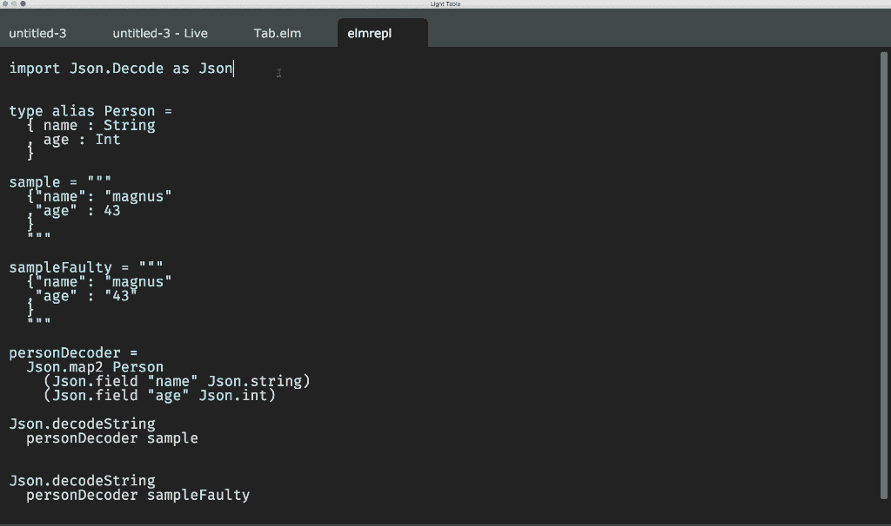
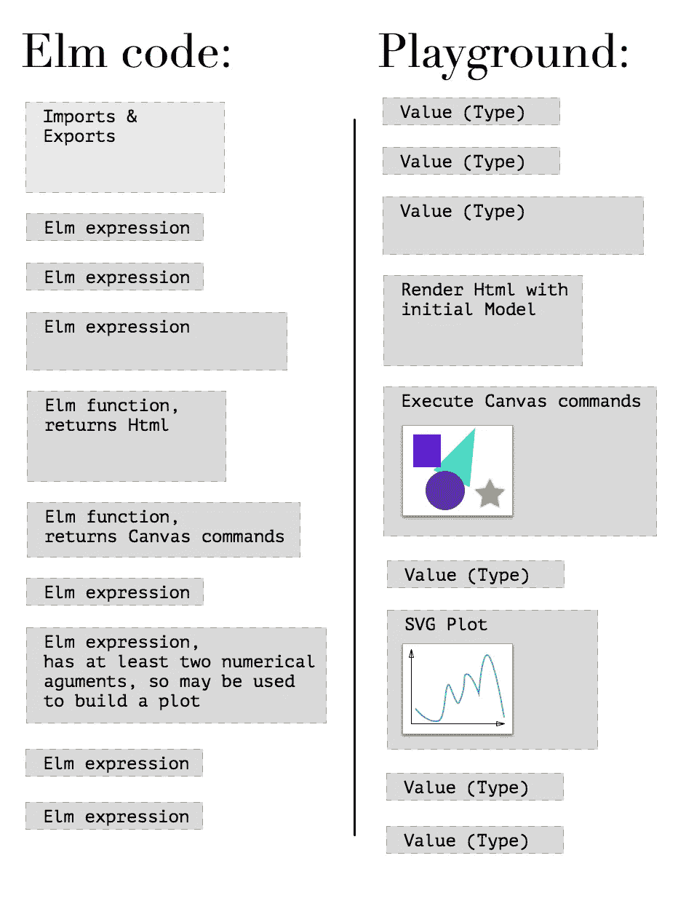
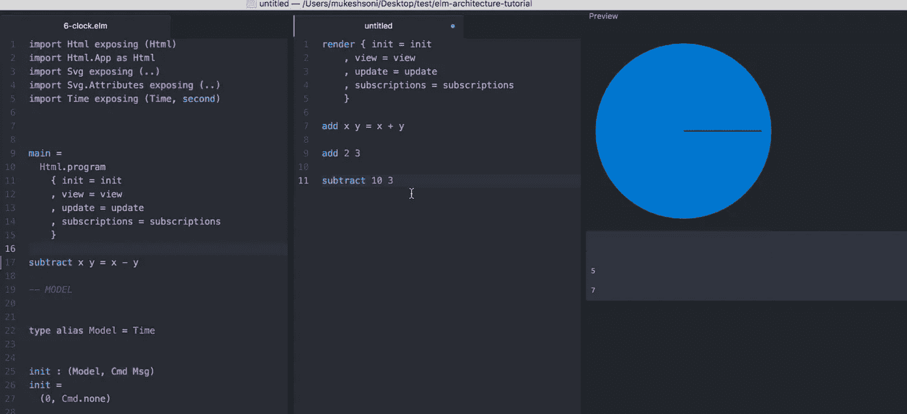
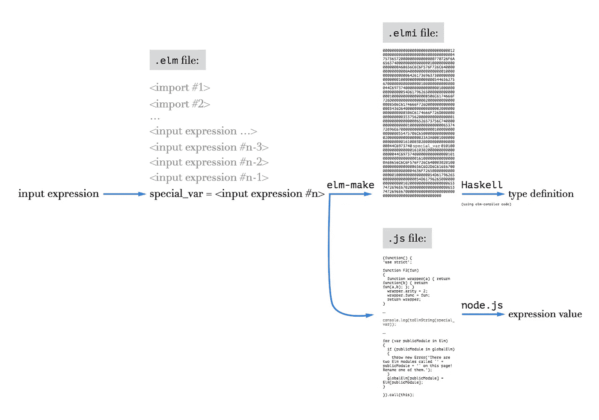
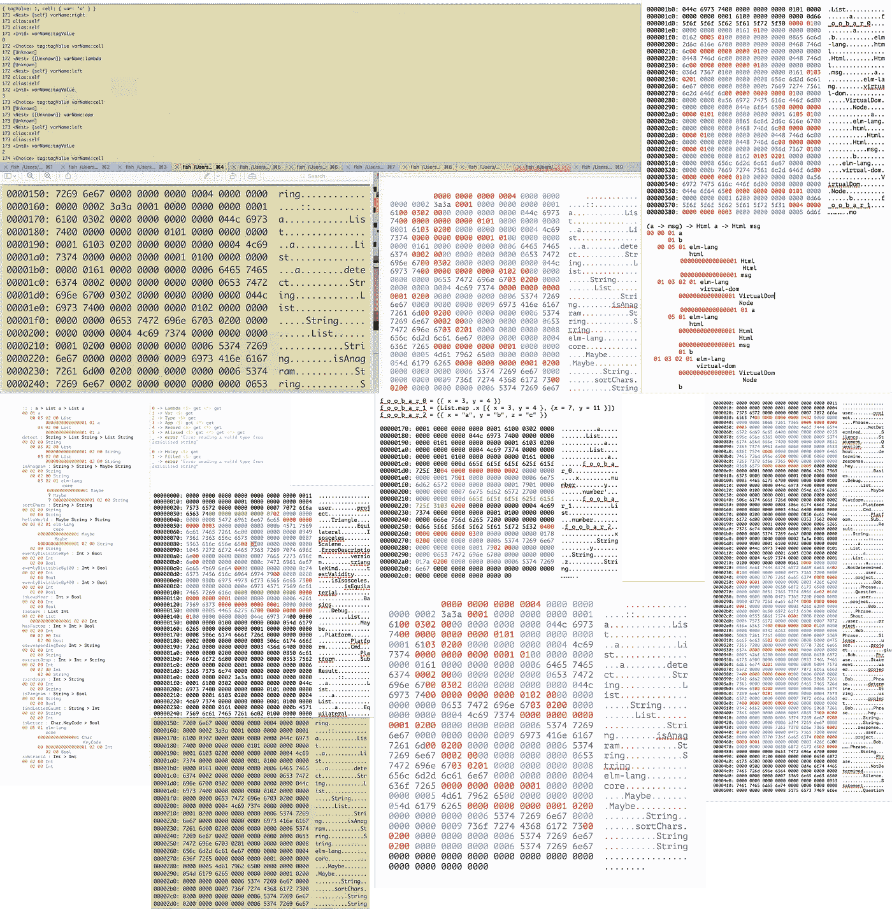
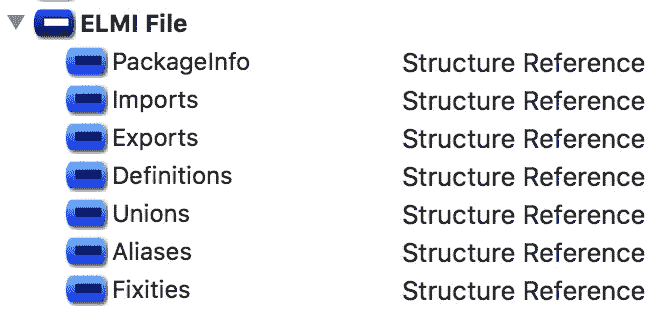
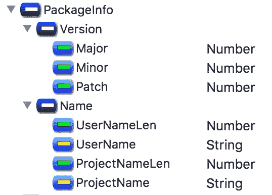
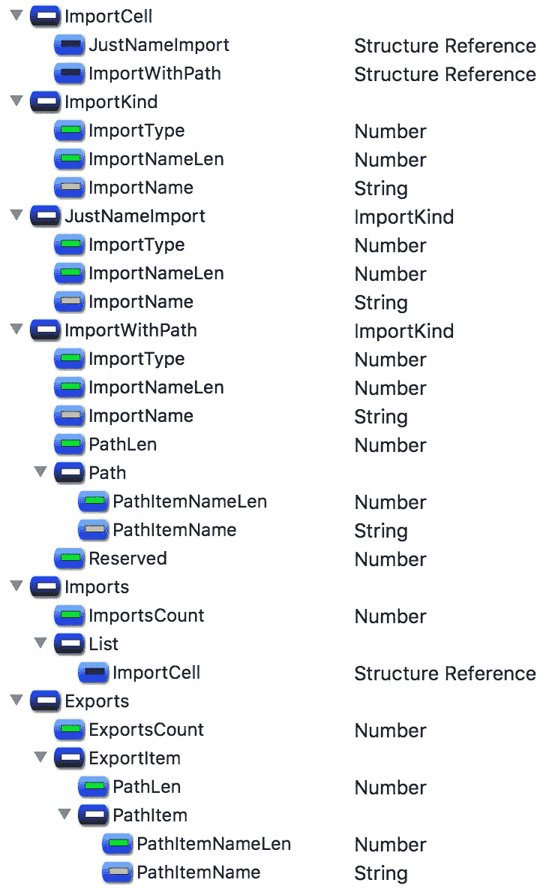
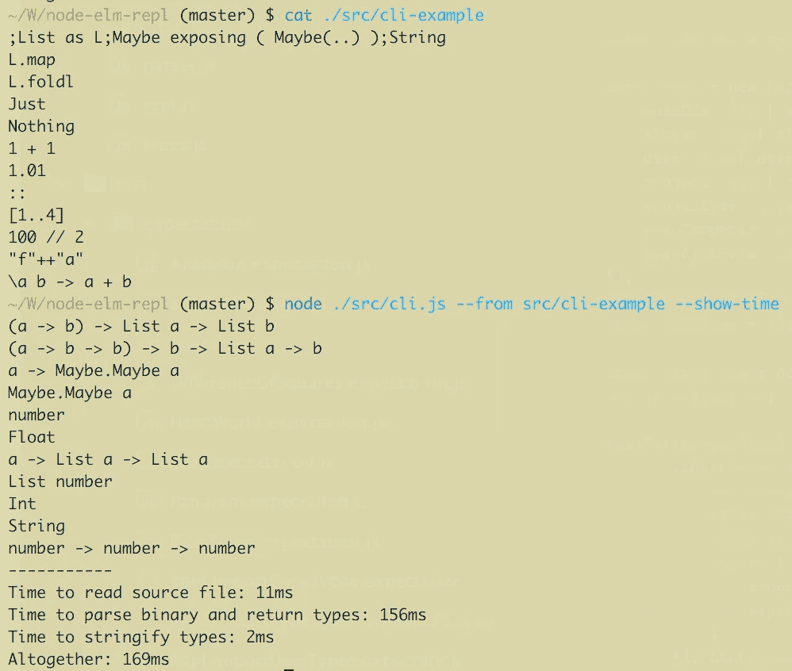

# 现代二进制逆向工程与节点。js，为榆树，或为什么我们真的需要榆树操场

> 原文：<https://medium.com/hackernoon/modern-binary-reverse-engineering-with-node-js-for-elm-bd7546853e43>

看起来我已经有一段时间没有发表任何东西了，确切地说是从 2014 年 9 月开始，尽管我有很好的[话题](http://shamansir.github.io/rpd/)要讨论。因此，这里有一个新的尝试来回复你写书呆子文本。尤其是，考虑到它变得越来越流行，越来越花哨。

## 这个帖子的一个精髓(不说 TL；博士):

存在一种语言榆树。这可能是对 T4 JavaScript T5 的一个很好的替代。【“这是一个粗略的、有争议的说法！”你会说。你有权这么说！].而且，正如每一种新语言都会发生的那样，它一步一步地为每一种现代代码编辑器/ IDE 开发插件。每个这样的插件通常都是由新语言社区编写的，而不是由这个特定编辑器/ IDE 的开发者编写的。

对于这些插件的开发者来说，一个问题是，目前 Elm 没有反射(一种获得实体类型的方法),并且倾向于根本没有反射。就其本身而言，没有反射是一件相当好的事情，通常它会使语言语法和/或库变得非常复杂。但是在编辑器中实现有用的东西需要详细的类型信息——漂亮的类型提示、漂亮的自动完成等。

By itself, having no reflection is rather a normal thing… Primitive joke, I know… Failed to resist.

乍一看，这似乎没什么特别——许多语言没有反射，所以人们通常编写依赖于 IDE 的词法分析器和语法分析器，或者使用其他方法来获取类型信息。但是对于 Elm，有一个微妙的区别:它有一个 REPL，显示每个条目的实体(变量或函数)的正确类型。它不是在语言的帮助下工作，而是利用编译器的一些隐藏的棘手功能(我将在后面介绍)。那么，为什么不使用官方的 REPL 结果来获得这些有用的信息呢？..帖子回答为什么。

Elm Language REPL (every pun intended… or not)

此外，这篇文章无耻地向那些为 ide 开发 elm 插件的人推销了名为 [node-elm-repl](https://github.com/shamansir/node-elm-repl) 的 node.js 库，但只针对那些不介意在目标 IDE 中运行 node.js 进程的人。

所以，如果你对 Elm 或者为 ide 编写插件或者解析二进制文件不感兴趣，那么这篇文章可能不会让你感兴趣……或者实际上它会让你感兴趣？

**免责声明:** *(我的帖子里总是有免责声明。那为什么要破坏传统呢？)*下面的每个结论都是讨论的主题，因为这里发生的只是一个由单一人类思维驱动的调查，通常倾向于如此令人不快的错误，以至于只有几十年才能证明它从一开始就是令人惊讶的正确；

## 为什么在 Elm 中获取类型很重要？

有些人可能对确定类型的 [*Lighttable*](http://lighttable.com/) 方式感到满意——选择表达式并按一个特殊的键从后台 REPL 进程的执行中获得值和类型。

Elm REPL in Lighttable

Lighttable 可能是第一个受 Bret Victor 沙盒讲座启发的 IDE，它给了我们一些关于它在现实生活中如何工作的想法。目前，有更多的沙盒驱动编程的实现，其中一些实际上实时显示结果。

XCode 里有 [Swift Playgrounds](https://developer.apple.com/swift/blog/?id=35) ，Mac 里有[Haskell](http://haskellformac.com/)，ClojureScript 里有[dev cards](https://github.com/bhauman/devcards)，ClojureScript 里有 [React 故事书](https://getstorybook.io/)，Wolfram Alpha 和新的 [Wolfram 语言](http://www.wolfram.com/development-platform/)，还有 [datalore.io 其他的还有 *livecoding environments* ，但是一般来说，这个概念是动态地观察代码表达式的结果和/或统计数据，并且通常是横向观察。](http://datalore.io)

Different types of Sandboxes, Playgrounds and Visual REPLs for different languages (not Elm).

列出的几个环境为用户提供了在不修改实际代码的情况下使用特殊控件来更改输入值的方法，从而让用户监督细微的变化会如何影响输出。

Haskell for Mac 可能是最接近 Elm 的东西了。(特别是，考虑到 Elm 已经有了相当稳定的 [WebGL 包](http://package.elm-lang.org/packages/elm-community/webgl/latest)，它可能会很大)。

为什么榆树会特别酷？

首先，与 Python 和 JS 不同，Elm 是*严格类型语言*，所以实际上任何变量都 100%保证是数字、字符串、HTML 块、画布或一些用户定义的自定义类型，包括*选项*，并且这个变量保证永远保持这种状态，从它在代码中某处被定义的那一刻开始。

第二，与 React 一样，Elm 可以将响应*状态*变化而返回一些标记(即 HTML)的函数视为*组件*。因此，如果您的表达式返回 HTML(或 SVG 或 canvas context 的命令，或任何您可以处理的东西 *visual* )并且您的 IDE 支持沙箱，您可能会在更改绑定到该组件的状态时观察到组件的更改。按照 Elm 架构，*视图*是响应于`Model`中的任何变化而返回`Html`的函数。

An example of Elm components provided by [elm-mdl](https://debois.github.io/elm-mdl) library.

第三，对 Elm 来说更好的是，所有的表达式都是函数，任何函数都可以省略一些参数来调用(在函数式编程中我们称之为“部分应用”)。例如，这允许所述插件用建议值替换一些参数，并绘制所有可能结果的图表。

哦，还有最重要的一点——这是 Evan 在看到调试器时所梦想的事情。

因此，Elm 是最适合沙盒的语言。

Mukesh Soni 正在为 Atom 开发一个插件，为 Elm 带来 React 故事书风格的界面。

[Elm-Instant](https://github.com/mukeshsoni/elm-instant) plugin for Atom by Mukesh Soni

但是用户需要以特殊的形式包装代码块，并在游戏面板中编写可供尝试的东西，这与沙箱不同，沙箱为程序员提供了对正在开发的实际代码的查看和控制。

二进制解析的想法实际上始于我与 Mukesh 联系的时候(他已经有了插件),我决定尝试通过检测类型来实现一些东西。他完全同意这将有所帮助，所以我匆忙进入二元调查，穆克什在我的发现中给了我很大帮助。不幸的是，由于各种原因，目前将工作类型检测集成到插件本身处于冻结状态。特别是，由于我目前的职业(JetBrains，如果你想知道的话)似乎更好地使用这个技能/代码来改进 IDEA 插件:)。不过，不管怎样，到处都有它会很酷。这也是我写这篇文章的原因之一。

一些到 Google Groups 讨论的链接，为你提供从语言本身或它的工具外部获取类型的过程:

*   2013. [Evan 告诉他正在提供类型](https://groups.google.com/forum/#!searchin/elm-discuss/elmi|sort:relevance/elm-discuss/omXjo_4p8CM/-UqLefyCI78J)，可能使用`elmi`文件(这些实验后来被放弃了)；
*   2013.[二进制文件组织方式的探讨](https://groups.google.com/forum/#!searchin/elm-discuss/elmi|sort:relevance/elm-discuss/bkEEN1P5f9U/hyNfMSur-d0J)；
*   2016.[AST 工装讨论，第 1 页](https://groups.google.com/forum/#!searchin/elm-dev/elmi|sort:relevance/elm-dev/QPLPd8q1Od0/gYFfWgezBAAJ)；
*   2016.[AST 工装讨论，第 2 页](https://groups.google.com/forum/#!searchin/elm-dev/language$20server|sort:relevance/elm-dev/uDGGTEh8ZYg/MNO19dYDAwAJ)；
*   2017.[关于 Elm 与 MS 语言服务器配对的讨论](https://groups.google.com/forum/#!searchin/elm-dev/elmi|sort:relevance/elm-dev/aDWFBg72Wt4/0ZUKGOq7CQAJ)；

因此，重要的是要注意，在 Elm 0.19 或稍晚一些的版本中，事情可能会发生巨大的变化，可能在最近的某个时候，我们会以某种方式调用编译器的类型，或者实现一个 [MS 语言协议](https://github.com/Microsoft/language-server-protocol)。我*真的*考虑过这种信念的扭曲，我认为这可能会导致一个没有二进制解析的更好的 Elm-IDE 世界，而这正是我们真正需要的。另外，`elmi`文件格式可以按照 Evan 想要的任何方式改变。但是我有很棒的测试。如果这种情况很快就会发生，那么这个故事就完全没有实际意义，反而可能是一堆有趣但毫无意义的信息。在进一步阅读之前，请*考虑*。

## 现在有哪些 Elm IDE 插件使用类型建议？

(此列表中可能有错误，如果有错误或过时，请纠正我)

*   [LightTable Elm 插件](https://github.com/rundis/elm-light):之前用 [elm-oracle](https://github.com/ElmCast/elm-oracle) ，现在直接用 elm-repl 就地求值代码，自己的 [peg.js](http://pegjs.majda.cz/) 生成解析器提取类型。在获取类型和值方面，两者都有限制，并且有时间问题，至少是 afaik
*   [IntelliJ IDEA Elm 插件](https://github.com/durkiewicz/elm-plugin):用自己的解析器解析类型；
*   [elm-oracle](https://github.com/ElmCast/elm-oracle) 是一个 JS 工具，用于从在线的 elm 文档中提取类型:需要互联网连接；
*   [elmjutsu](https://github.com/halohalospecial/atom-elmjutsu) ，一个最近的开发，一个在 Atom 中开发 Elm 插件的工具箱:不需要 [elm-oracle](https://github.com/ElmCast/elm-oracle) 仍然解析 Elm 文档，但是它在本地缓存中存储类型标记，所以通常工作得相当快，并且不需要持续的互联网连接；
*   [Atom Elm 插件](https://github.com/edubkendo/atom-elm):使用[Elm-Oracle](https://github.com/ElmCast/elm-oracle)；
*   [VSCode Elm 插件](https://github.com/sbrink/vscode-elm):使用[Elm-Oracle](https://github.com/ElmCast/elm-oracle)；

因此，目前的解决方案是要么编写一个完全定制的 Elm 语法解析器，要么解析文档。关于第一个选项:自定义语法解析器也需要解析导入的包代码来获取它们的类型。第二种选择主要由 JS 驱动的[工具](https://hackernoon.com/tagged/tools)使用，而不是作为一个浪费时间的问题来解析需求代码。为了在没有指定的时候获取类型，Elm 允许，程序员使用`elm-repl`。但是 Elm 编译器本身在编译源代码时已经有了这些信息！

## 如何改进？

不需要互联网连接仍然比有互联网连接好。在一些国家它仍然很慢，在一些国家一些网站仍然被限制访问。程序员确实想在火车、公共汽车、地铁上工作……很多地方仍然没有联网，或者你必须付费，或者即使你不想也必须授权——现在存在很多障碍(以前甚至更少),尤其是对旅行者而言。

然而，Elm language 的作者 Evan 曾经注意到，在某些情况下，文档可以存储在软件包发行版本身中。

在使用 REPL 的情况下，只有在您没有安装所需的软件包时才需要连接(“我没有在本地找到您的软件包，我可以下载您的软件包吗？”，它问，你可能会同意)。在所有其他情况下，您可以愉快地继续向它询问类型:

除了每个命令请求都很慢。作为用户，你可能根本没有注意到这一点，但是即使在我的现代机器上，每个请求都需要 300 毫秒到几秒钟。如果使用子进程用 node.js 包装调用，结果需要运行一个独立的 REPL 进程来检测单个表达式的类型，那么单个调用之间的暂停就变得完全不可预测。

The actual sensitive pause required to determine the type of the expression for the first time in Elm REPL.

为什么是 node.js？现在大多数流行的编辑器要么以 JS 为动力，要么可能从内部运行 JS。另外，Elm 目前编译为 JS，另外您可以使用原生 JS 模块连接 JS 和 Elm，还有用于与 JS 进行数据通信的 JS 端口——所以 JS 就像一个真正友好的邻居。至少现在是这样。虽然我们还没有进入 WebAssembly。

另一个问题是:如果您想以这种方式从 REPL 中提取类型，您需要从输出中解析它。这与编写语言语法解析器不同，它并不那么难，但是随着 REPL 输出格式的细微变化(这不能包括在新特性部分中)，您的工具就坏了。如果一些奇怪的操作系统中断了输出，你的工具也会中断。*并且这种格式不受限于编译器版本，实际上插件解析的文档也是如此*。完全没有保证。无论如何，REPL 本身在寻找类型方面是一个中间人。

## 挖掘 REPL 逻辑

但是如果你深入研究一下 Elm REPL 代码，你会发现 Elm 编译器实际上创建了一个神奇的二进制文件来存储类型。不在有代码的目录下，而是在`elm-packages`目录及以下。该文件的扩展名为`.elmi` 。REPL 用它来得到这些类型，令人惊讶的是，以一种相当肮脏的方式:

*   取新的输入表达式，应该只有一个；
*   将它附加到之前执行的表达式的所有导入中，因此导入将首先进行，并将与之前的表达式共享；
*   将您的表达式分配给一个唯一命名的变量(这里是 Evan 的复活节彩蛋，但我不会破坏它)；
*   将这几行连接起来，将所有内容放在一个临时的`.elm`文件中；
*   用`elm-make`编译这个文件；
*   进入`elm-stuff/build-artifacts/user/project/1.0.0`，在那里找到对应的`.elmi`文件(是二进制的！);
*   用编译成二进制代码的 Haskell 代码解析这个文件，并从中提取变量类型；
*   同样，通过使用 node.js 执行编译过的`.js`文件来获取这个表达式的值，包括一些记录评估值的附加内容；
*   删除所有临时的东西，就像它从未发生过一样(`.elmi`文件留下来重新使用，到了源文件被改变的时刻)；

Elm REPL Logic.

这是我能够从 REPL 的 Haskell 代码中得到的，同时使用一些 UNIX 实用程序来锁定位于已知目录中的文件以防止删除——所以我能够耐心地分析它们而不着急。

你好，我亲爱的年轻闪亮的开发者！这是我给你的第一个练习。如果你已经读过一些关于 UNIX shell 的童话，你能帮我解决一个小问题吗？问题是:在创建文件之前，在不知道文件名的情况下，如何防止文件被删除？…

## 摆脱中间人

现在，当算法已知时，我们可能会丢弃一些我们不需要的动作，或者使它们可选。由于对我的要求是 JS/node.js 的使用，我决定去掉 Haskell 部分，让一切都由 JS 驱动。

这意味着，我们需要用服务器端 JavaScript 解析二进制文件`.elmi`！

## 实际上开始解析

node.js 有很多二进制解析器——然而，事实证明，并不是每个解析器都支持所有预期的东西——这与现实不符。一些解析器不能嵌套(并且`.elmi`文件包含嵌套，因为类型定义可能递归地引用它们自己)，一些被放弃，一些需要特殊的解析器语法(像 LEG/PEG 等)。)所以他们花了很多时间将这种语法转换成 JS 友好的 AST(说实话，使用这些解析器生成器，您通常可以将 JS 解析器预编译成一个可重用的 JS 文件，但通常这个文件会占用很多空间)。

我认为拥有类似 JS 链的语法就足够了——既能从语法中感受到解析器的流程，又不会浪费用户资源。通过一些探索，我使用这些严格要求的列表选择了两个:

*   [node-binary](https://github.com/substack/node-binary)from[substack](https://github.com/substack):它有很好的语法，并且是最小的；
*   [二进制解析器](https://github.com/keichi/binary-parser)来自 [keichi](https://github.com/keichi) :漂亮的语法，也是最小的，有嵌套；

首先，我认为我可能只是使用 node-binary 的`.tap()`函数来深入复杂的结构，但结果是我还需要有一个`.choice()`函数来决定如果某个字节等于某个期望值时调用哪个子解析器，而且 keichi 的二进制解析器似乎也没有被抛弃(2012 vs 2016)。

Some code from the parser

然而，它需要一些修改。

首先，我需要[实现对命名子解析器](https://github.com/keichi/binary-parser/pull/41)(它们可以被定义为函数)的支持，以便能够在不重新实例化的情况下重用它们，并使用子解析器作为单元来实现真正的递归。

第二，它使用类似于`eval`的方式在所需的上下文中调用用户定义的回调(实际上，它是`new Function`构造函数，它被视为不安全的，最终导致了`eval`调用)，Atom 基础设施不太喜欢它，所以我需要[将](https://github.com/keichi/binary-parser/pull/44) [漏洞包](https://www.npmjs.com/package/loophole)添加到`package.json`中，并添加一些*猴子补丁、*以使代码安全(通过猴子补丁使代码变得安全，听起来真的很奇怪……)。

两个拉请求都没有合并到@_keichi_ yet 的原始存储库中。

**代码:**这是解析器最终版本的[代码，是在](https://github.com/shamansir/node-elm-repl/blob/master/src/parser.js)[我自己修改的二进制解析器](https://github.com/shamansir/binary-parser)包的帮助下编写的。

## 潜入二元世界

作为`.elmi`文件的源材料和正确解析的目标，我决定使用来自 exercisem . io 的[练习的](http://exercism.io/languages/elm/exercises)[我的实现](https://github.com/shamansir/exercism)。它们有不同但简单的类型组合，我用它们来实际测试代码(chai 和 mocha 来帮忙，nyan！).通过锁定 REPL 创建的文件，我能够看到 REPL 提取变量类型的方式(通过为每个新表达式创建一个临时创建的变量和一个文件，正如上面描述的[)然后得到二进制结果。](#digging-into-the-repl-logic)

首先(实际上，在编写当前 80%的解析器代码的过程中)，这是一次手工试错:使用 shell 二进制查看器并将结果传递给 MacOS 页面(哈哈！)，我将字体改为等宽字体，用不同的颜色标记看似常见的区域，并试图找到它们之间的结构和关系:

In the process of decomposing binaries, using MacOS Pages and iTerm 2.

**Trickity-trick #2:** 作为全能的 UNIX 大师，您会使用哪种 UNIX 工具以美观友好的方式查看二进制文件内容？

然后，在接近终点时，我发现了一个非常好的工具，名为“ [Synalize it！](https://itunes.apple.com/de/app/synalyze-it/id417074533)(原 Hexinator)。基本上，这个工具是非常二进制逆向工程的朋友。

它允许你打开二进制文件，在一个漂亮的网格中看到它的所有位，用鼠标轻松地标记区域，并给这些区域分配名称/颜色对，不管它们在一个文件中占多少位。之后，您可以重复使用这些配对，用一个名称/颜色标记相似的区域。除此之外，这个工具有自己的基于 XML 的`.grammar`定义格式，支持不同的嵌套方式和重用已经定义的结构。是的，这个工具有点贵，如果这对你不利的话。

用于`.elmi`的`.grammar`文件也[位于存储库](https://github.com/shamansir/node-elm-repl/blob/master/elmi.grammar)中。

A complete grammar structure and an example binary file, parsed with this grammar, side-by-side. Synalyze it!

## 解构 ELMI 的细节

一些原始的结论从一开始就很容易确定:

*   字符串定义为 8 个字节长，内容跟随该字节；
*   首先，是 Elm 版本和包名；
*   然后，有进口，前缀使用的数量；
*   然后，有出口，前缀使用的数量；
*   然后，是与变量名配对的类型定义；
*   这通常会结束一个文件的重要部分(有时不会)；

Root ELMI File structure.

有些事情很难评估:例如，复杂的结构，当以二进制存储时，通常由几个带有数字的标记位单元组成，后面跟着带有相同数字的标记位单元，但是在这种情况下，这些相同的数字可能具有完全不同的含义，并且在理论上可以(或者不可以)定义在读取这样的标记之后我们应该读取的字节数，但是我们可能应该读取的这些字节也可能包括具有不同含义的标记， 它们内部的一些标记可以定义这个结构应该从现在开始分成三个分支，每个分支都以一些标记开始…确实，当你解构这些无意义的数字的简单序列并试图从它们中形成一个有意义的稳定的树时，感觉你是某种*整体侦探* …

How a line of random byte and string sequences could lead to a meaningful structure with cells and markers.

尤其是在 Pages 应用程序中完成时。所以，至少不要在 Pages App 里做这种东西，除非你真的想变得怪异。

项目[有所有被发现的复杂类型的例子需要的测试](https://github.com/shamansir/node-elm-repl/tree/master/test)，包括预编译的`.elmi`文件和尚未编译的`.elm`文件要测试。

Package info definition.

Package Info example from HelloWorld.elm

**包装信息。**包信息不需要注释，它只包含 Elm 编译器版本、包作者用户名和项目名。

Imports and Exports definition.

Imports and Exports example from HelloWorld.elm

**进口。**任何导入都可以是一个内部包，只通过名称(标记`0001`)来定义，或者需要一个包的完整路径和类型(标记`02`)。

**出口。它们只是路径——不同长度的字符串数组。**

**类型定义。**类型定义是一个文件中最复杂最繁琐的东西。他们是那些包含上述神秘的标记内标记结构的人。但我是来帮忙的。

Type Definitions and Nodes kinds.

这里的结构类型与实际的 Elm 类型有点不同，但是它们仍然以确定的方式定义了它们。单一类型是用数据单元的递归结构定义的，其中单元可以是:

*   *变量*(标记为`1`):只是通过名称对某个已有变量的引用；
*   *Lambda* (标记为`0`):定义将*左侧*应用到*右侧*的东西——在 Elm 代码中我们定义类型时用箭头(→)表示，即`String -> Int`，其中`String`在左侧，`Int`在右侧；
*   括起 *Holley* 或*填充类型*(标记为`2`):该单元格可以在任何其他单元格内定义，其中 *Holley* 表示在局部范围内定义的类型，因此由单个名称引用，*填充的*表示不仅由名称定义，还由用户、包和模块名称定义的类型；
*   *应用*(标记为`3`):定义一个有*主语*和*宾语*的东西——在 Elm 代码中我们定义类型时用空格( )表示，即`List Int`，其中`List`是主语，`Int`是宾语；无限数量的对象可以应用于一个单一的主题；
*   *记录*(标记为`4`):一条[记录](http://elm-lang.org/docs/syntax#records)，记录内有命名的 field↔type 对，前缀为内存储字段的个数；
*   *别名*(标记为`5`):推断出的类型，在类型定义中有一个可重用的别名——想想`Html a`中的`a`、`Cmd msg`中的`msg`、`foo -> foo`中的`foo`等等；或者一个[类型的别名](https://guide.elm-lang.org/types/type_aliases.html)；

**NB:** lambda 只能有两部分，所以像`String -> Int -> Bool`这样的定义存储为两个 lambda，一个在另一个里面:lambda `(Int -> Bool)`应用于一个`String`类型，根 lambda 单元格是`(outer-lambda: String -> (inner-lambda: Int -> Bool))`； **Trickity-trick #3:** 思考这如何与 Elm 类型中的函数定义联系起来；

All the Node kinds expanded (except Aliases).

Type Definition example from HelloWorld.elm

这里的技巧是，几乎每个单元格都可能包含另一个具有自己的内部定义和数字名称空间的单元格，这就是为什么字节的普通结构从一开始就看起来如此重复的原因。如果你有二进制逆向工程的博士学位(像我没有)，你会认为这是显而易见的，但对于新手来说，总有一个建议是不要害怕结构，要相信每一位、每一个字节、每一个生命、每一个宇宙和每一件事情背后都有一个有意义的原因…

Aliased Node structure.

**联合、别名、固定件。这些似乎对类型定义没有影响，所以这些部分可以完全跳过解析。**

上面所有的方案，连同`.grammar`文件，定义了任何`.elmi`文件的结构。如果您发现`.elmi`文件不符合此方案和语法，请派生 [node-elm-repl](https://github.com/shamansir/node-elm-repl) 仓库，将此文件[添加到规格](https://github.com/shamansir/node-elm-repl/tree/master/test)中，然后向源发出拉取请求。

所以，现在我们知道了任何表达式的类型(和值):

[node-elm-repl](https://github.com/shamansir/node-elm-repl) in Action.

## 判决

如果您是任何 IDE 的 Elm 插件开发人员，请寻找任何可能的方法在您最喜欢的 IDE 中开发和集成沙盒与 Elm，因为，考虑到所有的语言特性，它完全有可能变得很棒。

如果你是那种为了好玩而从头到尾看完这篇文章的人，请继续做这样的人。

如果您希望在不久的将来对一个文件进行二进制工程，并且阅读本文只是为了了解通常是如何完成的，那么考虑使用 Synalize 吧！对于这个案子。否则，就用手和纸。或者页面。或者 Excel。无论如何，它训练你的思维去解决深层次的问题。但是有些工具真的有助于不要太疯狂。

如果您计划解析`.elmi`文件并从中提取类型，那么现在您已经有了一个完整的技术规范……以及一段 JS 代码来自动完成这项工作。

## 技巧的解决方案

**#1:** 没什么特别的，只是用`chmod`和`chown`在一个可能包含文件的目录上设置一个粘滞位，以防止运行应用程序的用户(这里是 REPL)删除里面的任何东西:[http://unix.stackexchange.com/a/20106/7667](http://unix.stackexchange.com/a/20106/7667)

**#2:** 更不特别，名叫`xdd`的好 util 是你的朋友:[http://unix.stackexchange.com/a/282220/7667](http://unix.stackexchange.com/a/282220/7667)，[http://stackoverflow.com/a/20305782/167262](http://stackoverflow.com/a/20305782/167262)

**#3:** 完全无解。