# 使用 TICK 堆栈和 Slack 监控集群集群

> 原文：<https://medium.com/hackernoon/monitor-swarm-cluster-with-tick-stack-slack-3aaa6483d44a>

在本文中，我将向您展示如何建立一个开源时间序列平台来监控您的 **Docker Swarm** cluster &发送关于 **Slack** 的通知，以防异常检测。

我们监控堆栈的组件:

用于收集和报告指标的插件驱动的服务器代理。

用于度量、事件和实时分析的可扩展时间序列数据库。

用于在数据基础上构建图表的实时可视化工具。

时间序列数据的处理、监控和警报框架。

实时团队消息应用程序。

注意:这篇文章中使用的所有代码都在我的 [Github](https://github.com/mlabouardy/swarm-tick) 上。

**1 —群组设置**

如果您已经有了一个现有的 **Swarm 集群**，您可以跳过这一部分，如果没有使用以下脚本来设置一个具有 3 个节点的**Swarm**(1 个**管理器** & 2 个**工作器**):

发出以下命令:

> chmod +x setup.sh
> 。/setup.sh

上述命令的输出如下:

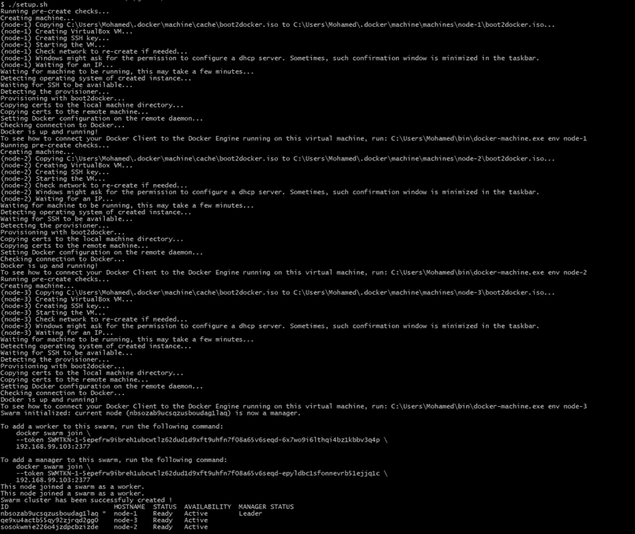

**2 —堆栈设置**

创建完成后，通过 **SSH** 连接到您的**管理器节点**，并克隆以下存储库:

> https://github.com/mlabouardy/swarm-tick.git

为了启动所有这些容器，我使用了 **docker-compose** :

发出以下命令来部署堆栈:

> docker stack deploy — compose 文件 docker-compose.yml tick

等待节点从 **DockerHub** 中提取图像:

拉出后，您应该会看到服务正在运行:

在[**http://IP:8888**](http://IP:8888)(**chrono graf**Dashboard)上打开浏览器，正确配置数据源:

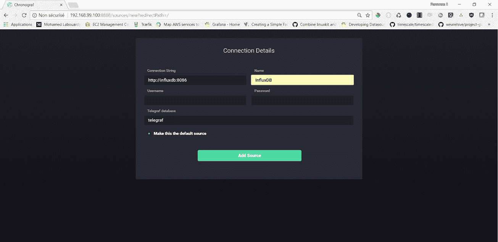

**3 —系统使用仪表板**

点击“**创建仪表板**，并为仪表板指定一个名称:

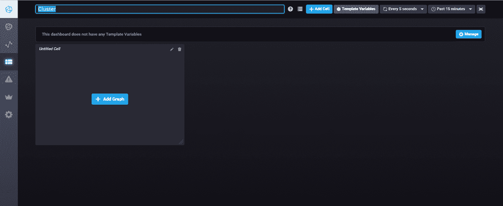

在添加图形之前，我们将使用一个叫做**仪表板模板变量**的概念，来创建动态的&交互式图形。在我们的度量查询中，我们将使用变量来代替像节点名和容器名这样的硬编码。因此，点击前面创建的仪表板顶部的“**模板变量**”。并且，创建一个名为 *:host:* 的变量，如下所示:

注意:目前，还没有为用 **swarm 全局模式** ( [Github](https://github.com/moby/moby/pull/24973) )创建的服务设置主机名的解决方案。这就是为什么我们得到的是 id 列表而不是名字

您现在可以使用仪表板顶部的下拉菜单来选择*:主机:*模板变量的不同选项:

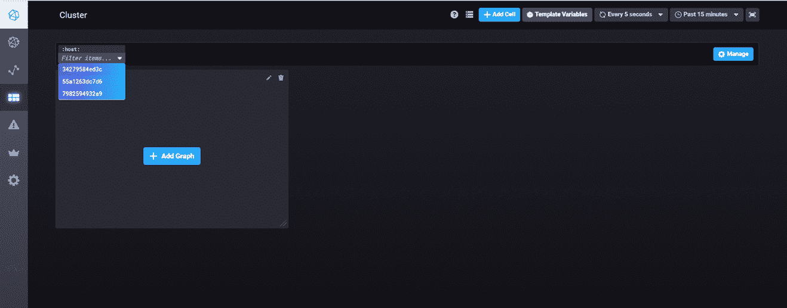

现在是时候创建我们的第一个图表了，所以点击“**添加图表**按钮。

**3.1 —每个节点的内存使用量**

要创建查询，您可以使用**查询构建器**，或者，如果您已经熟悉 **InfluxQL** ，您可以在文本输入中手动输入查询:

> 从“vm_metrics”中选择 mean(“free”)作为“mean_free”，mean(“used”)作为“mean_used”，mean(“total”)作为“mean_total”。“自动发电机”。" mem_vm "其中 time >:dashboard time:AND " host " =:host:GROUP BY:interval:FILL(null)

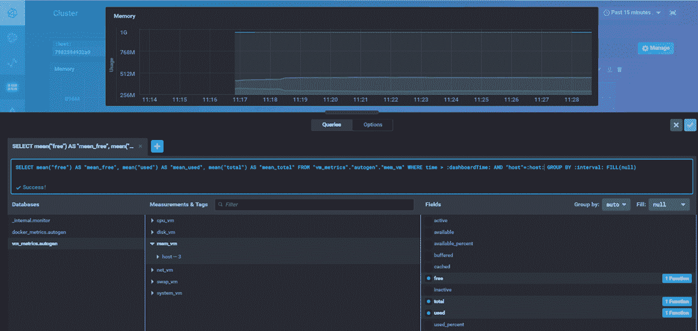

我们的查询计算度量 *mem_vm* 中字段键 *free* 、 *used* 和 *total* 的平均值，并按照时间和节点名称对它们进行分组。

您可以通过点击“**选项**选项卡来更改图形类型、X 轴和 Y 轴格式:

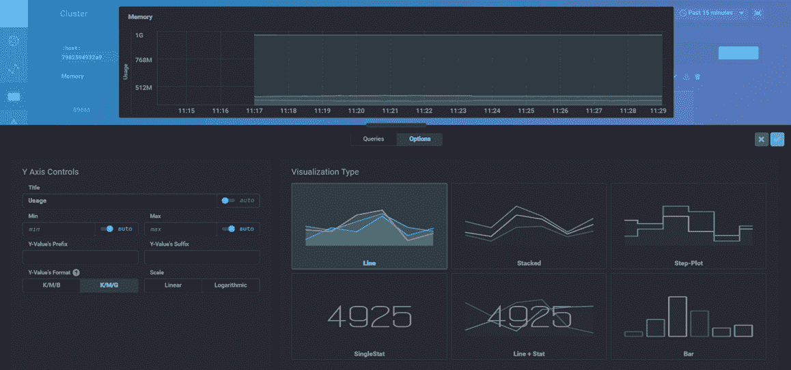

仪表板上的一个可视化效果并不十分有趣，所以我添加了更多的图表来展示更多的可能性:

**3.2 —每个节点的 CPU 使用率**

> 从“vm_metrics”中选择 mean(“usage _ user”)作为“mean_usage_user”，mean(“usage _ system”)作为“mean_usage_system”。“自动发电机”。" cpu_vm "其中 time >:dashboard time:AND " host " =:host:GROUP BY:interval:FILL(null)

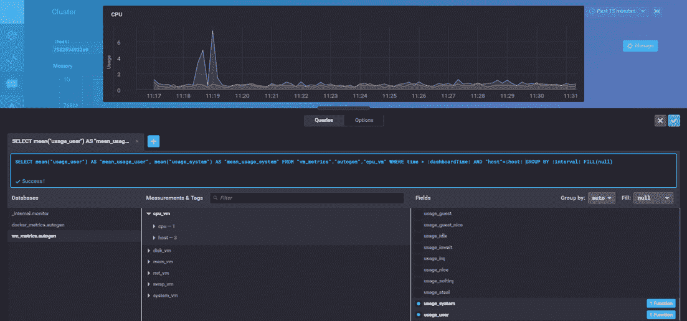

**3.3 —每个节点的磁盘使用量**

> 从“vm_metrics”中选择 mean(“free”)作为“mean_free”，mean(“total”)作为“mean_total”，mean(“used”)作为“mean_used”。“自动发电机”。" disk_vm "其中 time >:dashboard time:AND " host " =:host:GROUP BY:interval:FILL(null)

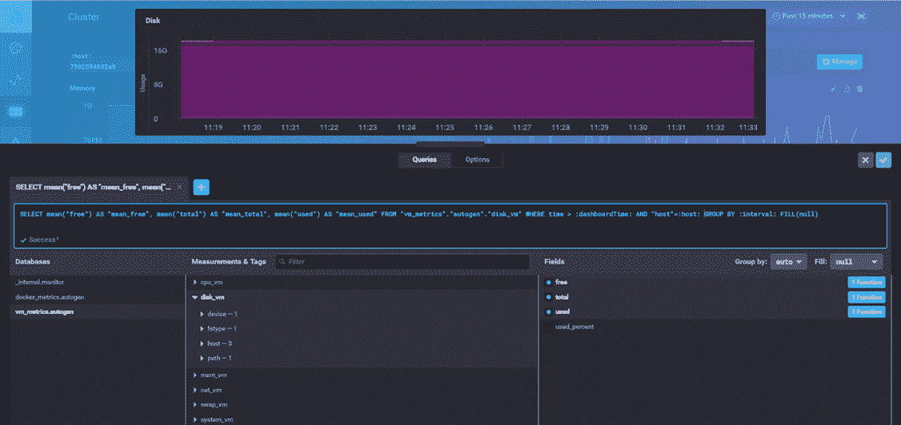

我们最终得到了这样一个漂亮的仪表板:

让我们创建另一个仪表板来监控在**集群**上运行的 **Docker 容器**。

**4 —群体服务仪表板**

创建第二个名为“ **Services** ”的仪表板，并创建一个模板变量来存储集群上运行的服务列表:

您可以按服务名过滤 now 指标:

**4.1 —每个服务的内存使用量**

> 从“docker_metrics”中选择 mean(“usage _ percent”)作为“mean_usage_percent”。“自动发电机”。" docker_container_mem_docker "其中 time > :dashboardTime:和" com . docker . swarm . service . name " =:container:GROUP BY:interval:FILL(null)

**4.2 —每项服务的 CPU 使用率**

> 从“docker_metrics”中选择 mean(“usage _ percent”)作为“mean_usage_percent”。“自动发电机”。" docker_container_cpu_docker "其中 time > :dashboardTime:和" com . docker . swarm . service . name " =:container:GROUP BY:interval:FILL(null)

**4.3 —网络发送/接收**

> 从“docker_metrics”中选择 mean(“tx _ packets”)作为“mean_tx_packets”，mean(“rx _ packets”)作为“mean_rx_packets”。“自动发电机”。" docker_container_net_docker "其中 time > :dashboardTime:和" com . docker . swarm . service . name " =:container:GROUP BY:interval:FILL(null)

**4.4 —每个服务的 IO 读/写**

> 从“docker_metrics”中选择 mean(“io _ serviced _ recursive _ write”)作为“mean_io_recursive_write_write”，mean(“io _ serviced _ recursive _ read”)作为“mean _ io _ serviced _ recursive _ read”。“自动发电机”。" docker_container_blkio_docker "其中 time > :dashboardTime:和" com . docker . swarm . service . name " =:container:GROUP BY:interval:FILL(null)

结果:

注意:您可以更进一步，通过创建另一个模板变量，按运行服务的节点过滤指标:

让我们看看如果我们在 **Swarm** 上创建另一个服务会发生什么:

> docker service create-name API-constraint node . role = = worker-p 5000:5000 mlabouardy/books-API

如果您返回到 **Chronograf** ，您应该会看到服务已经自动添加到容器下拉列表中:

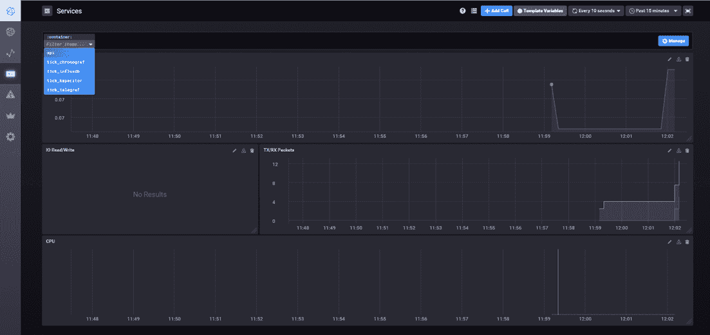

就是这样！现在，您已经具备了使用 **Chronograf** 构建漂亮的数据可视化和仪表盘的基础。

Kapacitor 是拼图的最后一块。我们现在知道了如何存储、获取和读取指标，现在您需要对它们进行详细说明，以做一些类似警报或主动监控的事情。

所以在“**配置**选项卡上，点击“**添加配置**”:

添加新的 **Kapacitor** 实例如下，并启用 **Slack** :

注意:更新 **Slack** 频道& **Webhook URL** 以防你在本教程开始时没有更新 *kapacitor.conf* 文件。你可以通过进入这个[页面](https://api.slack.com/incoming-webhooks)获得一个 **Webhook URL** :

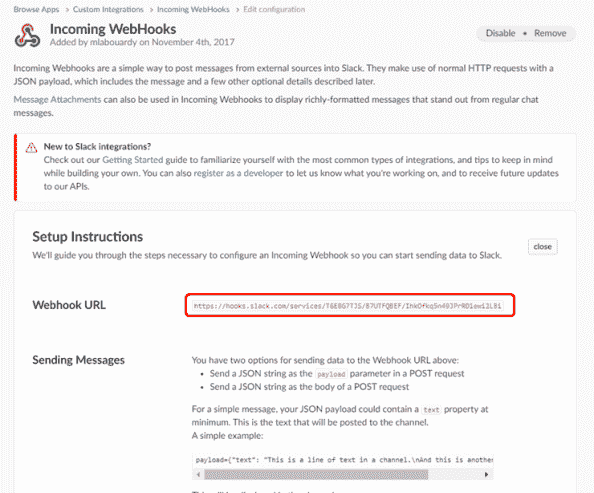

**5 —警报定义**

**5.1 —高内存利用率警报**

通过访问“**警报**”页面，导航至“**规则配置”**页面，并单击右上角的“**构建规则**”按钮:

如果**内存**使用率超过 **60%** ，我们将触发警报:

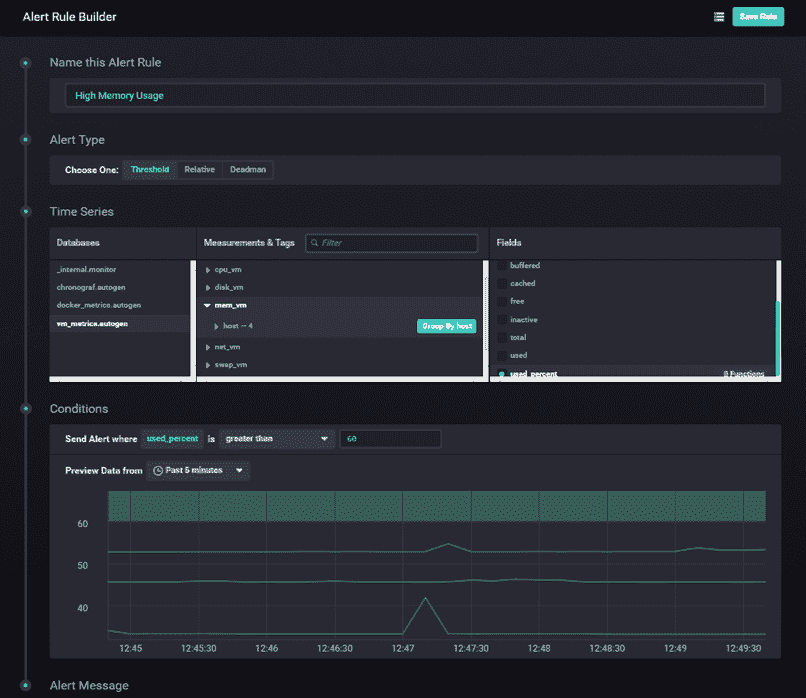

接下来，我们选择 **Slack** 作为事件处理器，并配置警告消息:

注意:如果您在初始**松弛**配置中指定了默认通道，则不需要在**警告消息**部分包含一个**松弛**通道。

**5.2 —高 CPU 利用率警报**

创建第二个规则，在 **CPU** 使用率超过 **40%** 时触发警报:

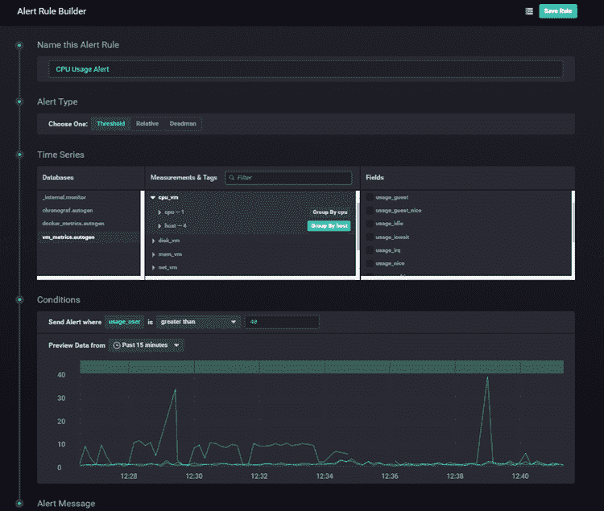

警报端点:

保存规则，就万事俱备了！

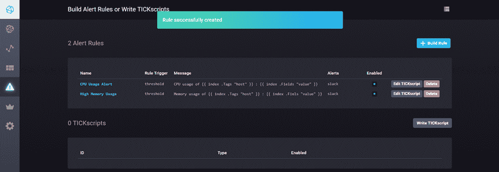

现在我们的警报规则已经定义好了，让我们通过在集群上创建一些负载来测试它们。

**6 —压力测试**

我用了 **stress** ，一个生成工作量的工具。它会产生 CPU、内存、I/O 和磁盘压力。

**6.1 —给 CPU 施加压力**

> docker 运行— rm -it 进度/压力— cpu 4 —超时 20 秒

注意:根据您的 CPU 类型，确保相应地更换' **4** '。

几秒钟后，您应该会收到一个**时差**通知:

**Kapacitor** 触发警报，如果警报解除，还会恢复它们(状态正常)。

**6.2 —强化记忆**

> docker 运行— rm -it 进度/压力—虚拟机 3 —超时 20 秒

它将使用三个进程对内存施加压力，每个进程大约有 **256 Mb** (用选项*–VM-bytes*覆盖)。

让它运行几秒钟:

就是这样！您已经成功地为您的 **Swarm 集群**建立了一个高度可扩展的分布式监控平台，并且只使用了开源项目。

