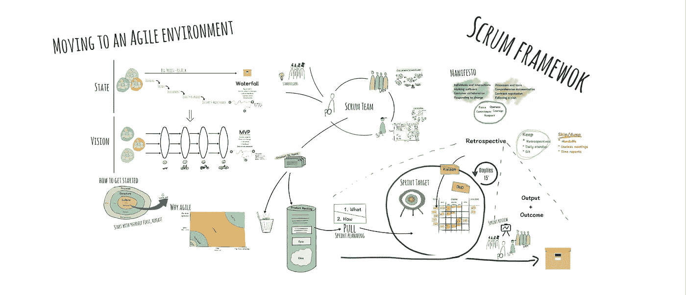
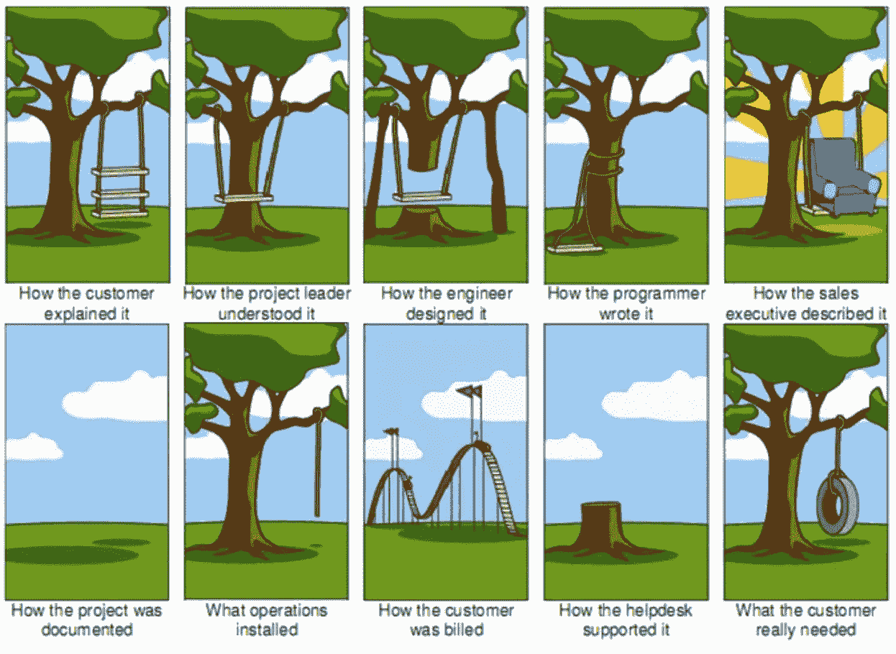

# 迁移到敏捷环境(第一部分)——开始

> 原文：<https://medium.com/hackernoon/moving-to-an-agile-environment-part-i-getting-started-4ed049d2b0c0>

> 亲爱的读者，我偶然看到这篇文章，想告诉你我几个月前的一次经历——从瀑布环境转移到敏捷环境的经历。我既不是敏捷专家，也不是 Scrum 大师，但是我会给你我从我的经验和我从一些书籍和文章中检索到的[所学到的东西。这是第 1 部分，共 3 部分。](https://hackernoon.com/tagged/learning)

# 国家与愿景

## 状态

在我的整个职业生涯中，我一直在瀑布模型中工作。具有长需求列表的长项目(大多数时候不太详细，或者有时根本没有记录)，长时间的开发和验证，以及每个人都害怕的最终部署。

当项目被交付的时候，大多数时候用户要求改变或者开始报告一些特性不像他们想要的那样运行。我们都知道下面的图像我想…

所有这一切的发生主要是因为在项目的发展过程中缺乏来自用户的反馈，这是大多数团队在遵循瀑布模型时面临的最大问题。

别误会，瀑布确实有用！否则它不会在各种各样的软件开发公司中如此受欢迎。但我相信我们可以做得更好(这是我们的愿景)。

## 视力

你不会对这个愿景感到惊讶，事实上它非常简单。我们的目标只是将我们的项目分成几个阶段，这样我们可以更频繁地发布它，因此，在整个项目发展过程中，有机会让我们的用户给出反馈。我们可以这样做，按照 [**MVP**](https://medium.freecodecamp.org/what-the-hell-does-minimum-viable-product-actually-mean-anyway-7d8f6a110f38) 的想法。

MVP 代表**最小可行产品**，是最重要的[精益启动](http://theleanstartup.com/principles)技术之一。但它对初创公司和拥有成熟产品的大公司都有效。这种思维模式是经常简单地交付，这就把我们带到了 [**时间盒装与功能盒装交付**](http://possibility.com/blog/content/time-boxed-versus-feature-boxed-releases) **。**

瀑布模型遵循**特征盒装模型**。在某一组特性完成之前，你不能发布你的项目。这影响了交付日期，并且会影响团队的工作流程，因为除了我们在下一个版本中交付的那些特性之外，没有任何东西停止或继续。使用这种方法，我们可以拥有一些比另一个花费更长时间的特性，并且整个交付都被这个特性所损害。

[敏捷](https://hackernoon.com/tagged/agile)环境遵循**时间框模型，**如果某个特性延迟了也没关系，交付无论如何都会发生！在这种模式下，发布不会因为特性的完成而受到影响，用户知道将会在那个日期收到他们的发布。但现在你扪心自问……”这说不通。还没完成的东西怎么出货？如果我的“用户管理模块”只附带用户列表，而我们甚至没有注册表单，该怎么办？”…我会拿到的，但不是现在。我们将在讨论**潜在可发货产品** ( [第二部分](/@rodolfogonalves/moving-to-an-agile-environment-part-ii-scrum-by-the-book-5733dc6bee3e))时讨论它。

# 为什么是敏捷？

你应该问自己的第一个问题是:“为什么以及什么时候我应该使用敏捷”。

敏捷非常适合大中型项目，但对于小型项目则力不从心。

你必须评估**什么与如何**的关系。当你有更多的东西要构建时，你会有更多的东西要考虑如何构建，并且当你开始对**确定性**和**一致意见变得更加疏远时。**

遵循 MVP，你将在项目的所有利益相关者之间有更多的迭代，你可以将缺乏**协议**和**的情况最小化。**

# 动机

嗯……我想我刚刚给了你几个理由来激发你对敏捷的兴趣，但是请多搜索一下。看文章，查一些视频，一些书...我可以向你推荐米奇·莱西[的《](https://www.mitchlacey.com/)[Scrum 领域指南](https://www.amazon.com/Scrum-Field-Guide-Practical-Development/dp/0321554159)》。

我不能错过与你们分享这些来自 spotify 的视频的机会:

 [## Spotify 工程文化(第一部分)

### 这是描述我们工程文化的动画短片的第一部分(这是第二部分)。这是一个正在进行的旅程…

labs.spotify.com](https://labs.spotify.com/2014/03/27/spotify-engineering-culture-part-1/)  [## Spotify 工程文化(下)

### 这是描述我们工程文化的动画视频的第 2 部分。如果您还没有阅读第 1 部分，请先阅读第 1 部分…

labs.spotify.com](https://labs.spotify.com/2014/09/20/spotify-engineering-culture-part-2/) 

这些视频对我和我的朋友 [@dpcardoso](http://twitter.com/dpcardoso) 来说是一个很大的灵感来源，他一直在公司的这条“转向敏捷环境”的道路上与我一起工作。

你和我们一样吗？你想在你的组织中做一些大的改变吗，比如从瀑布到敏捷框架？

让我给你一些关于如何开始的指导方针。我不能向你保证它会在你的组织中工作，但是它确实在我们的组织中工作了(我们几个月前才开始使用 Scrum)。

# 如何开始

## 1.建立紧急状态

确立一些要实现的目标！你的提案从有用会给你的公司带来什么？

写下你可以利用的所有优势，以及它在你的组织中解决了哪些问题。你不能仅仅因为敏捷“酷”或“尝试新事物”就采用它，你必须确定你每天面临的所有问题，以及你打算如何解决它们。

但是，请不要太雄心勃勃，建立一些合理的东西。否则人们不会相信“不可能的事情”。spotify 的环境是一个梦，但不要迷失……你必须在你的公司现实、你的“真实世界”中思考。不要试图一蹴而就。

## 2.创造一个远景/描绘一幅未来的图画

你看到文章开头那个大图了吗？那是我的“T2 未来的照片”。找到某种方式来陈述你的愿景，这样你就可以把它传达给公司的其他人。

## 3.找一个赞助商

这一点非常重要。如果你只是一个像我一样的开发人员或者没有太多权限的人，你需要一个人人都关注和倾听。这个人必须理解你的提议，并且必须相信它！那他一定在沟通上帮你。

## 4.传达愿景

现在你有所有的条件向你的其他同事陈述你的愿景。我相信你的愿景会有很多挑战，你必须对每一个挑战进行推理。利用你的赞助商来帮助你说服人们相信你的愿景。

就像我说过的，愿景很容易理解，但实现起来并不容易。你可能需要应对许多挑战，改变你环境中的许多事情。

敏捷是一种方法论，但是你需要一个框架来实现它。你有几个但最出名的是****和 [**看板**](https://leankit.com/learn/kanban/what-is-kanban/) **。**我们决定与 Scrum 合作，这就是我将在第 [II](/@rodolfogonalves/moving-to-an-agile-environment-part-ii-scrum-by-the-book-5733dc6bee3e) 和第 [III](https://hackernoon.com/moving-to-an-agile-environment-part-iii-scrum-by-experience-35fb7b5af563) 部分阐述的内容。****