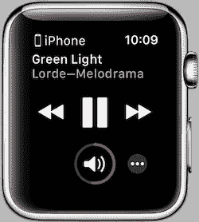
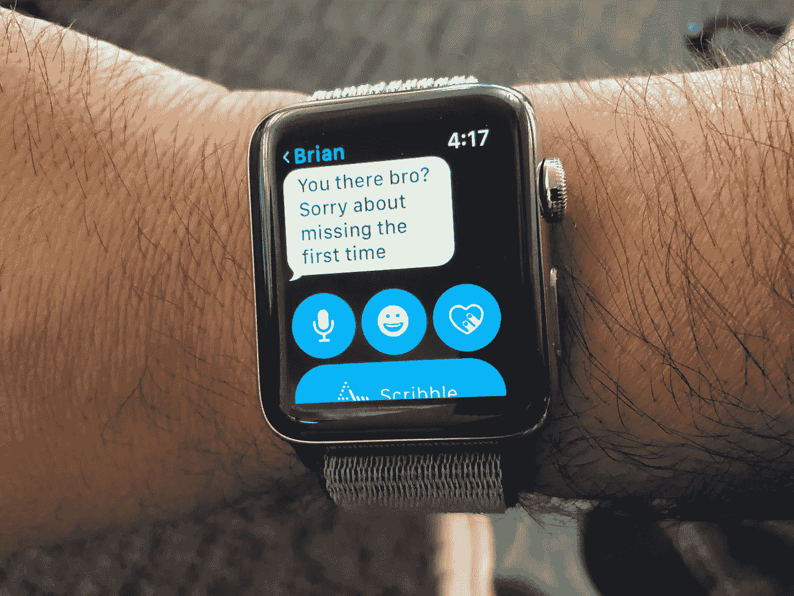

# 多设备是很难的，甚至苹果也没有做对

> 原文：<https://medium.com/hackernoon/multi-device-is-hard-and-not-even-apple-gets-it-right-b647f0a2f890>

## 为了能够瓦解智能手机，新设备首先需要与智能手机更好地共存

我在帖子中经常提到的一个话题是关于[“智能手机解体”](/p/apple-airpods-and-the-disintegration-of-the-smartphone-cb8e29efc8e3)，这是一种趋势——由技术发展和市场动态驱动，但尚未来自客户需求——新的个人设备提供的功能与智能手机的一些功能重叠，最终将取代智能手机。

最近有一些文章和新闻一直指向这个方向:

*   一些人认为[智能手机作为一个平台将变得无关紧要，因为谷歌或亚马逊等公司提供的云端人工智能能力将成为关键方面](https://www.msn.com/en-gb/money/technology/the-iphone-x-is-the-beginning-of-the-end-for-apple/ar-AAuosJd?ocid=st)。这是一个相关的观点，也意味着解体，因为这些功能可以从智能扬声器或语音优先的可穿戴设备等新设备中消费，取代智能手机今天的部分角色。
*   其他一些人认为，语音优先的方法，即使是在亚马逊的 Echo Show 和 Spot 这样的屏幕设备上，[也标志着“智能手机的终结”](https://www.fastcompany.com/40479207/for-amazon-the-future-of-alexa-is-about-the-end-of-the-smartphone-era)。虽然这篇文章很好地分析了亚马逊承诺语音优先的复杂性和决策，但我仍然认为这种方法是补充，而不是真正的完全替代。这是一个更大的难题，触摸设备也将在其中发挥作用。
*   还有一些讨论已久的传言，本周变得更加具体，关于苹果自己的增强现实耳机计划，该计划将在 2020 年推出，可独立于手机工作。但是考虑到文章中提到的这种对手机的独立性是相对的:

> 当前一代虚拟现实耳机使用智能手机作为引擎和屏幕，苹果的设备将拥有自己的显示屏，并运行在新的芯片和操作系统上

它考虑了显示和处理，但是连接性呢？特别是在设备需要移动电话的情况下，我可以通过手机或手表上的连接看到它。

**这一切都指向了新设备(扬声器、手表、眼镜)占据今天智能手机角色的相同战略方向。但是，通往这一明确目标的道路已经表明，过渡将为客户体验带来需要解决的新问题。**

# 附件/独立设备二元性

正如我之前详细讨论过的，[苹果围绕手表的策略正在创造一条道路，在这条道路上，手机本身变得不那么重要](https://hackernoon.com/the-lte-apple-watch-new-value-and-new-applications-fcbf8cfc77c5)。有些人甚至把[手表视为进入 AR 耳机的过渡步骤，这也将使它变得多余](http://www.businessinsider.com/apple-watch-series-3-vs-augmented-reality-2017-11)。

这一点随着支持 LTE 的 [Apple](https://hackernoon.com/tagged/apple) Watch Series 3 变得更加明显，预计它将从 iPhone 的一个配件演变成一个完全独立的设备。

但发布的产品却是另外一种东西，一种介于配件和自给自足之间的混合体。两个主要原因推动了这一点:

*   **用户期望**。虽然蜂窝手表可以让用户不必携带手机，但这将是一种随意的替代，永远不会是完全的替代:对于许多使用情况来说，(大)屏幕仍然是首选，相机功能越来越重要，这只是举两个例子。大多数情况下，用户仍然会携带这两种设备，因此，与其期望独立使用，不如让它们和谐共存。稍后会详细介绍。
*   **技术限制**。这可能是最重要的驱动因素:**蜂窝使用中的电池寿命目前无法承受完全更换行为。**最近发布的 WatchOS 4.1 支持在手表中播放苹果音乐，[进一步强调了这一点](https://www.cultofmac.com/511461/apple-watch-3-battery-guidelines-updated-watchos-4-1/?utm_campaign=heres-how-fast-apple-music-streaming-drains-your-watch-3-battery&utm_medium=twitter&utm_source=twitter)。

因此，最终我们有了一个新的设备，它可以独立于手机工作，但它将是一个附件，在可能的情况下依赖于手机的连接。这就给我们带来了用户体验的[多设备](https://hackernoon.com/tagged/multi-device)问题:**当你携带两个功能重叠的设备时，决定什么做什么就成了一件至关重要的事情。**

# 共存会产生新的问题

让我给你举一个苹果设备共存导致智能手机瓦解的例子。

场景是这样的:我带着我的 iPhone，我的 Apple Watch，通过 AirPods 听音乐。

Yes! Exactly like this!

音乐从我的手机播放到 AirPods，我不想浪费宝贵的手表电池做不同的事情。但有趣的是，由于 Apple Watch *是 iPhone 的配件，所以它是[显示“正在播放”的脸，这允许我控制音量和跳过歌曲，而不必从口袋中拿出手机](https://support.apple.com/en-us/HT204691)。这是苹果公司的一个伟大的设计决策，它已经“瓦解”了 3 种设备(iPhone，Watch 和 AirPods)的音乐体验，为我提供了一种方便的方式来使用它们的一部分体验。

如果我在手机中收到一条短信(或 WhatsApp 消息)，我会在手腕中收到通知，这样我就可以查看它，同时仍然可以将手机放在口袋中。确实方便。

然后我想回复那篇文章，这里是共存显示其接缝的地方。因为 [Apple Watch 允许我选择语音回复](https://support.apple.com/en-us/HT204943)(图中第一个圆形图标)，利用 Siri 的语音转文本功能将我的话转录成消息，效果相当不错。但在这种情况下，手表决定充当一个独立的设备，而不是一个配件，并忽略了我目前正在通过 AirPods 听音乐。它不会暂停音乐，不会给我语音识别已经开始的音频提示，也不会从 AirPods 接收语音输入，而是从手表本身内部的麦克风接收。它决定像不存在其他设备一样工作。

# 什么什么

这确实是一个很小的不便，但这表明了当功能分布在设备上时，智能手机解体体验的差距:

*   来自电话的数据连接
*   耳机中的音频交互
*   手表中的控件、通知和用户界面

协调它们以最合理的方式一起工作并不简单，有时是由于技术限制，甚至是产品设计的限制。

从技术的角度来看，我们必须知道什么是最好的方法:蓝牙连接应该从手机改变到手表，或者在这种情况下，应该从手机触发语音识别，但通过手表显示屏给出视觉反馈？这些事情中的任何一件发生得足够快以提供响应能力吗？

而且，这是预期的用户行为吗？或者，即使用户正在使用 AirPods，手表仍然使用自己的麦克风更有意义吗？例如，考虑用 Shazam 识别歌曲。

# 移交使情况变得更糟

当所有设备都存在时，前一种情况需要设备之间的协调。但是，如果我们考虑动态变化，情况会更加复杂:

*   你在 iPhone 里选了一些音乐，因为 UI 更方便，戴上你的 AirPods 开始听。然后你出去跑步，因为你有一个 LTE 的 Apple Watch，所以把你的手机留下了。人们自然会希望你的 AirPods 从手机切换到手表，手表会继续播放你正在听的歌曲。这一切发生得没有一点差错，持续的音乐总是在你的耳边。
*   您正在 iPhone 上进行对话，使用 AirPods，因此您可以方便地在 AirPower mat 中为手机充电。突然你不得不离开，但你的手机仍然没有足够的电量，所以如果你拿起它，电话肯定会掉线。但是不用担心，当你离开时(或者当 iPhone 检测到电池电量低时)，电话会无缝地移动到你的手表中，你的 AirPods 会连接到它，所以你可以继续交谈，没有问题。

这两种情况在今天都行不通。不支持从手机到手表的转换，并且当手表检测到与手机断开连接时，手表启动 LTE 无线电所需的时间将意味着第一种情况下音乐的明显暂停，更严重的是第二种情况下的掉线。但是客户期望他们应该这样做。

随着新设备融入到生态系统中，以及新应用和功能在多个生态系统中发挥作用，共存和独立之间的平衡将更多地取决于环境，设计决策将不得不考虑复杂的多设备场景。