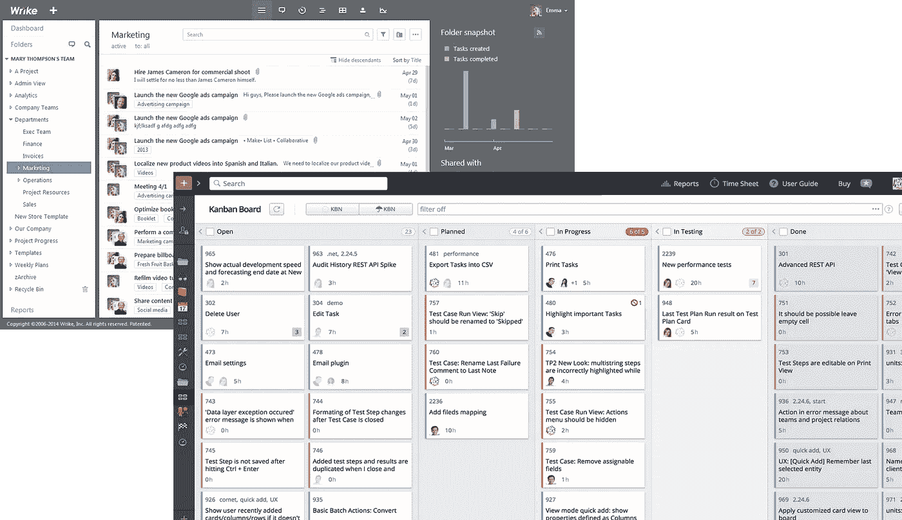
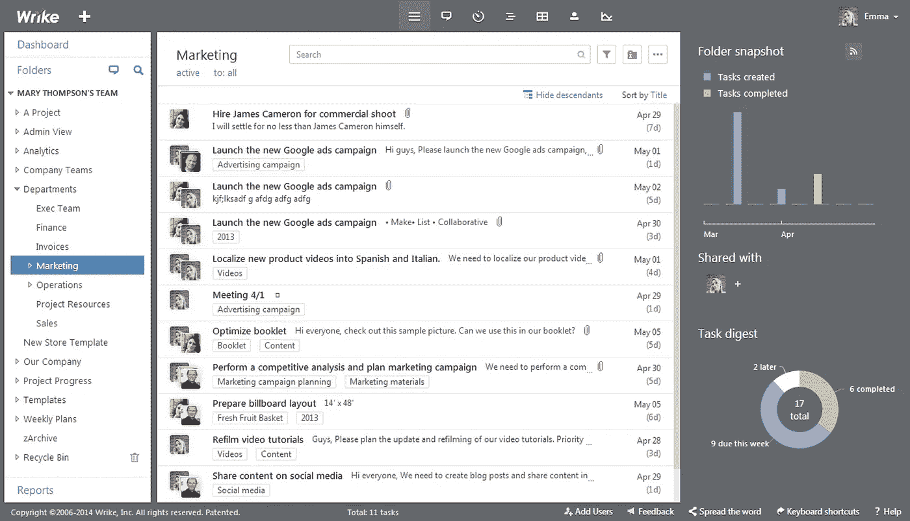
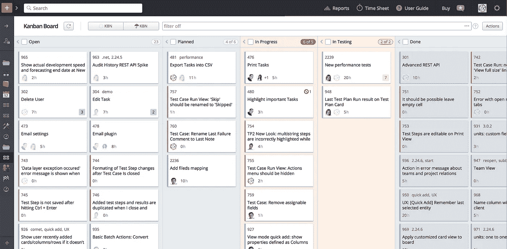

# 我在任务和项目管理专业产品方面的经验

> 原文：<https://medium.com/hackernoon/my-experience-with-professional-products-for-task-and-project-management-970bd8dfece1>

网络上充满了任务和项目管理的解决方案，从备忘录列表到复杂的计划。

然而，在那片海上航行并不容易，因为有大量的解决方案，而每一个都是基于一些妥协，在测试阶段并不总是显而易见的。在一致的数据输入后，极限出现。然后，尽管有广告，切换到另一个解决方案从来都不容易(或不可能)。

在这篇文章中，既没有列出所有可用的产品，也没有比较评论。然而，我的经验是在一个有着不同角色的小团队中选择和采用我们所说的那种工具。涉及许多领域，包括软件开发、机械/电气设计、营销和运营。

选择标准是在个人生产力水平和团队管理水平上使用该工具的能力，移动和平板电脑应用的可用性，广泛的处理/规划功能。

## 产品类别

我评估了几个产品系列，显然摒弃了极端情况，即用于简单笔记列表的程序和专用于企业的软件(ERP 和类似软件):

1.  **低端**。这些应用程序是为个人使用和团体使用(接受简化)而设计的。活动列表比基本计划更具结构化和/或可配置性，根据所选择的计划，您可以进行最少的项目管理和规划。这一类别包括非常多的产品(其中我最喜欢的有: [ToodleDo](https://www.toodledo.com/) 、 [Asana](https://asana.com/) 、[涅槃](https://www.nirvanahq.com/))。在许多情况下，免费版本没有太多限制，付费版本或扩展提供了一些高端功能。
2.  **中档**。这个专业类别广泛分布着领先的品牌(包括 [Targetprocess](https://www.targetprocess.com/) 、 [Wrike](https://www.wrike.com/) 、[吉拉](https://www.atlassian.com/software/jira))，也是为了满足业务需求而设计的，并且是一个承诺更长寿命、功率和灵活性的类别。安全策略、规划、仪表板、里程碑/发布管理、高级搜索/过滤等等通常都是可用的特性。你很容易认出这一类，因为成本往往不低。虽然有时有免费版本，但这些版本通常太有限，尤其是如果您打算在团队中使用它们。投资将取决于您想要包含的功能，因为所有产品都有更多的定价方案。准备好每年为 5-10 个用户花费几百美元。
3.  **高端**。最后，还有一类旨在解决高度复杂的规划问题的解决方案([微软项目](https://products.office.com/it-it/project/project-and-portfolio-management-software)、[团队合作项目](https://www.teamwork.com/project-management-software)、 [LiquidPlanner](https://www.liquidplanner.com/) 等)。).这些是相对昂贵的解决方案，为了获得有效的结果，需要相当程度的深入分析。在某些情况下，中档产品的最贵定价计划足够好地涵盖了这一类别。

## 选择

为了省钱，我个人对许多低端应用进行了大量测试。然而，对于一个有效的工具来说，除了升级和投资之外没有其他方法，因为有两个主要问题:太基本的功能——很快就会在实际情况中暴露出它们的局限性——以及随着时间的推移产品增长非常有限——使得用数据填充它没有吸引力，从太多的妥协开始。

相反，由于与需求相比成本过高，我放弃了高端应用程序。

因此，我在专业解决方案方面的研究采取了一种非常精确的方式，在中间范围内: [Wrike](https://www.wrike.com/) 或 [Targetprocess](https://www.targetprocess.com/) 。特别值得一提的是 [LiquidPlanner](https://www.liquidplanner.com/) ，但我放弃了它，因为它的成本很高，用户界面也不能完全说服我。

Wrike 是一个相当全面的解决方案，拥有许多竞争对手产品不具备的功能:项目/活动层级、简单的用户界面、出色的平板电脑和智能手机应用、良好的可配置性。

Wrike 的两个最重要的限制是成本和项目管理。定价是严格的:放弃免费的解决方案，你从 49 美元/月开始(他们宣传 9.8 美元/月/用户，但实际上你必须从 5 个用户开始，然后逐步增加到 5 个用户)。此外，项目管理很差。层次结构允许高度的灵活性，但除此之外，其他产品肯定更好。该应用程序主要侧重于任务管理。

Wrike

[**Targetprocess**](https://www.targetprocess.com/) 一开始是无所适从。它采用了一个明显复杂的模型——主要基于软件开发——但是定制选项大大优于竞争产品。可定制性太强，看起来太复杂了。如果你不害怕并且有耐心迈出第一步，你会意识到它是一个非常强大的工具，是为过程的管理和计划而精心设计的(甚至在软件开发之外)。当你习惯了，它很容易使用。智能手机应用程序并不出色，但事实是这些工具需要更大的屏幕。支持非常出色，显然比 Wrike 更有能力。定价高于 Wrike(20 美元/月/用户)，但更灵活(单用户定价)。

Targetprocess

我们选择 Wrike 主要有两个原因:我们担心英语(我为一家意大利公司工作)会令人害怕，以及 TargetProcess 的高度可配置性和多功能性会使用户迷失方向，对这些工具完全陌生。这些问题很容易克服，但是感觉到的影响已经很大了，心理上的拒绝不是最好的开始方式。此外，尽管这是一个被高估的点，但我对 Wrike 的层次灵活性很着迷，对 Targetprocess 的层次僵化也有点害怕(我们的流程还在进行中)。

## 收养

采用 Wrike 不仅简单，甚至令人愉快。除了你在任何产品中遇到的小缺陷之外，界面真的很方便，很讨人喜欢。此外，平板电脑/智能手机应用程序非常容易使用。优秀的界面和简单的概念促进了用户的采用。相反，缺少高级搜索的真正语法是一个问题，还有适度的可定制性和缺少任何形式的条件格式(例如，自动突出显示某些活动)。此外，从整体角度来看，我对项目管理感到失望。

## 接下来的

我认为 Wrike 是一个不错的工具，但是，在特定情况下，我渴望与业务数据更好地集成(带有特殊编号逻辑的定制字段、外部文件夹链接等等)。拥有软件开发技能——尽管 Wrike 设想了定制扩展的可能性——我选择用 [Zoho Creator](https://www.zoho.com/creator/) 实现一个特定的应用程序，除了活动和项目之外，它还可以集成许多其他数据并满足其他需求。Wrike 被抛弃了，我又一次发现自己有一个很大的导出列表，需要以某种方式迁移到新系统。Wrike 有一个很好的导出功能，但我更喜欢手动(并且考虑周到地)将数据重新插入新系统。对于这类产品，从一个系统导出并自动加载到另一个系统的可能性是一种理论上的可能性。实际上，自动数据迁移总是被证明是不合适的，主要是因为这两个系统经常不采用相同的范例。

## 最后

事后看来，在 Wrike 和 Targetprocess 之间，我会毫不犹豫地选择 Targetprocess。我相信，随着时间的推移，解决任何沉默的方法在很大程度上都是通过工具的灵活性和寿命来实现的。您的公司投资于这些工具的定制和采用，因此最好投资一个可以伴随团队多年的工具，以满足可能增长的需求。