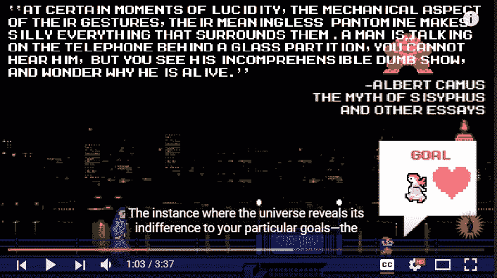
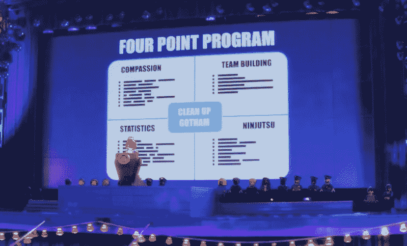

# 我的阅读材料可以制作一部乐高电影——这些课程变成了可堆积的砖块

> 原文：<https://medium.com/hackernoon/my-readings-would-make-a-lego-movie-10-lessons-that-turned-into-pile-able-bricks-e1a123f13d22>

一年前看了[乐高电影](http://www.imdb.com/title/tt1490017/)。我记得当时被它的独创性惊呆了，但我没有完成它。今年看了很多书，想起了电影给我的一些感悟，决定再看一遍。

我总是被哲学、社会学和其他人文科学吸引，它们就像一种 x 光设备，有助于看穿社会基础设施，有时甚至能看穿个人的内心，看看到底发生了什么——甚至(最重要的是)在没有人意识到的时候。

在某种程度上，对我来说，生活就像一场游戏，理解游戏规则的人将占上风——即使这意味着除了理解她/他是游戏的一部分之外，不会赢得任何物质上的东西，不管他/她在游戏中的表现如何。

我永远不会忘记当我对加缪的《陌生人》有了更深的理解时，8 位哲学制作的解说视频[。该视频通过将生活比作游戏，准确地解释了存在主义哲学的关键思想。虽然这个人无法纠正生命游戏的荒谬，但对我来说，他/她知道这是荒谬的似乎更好。](https://www.youtube.com/watch?v=KI25easQs2k)

Donkey Kong & The Myth of Sisyphus — 8-Bit Philosophy

我认为乐高电影用砖块对塑造现代社会的动力、信仰和行为进行了重要的透视。其中提到的一些主题让我想起了我正在阅读的许多书籍，都是当代畅销书作家的作品。下次你看的时候，看看你能不能自己认出他们。

## 1.人们渴望遵循规则

乐高电影以一个建筑工人在早上上班前遵循快乐清单开始。如果这些规则被遵守，他应该适应，被喜欢，并且快乐(按此顺序)。

嗯，我读了很多书，我开始意识到一些最成功的书在名字中包含了世界法则——看看畅销书“ **5 秒法则”**，移情作者兼叙述者梅尔·罗宾斯(顺便说一句，我认为是最好的叙述者之一)讲述了她如何发现只需要 5 秒钟就可以激活她的前额叶皮层并重新控制她的生活， 或者也是最畅销的**《10X 法则》**，作者兼叙述者格兰特·卡尔多内解释了将行动量增加十倍是如何让他获得人生成功的。

人们渴望控制，给他们一套他们可以遵循的规则，以获得成功，拥有更好的关系，更快乐，这似乎可以解决这种渴望，并推动这些书成为明星。

乐高建筑工人埃米特(Emmet)也没有什么不同，他依赖说明书度过一天，因为他从醒着一直到睡着。

Opening scene in The Lego Movie, where the main character goes through a set of Instruction Manuals

## 2.不是“一切都很棒”

贯穿整部电影的主要歌曲是副歌“一切都很棒”,由工人们在执行他们有些机械和指令主导的施工任务时演唱，呼应了过去几年流行的积极言论。

事实上，从 t 恤印花到马克杯，以及几乎所有的[初创企业](https://hackernoon.com/tagged/startup)文化，人们都在努力以更积极的眼光看待事物，培养积极的想法，期望这些想法会引发更好的行动。

Unikitty 是书中最有趣的角色之一，当所有的积极情绪都不足以面对她的世界被摧毁时，她会时而开心时而愤怒。

Angry Unikitty in The Lego Movie

让这个角色如此有趣的是，她放下了有些霸道的“一切都很棒”的座右铭。事实上，尽管尝试用更积极的眼光看待生活有很多好处，但悲伤也很重要，允许自己悲伤。

哲学家阿兰·德波顿在生活学院有一个周日布道，讲的是[悲观主义的智慧](https://vimeo.com/10601416)，这与(强迫自己)以积极的眼光看待一切的趋势背道而驰，他在布道中引用了尼采的名言:

*“对于那些与我有关的人，我希望他们遭受痛苦、悲伤、疾病、虐待和侮辱——我希望他们不要对极度的自我蔑视、自我不信任的折磨和被征服者的悲惨感到陌生。”*

此外:

*“如果你拒绝让痛苦降临在你身上，哪怕是一个小时，如果你不断地试图提前预防所有可能的痛苦；如果你体验到痛苦和不快是邪恶的、可恨的、值得消灭的，是存在的一种缺陷，那么很明显,[你内心深处怀有]…舒适的宗教。你们这些安逸的小人儿，你们对人类的幸福知之甚少，因为幸福和不幸是姐妹，甚至是双胞胎，要么一起长大，要么像你们一样，一起变小。”*

## 3.一种超越他人标签的真实的特殊感会有很大的帮助

千禧一代经常被指责为有资格和感觉像一片特殊的雪花——他们的思想和感情应该小心处理，以免破裂。

在电影中，太普通也不特别的埃米特遇到了“反抗的碎片”，一个只有非常特别的人才能找到的碎片，这自动赋予了他那种地位，尽管他觉得自己并不特别。

在整部电影中，埃米特感觉自己是一个冒名顶替者，一个并不特别的人，但一场“事故”让其他人认为他是。他是最终拯救了世界的反英雄。

有一个有趣的场景，古鲁维特鲁威斯发表了一篇关于 Wyldstyle 的特殊性的演讲，错误地认为她是专业的，当他意识到他的归因是错误的时，立即向埃米特发表了同样的演讲，以他千篇一律的方式表明，别人归因的特殊性可以是毫无意义的。

我认为这里的要点是，感觉特别(在某种意义上比特别更独特)给了你做特别的事情的能力——如果你能克服冒名顶替综合症——这超越并独立于其他人的特别标签。

## 4.制造者会制造——而且很多时候是惊人的东西

创客运动是一种当代亚文化，鼓励人们利用他们的创造力来建造东西。在这部电影中，不仅主角是一名建筑工人，而且还有人类“建筑大师”，这实际上是乐高的一个真实职位——正如我在一部关于乐高公司的电影 [A LEGO Brikumentary](http://www.imdb.com/title/tt3214286/) 中发现的那样——他们使用砖块建造非常复杂的结构。

今年早些时候，我有机会参加了一个由当地私人实验室组织的[为期 3 天的研讨会](/hackeriosity/yesterday-started-the-young-creators-2017-a-series-of-workshops-promoted-by-the-lisbon-city-87bb54a61571)，该研讨会有许多对制造商有吸引力的学科:3D 打印、生物黑客、机器人技术(在这种情况下使用 Arduino)和纺织黑客技术。我选择了 robotics/Arduino 类，但是四处走走，看看其他类的输出。

当人们被允许发挥他们的创造力时，我惊讶地看到他们能够做出的东西，以及他们拯救长大后独自玩耍的内心儿童的能力，向毕加索几乎经常被引用的表达“每个孩子都是艺术家”致敬。问题是我们长大后如何保持艺术家的身份”。

这是最鼓舞人心的运动之一，它将几代人团结在一起，创造出有时非常神奇的东西。

## 5.英雄们喜欢嘻哈音乐和单干——狂妄自大被大声唱出

乐高电影中的蝙蝠侠角色——这里我也指的是续集蝙蝠侠乐高电影——是一个自信、孤独的英雄，他歌颂自己，喜欢重金属音乐。

嗯，当时我刚刚读/听了本·霍洛维茨写的《艰难的事情》这本书，讲述了他在科技界的成功和失败之旅。每一章都以一首嘻哈歌曲开始，Audible 上的解说员的语气/态度让我想起了乐高蝙蝠侠电影中的蝙蝠侠。

这是一个完全主观的(有些人可能会说不公平)比较，但你可以自己测试一下，看电影，在 Audible 上播放这本书的片段，看看你是否有和我一样的感受。

## 6.大反派也很脆弱

当听到[的 TED 演讲](https://www.ted.com/talks/brene_brown_on_vulnerability)关于脆弱的力量时，布琳·布朗变得很出名。在她的书中，她解释了在“永不满足”的文化中，脆弱作为一种与自己重新联系的工具的重要性。嗯，在两部电影中，为了打败坏人，蝙蝠侠被迫与他人合作，并认识到自己的脆弱。

但也许最感人的一幕是在蝙蝠侠和小丑之间，当蝙蝠侠告诉小丑，他对他来说没有任何意义，小丑几乎哭了。非常特别的是，作者能够拆解最可怕的反派之一——是的，杰克·尼科尔森的小丑的咧嘴笑让我毛骨悚然——并展示了导致他邪恶的潜在(相当人性)情感。布琳·布朗谈到了一个小人操纵一个大面具的形象，这正是这部电影所描绘的。一个弱小的男人操纵着一个可怕的恶棍的巨大形象。我敢肯定，在此之前，没有人有能力通过另一个镜头来看小丑。

“Let me tell you something J bird: (…) There is no us. Batman and Joker are not a thing. I don’t need you. I don’t need anyone. You mean nothing to me. No one does” The LEGO Batman Movie

另一个，是蝙蝠侠和管家阿尔弗雷德之间的对话，当阿尔弗雷德告诉他蝙蝠侠最怕的不是怪物，而是再次成为家庭的一员。一个非常勇敢的英雄再次被分解成一个很难与最可怕的怪物战斗的人，但不是他的不足感。

## 7.女性正在分享聚光灯

这是最明显的一点——在两部电影中——总有一个女性英雄来拯救异性。女性英雄在某种程度上是一种刻板印象，更温和，更有同情心，更合群，更关心群体，但在解决以前的(男性)英雄所面临的问题时，却被置于平等的地位。

## 8.对大师的话应该有所保留

也许最滑稽的角色之一是维特鲁威，古鲁/巫师，关于将要发生的事情的低语预言(有时透露出对最基本事情的无知)。《纽约客》畅销书排行榜上满是大师，有些人甚至有天赋知道 20 年后会发生什么。

阅读凯文·凯利的《不可避免:理解将塑造我们未来的 12 种技术力量》,你会相信你已经尝到了未来的滋味。

不要误会我，我真的很喜欢那本书，也喜欢对未来进行推测的创造性能力，但电影中这个滑稽的角色提醒我们，我们应该有自己的观察、研究和测试机制(主要是在所谓的后真相时代)，不要仅仅因为有人被称为古鲁就依赖他们，毕竟历史上充满了马尔萨斯和其他没有实现的预言。

## 9.未来的超级巨星喜欢数据和同情

在乐高蝙蝠侠电影中，特工芭芭拉·戈登**“利用统计数据和…同情心，清扫了姐妹城市哥谭市布吕达文的街道”**并强调了一个四点计划，以解决尽管蝙蝠侠十年来的努力仍未解决的问题。

嗯，深度学习和与智能机器提供的数据进行交互的能力是一个明显的趋势，在这方面已经写了大量的墨水。

在关于直觉在我们生活中的作用和重要性的纪录片 [InnSaei](http://www.imdb.com/title/tt4924624/) 中，我看到哈佛大学教授丹尼尔·夏皮罗(Daniel Shapiro)声称发展另一套技能的重要性，即理解他人的感受，以便在世界上有效地行动和互动。因此，同情心似乎正在进入以前致力于理性思考的殿堂。

对忍术的需求对我来说不是很清楚，但也许它可能与要求你成为某件事上的“忍者”的一系列工作有关。

## 10.精通允许超越规则

对我来说，最重要的一课是乐高积木大师是如何成为大师的，因为他们不需要遵循任何规则。事实上，当我看乐高积木资料馆时，我有点惊讶他们居然有建筑大师的工作，而且许多建筑大师或获奖的乐高设计师都被授予了开箱即用的能力。

一位用乐高积木搭建的艺术家谈到了他发现自己不需要遵循说明的时候，并且意识到不按书来搭建会有无限的可能性。

事实上，掌握，往往涉及到创造性的可能性。当你非常擅长某件事，当你掌握了它，你的大脑似乎有更多的资源释放出来变得更有创造力。

## 结论

你应该看乐高电影，而不是坐在成堆的书上😎。开玩笑的。但事实是，我确实看到了我从这些电影中阅读的书籍中提取的许多关键教训。

好吧，请放心，我不会急着把我的名字改成 Wyldstyle(虽然我喜欢角色不断地问这个角色是不是一个 DJ 的名字)，但看到所有这些行为和特征以砖块大小显示出来，给了我一些视角、客观性和对其他类型电影中一些事情的认识(可能因为他们有描绘人的人，而不是描绘人的可爱的立方体玩具)。

此外，这部电影帮助我记住了一些概念，否则这些概念会过于分散，或者看起来毫无关联，因为电影中的角色帮助我将它们融合在一起。

当我想到蝙蝠侠演唱硬核歌曲并赞扬他自己的努力时，我会永远记得本·霍洛维茨的《关于艰难事物的艰难事物》的叙述者，当我看到小丑流泪时，我会永远想到布琳·布朗的脆弱和情感外露的概念，当我想到正在创造新事物的人们时，我会永远想到大师级的建设者。 **更重要的是，当我看到人们表现得像特殊的雪花时，我希望他们这样做不是因为一些维特鲁威人告诉他们他们是，而是因为他们发现了他们超越标签的独特性。**

所有这些，我认为是可堆叠的概念砖块，通过观看这些电影粘在一起。试一试，告诉我你看到了什么。