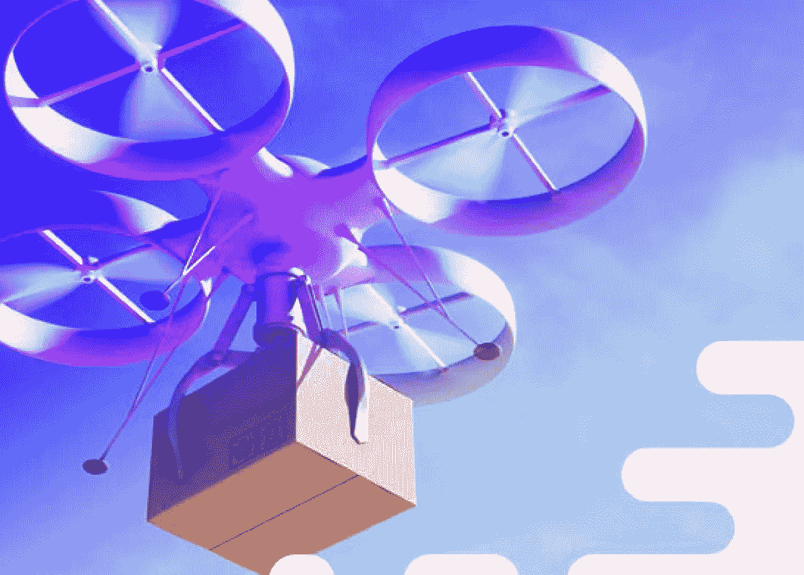

# 无人驾驶飞机的通航空域:私有产权和管制空域

> 原文：<https://medium.com/hackernoon/navigable-airspace-for-drones-private-property-rights-and-regulated-airspace-12d18c34fb1c>

## 商业无人机运营的未来需要一种法律和技术机制，能够快速促进私人财产上空的低空飞行

在 1946 年具有里程碑意义的"美国诉考斯比，328 U.S. 256 (1946) 一案中，最高法院就私有财产所有人在多大程度上实际拥有并可以控制其财产上的空域发布了基本指导意见。

在 ***考斯比*** 一个农民住在一个机场附近，美国军用飞机在他的地产上空低空进出。虽然对农民财产的干涉造成了直接和间接的经济损失，但法院通过在他们财产上空低空飞行解决了财产入侵、非法侵入和占领的重大问题。法院指出，土地所有者对周围大气的直接延伸范围拥有“专属控制权”，并且“土地所有者至少拥有他们所能占有或使用的与土地相关的尽可能多的地面以上空间”法院将进一步澄清，一个人不需要以建筑物或结构的形式实际占据空气空间，才能真正拥有土地或与土地有联系。

关于技术创新和法律的融合，法院在大约 70 年前用当时还没有明确构想出来的方言指出**在私有财产上非自愿建造低空无人机高速公路将构成对私有财产的不合理占有:**

> 我们毫不怀疑，如果美国在被告的土地上修建一条高架铁路，其高度正好与美国飞机现在飞行的高度相同，这将是一种部分征用，尽管该结构的任何支撑都不在土地上。

正如法院将继续阐明的那样，强制低空进入和使用私人财产上方的空域将是一种征用形式(即，在没有公正补偿的情况下，低空飞行是对私人财产的实际侵犯，违反了第五修正案的正当程序征用条款)，这将减少对个人财产的享有、使用和控制。

> 原因是会有一种如此直接的侵入，以至于剥夺了所有者对财产的充分享受，并限制了他对财产的利用。虽然所有人并没有以任何实际方式占据该层空气空间，也没有以传统意义上的方式使用该层空气空间，但他确实以与建筑物之间为采光和通风而留出的空间相同的方式使用该层空气空间。在这种低高度上的超邻近空域如此靠近陆地，以至于对它的连续入侵影响了陆地表面本身的使用。我们认为，土地所有者，作为其所有权的一个附带事件，对它有一个要求，对它的入侵与对地表的入侵属于同一范畴。

> 我们认为土地所有者，作为他所有权的一个附带事件，对它有一个要求，对它的入侵和对地表的入侵是同一个范畴

# **私有财产的土地使用和监管征收**

在重新处理空域所有权和控制权的具体问题时，法院在*格里戈斯诉阿勒格尼县* (1962) 一案中认为，该县在未经同意或公正补偿的情况下指挥低空飞行通过申请人的财产，其行为相当于征用航空地役权，为此，该县必须根据第五修正案的征用条款对财产所有人进行补偿，这符合各州通过第十四修正案做出的规定。

虽然当代的土地使用、监管判例和征用法实际上是广泛的，如果不是堂吉诃德式的，有时甚至是矛盾的，但[【I】](#_edn1)*caus by*服务于一个独特的目的，确立了空气空间和私有财产利益之间的基本联系。关于这一主题的更全面的论述和广泛的概述见脚注，在*制造法律和香肠:对*宾夕法尼亚中央运输公司诉纽约市的四分之一世纪回顾。[【二】](#_edn2)

**因此，立法或法规何时构成征用私人财产的问题是一个形式(即*对财产的实际*占有、侵占或挪用，或*管制性征用，剥夺所有者对土地的经济使用、享有和利益)和财产干预程度的问题。***

# **实物和监管收入**

在 *Lingle 诉 Chevron*(2005)*一案中，最高法院将征用判例概括为*政府直接征用*或*对私有财产的实际侵犯*，两者都要求公正的补偿。此外，法院指出，如果剥夺了所有者所有的经济上有益的用途，即使没有实际占有或侵占私有财产，监管性征收也会发生。[【iv】](#_edn4)在证明所有者被剥夺“所有”经济用途可能看起来是不必要的负担的同时，它涉及财产所有权的非占有形式(即采矿权利益或地役权持有人)。*

**Lingle* 考虑了法院之前在*太浩-塞拉保护委员会有限公司诉太浩地区规划局* (2002 年)一案中的调查结果:*

*第五修正案的文本本身为区分实物征收和监管征收提供了基础。《宪法》明确规定，每当政府出于公共目的征用私人财产时，无论是征用还是实际占有，都必须支付赔偿。但是宪法并没有提到禁止财产所有者使用其私有财产的相关规定。[【v】](#_edn5)*

*因此， *Tahoe-Sierra* 和 *Lingle* 对*实物征收*和*监管征收*进行了区分，它们影响经济使用，即使不是通过实物占有、入侵或侵占。*

# ***新的 FAA 无人机法规未能解决商业应用所必需的基本问题***

*2016 年联邦航空管理局扩展、安全和安保法案(“FAA 重新授权”)于 2016 年 7 月 15 日生效。[【VI】](#_edn6)FAA 重新授权专门在不少于五个章节中阐述了无人驾驶航空系统(“UAS”或“无人机”)的问题。此外，美国联邦航空局重新授权之前，美国联邦航空局于 2016 年 6 月发布了备受期待的关于商业无人机运营的第 107 部分。然而，第 107 部分既没有促进也没有创造许多新的商业无人机机会，主要是为了承认有用技术的存在及其未来应用。功能抑制性，**第 107 部分仍然禁止实际商业无人机应用所必需的最基本的技术能力，特别是以下要素(1-7):***

> ***1。超出操作者的视觉视线***
> 
> ***2。高于地面 400 英尺，除非在建筑物的 400 英尺范围内***
> 
> ***3。不参与操作 UAS 的人的直接操作***
> 
> ***4。单个人操作多台 UAS***
> 
> ***5。在夜间***
> 
> ***6。超过 55 磅的飞机，包括有效载荷***
> 
> ***7。在能见度小于三英里的天气条件下运行***

*虽然第 107 部分未能解决某些现有的和中期发展的技术能力，如自主或半自动无人机飞行，但它确实为无人机运营提供了请求 FAA 批准放弃上述限制的某些要素的可能性。*

# ***视线限制***

*新法规对商业无人机操作设置了 ***视线***(**LOS**”)限制，排除了完全基于 GPS 的自主无人机操作，这意味着无人机操作员必须与他们的无人机保持视觉联系。然而，尽管独家 ***第一人称视角***(“**FPV**”)操作，其中操作者基于第一人称视角的视频反馈控制飞行，并且禁止无人机定向，与基于直接视觉视线的无人机操作相反，第 107 部分允许第一人称视角操作的广泛豁免，如果“查看和避免”安全要求“以其他方式”得到满足“看到并避免”的语言，结合豁免的模糊“其他方式”元素，可能会解决无人机对空交通管制通信、交通碰撞和避障系统的持续发展。*

*然而，对于商业无人机应用，特别是包裹递送服务，可能需要比当前 FPV 豁免和对 LOS 要求的修改更大的自主程度，以允许在某种程度上自主飞行*【超视距】( **BVLOS** 】)，这是促进更大范围和规模的无人机服务操作所必需的。**

**值得联邦航空局称赞的是，它不仅意识到了当前监管框架下的实际限制，而且启动了一些程序来分析*(**EVLOS**)操作、现有技术的可靠性以及潜在安全问题的缓解。这些评估计划包括但不限于探路者计划、与美国宇航局无人驾驶飞机系统的协调(" **UAS"** )、交通管理(" **UTM** )、全国运动[【VIII】](#_edn8)，以及与各种数字平台合作创建 ***低空授权和通知能力*** (" **LAANC** )，以简化*控制的*空域中的豁免授权。[【IX】](#_edn9)***

# ****美国联邦航空局法规对私人财产上空的低空飞行问题保持沉默****

**FAA 对正在进行的技术变革和商业无人机服务对经济的潜在好处的接受度，以及它与 NASA 和私人技术供应商协调机构间政府计划的意愿确实是最有希望的。**

> ****然而，** **除非美国联邦航空局(FAA)预计无人机只能在公共财产上空或受控空域(即更高的高度)内运行，除了征用权行动之外，有必要建立一种技术和法律机制，以迅速实现和促进财产所有者对私人财产上空低空飞行的同意。****

**我们提出了一种**机制，这两种机制都激励财产所有者(即*主机*)的参与，同时提供不受限制的潜力，为商业无人机服务提供商创建动态飞行路径(即，与静态飞行路线相反)和在私人财产上空低空飞行而不侵入的能力，而不是追求不必要的公共政策问题和可能的诉讼。****

***通过授予可撤销的低空航行地役权来促进大范围通行权的机制，对于成功扩展商业无人机服务来说，即使不是最关键的部分，也是必不可少的。***

*虽然 FAA 对美国所有空域拥有主权监管权，但它不能在未经同意的情况下强迫(即强制)低空进入私有财产，除非采取征用或谴责行动，这需要司法参与和公正的补偿，因为这将构成一种征用形式。[【x】](#_edn10)此外，如 FAA 所述，空中交通管制没有权力或责任控制 G 类空域的空中交通，G 类空域从地面(即地面)延伸至上覆 E 类空域的基地。[【Xi】](#_edn11)*

*因此，如果没有一个有效的机制来支持和激励财产所有者向无人机服务提供商授予低空通行权，商业无人机服务就没有切实可行的方法来绘制动态飞行路线，并在低空运行而不侵入**。***

# ***航行地役权***

*地役权是一种法律上可强制执行的机制，使财产所有者以外的其他人能够使用财产。地役权通常授予公用事业和政府机构，用于有益于公共利益的用途(如铁路轨道和公共街道)。地役权可以是临时的，也可以是永久的(即“与土地同在”)。因此，永久地役权在未来财产所有权转让给任何后续财产所有人时仍可强制执行。*

*私有财产的补偿和使用权通常由财产所有者和寻求地役权的实体在个案基础上进行谈判。然而，当公共机构有权寻求地役权，但无法就补偿和财产使用条款进行谈判时，它们可能试图通过称为征用的法律程序通过征用权获得地役权。*

*机场经常获得机场和机场开发项目周围空域的飞行地役权，因为低空飞行、起飞和降落可能包括入侵、侵犯和占用私有财产，因此构成对财产所有者使用和享有其财产的征用和/或干涉。*

*[AERO Foundation](https://aerotoken.com) 提议使用统一的可撤销航行地役权，这将为财产所有者(即*主机*)提供一种机制，以授予 AERO 网络内任何合格的无人机服务提供商的访问权。这种对等的区块链工具是一种可撤销的临时协议，使注册和合格的无人机服务提供商能够根据导航地役权和航空基金会规定的条款进入东道国的低空空域。*

*本文摘自 *AERO Token 白皮书*的第 2 部分，作者[蔡斯·帕金斯](https://twitter.com/ChaseTheTruth)，埃里克·罗布尔和海莉·哈尔平。(2017)【aerotoken.com】见白皮书原文。*

*[**AERO Token**](https://aerotoken.com) 是一种基于以太坊的区块链技术，使财产所有者(即主机)能够向授权的无人机服务提供商授予临时通行权地役权，以换取收入。*

**

***脚注:***

**见*，吉迪恩·坎纳，*制定法律和香肠:对*宾州中央运输公司诉纽约市的四分之一世纪回顾，13 WM。玛丽比尔 RTS。J. 679，681 (2005 年)。坎纳指出:“宾大中央”缺乏理论上的明确性，因为它断然拒绝制定管理性诉讼的要素，也因为它在知识上轻率地通过征用权法律，很少注意预先存在的法律学说。其后果已成为专业律师的经济天堂，司法机构的负担，以及潜在房屋建筑商的间接障碍，以及潜在购房者和整个社会的经济灾难。*

**同上。**

*卢卡斯诉南卡罗来纳州海岸委员会，美国最高法院判例汇编第 505 卷第 1003、1019 页(1992 年)*

*[【ⅳ】](#_ednref4)*同上。**

*[【v】](#_ednref5)*参见*塔霍-塞拉普雷斯。理事会有限公司诉太浩地区规划局，美国最高法院判例汇编第 535 卷，第 302 页，第 321-22 页(2002 年)*

*[【VI】](#_ednref6)[https://www . congress . gov/114/BILLS/HR 636/BILLS-114 HR 636 ENR . pdf](https://www.congress.gov/114/bills/hr636/BILLS-114hr636enr.pdf)*

*[【VII】](#_ednref7)[https://www.faa.gov/uas/media/Part_107_Summary.pdf](https://www.faa.gov/uas/media/Part_107_Summary.pdf)*

*[【VIII】](#_ednref8)[https://www . NASA . gov/aero/NASA-completes-最新-无人机-交通-管理-飞行-竞选](https://www.nasa.gov/aero/nasa-completes-latest-drone-traffic-management-flight-campaign)*

*[【IX】](#_ednref9)【https://faaco.faa.gov/index.cfm/attachment/download/75780】T2*

*【x】[【https://www.law.cornell.edu/supremecourt/text/328/256】](https://www.law.cornell.edu/supremecourt/text/328/256)*

*[【Xi】](#_ednref11)[https://www . FAA . gov/regulations _ policies/handbooks _ manuals/aviation/phak/media/17 _ phak _ ch15 . pdf](https://www.faa.gov/regulations_policies/handbooks_manuals/aviation/phak/media/17_phak_ch15.pdf)*