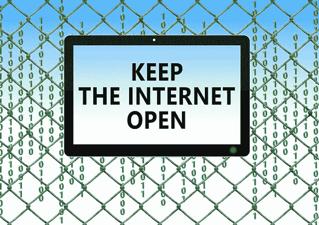
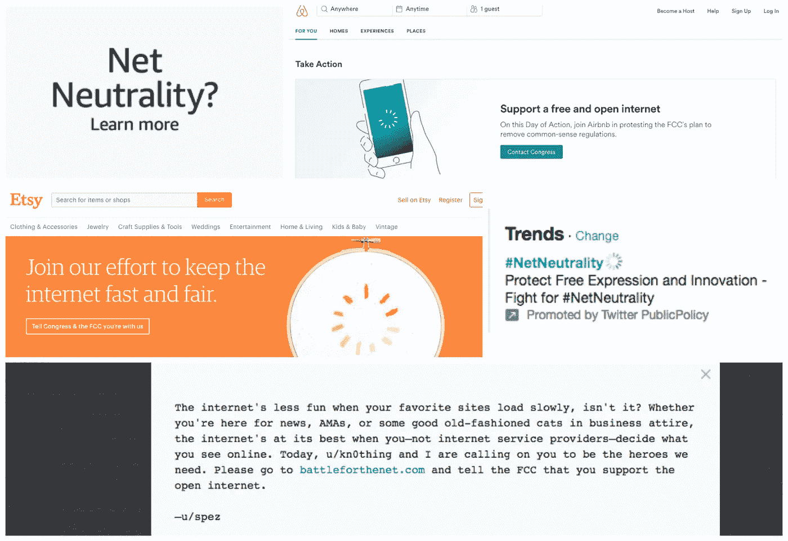

# 网络中立性及其重要性

> 原文：<https://medium.com/hackernoon/net-neutrality-and-why-it-matters-e7e107acbfee>

你注意到本周在你最喜欢的网站上关于网络中立的信息、广告和行动呼吁了吗？我们做到了。我们一直在密切关注这个问题。[7 月 12 日星期三是“网络中立行动日”，](https://www.battleforthenet.com/july12/)该活动旨在提高意识，鼓励消费者反击联邦通信委员会(FCC)收回网络中立的愿望。

许多互联网最大的公司和众多活动家组织发布消息并呼吁采取行动，签署请愿书并联系 FCC，以保持互联网对所有用户的开放和平等访问(也称为保持网络中立)。

Amazon, Airbnb, Etsy, Twitter, and Reddit were many companies across the Web participating in A Day for Action.

“拯救互联网”是号召。但是互联网需要拯救吗？网络中立(或缺乏中立)意味着什么？这里有一个什么是网络中立和摆脱它可能意味着什么的分解。

# 什么是网络中立？

有时也被称为“开放互联网”，网络中立是指互联网是一种公用事业，每个人都有权开放和不受约束地访问它。实际上，这意味着互联网服务提供商(ISP)必须向客户提供平等的互联网接入。例如，他们不能为更多的钱提供完全不同的、更好的或更快的互联网连接。提供更快的高级互联网套餐的一个后果可能是，有钱的大公司可以支付更好的互联网服务，并有效地将较小的竞争对手拒之门外，如果他们没有购买更昂贵的高级互联网套餐，他们的网站可能会加载更慢。搜索结果、客户服务和基于云的服务可能会受到此类做法的影响，然后公司不再有公平的竞争环境。

2014 年，FCC 主席 Tom Wheeler 赢得了根据 1934 年《通信法》第二章对 ISP 重新分类的战斗，该法案赋予 FCC 监管 ISP 的权力。强有力的网络中立法律随之出台。这些规则限制了一些实践，比如付费优先和节流。(“节流”是指审查、阻止或故意减慢某些网站或内容的速度。例如，假设网飞支付了高级互联网连接费用，而吉尔的电影网站没有，因为她是一家初创公司，还负担不起。如果两个彼此靠近并共享带宽的家庭试图同时从每个服务下载电影，网飞的客户将获得优先权，吉尔的电影站点数据将被节流以给网飞的客户腾出更多带宽。)

2016 年，美国宽带行业起诉推翻 FCC 的网络中立法律，败诉。在裁决后不久发表的一份声明中，FCC 主席汤姆·惠勒说:“今天的裁决是消费者和创新者的胜利，他们有权不受约束地访问整个网络，它确保了互联网仍然是一个无与伦比的创新、自由表达和经济增长的平台。”

# 有什么大惊小怪的？

取消网络中立有可能将大量的权力和控制权交给少数大公司和互联网服务提供商。这意味着 ISP 可以做一些事情，例如:

*   与大公司达成交易，让他们的数据或内容优先于竞争对手的数据。
*   抑制那些不付给他们更多钱或者不是他们客户的公司的数据。
*   向消费者收取更多费用以获得更快的网速，并降低不付费用户的网速。
*   阻止手机上的应用和服务。
*   优先考虑他们自己的服务。
*   减慢某些网站的访问速度。
*   审查或阻止某些内容。

网络中立的反对者称，FCC 的限制扼杀了创新，阻碍了对电信基础设施的投资。他们说，允许互联网服务提供商提供优质服务并获得额外收入，将鼓励提供商拿这笔钱投资更多的基础设施和其他创新改进。

这种观点的问题在于:ISP 市场的竞争并不激烈。他们几乎没有动力投资改善或提供更好的服务。想想你在你的城市有哪些选择。你很可能有一两个互联网服务选项，对不对？你并不孤单。

据 The Verge 报道， [51%的美国人只有一种选择，38%的美国人只有两种选择](https://www.theverge.com/2017/7/12/15715030/what-is-net-neutrality-fcc-ajit-pai-bill-rules-repealed)。这算不上竞争。这绝对不是为了提供更好的服务或降低成本而在 ISP 下面点火。与其他国家相比，美国在成本上把 T4 排在第 13 位。然而，美国甚至没有进入平均网速的前十名。

那么我们有什么？竞争很少，对消费者改善服务或降低成本的激励很少，基本上对消费者(包括企业)进行勒索的激励非常高。如果你不喜欢它，它不像有许多其他供应商可以使用。他们有你。

# 网络中立:对竞争是好是坏？

上网和互联网是有区别的。ISP 不是互联网。它们只是提供互联网接入。可以说，他们是看门人。摆在我们面前的问题是，这些看门人应该有多大的控制权？摆脱网络中立将意味着互联网面临被 ISP 网守监管和控制的风险。如果没有网络中立，我们有什么保证让互联网保持开放，不受大公司的影响和控制？互联网服务提供商将有权让网飞这样的公司付费，以确保他们的服务以更快的速度流动，或者他们的内容优先于那些无法支付“互联网快车道”费用的小公司网络中立的存在是为了保护那些可能会被超支和挤压的小公司。

[Twitter 的公共政策经理劳伦·库尔特森(Lauren Culbertson)最近在公司博客上写道](https://blog.twitter.com/official/en_us/topics/company/2017/Join-the-Fight-for-NetNeutrality.html)“网络中立是竞争、自由企业、企业家进入市场的基础，也是接触全球客户的基础。你不必成为一个大人物来竞争。任何人只要有好的想法、独特的视角和令人信服的愿景，都可以加入这个游戏。”

博客继续解释说，如果没有网络中立，像 Twitter 这样的公司可能不会出现，因为创业公司很少有资本在网上“付费玩”。想想看，如果网飞在 2014 年受到遏制，当时 FCC 威胁要允许 ISP 向服务提供商提供更快的选择。网飞会繁荣吗？现在想想其他的创业公司，由于互联网的开放性，他们变得成功并颠覆了他们的行业。

[The Verge 说得好](https://www.theverge.com/2017/7/12/15715030/what-is-net-neutrality-fcc-ajit-pai-bill-rules-repealed):“…一旦你建立了一个经济，在这个经济中，巨头们正在达成交易以取得领先，小公司破坏它们的能力就会迅速消失。如果每家新公司都必须付费才能参与，你就是在从创新中吸走资金，然后用它们来充实 ISP 的腰包。”

# 你能做什么

你认为摆脱网络中立会对你的企业、你的行业以及整个竞争产生什么影响？如果你想知道更多，这里有一些参考资料。

[拯救开放的互联网](https://netneutrality.internetassociation.org/action/)
[如何写出有影响力的网络中立评论](http://mashable.com/2017/06/15/how-to-write-a-good-fcc-comment/#cXMDJZbPTiqg)