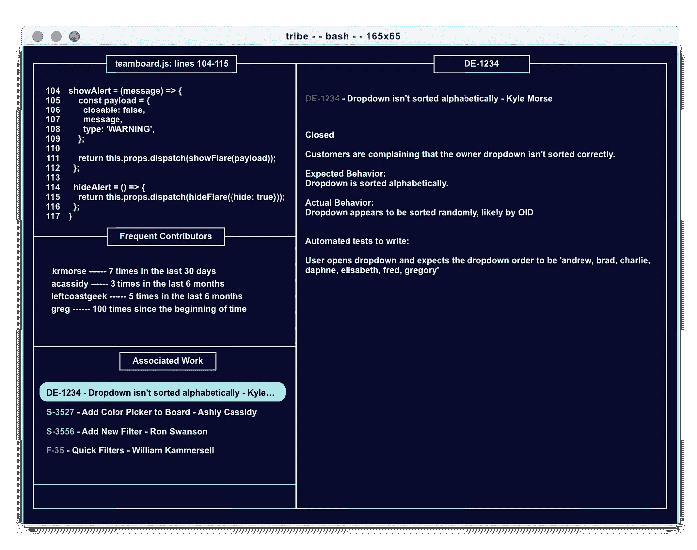

# 新的 CLI 来找出@*$%代码存在的原因！

> 原文：<https://medium.com/hackernoon/new-cli-to-find-out-why-the-that-code-exists-6591cf406be3>

你是否曾经说过(或大喊过)“为什么@*$%的代码会存在？”很有可能，你有。在开发人员的职业生涯中，很多时候他们会遇到毫无意义的代码。是什么决定导致了这段代码出现在这里？谁决定这是解决问题的正确方法？为什么，为什么，为什么？

有很多方法可以获得特定代码行的更多信息。你可以很容易地运行 [gi](https://hackernoon.com/tagged/git) t 责备，它可以向你显示最后一个接触代码的人和他们的提交消息。您可以运行 git history 或 git log 来进一步追溯文件或代码段的历史。你甚至可以在你的首选项目[管理](https://hackernoon.com/tagged/management)系统中对多年的历史数据进行分类，以期收集当时正在发生的事情的信息。这些选项中的许多都需要时间，开发人员也很忙(而且有点懒)。所以，我引入了*部落*，一个新的命令行界面来帮助你更好地理解为什么@*$%ing 代码会存在。

*Tribe* 让您可以快速访问 git 历史中所有相关的工作项和问题。您已经将您的工作直接绑定到您的提交，以便在部署过程中更加容易。现在，我们让你更容易理解你当前工作的历史背景。

部落怪-L <start line="">，<end line="">，<filename></filename></end></start>

通过这个简单的命令，您可以从吉拉或 Agile Central 解锁 git 和工作历史。查看谁经常提交这个文件，最后十次提交这个文件或部分，以及当时交付的值。围绕这项工作的文档是存在的，但隐藏在多年的腐败之下，极难浏览和筛选。我们把它带到表面。

See important information about historical work items right from the terminal.

*部落*是第一个增量，我们很乐意做得更好。点击这里查看 github 源代码[，并给我们一些反馈，告诉我们你认为哪些有价值，哪些没有价值。我们知道您还有其他我们没有想到的使用案例，我们很想了解一下。也许有一些你渴望快速获取的信息。如果您有一些想法，请提交拉动请求。](https://github.com/HeySquirrel/tribe)

我们的愿景是构建一个代码库地图，帮助您和所有开发人员理解每行代码背后的原因。在这个旅程中帮助我们！

感谢阅读。如果您喜欢这篇文章，请点击并按住👏说“谢谢！”并帮助他人找到这篇文章。