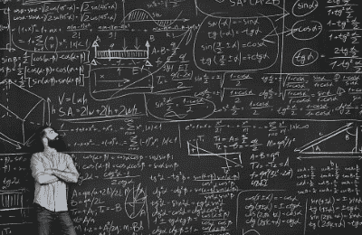
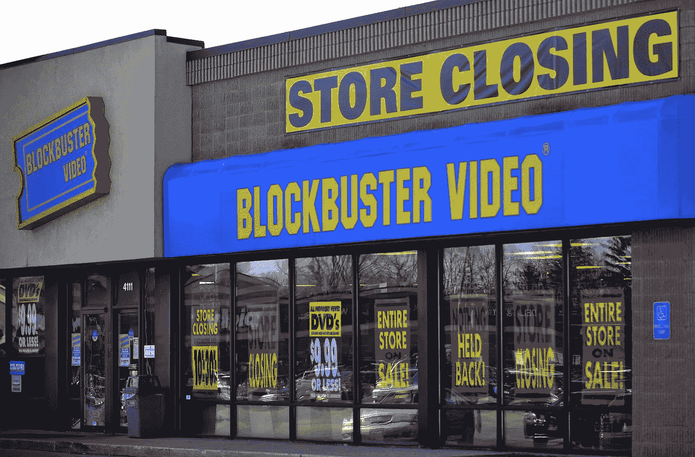
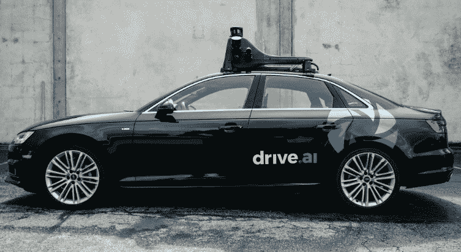

# 新平台、人工智能和组织进化

> 原文：<https://medium.com/hackernoon/new-platforms-ai-evolving-the-organization-79797e4b472c>

杰森·科斯塔

人工智能和深度学习将成为根本的游戏规则改变者，类似于过去十年随着“移动”和“云”成为主要类别推动者而迎来的创新浪潮。

当我们回想互联网的出现时，公司需要一种不同的 DNA 来建立一个新平台时代的大规模组织。换句话说，仅仅拥有一个线下购物中心，拥有像西尔斯或梅西百货这样的实体店，并给他们一个网站是不够的——这并不等同于一个电子商务互联网公司。在接下来的 20 年里，一个拥有不同思维方式的全新组织建立了亚马逊，并彻底改变了电子商务格局。

# **砖头&砂浆+网站！=互联网公司**

其中很大一部分是因为有太多的新角色、方法和流程需要开发新的技能，而旧的守卫者不能或不愿意这样做。这包括以前不存在的过程，例如 A/B 测试和快速实验。

刚刚进入互联网的公司从未见过如此规模的 A/B 测试和实验。这让位于对数据工程师的不断增长的需求，他们需要为现有系统配备可扩展的框架来例行部署实验，并需要大量数据科学家来解释每天(如果不是每小时)出现的所述实验的结果。网络时代的数据科学是一个相当新的独特的角色，以前从未真正以这种规模存在过。

此外，产品开发周期时间突然发生了变化。网络使得公司可以随时部署新产品。西尔斯每季度出版一次目录；亚马逊可以每天(或每小时)发布一个新的“目录”。这对于软件和作为平台的互联网的本质来说是全新的，需要不同类型的准备和计划来充分利用。一旦团队能够协调起来，并且处于发布训练的节奏上，他们就能够以极快的速度与用户一起升级或修复系统。这也允许高度压缩的产品反馈循环，允许团队比以前更快地改进他们的产品。

新的组织 DNA 包括创建一个“产品经理”的角色，以及提升工程的权力。不再是工程被降级到黑暗角落的角色，接受销售和营销的行军命令。

突然之间，工程师被誉为英雄，他们在产品开发周期中创造并拥有主要话语权(理应如此)。产品经理的到来催生了一些既懂技术又有敏锐商业嗅觉的人——他们同样擅长与工程同行交谈，或与设计讨论用户界面需求，与销售和营销人员谈论客户表达的需求。最重要的是——他们能够穿透所有的外部和内部噪音，将产品送到用户手中。

# **互联网公司+深度学习！=艾公司**

就像一家实体公司不能仅仅部署一个网站，然后突然变成一家电子商务公司一样，传统互联网公司建立一系列神经网络，然后变成一家“人工智能公司”是不够的。即将到来的平台向人工智能的转变将需要新的组织、角色和方法。这将在涉及机器人的领域尤为明显:无人驾驶汽车、工业自动化(工厂、仓库等的机器人)。)、自动化最后一公里配送等等。

# *数据网络效应*

突然间，数据将比互联网时代更加重要。在人工智能时代，战略性数据获取将是绝对重要的。输入训练框架以生成学习模型的极其庞大、差异化的数据集将成为新人工智能公司的一个主要竞争优势。许多公司可能会使用硬件来收集这些数据。他们可以销售硬件作为亏本产品，以打入特定市场(家庭、汽车、办公室等)。).硬件的存在将给这些公司带来*数据网络效应*，这意味着随着时间的推移，这些公司将在各自领域的其他竞争者中获得复合竞争优势。一家特定公司在某个垂直行业获得的数据越多，他们的模型和自动化决策就越好。最后，它需要是“好的”、“干净的”数据；不是垃圾进，是垃圾出。更好的产品导致更好的使用，这反过来提供了更多的数据，因此具有数据生命周期的优势。

# *决策自动化*

决策自动化也将变得至关重要。这里，我指的是机器在不需要人类参与的情况下做出决定的能力。一个公司的产品越快能够自主决策，他们就越有竞争优势。例如，在最后一英里送货机器人的情况下，人类需要多久对机器人执行一次远程操作？如果当机器过马路或必须避开人行道上的障碍物时，人类不必远程干预，公司将会看到更大的规模经济。

然后，问题变成了这样一个机器人的生产者多快能达到 75%的自主性，甚至 90%的自主性——当他们遇到需要某种人类干预的边缘情况时，有一个遥控操作者管理这些机器人的车队。工厂和仓库也是如此，这些机器人需要达到尽可能高的自动化决策水平。

# *新产品团队*

在这些下一代组织中也可能会有过多的扩展角色。产品管理会改变，工程也会改变。在互联网和移动时代的进程中，这些领域的大多数公司都选择将注意力从硬件转移开。相反，出现了现代产品组织三巨头:产品、设计和工程。随着自动驾驶汽车、工业自动化和机器人、智能家居等等的出现，将会需要机械和电气工程师、工业工程师，甚至可能还需要物理学家和数学家。当然，将会需要更多的数据科学家，而数据科学本身可能会成为一门手艺，Hack Reactor 等学校会培养一批数据科学家，将 TensorFlow 等行业标准工具应用于特定数据集。开发新建模策略的博士们可能会变得更像建筑建筑师，被外包出去提供蓝图，但可能永远不会踏上建筑工地。

# *PM 的角色*

产品经理的角色也将发生巨大的变化，我怀疑将被分为两个角色。一方面，对于一组面向客户的产品经理来说，可能会更加强调项目管理和产品营销。这些项目经理将不断与客户沟通，更积极地监控时间表，并从市场获得反馈。他们还将在走向市场的叙事方面与营销部门密切合作，专注于让机器人和人工智能服务对用户和企业友好。

另一方面，将会有高度技术性的项目经理与工程密切合作(甚至可能向工程汇报)。在人工智能和深度学习的背景下，这些项目经理需要了解现在什么是可能的，然后计划他们需要收集什么数据，以便在 2 年、5 年等时间里让更多事情成为可能。这意味着它不仅仅是构建一个功能路线图；它还需要一个数据路线图。此外，这不仅仅是获取任何数据并对其进行处理的问题——产品需要从一开始就考虑数据收集。项目经理需要找出哪些信号是重要的，然后构建产品来收集提供这些信号的最佳数据集。

# **结论**

虽然人工智能的发展和更深入地渗透市场还需要时间，但我相信深度学习将成为我们日常生活中无处不在的一部分——从我们如何去工作和我们在办公室的生产力，到我们如何获得食物和与我们的家庭生活空间互动。组织将有无限的机会利用这一点，但也有许多陷阱要避免(见[大片](https://en.wikipedia.org/wiki/Blockbuster_LLC))。如果互联网浪潮是某种迹象的话，那么在下一场游戏中会有许多赢家和输家。对于现有的参与者来说，他们的成功将在很大程度上取决于一个特定的公司如何从我们过去的互联网经验中吸取教训，进化他们的 DNA 并驾驭新的平台浪潮。下一个十年将会是惊人的。

*杰森·柯斯达目前是 GGV 资本投资公司的 EIR。这篇文章是正在进行的系列文章的一部分，旨在探索消费产品开发、平台分析和策略等主题。*