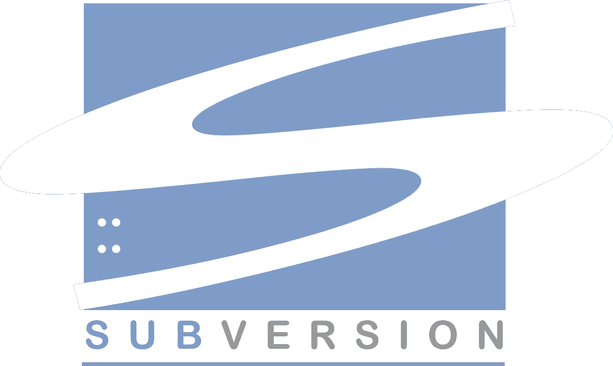

# 下一代颠覆——揭开面纱

> 原文：<https://medium.com/hackernoon/next-generation-subversion-unveiled-7c61e8b71797>

上周，Subversion 团队发布了一个次要版本，通过 1.9.6 解决了安全性和性能问题。这极大地增强了用户群对 Subversion 的信心，因为他们期待未来继续致力于在 Subversion 上构建任务关键型企业项目。

我认为——社区在 Subversion 项目中继续展现势头和增加创新是至关重要的——世界上一些最大的企业依靠它来对其最有价值和最关键的数据进行版本控制，因此技术的持续创新确保这些数据将在未来几年内保持在 Subversion 上。

也就是说，今天真正令人兴奋的是 Subversion 项目的未来。今天，作为 Subversion 社区正在进行的创新的一部分，它的开发者之一 [Julian Foad](https://www.linkedin.com/in/julianfoad/) 刚刚透露了他几周以来一直在做的事情——一个解决困扰 Subversion 用户十多年的长期问题之一的计划。**不用服务器在本地工作。**

分布式版本控制(DVCS)技术使开发人员能够利用快速工作流，他们能够在本地*分支*和本地*存储*正在进行的工作，而无需与服务器对话。这已经被广泛认为是一个巨大的生产力和多任务的好处。

现在，Subversion 将获得自己的生产力和现代化的工作流程，其设计提案为*“搁置和检查点”*，正如 Julian [在此](https://lists.apache.org/thread.html/4fe683f50f4528e3b6e4a66ceffedc673622e82a5f3587083c77384a@%3Cdev.subversion.apache.org%3E)披露的，详细的[设计](https://hackernoon.com/tagged/design)在那封电子邮件的页脚以 [google](https://hackernoon.com/tagged/google) doc 格式显示。

*“Subversion 是数百万人的首选系统，这些开发将给 Subversion 用户带来 git 已经普及的本地操作的速度优势。”* **—朱利安·福阿德(SVN 委员，SVN 装配工程师)**

这个新设计可能会促使在 [1.10](https://subversion.apache.org/docs/release-notes/1.10.html) (处于测试阶段)之后发布 **1.11** 。总的来说，我为 Subversion 的用户感到非常兴奋，我们在 [Assembla](http://www.assembla.com/home?referrer=jacek.medium) 很高兴能够帮助 Subversion 向前迈进*下一代*。当该版本上市时，世界各地的企业将能够利用其开发人员基础上的生产力的非线性增长。

*“安培拉的云互联颠覆平台愿景鼓舞人心。我很高兴能与安培拉和开源社区合作，推出这些期待已久的功能。”* **—朱利安·福阿德**

此外，这使得 Subversion 在其他战略领域继续创新 1.11 版本。

我真心希望这能激励新用户和开发者进入 Subversion 社区，他们对推动创新并最终增加“维护者列表”的规模感兴趣。

*“与安培拉合作开发下一代 Subversion 正在 Subversion 项目中创造新的激情。”* **—朱利安·福阿德**

这个社区需要有才华、有动力的人，他们想把 Subversion 做得越来越好。要加入，只需跳转到[邮件列表](https://svn.apache.org/repos/asf/subversion/site/publish/mailing-lists.html)并开始！

继续关注我的更多更新，或者上 [Twitter](https://twitter.com/jacekmaterna) 了解 1.11 的最新进展。

SVN 快乐！