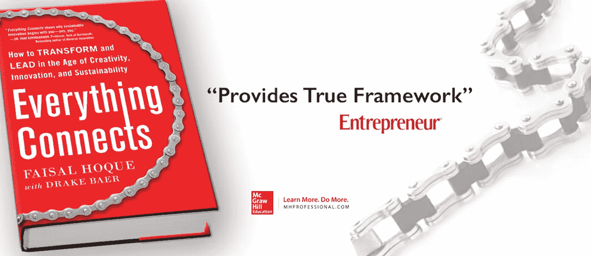

# 没有人能在孤岛上成功

> 原文：<https://medium.com/hackernoon/nobody-succeeds-in-a-silo-1db5f4f16dd2>

[Photo: Thomas Barwick/Getty Images]

专业知识本身不会走得很远。为什么最成功的人是伟大的合作者的四个原因。

从小到大拥有过蚂蚁农场吗？如果你看过——或者你在电视上看过任何自然特辑——你就会知道一个蚁群专注的专业化是一个值得一看的景象。如果没有自然界中几乎无处不在的协作力量，我们自己的进化道路将会非常不同。

不过，你的办公室可能就是另一回事了。虽然协作工具和工作空间仍然十分流行，但批评者的声音也很大，他们认为过多的互联[比其他任何东西都更容易分散注意力。当涉及到某些种类的*任务*时，这经常是真的。但是我们工作的*成果*，更广泛地说，更多时候受益于团队努力。](https://www.fastcompany.com/3057730/slacklash-group-messaging-apps-are-stressing-some-people-out)

当涉及到技术、产品开发或我们拥有的任何一项技能时，我们有多聪明或悟性并不重要。没有人能在筒仓里长期成功。无论我们从事何种事业——个人的、职业的、慈善的、政治的或私人的——我们都不能忘记所有参与其中并对我们的成功至关重要的人。

这是非常成功的人知道并内化的东西。当我们集思广益时，我们可以简单地学习更多，更好地应用新的见解。根据 Piirus 进行的一项调查，令人震惊的是，91%的学术研究人员认为合作增加了研究影响，94%的人对跨学科合作感兴趣。那些成功的人从他们的错误和他们周围的人那里学习。更重要的是，他们不会忘记，不可能预测他们可能会激励或影响谁，或者谁最终会激励他们——今天的陌生人可能是明天的合作伙伴。以下是为什么最成功的人都是顶尖的合作者的四个原因。

# 有关系的

*   [真正颠覆性领导者的 5 个习惯](https://www.fastcompany.com/3052725/hit-the-ground-running/5-habits-of-truly-disruptive-leaders)
*   [激励型领导者的三个习惯](https://www.fastcompany.com/3052188/know-it-all/three-habits-of-motivational-leaders)
*   [放慢工作速度的五种方法可以提高你的工作效率](https://www.fastcompany.com/3057853/how-to-be-a-success-at-everything/five-ways-working-more-slowly-can-boost-your-productivity)

## 1.成长来自分享

当决策和风险由一群为同一目标奋斗的人共同承担时，通常更容易更快地实现最佳结果。当我们与他人分享我们的努力和知识时，我们创建了一个社区，这个社区可以聚集在一个好主意周围，并在一个坏主意变坏之前冲进去质疑它。

当然，任何人类学家、社会学家、历史学家或教师都会告诉你，群体有时会一起做出可怕的决定。但是，只要他们的文化在精神上是强大和民主的，个人之间的相互联系通常有助于将想法暴露给分析和批评。否则我们不会遇到的观点会出现并交叉传播。增长变成集体的，而不是封闭的。

## 2.我们可以发现意想不到的排列

正如哲学家大卫·休谟(David Hume)的名言:“今天你的玉米成熟了；我的明天也会如此。今天我和你一起劳动，明天你来帮助我，这对我们双方都有好处。"

尽管情况不同，我们仍然可以找到相互的一致。在许多协作的情况下，我们倾向于为了群体的利益扮演一个特殊的角色——想想那个蚁群。这个团体的繁荣正是因为每个人都不做完全相同的事情，尽管如此。它只是组织每个人的独特贡献，确保一个人的努力与另一个人的努力相辅相成。

非常成功的人了解成为专家的潜力和限制；他们知道，通过相互合作——以及交换专业知识——我们可以超越我们各个部分的总和。

## 3.灵活性需要合作

随着越来越多的人远程工作，随着外部承包商推动零工经济的发展，越来越多的重要想法来自与你不在同一个物理空间工作的人。这使得公司内部一些定义更加清晰的层级变得有些模糊。尽管这并不意味着“组织结构图”的彻底终结——或者领导力本身的衰落——但它确实意味着成功将取决于更大的灵活性。

> 为了与他人合作，我们经常需要启发和影响他们，而不仅仅是来回分享信息。

现代职场中的成功人士可以利用这些变化的一种方式是拥抱协作，例如通过灵活的[人才集群](https://www.fastcompany.com/3012598/how-talent-clusters-will-help-you-win-a-sustainable-future)。通过清晰的指挥链做出决策不再常见，为了发展壮大，我们需要适应这种情况。

## 4.合作迫使我们互相激励

为了与他人合作，我们经常需要启发和影响他们，而不仅仅是来回分享信息。激励型领导者知道如何通过让团队成员对他们一起做的工作感觉良好来创造自我价值感。那些大多独立工作的人没有这种负担，但他们可能无法分享同样的回报。

知道如何激励他人是与他们联系的关键。没有这种联系，就没有朝着共同目标的努力。人们退回到自己的小天地，专业知识无处可去——没有更广泛的目标可以服务。最成功的合作者知道如何尊重和准确地交流。关注情绪有助于更好地相互理解，尤其是当你的合作对象不直接向你汇报时——这种情况可能会变得越来越普遍。

我们做什么，在哪里做，或者我们能创造出多好的产品或提供多好的服务，都无关紧要。为了成功，我们需要有效地与我们周围的许多人建立伙伴关系。这样，当我们低着头完成一项单独的任务时，我们会确切地知道它是为了什么——并且我们在工作中并不真正孤独。

*连环企业家* [*费萨尔·霍克*](https://www.fastcompany.com/user/faisal-hoque) *是* [*沙多卡*](http://www.shadoka.com/) *的创始人，使企业家精神、成长和社会影响。他是《万物互联:如何在创造、创新和可持续发展的时代进行变革和领导》和其他书籍的作者。免费使用万物互联* [*领导力 app*](http://app.everythingconnectsthebook.com/login.php)。

***版权所有 2016 费萨尔·霍克。保留所有权利。***

