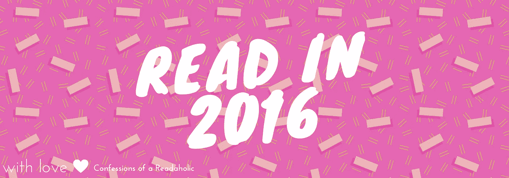

# 我在 2016 年读过的非小说类书籍

> 原文：<https://medium.com/hackernoon/nonfiction-books-i-read-in-2016-631b52d4953f>

## 从斯多葛派到马克·曼森

我已经决定为你制作一些标题为**“2016 年阅读”**的清单，这样今年管理你的 TBR 清单会有更多的麻烦*(*咧嘴*)* 。更多的标题添加到您的阅读清单。这就是所有书单的全部意图，比如今年的十大和五大书单，向你介绍你可能没有读过的书，我会尽一切努力说服你至少看看 Goodreads.com 或亚马逊的书名，并可能添加到你的愿望清单/TBR/必读清单中。

这已经成为互联网上的惯例。每年年底，我都会打开各种浏览器标签和其中的链接，这些标签和链接会引导我找到一定数量的前十名名单，然后我会尝试根据我读过的书来匹配这些名单。今年我很健康地失败了，但是我已经在我的 TBR 中增加了宇宙数量，我确信这将在我的一生中扩展。**叹息**

这个列表挑选了一些我认为值得你花时间去读的非小说类书籍，你绝对应该看看:

# 马可·奥勒留的沉思

一些实用的智慧之言来配置罗马皇帝的生活。这篇课文很旧了，但读起来很方便。马可·奥勒留是公元 161 年至 180 年间的罗马皇帝。他被认为是最重要的 [**斯多葛派哲学家**](https://www.youtube.com/watch?v=yu7n0XzqtfA) 之一，我们今天读到的 [***沉思录***](https://amandeepmittal.wordpress.com/2016/05/27/meditating-with-marcus-aurelius/) 实际上是马库斯为自己写的一本个人笔记本。他把他的作品分成 12 个较短的卷，组成了今天的《沉思录》。有人可能会问，从一个已经死去近 18 个世纪、如今已成为流浪尘埃一部分的人身上能学到什么？*智慧。智慧是人生的关键。*

在 12 卷中的每一卷中，马库斯的写作都很清楚，因为他将一个人生活的美德描述为一个情节，这个情节是宇宙作为一个整体如何运作的本质。在他的日记中，他提醒自己对宇宙本质上是递归的理解。

[**阅读全文回顾**](https://amandeepmittal.wordpress.com/2016/05/27/meditating-with-marcus-aurelius/)

# 罗伯特·格林的杰作

在《掌握》一书中，格林阐述了掌握是一个以理性的方式在你热爱的领域获取知识的过程。他进一步强调为你的行业获取技能，但这需要时间，而且这个实体只有有限的数量。只有通过获得必要的技能和投入时间，一个人才能在他们的直觉和理性思维之间平衡地应用它们来创造一个维度思维。

我喜欢格林将自己的想法和信息解读成文字并用故事来说明的风格。

# 塞内加论愤怒

《论愤怒》一书进一步分为三册，塞内卡在书中反映了这种激情和感觉是如何让我们在余生中坚持下去的。他把愤怒描述为一种情绪，“在它的控制下，任何人都不会有人性。”我们都在不同的方面感到愤怒。有时候是我们自己，很多时候是因为我们想到了别人。一些人认为这实际上造成了恐怖，反映到了其他人类身上。有些人只是想为他们受到的伤害报仇。

> **人认为自己受到了伤害，可能希望为自己的错误进行报复，然后可能由于某种原因或其他原因被说服放弃他的意图并冷静下来。我不称之为愤怒，它是一种受理智控制的精神情感。**

[**阅读全文回顾**](https://amandeepmittal.wordpress.com/2016/08/23/review-seneca-on-anger/)

# 罗德·贾金斯的《创造性思维的艺术》

我们都有创造性思维的能力。为什么？它比平庸的人有更好的生产力，更多的满足感，并提高观想。《创造性思维的艺术》一书的作者 Rod Judkins 是一位艺术方面的讲师和学者。但这当然不意味着一个人必须参加或接受一些现代教育来获得创造力。没有创造力的源泉可以饮用。

在阅读《创造性思维的艺术》时，我从第一章观察到，朱金斯知道他在说什么。他引用了一些短语，他主要写了一个人在缺乏创造力时打算面对的障碍，以及如何在日常生活中发展一些线索并将其转化为习惯。这不是自助，或者是以那种方式得出的结论，这是我的结论。一旦你用完了，你就能得到你的。这就是 Judkins 的书如此特别的原因。它不会以一种确定的方式结束，而是把那部分留给你自己。

[**阅读全文回顾**](https://amandeepmittal.wordpress.com/2016/05/20/book-review-the-art-of-creative-thinking-by-rod-judkins/)

# 马克·曼森的《不给 A F*CK 的微妙艺术》

最后但并非最不重要的是，在这个**的乌托邦中，不搞暧昧的微妙艺术*是对溺爱、让我们都感觉良好的心态的解毒剂，这种心态已经感染了社会，宠坏了一代人，仅仅因为他们出现就奖励他们金牌。*

*曼森认为，学术研究和适时的笑话都支持这一观点，即改善我们的生活并不取决于我们将柠檬变成柠檬水的能力，而是取决于学会更好地消化柠檬。*

*曼森建议我们了解自己的局限并接受它们。一些需要考虑的事情。*

> ****感谢阅读。如果你觉得这篇文章有用，请点击*** 💚 ***按钮，这样这个故事就能接触到更多的*读者*。如果你想谈论更多，请在***[***Twitter***](https://twitter.com/amanhimself)***|***[***Goodreads***](https://goodreads.com/amandeepmittal)***|***[***书博***](https://amandeepmittal.wordpress.com/)*

******

> *[黑客中午](http://bit.ly/Hackernoon)是黑客如何开始他们的下午。我们是 [@AMI](http://bit.ly/atAMIatAMI) 家庭的一员。我们现在[接受投稿](http://bit.ly/hackernoonsubmission)并乐意[讨论广告&赞助](mailto:partners@amipublications.com)机会。*
> 
> *如果你喜欢这个故事，我们推荐你阅读我们的[最新科技故事](http://bit.ly/hackernoonlatestt)和[趋势科技故事](https://hackernoon.com/trending)。直到下一次，不要把世界的现实想当然！*

**