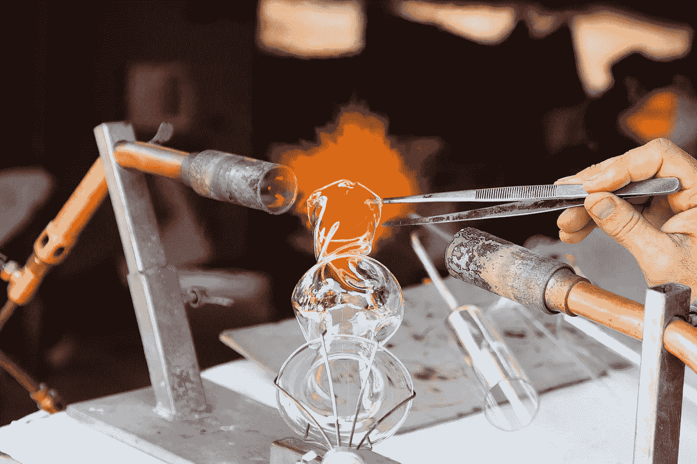

# 没有耐心，但有足够的毅力

> 原文：<https://medium.com/hackernoon/not-patient-but-plenty-of-perseverance-e58a8af93a73>

Photo credit: Photo by [Quino Al](https://unsplash.com/photos/rJ0UoWGMMSY?utm_source=unsplash&utm_medium=referral&utm_content=creditCopyText) on [Unsplash](https://unsplash.com/?utm_source=unsplash&utm_medium=referral&utm_content=creditCopyText)

## 从错误中学习的力量

今年秋天早些时候，在北加州文艺复兴博览会上，我观看了玻璃吹制大师斯图尔特·阿贝尔曼的演示。他给我的不仅仅是一瞥他如何创造美丽的艺术作品。他让我对创业和人生有了新的看法。

阿贝尔曼告诉人群，熔化的玻璃从他手中的钢棒上滴下

> "我没有耐心，但我有足够的毅力。"

他把自己的工作比作陶器——当他们制作一件作品时，制陶工人必须扔它，加热它，上釉，烧制它，然后完成它。他们需要几天时间才能看到他们努力的最终成果。

Photo credit: @AblemanArtGlass

阿贝尔曼说，他没有耐心等那么久，看看他所做的是否奏效。他现在想看到结果。但他愿意一遍又一遍地努力直到成功。他很有毅力。

我一直认为这两者是同一个统一体的一部分。一种宽容的心态——耐心和坚持下去的意愿。努力工作道德的缩影。

也许我理解错了。

我去寻找更多的例子。

## **玻璃吹制工，艺术**

我被吹制玻璃艺术所吸引。我在一个充满艺术、陶器和玻璃的家庭中，与一个艺术家社区联系在一起。我最喜欢的(活着的)艺术家是乔治亚州的玻璃吹制大师保罗·本德祖纳斯。事实证明，他说的和阿贝尔曼说的关于 2000 华氏度熔融玻璃的艺术非常相似。当被问及为什么选择玻璃作为媒介时，Bendzunas 说:

> “我喜欢玻璃的直接性。我可以在一个过程中概念化并完成一件作品……如果你失去了一件作品，你会学到一些东西，然后去另一件作品。”——[保罗·本德祖纳斯](http://www.bendzunasglass.com/about.html)

这两位艺术家都是他们作品中的大师。他们不仅仅生产华丽的艺术作品，他们是美国艺术玻璃复兴的一部分，可以追溯到 20 世纪 70 年代。他们边走边学——包括学习如何建造他们需要的熔炉和工具。他们甚至创造自己的材料。他们推动媒体去探索可能性。

## **是什么让我们坚持不懈？**

在我的儿童发展课程中，我讲授了托马斯&切斯在 20 世纪 70 年代提出的九种气质特征。这些特征区分了人类对环境的基本反应。它们在出生时就存在并且可以测量，并且在我们的一生中保持不变。它们涵盖了活动水平、我们生物节律的规律性、我们的适应能力、我们对新事物的反应、需要什么才能得到我们的反应以及这种反应有多强烈、我们情绪的总体质量、我们有多容易从一项任务中分心，以及我们在一项任务上的注意力持续时间或持久性。

对我来说，耐心和毅力合在一起就是最后一点，坚持。然而——这里有两个玻璃吹制大师在这两者之间制造了一个干净整洁的裂缝。

没有耐心，但有足够的毅力。

然后我看到了一些其他意想不到的地方，这个新的视角出现了。

## **企业家和初创企业**

20 年来，我一直观察我丈夫和我们的朋友在硅谷的科技创业公司。去年轮到我了:我加入了一家初创的非营利组织。速度令人陶醉。快速工作，努力迭代，学习并继续前进。

创业是没有耐心的。但是那些成功的人也是坚持不懈的。不是那种僵硬的，被锁在里面的，如果它杀了我，我就要做这个工作的那种毅力。但这种玻璃吹制工似乎可以。工作流畅的那种，拥抱“即时性”，并假定心态是“如果你失去了一块，你会学到一些东西并去另一块。”

我想到了埃隆·马斯克。如果你回顾一下他 10 年前对特斯拉的商业计划，你会发现他的目标是正确的。这很难想象——在这段时间里，他发明了全新的技术。然而，他不仅能够看到它，而且还能按计划进行。他可能创建他所拥有的公司的唯一方法就是顽强地坚持。但是耐心和毅力如何发挥作用呢？

众所周知，马斯克是一个很难共事的人——他对搞砸或拖延没有耐心。他还因敢于犯错而闻名——犯错是意料之中的，你可以从中吸取教训。愿意为了进步而失去火箭是对失败价值的一个相当大的承诺。Space X 的前三枚测试火箭都因爆炸而失败，此后还有其他火箭。马斯克甚至在 2017 年 9 月发布了一个最喜欢的爆炸的[视频。但马斯克在火箭失败后的推文总是专注于数据分析。Space X 努力挖掘，以了解哪里出了问题，并从那里开始建设。](https://www.youtube.com/watch?v=-2PWKdQzuU8)

没有耐心，但有足够的毅力。

成功的初创企业会欣然接受这一点。这还不是全部。这种“没有耐心，只有毅力”的事情在生活中也会出现。

## **孩子，和生活**

我经常想起孩子和童年。我的使命是帮助人们从不同的角度看待孩子的思想，我正在写三本关于孩子的书。

考虑到 Abelman 的信息，我意识到它也适用于孩子。

总的来说，孩子们没有耐心。他们想要结果——或者信息，或者安慰，或者别的什么——现在就很想要结果。这并不是说等待对他们没有好处(确实有好处，以后我还有很多话要说)。但是大多数孩子并不是自然而然或轻易就能得到的。然而，大多数孩子*来到这个世界时所具备的是巨大的毅力。这使他们能够爬行，然后面对坠落行走。它使孩子们能够努力学习说出他们听到的周围语言的声音。这也使他们能够探索和了解他们的世界。*

*我写过的其中一件事是向孩子们灌输“[错误是学习](/@mw.waterman/mistakes-are-opportunities-to-learn-3fd8e8e5794)的机会”这一信念的重要性它既简单又激进。很简单，因为在某种程度上，谁不相信我们的错误给了我们教训。激进是因为真正的生活和呼吸会改变你的整个行动观。它使我们能够利用与生俱来的毅力。*

*真正相信并接受错误是学习的机会，意味着看着火箭在发射台上爆炸，感到兴奋和可能，而不是感到后悔。*

## *技术和未来之路*

*将我们的错误视为我们下一个更好的知识的来源，这是思维方式的彻底转变。相信我们需要承受的损失、挫折和失败不是一种负担或让我们变得坚强，而是通往成功的必经之路。无论你在哪个领域工作:编译失败的代码对我们来说都是有帮助的。那个摔倒的机器人教会了我们，让我们前进。*

*认为这是未来公司的孩子们。他们将会把人工智能完全带到网上，把纳米技术带给大众，并突破生物技术的界限。*

*我想这就是我们要去的地方。不断加快的步伐，对我们注意力的要求。我们走得越来越快，不再有任何耐心。这并不是说等待对我们没有好处(确实有好处，以后我还有很多话要说)。但我越来越清楚，突破的显著特征将是毅力，再加上一种艺术眼光。*

*艺术。企业家精神。生活。技术。现在一切都变得有意义了。*

*这些玻璃吹制工，用他们古老的火和熔炉技术，为我们未来的新技术之路提供了线索:不是耐心，而是足够的毅力。*