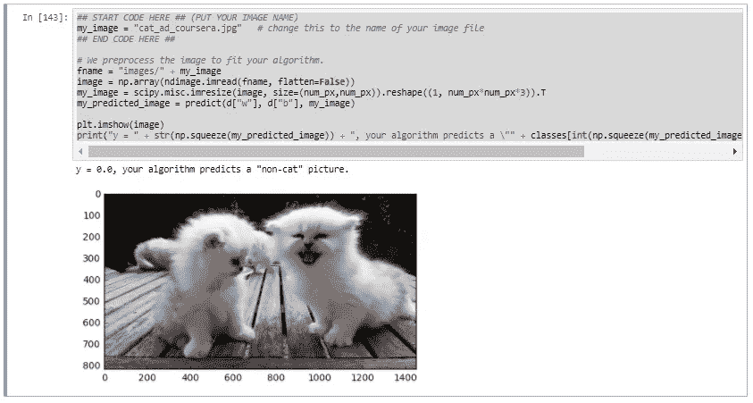

# (不)在深处滚动:深度学习、深度思考、深度工作和浅层机器

> 原文：<https://medium.com/hackernoon/not-rolling-in-the-deep-deep-learning-deep-thinking-and-shallow-machines-d80524174ca1>

Adele, when Rolling in the Deep

我最近在 Coursera 上完成了吴恩达的深度学习专业化的第一个课程，学到了更多关于神经网络、神经元、反向和正向传播的知识。这需要我花一些时间去做。到处回忆一下微积分。矩阵和导数再次向你问好。我很高兴花一些时间来研究这些过去的概念，并把它们作为学习新东西的桥梁。

不久前，我还读完了卡尔·纽波特的《深度工作》一书，这本书让我意识到在一个“注意力分散的世界”中专注和深度专注的价值和必要性。就像作者一样，我从来不喜欢开放的办公空间，在那里玻色噪音消除设备几乎成为一天中必不可少的用品。一年前，我发现了冷火鸡(Cold Turkey)——一款允许你在一段时间内阻止自己访问社交网络和其他分心事物的应用。这本书只是让这种想法合法化，即至少对于那些喜欢沉思的人来说，我们缺少了一些东西，一些被我们自己偷走的东西，在许多情况下，这些东西可能是无价的。

一些为深度集中留出时间的策略帮助我非常有效地完成了这门课程，同时我也完成了其他一些与“深度”哲学配合得特别好的课程。芭芭拉·奥克利(Barbara Oakley)的《学会如何学习》(Learning How to Learn)和续集《思维转移者》(Mindshifter)，专注于帮助人们更有效地学习和发展学习生活方式，在 MOOC 排名中一直处于领先地位。连同卡尔的书，这些都是一个很好的工作和学习的深度包。

与此同时，我继续阅读汉娜·阿伦特(Hannah Arendt)的《人类状况》(The Human Condition)——是的，在开始读这本书之后，我还读了许多其他书籍，但这本书花了我更长的时间才读完，我还看了纪录片《汉娜·阿伦特:精神生活》(Hannah Arendt:The Life of The Spirit)。

这些看似不相关的内容给了我“思考的食粮”。

## 深处的深处

吴恩达在第一次演讲中提到，神经网络已经存在了很长时间，但自从它们被重新标记为深度学习以来，它们似乎更能引起公众的共鸣，以捕捉大众的想象力。毕竟“很深”。

当我想到深入思考或学习时，我会想到像汉娜·阿伦特这样的人，他们能够与自己进行长时间的对话，并从临床角度剖析一个主题。在 1964 年对君特·高斯(Günter Gaus)的一次采访中——这是一次非常有趣的采访——她提到她是如何“为了理解”而写作的，如果你读了她的一本书，你会发现她似乎正在这样做——通过她的推理，放大看似最脆弱和最困难的方面，来检查、理清和征服她自己对它们的理解。她写作似乎不是为了向别人解释什么(有时很容易失去推理的线索)，但她似乎在说服自己一些论点。

但是这和深度学习或者神经网络有什么关系呢？神经网络的能力依赖于它们识别肉眼看不到的复杂模式的能力。就像汉娜一样，他们浏览数据，并与自己交谈以最小化错误，使他们的判断更接近事实。但与汉娜不同，正如加里·卡斯帕罗夫在他的书《深度思考》中多次提到的那样，机器缺乏情感。这使得他们坚持不懈地进行这种内部对话。

MOOC“学习如何学习”最有趣的见解之一是，大脑有两种认知模式:集中模式和分散模式，即使人们看起来什么也没做，他们也在思考。当你没有把我们的注意力集中在任何特定的事情上时，不时地从专注思考的深度工作中休息一下，允许意想不到的联系发生，这是很好的。**我想知道机器是如何做到这一点的，或者在未来能够做到这一点。**

卡斯帕罗夫提到了计算机象棋中的两种搜索类型:A 型/蛮力型或战略和选择性搜索，当评估和规划一步棋时，首先关注比另一种类型更窄但更有可能的选项范围，然后遍历所有选项。当涉及到设计计算机国际象棋游戏时，“暴力 A”似乎正主导着我们当今程序员的选择:“速度胜过知识”。这两种方法在国际象棋游戏开发方面一直在争夺焦点，但就目前而言(显然对 Garry 来说很不幸)，似乎更快地评估所有可能性胜过缓慢地专注于一些更明智的选择。

## 会玩但不会玩的机器

在任何情况下，机器似乎都很专注，不需要为了获得绝对的胜利而找时间进行一些娱乐性的休息。卡斯帕罗夫提到，对他的一个同事来说，“在棋盘上找到真理”意味着无论谁下得更好，都是绝对的输赢。归根结底，国际象棋只有三种可能的情况:赢、输或平。

机器不需要娱乐，不会分心，也越来越不会像人类那样长时间从事深度工作。因此，除了理解机器是否可以完全智能化，或者是否可以真正思考，我的问题是，机器可以有深度吗？

当我回顾矩阵计算的主题时，我曾经手工计算过矩阵的乘法，这需要计算机几分之一秒的时间来处理。对于几层的神经网络来说，手动执行计算可能需要很长时间——按照术语来说，层数越多，网络越深。**所以根据这一点，是的，机器可以深入，而且可以比人类更快地深入。**

但是为什么当我想到机器时，它们似乎注定是肤浅的？我可以想象一个机器人的水平相当于俄罗斯棋手，但一个机器人的写作深度相当于一个俄罗斯小说家(这是难以想象的)，或者一个机器人哲学家。不仅仅是因为他们不会问问题，卡斯帕罗夫也提到过，还因为他们不能忍受痛苦，我总是把深度与某种忍受痛苦的能力或对这种事情的感受能力联系在一起。

## 深层的透明

机器还不擅长的另一个例子是透明度。虽然 Hannah 展示了她得出结论的推理，但机器远没有这么透明。在神经网络中，甚至存在所谓的隐藏层(除了输入和输出层之外的所有层)，大部分计算发生在这些层中，但这些层类似于难以访问(如果不是被禁止的话)的黑盒。我们有输入和输出，至于中间发生了什么，机器无法清楚地向人类表达。

也许我把深度和海洋的深度联系在一起，无论你潜多深，你总能看到你周围的环境。对于人类思考者来说，事情就是这样发生的，他们能够通过语言来传达他们的思想，这种语言或多或少是透明的(取决于他们与他人以及自己交流思想的能力)。至于机器，深度似乎更像一个池塘或湖泊，在那里你可以看到尼斯湖的凸起，但不是它的整个框架。

Mystery ‘bumps’ photographed by Clive Limpkin at Drumnadrochit. REXSCANPIX. Metro article 2015

## 机器状况

因此，我不认为我可以崇拜机器，或者有一天我可以拥有一台机器作为英雄。不是因为他们不聪明——老实说，这有时会让人觉得被高估了——而是因为他们没有感觉。我承认，我对输给一台机器给卡斯帕罗夫造成的表面创伤感到有些惊讶——真的吗？你输给了一台机器？保持冷静，坚持下去。

但我希望看到一台机器与汉娜进行某种讨论和对话，跟随她的推理动作并给予一些回报，或者写下汉娜写给卡尔·雅斯贝尔斯(对她来说相当于父亲)或海德格尔(她一生的挚爱)的信，以及这些信意味着什么。

在电影《她》(Her)中，一个孤独的男人爱上了他的虚拟助手萨曼莎(由斯嘉丽·约翰逊(Scarlett Johansson)饰演)，他没有爱上机器智能——我不记得有任何类似象棋的对话，而是在一天结束时的平庸而亲密的对话，这可能是任何足够接近的人，而不是大师级的人说的。

Theodore, when Rolling in The Deep in the Movie “Her”

所以，我重复一下问题。机器可以深度吗？机器能和其他人或者其他机器进行真正深入的对话吗？我指的不是照本宣科的、算法式的、像象棋一样的对话，甚至(有点不幸地)不是展示某些作家和哲学家的思维和感觉的推理深度，而是能够触动人心的对话。

答案是肯定的那一刻——亚马逊的 Alexa 似乎将那个时刻推得太远了(但我们可以一如既往地感到惊讶)——这是“深度”真正符合大众想象力所习惯的“深度”的时刻，而不是有点误导性的宣传。

此外，也许当我们开始从深度而不是(脚本化的)智能的角度来看待关于机器的问题时，我们将不再把机器视为威胁，视为允许我们赢、输或平的棋手，而是更丰富和更深刻的生活的共同作者。

毕竟，正如卡尔·纽波特(Cal Newport)提到的，对苏格拉底的原文做了一些编辑，“未经审视的生活不值得过”，我也相信，“没有深度的生活不值得过”。机器仍然没有装备来帮助我们。

所以称之为一切，但不要称之为深刻，只是还没有。虽然神经网络在识别猫方面越来越好，但是有些还是很难识别，比如下面我朋友的猫，这是我在一次课程练习中用过的。我向你保证它们是真实的😸

*“y = 0.0，你的算法预测出非猫图片”*

有时候还是有点像这样:

One of the Adele/Cat online memes. Didn’t know this was a thing until I searched for something to illustrate. I am not the author.