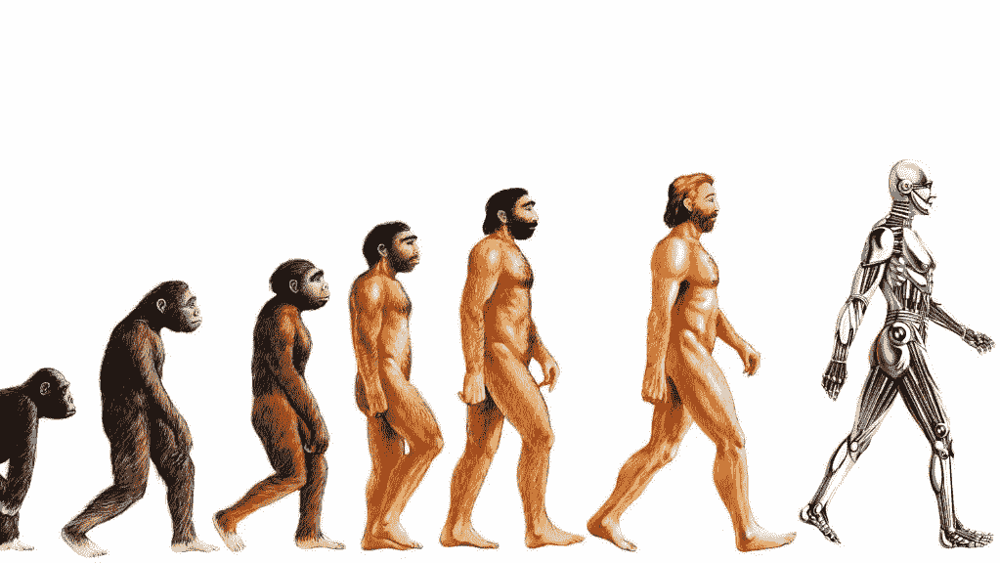

# 当然，人工智能对人类是一种威胁

> 原文：<https://medium.com/hackernoon/of-course-ai-is-a-threat-to-the-human-species-b4adf5abe129>

***更新*** : *更深入的分析参见* : [第一原理:AI 的必然崛起](/@csenn/first-principles-the-inevitable-rise-of-ai-f6b657192e44)

由于机器学习算法的最新进展，人工智能对人类物种的威胁最近进入了主流讨论。埃隆·马斯克、马克·扎克伯格、比尔·盖茨和桑德尔·皮帅只是在讨论中加入自己观点的几位科技领袖。

所以让我们澄清一下。

当然，人工智能对人类是一种威胁。

这不是观点，这是事实。真正的问题是:

*对* [*未来*](https://hackernoon.com/tagged/future) *时间的威胁有多大？*

# 威胁等级

如果你在印度的平原上行走，一定会有看到眼镜王蛇或者被眼镜王蛇咬伤的危险。可能有许多变量影响这种风险，如一天中的时间、你走的路、你的步态、你的视力、季节等。然而，基于一些可测量的变量，如果存在足够的数据，被咬的概率可以被指定。

现在想象你住在堪萨斯城的郊区，正在你的后院散步。在这里被眼镜王蛇咬伤的可能性比你在它的栖息地行走要小得多。事实上，这可能从未发生过，也可能永远不会发生。但是理论上总是有这样的可能性，一辆动物园运输卡车可能会撞毁你的街区，动物可能会逃跑，一条眼镜蛇可能会跑到你的后院。

关键是威胁仍然存在，即使它非常小。因此，未来的人工智能肯定是一个威胁。真正的问题是威胁有多大？

但是为了让**威胁**在未来的背景下有意义，我们必须讨论**时间**。

# 时间

我们这个物种已经有五万年历史了。我们是地球上的主导物种。我们大多数人都不太担心猿类军队组织和发起多管齐下的战略攻击，只有微小的生物才能对我们的物种造成重大伤害。

因此，如果 AI 在未来的某个时刻对人类构成威胁，它也会威胁到地球上的所有其他生命。

因此，人工智能对生物生命是一种威胁，据估计，生物生命已经超过 40 亿年了。

似乎每当我们开始讨论人工智能的未来，以及它是否是对人类的生存威胁时，我们倾向于用几十年，或者最多一代或两代人来描述。100 年是我们物种时间跨度的 0.2%。100 年是地球上生命时间跨度的 0 . 0000025%。

我们不打算在这里回顾历史，但我们正在沿着目前看起来像是社会和技术增长的指数曲线越走越远。只要这种趋势继续下去，人类创新的**率就会继续增长，**使创新发生得更快。我们越深入未来，它就变得越不确定。

一分钟后的未来是相当确定的。未来 10 天，甚至 3 个月后，也是相当确定的(包括始终存在的重大国际冲突的风险)。20 年后的未来会变得更加多云。100 年后，更是如此。

如果我们把技术创新的增长速度和不确定性的增加结合起来看，我们可以推断人工智能的理论潜在威胁也在增加。正如印度的平原对于眼镜蛇王来说比堪萨斯城的后院更像是一个栖息地一样，遥远的未来对于强大的人工智能来说更像是一个栖息地，而不是现在或不远的将来。

这是一个有趣的游戏，试图预测人工智能在 10 到 30 年后是否会成为威胁。但真正有趣的是当我们把**放大一点的时候。人工智能会在 200 年、2000 年或 10000 年后对人类构成威胁吗？缩小时，您是否开始感到有点不自信？相对于我们物种的历史，这些时间框架仍然很小，相对于地球上生命的全部历史，这些时间框架几乎可以忽略不计。**

你可能会想“当然，但是几百年或几千年后的问题就是未来的问题，我们现在对这些时间框架无能为力，我们都将早已死亡。我们能真正影响的只是现在，缩小视角只是一个毫无意义的思维实验。”

很公平。但是当我们思考诸如人类的命运和人工智能是否会比生物生命更有效率这样的大问题时，我们谈论的是应该在相对于它们的存在的时间框架内讨论的想法，而不是几代智人的寿命。

当有远见的领导人思考棘手的问题时，他们的回答是“你理解人工智能吗，我们真的离你所说的世界末日很远吗?”,“我的反问题是”( T8)还有多远？

也许我应该明白，当我们大多数人谈论我们这个物种的未来和命运时，我们是戏剧化的，我们真正感兴趣的是我们的子孙后代的生活。

50 年前，计算机只有整个房间那么大，15 年前，深度神经网络只被特立独行的研究人员使用。生物学用了 40 亿年才把我们带到现在。在短短 50 年里，机器复杂性的增长速度已经足够快，以至于那些真正对我们人类的未来感兴趣的人，把它们作为一个未知的未来，因而也是一个理论上的威胁来讨论，显得既理性又明智。