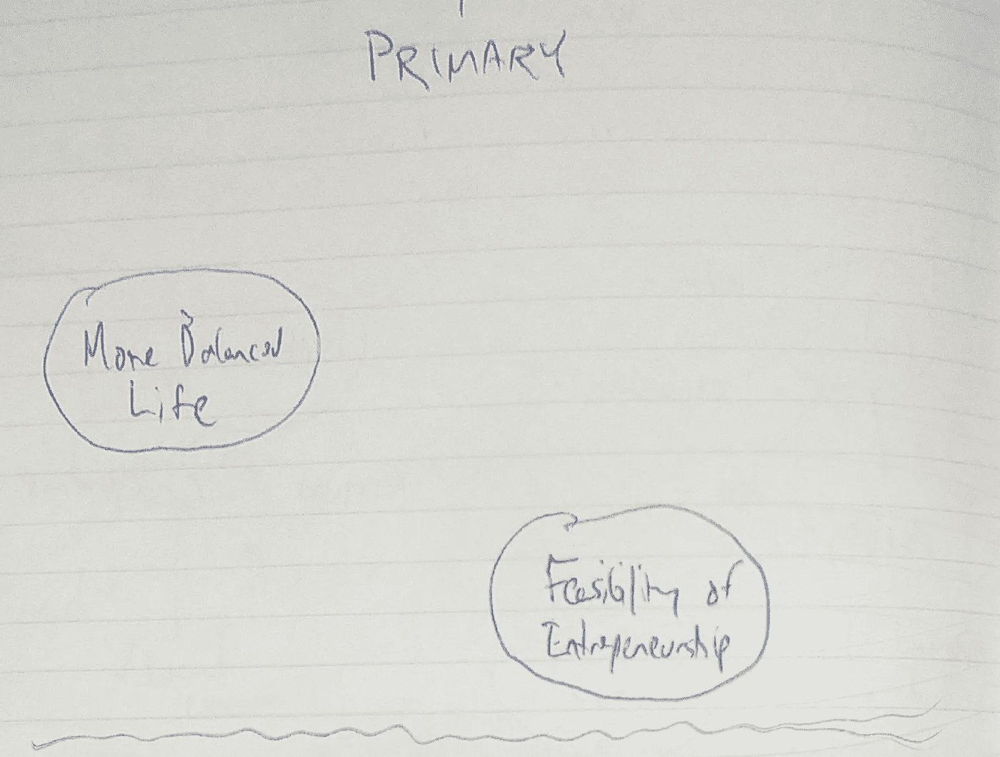
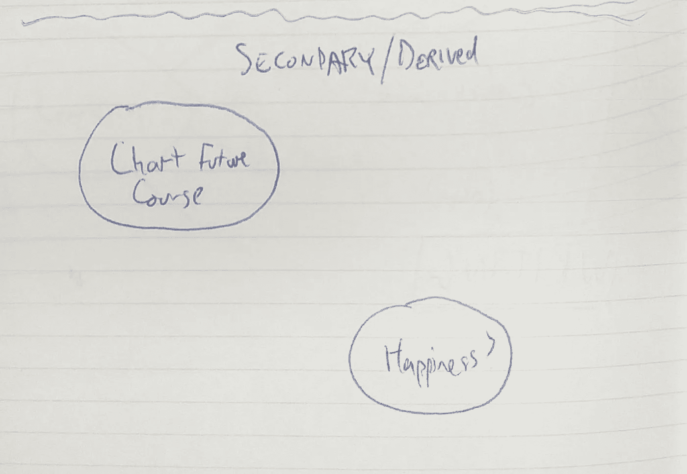
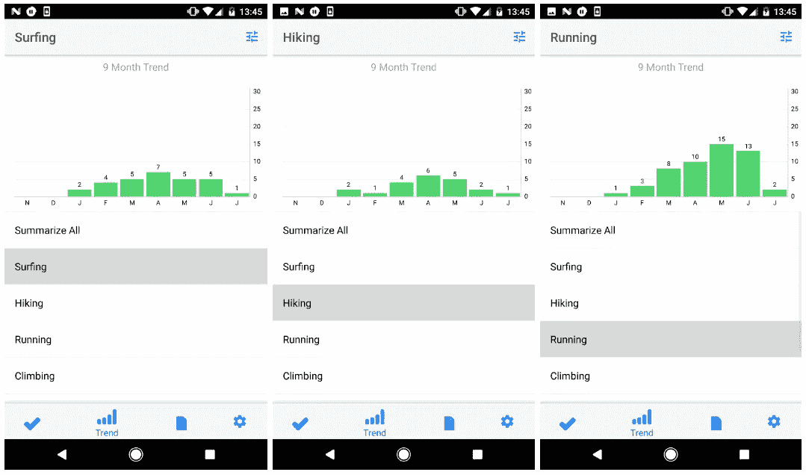
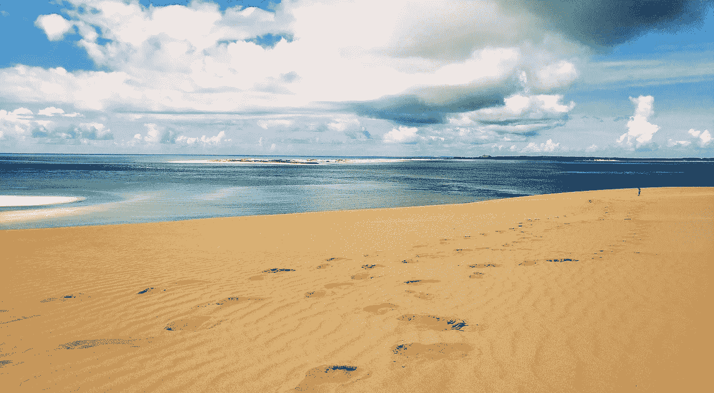

# 关于休假、目标、未来和寻找幸福

> 原文：<https://medium.com/hackernoon/on-sabbaticals-goals-the-future-and-finding-happiness-d621f2ae9c92>

## 为什么每个有能力的人都应该花些时间来理清自己的人生。

咻。

我本打算在我六个月的单身休假期中抽出一些时间来思考事情的进展，但突然一个月过去了，我还是什么都没写。

我认为最终花些时间去做这件事是件好事。

**警告:这篇文章比我最近的文章更加个人化和哲学化。前方有情绪。继续进行，风险自负。**

# 关于目标

在我休假的开始，我花了两周时间和我的妻子去旅行度蜜月。这是我们俩最长的一次没有笔记本电脑，自从——嗯，可能是自从我们有了笔记本电脑以来。

在那段时间里，我们看到了一些令人惊叹的地方和事物，吃了美味的食物，谈了很多关于生活和我们的未来。在没有工作的空间里——这是我记忆中第一次——我有时间和空间去*思考*。

我旅行时没有带笔记本电脑，而是带着纸质笔记本(好吧，还有智能手机……我不是精神病患者*)。在吃饭和活动之间的短暂休息时间里，我花了大量时间盯着笔记本上的空白页，试图弄清楚接下来的六个月我要做什么，以及为什么。*

*我最终从“做什么”开始(对不起，西蒙·西内克)，特别是我想在这段时间里做什么。*

*我最后只写下了我想完成的两件大事:*

**

*Apologies for the illegible handwriting and terrible photo quality*

***(引导 a)更平衡的生活***

***(评估)创业的可行性***

*我本能地知道这些事情对我来说很重要，一旦我把它们写下来，就很容易收回“为什么”。*

*这里又出现了两件简单但重大而重要的事情:*

**

*Ever the optimist, I actually wrote “happiness?” with a question mark*

***规划未来的道路***

***幸福***

*当然，当我度蜜月回来并开始休假时，我很快就忘记了那本笔记本。不过幸运的是，这些想法最终下意识地指导了我迄今为止所做的很多事情，所以我很高兴在那里找到它们，并且很高兴看到它们仍然准确地代表了我的优先事项。*

> *重要的不是计划，而是计划*
> 
> *格拉姆·爱德华兹博士*

*那么，我正在实现这些崇高的目标吗？*

*这是这篇文章剩余部分的主题。*

# *更加平衡的生活*

*这个很有趣，因为——作为一个宗教时间/活动跟踪者——我可以很容易地用实际数据跟踪这个目标。*

*这是我休假前 16 周的每周“工作”时间。*

**

*Time report courtesy of [toggl](https://www.toggl.com/)*

*正如你所看到的，我已经成功地在每周 40 小时+/- 10 小时左右徘徊，平均下来几乎正好是每周 40 小时(确切地说，是 40 小时 46 分钟)。*

*让我们把它与我休假前担任 CTO 的最后 16 周的时间进行比较。*

**

*Note that the axis goes up to 80 instead of 50 here. That 30-hour week is the week between Christmas and New Year’s.*

*比较这些同等时期会得出一些非常不和谐的数字。*

*在我休假的 16 周里，我“工作”了 **239 个小时，比我在首席技术官岗位上的同一时期少了**。这加起来差不多有 **10 个完整工作日**，或者说 30 个 8 小时工作日——**6 个工作周**——我为生活的其他方面回收的时间。*

*时间去哪里了？一个有趣的数据是工作之外做其他事情的机会。我从一月份开始记录我的跑步、远足和冲浪，所以我有休假前两个月的数据和休假后四个月的数据。*

*看起来是这样的:*

**

*Screenshots courtesy of [way of life](http://wayoflifeapp.com/)*

*在休假开始之前，冲浪实际上进行得很好，但从 3 月开始，其他事情都发生了巨大的变化(7 月是个例外，因为我在 5 月 5 日截屏了这些)。*

*这种平衡也影响了我生活的其他方面:和妻子在一起的时间、朋友、爱好等等。*

*稍后我会有更多的话要说，但是现在我想我们可以结束这部分了。*

*结论:我的生活越来越平衡了。*

# *创业的可行性*

*我的第二个目标是评估创业的可行性。我在我的第一篇博客文章中写到了这一点，甚至制作了这个小图表来试图阐明这一点。*

**

*Again, using question marks to convey my lack of confidence*

*这是怎么回事？*

*总之我会说… [merrrr？！？](http://www.urbandictionary.com/define.php?term=mer+mer+mer&defid=3533791)*

*我当然没有排除创业的可行性，但我也绝对没有排除这种可能性。*

*以下是我迄今为止所做的东西以及它们是如何完成的概要:*

*   *[coryzue.com](http://www.coryzue.com/)每天有 5 到 15 名访客，而 ***的收入为零****
*   *[Mailchimp Tools](http://mailchimp.coryzue.com/) 每天有 2 到 12 个访客，而 ***的收入为零****
*   *[照片新标签](http://www.coryzue.com/photos-new-tab/)日活跃用户约 100 人 ***收入为零****
*   *[我的 django 婚礼网站](https://github.com/czue/django-wedding-website)有 91 颗星，26 个叉， ***产生 0 收入****
*   *[Place Card Me](http://www.placecard.me/) 每天有 10 到 30 名访客，而 ***的收入为零****

*你感觉到一个主题了吗？*

*所以目前我会说我正坐在中间的盒子里。我做了一些东西，我让一小部分人使用它们，但是我没有得到报酬，我离通过我的产品维持可持续的生活还有很长很长的路要走。*

*从好的方面来看，我学到了很多，我希望不会重复我到目前为止所犯的错误。在理论上,,这意味着随着时间的推移，我应该对如何赚钱做出更好、更明智的决定。实际上，我可能会犯一系列新的错误。*

***结论:这个问题还没有定论，它仍然是一个高度优先的目标。***

# *规划未来的道路*

*我休假的更大目的是回答那个古老的问题:*我这一生想做什么？**

*我知道我对目前的工作不满意，但我不知道的是为什么。我只是精疲力竭，压力过大，还是我真的不再喜欢我正在做的工作？而如果是后者，我喜欢过什么*？**

**

*Where was I going? And was it going to be any good?*

*你可以看到前两个目标是如何融入这个目标的。更平衡的生活有望消除等式中的“压力”变量，并为我创造一个空间来评估我的职业目标，而不会被长时间的工作所影响。*

*同样,“创业的可行性”目标探索了另一个变量——即，如果我*没有*为我的旧雇主 [Dimagi](http://www.dimagi.com/) 工作，我会做什么。完全为自己工作、开始一个成功的副业以及“睡觉时赚钱”的梦想都很诱人，但实际上我对它的现实一无所知——包括我是否能成功。*

*所以探索企业家精神实际上是为了满足两个目标:第一个是可行性，第二个是测试我是否喜欢它。这两者对我来说都是一个可行的、有吸引力的未来课程。*

*我最终意识到我未来的目标其实很简单，可以归结为两件基本的事情。*

*我需要:*

1.  ***产生足够的收入来维持生活***
2.  ***享受我的作品***

*就是这样！当你把它简化的时候，看起来很简单，不是吗？*

*所以现在，我要做的就是找到一份能给我带来足够的钱让我生活下去的工作，并且乐在其中。一旦我明白了这一点，我就把这两件事写在盒子里，并开始头脑风暴，思考存在什么样的创收机制，什么样的属性会满足我的工作乐趣。*

*看起来像这样:*

**

*I’ll leave it to the reader to decide whether “improve lives” was the first or last criteria I wrote down*

*所以现在，终于有了这个新的观点，我所要找到的就是左边的东西，满足右边的大部分需求。*

*出于这个原因，在过去的一个月里，我一直在探索更多的东西，而不仅仅是创业，包括接受更多的自由顾问工作，试图让重返旧工作的道路更加具体，并探索其他产品的可能性，这些产品可以利用我的优势，可能比消费 SaaS 更容易产生收入。*

*这种新的框架也意味着，如果我能从受薪职位或咨询中获得“享受工作”部分的大多数积极因素，企业家精神就不是一项要求，这在寻找幸福未来方面提供了更多的灵活性。*

***结论:我仍然不知道我下一步要做什么，但我觉得我正走在正确的道路上，可以获得我需要的数据来做决定。***

# *幸福？*

*最后，我们来到那个难以捉摸而又最重要的目标:*幸福！**

*那么我在这里找到自己的位置了吗？简而言之——很抱歉在这部分吹牛——我会说， ***大部分是踢屁股。****

*在某种程度上，我是在欺骗，因为我已经把生活中最难也是最重要的约束——创收——搁置了六个月(谢谢老婆！❤你！).如果我没有明显更快乐，我会做一些真正错误的事情。*

*然而，即使如此，我仍然为今天比四个月前快乐得多而感到不知所措，这不仅仅是因为我不是在传统意义上工作。*

**

*Happiness is a mountain-top with a view*

*在我的休假工作中，我更加投入。我正在学习新的领域和技术。我在更加多样化的行业和社区中遇到了许多不同的、了不起的人。我把自己更多地“放在那里”，冒更多的风险，比以前更经常地失败(以好的方式)。*

*每天开始工作，我都很兴奋。*

*工作之外，我设法每周做四到五次户外活动。我探索了海角半岛上的所有小径，在 4 个月里看到的日出比过去 4 年还多，自学了冲浪——尽管很差——并且可能处于我成年生活中最好的身体状态。*

*我也更加投入和关注朋友，与家人保持更好的联系，与妻子进行更有吸引力和更体贴的交谈。*

> *基本上，我是一个更好的丈夫，一个更好的儿子，一个更好的朋友，坦率地说，一个更好的人。*

*同样令我震惊的是，我不必停止每周“工作”40 个小时来实现这一切。我所要做的就是问一个简单的问题:*我怎样才能快乐？* —并主动采取措施回答。*

*从最初问这个问题开始，我最终决定休假，这让我走到了今天:面对不确定的未来，掌握自己的命运，比多年来任何时候都快乐。*

***结论:休假生活为我的幸福创造了奇迹，我乐观地认为它将永久地改善我的生活。***

*我真的不能向任何寻求幸福的人推荐像休假这样的东西，也不能向那些分享能够在经济和后勤上负担得起休假的特权的人推荐。*

*那么……休假能为你的生活带来什么？*

**最初发表于*[*www.coryzue.com*](http://www.coryzue.com/writing/sabbaticals-goals-future-happiness/)*。如果你喜欢这篇文章，请按绿色的心来帮助别人找到它！非常感谢。**