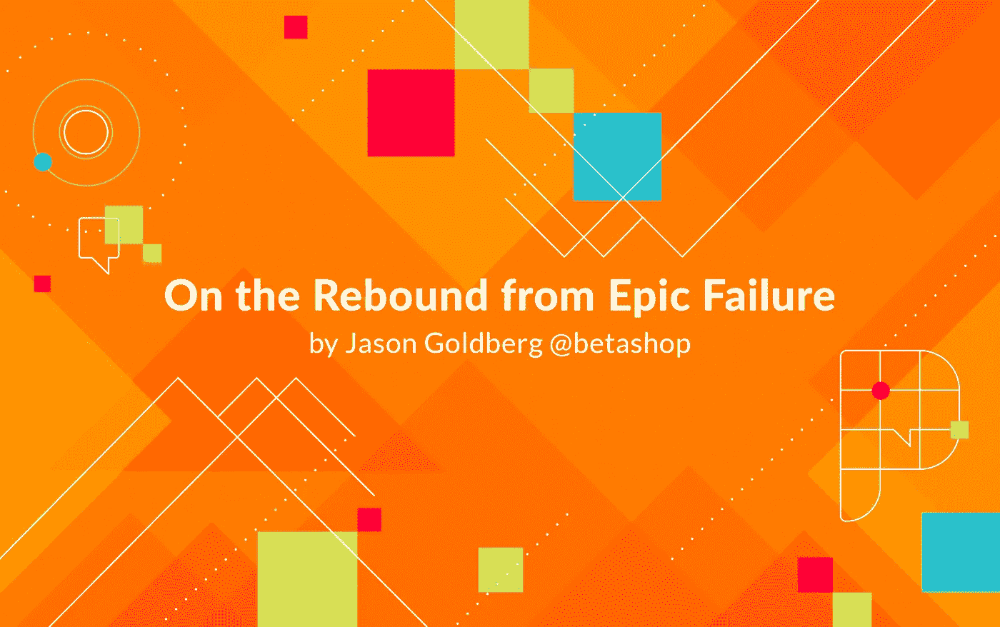
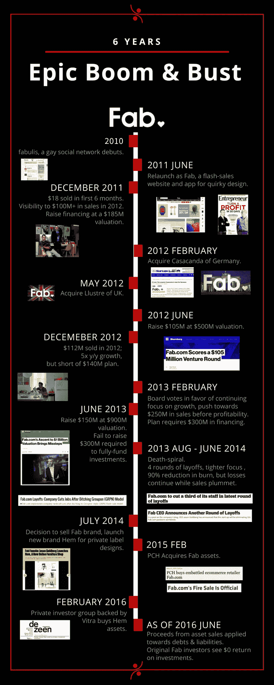
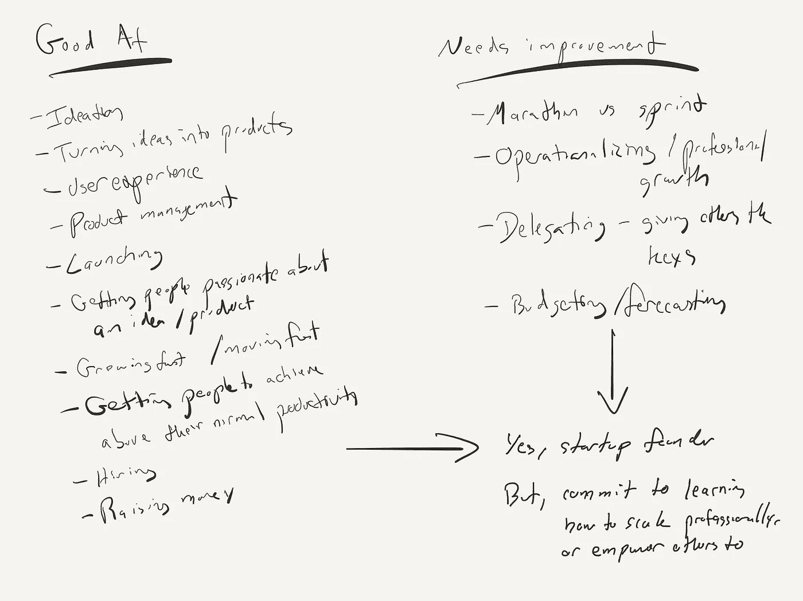

# 介绍

> 原文：<https://medium.com/hackernoon/on-the-rebound-from-epic-failure-88e77d2b39af>

从 2010 年到 2015 年，我是 [Fab](http://fab.com) 的创始人兼首席执行官，然后是其衍生公司 [Hem](http://hem.com) 。

我为 Fab 筹集了超过 3 亿美元的[风险投资](https://hackernoon.com/tagged/venture-capital)。

没用。

我失败了。*

失败对于所有参与其中的人来说都是令人沮丧和悲伤的。作为对这一史诗般的失败负责的人，我花了两年时间，最近才能够坦率地谈论和写下这一点。

这篇文章展示了 Fab+Hem 旅程的事件时间表，并开始从我的角度谈经验教训。在接下来的几周里，我会写一些更深入的后续文章，尤其是关于经验教训的。在此过程中，我将讨论这些经历如何影响我今天的选择，作为反弹和重建之旅的一部分。

提前感谢阅读。

**(读者注意:Fab+Hem 作为风险投资失败。然而，*[*【Fab.com】*](http://fab.com)*和*[*【Hem.com】*](http://hem.com)*品牌在各自的新主人的领导下继续生存，我支持他们两个取得巨大成功。)*

# 公开谈论史诗般的失败

从 2004 年到 2013 年，我写了几十篇关于创业和我的创业成功与失败经历的博文。很多人读了这些帖子，很多人告诉我他们很欣赏这些帖子。

然后，在 2013-2014 年，Fab 发生了内爆。在内爆期间，我做了一些糟糕的决定，包括试图通过一个现在臭名昭著的“[这是一个该死的创业公司](http://www.fastcompany.com/3029439/most-innovative-companies/fab-ceo-sent-this-terrifying-memo-in-a-bizarre-attempt-to-rally-hi)”帖子来召集军队。当我试图集中精力恢复这艘船的时候，我感到羞辱和恐惧，我后退一步，关闭了我的博客。

今天标志着我几年来第一次真正尝试回到公共写作。

## 我们应该庆祝失败吗？

有一种观点认为风险投资行业庆祝失败。风险投资是一项“热门”业务，极端赢家返还资金，并弥补所有损失。整个风险投资模式依赖于企业家和投资者承担风险，挑战极限，测试假设，转向，失败，再尝试。

我相信庆祝失败在某种程度上是有意义的。我同意 Ron Ashkenas 在他的 HBR 文章中对创新失败和执行失败的区分的前提:[何时不庆祝失败](https://hbr.org/2014/12/when-not-to-celebrate-failure)。

我们应该庆祝*创新失败*；试图发明创造时发生的失败。

我们不应该庆祝*执行失败*——当团队没有执行，当公司没有从创新模式转变为执行模式时发生的失败。

这就是发生在 Fab 的事情。一个令人兴奋的想法催生了一个创新的网站/应用程序，并发展成为一个高速增长的业务，但未能以可持续的运营模式执行。绝对没有任何理由庆祝这一惊人的失败。

然而，执行失败的教训对企业家群体来说有其自身的谦逊和信息价值。

我们不时会看到一个关于早期创业失败的媒体帖子，但更不常见的是像 Fab 这样的史诗般执行失败的第一手资料。这就是为什么我今天写这篇文章，其他人会跟进:揭示大规模失败的一些细节，以便其他人可以从所犯的错误中学习，也许从我试图从中恢复的具体经验中学习。

# 走向康复

在开始之前，我想感谢所有参与 Fab+Hem 旅程的人。

从这样的经历中康复是非常困难的，这无疑需要时间和相当大的努力。也很有可能有些伤疤永远不会完全愈合。创业是人们可能经历的最情绪化和最痛苦的经历之一。在初创公司的战壕里，不可能把业务和个人分开；这适用于创始人、员工和投资者。数亿美元的投资、在多个地区实施的带有传统战略的大量收购，以及缺乏协调一致的执行，造成了一个更加危险的局面。

我们的**员工**为公司奉献了他们的一切。他们把它当成了自己的生活。我希望他们中的每一个人都从他们的经历中学习并受益，并且他们从整体上看待他们的 Fab 经历，而不仅仅是如何结束的。让我无比自豪的是，超过 15 家新的创业公司是由前 Fab+Hem 员工创立的。还有数百名 Fab 校友继续在各种规模的雇主那里体验个人和职业发展。我祝愿他们取得巨大成功。

我们的投资者给了我们他们的钱和信任。他们中的一些人投入了自己的个人资金。他们中的许多人代表他们所代表的个人和机构进行投资。Fab+Hem 无法发货让我很痛苦。我知道他们中的许多人仍在处理善后事宜。

在这一点上，无论是私下还是公开，我已经说了很多次“对不起”，而且我准备一直说下去，因为我的决定而受到伤害或部分伤害的人们需要听到它。对不起

# 2007 年至 2015 年美国的闪存销售行业

2007 年至 2014 年间，超过 13.5 亿美元投资于美国的在线“闪购”公司。

闪电销售通常涉及通过电子邮件和应用内通知向客户推送商品的日常交易。

闪购模式背后的理论是，与亚马逊式的基于意图的电子商务相反，在这种电子商务中，客户通过搜索来满足特定的需求，闪购将通过向客户推广购物想法来创造需求，这或许类似于电视家庭购物频道，每年产生约 60 亿美元的销售额，而沃尔玛的销售额为 4800 亿美元。

资金最多的 7 家闪存销售公司是:

*   Zulily，mom's and kids，共投资 3.9 亿美元，其中 2.5 亿美元用于首次公开募股，1.4 亿美元用于私人风险投资。目前归 QVC 所有。
*   Fab，设计商品，3.2 亿美元风险投资。目前归 PCH 国际公司所有。从 Fab 剥离出来的“Hem”由维特拉支持的投资集团所有。
*   金边证券、奢侈品、2.7 亿美元风险投资。目前由萨克斯第五大道精品百货店的母公司所有
*   One Kings Lane，home goods，2.25 亿美元风险投资。目前归贝德柏士比昂公司所有。
*   名牌服装公司 Ideeli 获得 1.07 亿美元风险投资。目前归 Groupon 所有。
*   高级外观，名牌服装，4000 万美元风险投资。目前归诺德斯特龙所有。
*   Rue La La，名牌服饰，2200 万美元风险投资。目前归 Kynetic(前 GSI 商业)所有。)

这些公司中:

**0 今天还在独立运营。**

**1 IPO**

**2 卖的钱比养的多(Zulily &高级外观)**

**5 作为风险投资完全失败。**

**如果一位风险投资人在所有 7 家公司的首轮融资中投入了相同的金额，她仅仅从 Zulily 的 IPO 中就获得了正回报。**

# Fab+Hem 时间轴:6 年史诗般的成长，史诗般的内爆

2011 年年中，Fab 从一个失败的社交网络的废墟中脱颖而出，突然成为发展最快、最热门的电子商务公司。30 个月后，到 2013 年底，Fab 开始螺旋式下降，最终以融资额的一小部分被出售。第二大资金支持的闪存销售公司 Fab 作为一项风险投资是如何失败的？这是可以避免的吗？

我的下一篇博客文章将集中在我从奇妙的经历到史诗般的高潮和低谷中学到的最重要的经验。为了做好准备，下面我将介绍历史的大概情况和一些主要的课程主题。

## **成长阶段:2011 年年中至 2013 年年中**

在 2012 年——Fab 作为快闪销售网站的第一个完整日历年——Fab 销售了 1.12 亿美元的商品，高于 2011 年的 1800 万美元。超过 1000 万人注册了我们的每日电子邮件。我们是国王！

但我们没有。

自信(但事后看来被误导了)我们已经建立了一个可扩展的模式，可以实现全球统治——我们通过多次收购向欧洲扩张，并以 5 亿美元的估值筹集了 1 亿美元的融资。

我们打破了风险投资的一条基本规则:“[只有在你搞清楚产品与市场的契合度之后，才能筹集一大笔资金。](http://www.bhorowitz.com/revenge_of_the_fat_guy)“我们已经发现了超高速增长，但还没有完全融入一个高度功能化的执行模式。我们还没有成功地从创新跳到执行。

*这一区别对于当前的独角兽及其投资者来说是一个重要的教训；在你成为独角兽之前，你最好有一个可持续的、可重复的、可扩展的商业模式，并以最高的效率运行。这听起来像是常识，但你会惊讶地发现，如今有多少独角兽仍在思考这个问题。*

费伯不是优步。我们没有可在不同市场间复制的高度可扩展的运营计划和剧本。我们的模型是高度人员、库存和仓库密集型的。在我们解决好国内的问题之前，我们没有理由出国。相反，如果我们在海外扩张之前迫使 Fab 在美国实现盈利，Fab 故事的其余部分将会非常不同，而且很可能非常积极。

2012 年底，18 个月大的 Fab 已经飞近太阳。我们错过了 2012 年 1.4 亿美元的商品销售额计划(想象一下，从 1800 万美元增长到 1.12 亿美元，与您的计划相比，这是一个巨大的失误！).我们在网络营销、电视广告、国际扩张(已经占我们现金流的 30%和我时间的 1/3)和仓储方面进行了昂贵的投资。我们需要在 2013 年注入大量资本来继续增长。

2013 年初，我们的董事会考虑了两种可能的途径:

(A)蹲下身子，紧缩开支，只专注于美国市场，目标利润在 1 . 5 亿美元左右，或

(B)继续推动 100%的年增长率和世界主导地位。公平地说，这算不上什么辩论。

只有一名董事会成员支持路径 A，而其他所有人，包括我自己，都支持火箭飞船。(给有抱负的独角兽及其投资者的另一个提示:你知道那个不断大喊“停下来”的令人讨厌的董事会成员吗当其他人都在欢呼“加油！”—与其暗暗希望你能把他们从你的董事会中移除，不如集中精力多听听他们的意见！).

2013 年，我们在 Q1 创造了巨大的销售数字，然后我们遇到了阻碍。

当我们试图筹集 3 亿美元的资金来为我们现有的投资(包括在两大洲的库存和仓库)提供全额资金时，我们缩减了营销规模以保存现金，销售额大幅下降。

## **一只伤痕累累的独角兽蹒跚而行，失足跌倒:2013 年年中至 2014 年年中**

2013 年 6 月，我们以 9 亿美元的估值融资 1.5 亿美元(后来下调至 8 亿美元的前期投资)，这对一个 2 岁的品牌来说应该是一个巨大的成功。但是，现实是我们在融资方面失败了:我们需要 3 亿美元来实施记录计划并支持已经在进行的大型投资。2013 年 6 月，Fab 是一只新诞生的“独角兽”,正走在一条危险的道路上。我记得我接到了一个又一个祝贺我成为独角兽的电话，我的胃都要吐了。没有多少人知道以 9 亿美元的估值融资 1.5 亿美元是什么感觉，也没有多少人知道你正驶入一场狗屎风暴。糟透了。

在“独角兽”轮融资后不久，我试图筹集我们需要的额外 1.5 亿美元，但未能成功。

随后，我采取措施纠正错误，通过在欧洲的一次大规模裁员和在美国的三轮裁员，将 Fab 北美的员工人数从 400 人减少到 2013 年底的 85 人左右。我们削减了营销支出。我们试图简化业务，缩小商品范围。说实话，这成了死亡螺旋。我们唯一擅长的事情是降低燃烧率，但业务本身正在挣扎，失去价值。

*回想起来，这是故事中我最后悔的一段。我猛踩了一艘飞速行驶的火箭船的刹车，这很难做到，而且我失败得很惨。我太急于专注于削减成本和缩小范围，而不是后退一步，与我们的董事会一起制定一项计划，为我们的股东保留价值。大家总说:“切得快，切得深。”我现在不同意。应该是:“聪明地砍，有计划地砍，有帮助地砍。”我在削减方面超出董事会太多，没有向他们寻求足够的帮助。我没有让我们的管理团队很好地参与决策。我毫不客气地解雇了一些最忠诚的同事。我和我最好的朋友兼联合创始人分手了——抛开公司的核心精神、文化和宗旨一直是我们两个人的融合——而我本应该想办法让他成为解决方案的一部分。*

如果我以不同的方式处理这段时期，没有人会知道 Fab 会怎么样，但我现在真的希望我能慢一点，让我周围更多聪明的人参与进来。

## **从 Fab 到 Hem 到结束:2014 年年中到 2016 年初**

2014 年年中，随着销售额直线下降，公司仍在亏损，并背负着 1000 万美元的低利润第三方库存，我决定出售 Fab 品牌，并将剩余资源集中在新兴的自有品牌业务 Hem.com 上。独角兽远远地落在我们后面；Hem 是从公司剩余的最佳投资中创造一些价值的最后努力。

我们在 2015 年初将 Fab 出售给了 PCH 国际。我搬到德国柏林建造 Hem 更接近我们的全栈设计和制造团队。哼哼有了一个良好的开端；产品很漂亮，利润率也很高，但这与我们最初的晶圆厂投资者投资的火箭船增长故事相去甚远。到 2015 年底，我们需要 700 万美元的额外融资，才能让他们的年销售额达到 2500 万美元左右。

2016 年 2 月，[我们将 Hem 卖给了瑞士家具公司 Vitra 支持的投资集团，结束了 Fab-Hem 的故事](http://www.dezeen.com/2016/02/04/design-brand-hem-sold-private-investment-company/)。

虽然保密协议阻止我分享任何有关收购 Fab 和 Hem 的细节，但我可以告诉你，到今天为止，没有一个投资者收回他们的初始投资。

在 6 年的时间里，创造了数百个工作岗位，但又失去了。

我失败了。

# **试图从公众失败中恢复过来**

没有简单的方法来处理公众的失败。没有关于创业失败后复苏的商学院案例研究或 a16z 播客或鲨鱼池剧集。当你的创业失败时，你不会自动加入创始人恢复协会。

失败糟透了。史诗般的失败更糟糕。

很孤独。当你在史诗级别上失败时，突然每个人都讨厌你。你的员工讨厌你。你的投资者讨厌你。媒体歪曲你。行业回避你。那些曾经用刻薄的表情符号给你发短信的“酷”创业人士现在不会了。

这就是生活。你应得的。处理好它。

我在事业上有过一些成功，但最近也有过一些重大的失败。新闻快讯:成功比失败好得多。([苏菲·塔克说得更好](http://thinkexist.com/quotation/i-ve-been-rich-and-i-ve-been-poor-believe-me/532583.html)。)

我最近看到的关于公众失败的一些最好的建议来自杰夫·贝索斯，他说:“如果你在世界上做任何有趣的事情，你都会有批评者，”他说。“如果你不能容忍批评，就不要做任何新的或有趣的事情。”(视频如下)。

杰夫谈到了处理公众批评(这与公众失败密切相关)，但我认为他的建议同样适用于处理各种公众失败。

## 反弹和重建

那么，你失败了，你下一步做什么？

每个创始人都应该在失败后经历一次自我反省。他们应该问自己一系列问题，大致如下:

*   失败是可以避免的吗？我/我们是否应该做更多或不同的事情来创造或保持价值？(多年来你都会问自己这个问题，在你的脑海中和与他人的对话中一遍又一遍地回放这些事件。)
*   创业真的适合我吗？
*   如果让我重来一次，我会吗？
*   我从经历中学到了什么？
*   关于我个人擅长什么以及我需要改进的地方，这段经历教会了我什么？
*   人们会跟随我再次投入战斗吗？他们应该吗？
*   人们会再次投资我吗？他们应该吗？

在承认 Fab 失败后不久，我做的一件事就是想象自己是创始 CEO 的“成绩单”

Jason Goldberg: Self-Evaluation Report Card 2014

我和几个曾与我共事过的人讨论了我的自我评估:联合创始人、董事会成员、团队成员、教练、投资者、我的丈夫——以确保在我走上这条个人成长之路时，我没有错过任何东西。

集体反馈:我非常适合担任一家初创公司的创始 CEO，但为了避免未来的失败，我需要致力于学习如何更专业地扩大运营规模和/或授权他人为我这样做。我承认我很擅长创办公司，但不太擅长运营公司。在未来的几年里，我要么大幅改善我的弱点，要么加倍发挥我的优势，同时把钥匙交给其他人，以扩大规模。独自做出这个决定——这将是成功的一半。

## 想明白了。

我给那些正在恢复的人的最大建议是:专注于你真正擅长的事情，并回到做这些事情的基础上。向自己和他人证明，你仍然拥有可以产生积极影响的疯狂技能，无论是在一家老牌公司内部，还是在另一家初创公司，写一本书，教书，做志愿者，等等。失败后找一件事提醒你，你仍然非常擅长有价值的事情。

同时，比以往任何时候都更加认识到自己的弱点。如果不处理，你可能会再次重复同样的错误。

蹲下身子，离开聚光灯一会儿。

在 Fab+Hem 的旅途中，我很幸运有故事的 Hem 年。2015 年，我逃离了 Fab 的聚光灯和美国的创业场景，在德国柏林安顿下来，据说建立了一个可爱的品牌，Hem。这一年让我开始从 Fab 中恢复，同时还试图为我们的投资者挽回一些价值。

最终，尽管事实证明 Fab 的重量对 Hem 来说太重了。Hem 继承了复杂的 Fab 资本结构(超过 100 名股东，5 轮投资，估值很高)、复杂的 Fab 业务结构(全球超过 15 家子公司)以及堆积如山的 Fab 债务和负债。想象一下，试着向你的创建团队解释，公司 90%的股权在上市前就已经分配好了，有超过 3 亿美元的清算偏好，在每块石头下面和每一个转弯处，都有更多的钱是因为以前公司的一些随机的旧支出而欠下的，而这些支出每个人都已经遗忘了。至少可以说，这很难。

哼哼是一家完全错误的好公司。
方正对齐关闭。投资者不一致。

我在《哼哼》接近尾声时最大的体会之一是，尽管我为在哼哼制作出明显“好”的东西而感到非常自豪，但它仍然深陷于“Fab”的泥潭。

# 翻过一页

不过，我喜欢我们和哼哼一起建造的房子，在 2015 年底的圣诞新年假期，当我访问澳大利亚时，我不得不做出一个重要的决定:我是否会亲自投资让哼哼和一个正在考虑收购的投资集团继续合作，或者我是否会离开公司重新开始。

有一天，当我们度假的时候，我的丈夫克里斯强迫我回答最重要的问题:“杰森，如果你把过去几年的情感放在一边，”他问，“如果你能在接下来的几年里建造任何东西——并把我们自己的钱投资到这里——它会是哼哼，还是其他什么东西？”

我花了不到 2 秒钟的时间回答“其他事”。在新投资者的领导下，哼哼的前进之路不会集中在我的最爱:技术上。我投资并领导它是错误的。此外，有一个想法困扰了我几年——一个激情项目——我一直在拖延。现在是开始行动的时候了。

2016 年 2 月 2 日下午 4 点，就在我们签署出售哼哼的最终文件几个小时后，我登上了去印度浦那的飞机，那里有世界上最好的工程团队，从那以后我一直暂时住在那里。

我已经准备好掸掉身上的灰尘，回来再试一次，这次是和一个新公司和一个新想法一起:T4。

在 Pepo 加入我的是 Sunil Khedar(联合创始人/首席技术官)和一个由来自 Hem、Fab 和 Social Median 的许多顶级工程师和产品经理组成的团队。我和 Sunil 在 2008 年开始合作，我们 20 人的 Pepo 团队在大型互联网项目上合作已经有 100 年的经验。(换句话说，普通的 Pepo 团队成员已经与我和 Sunil 合作了 5 年，现在正在开发已经被数百万人使用的产品)。

我目前自筹资金 Pepo 和其他人说，我们将在今年晚些时候推出它，我还没有准备好谈论它的任何细节。

我可以告诉你——向你保证——的是，我现在正在努力做我最喜欢的事情:从零开始打造一款产品，并规划发布策略。我想重现没有失败的奇迹。

如果你做到了这一步，感谢你阅读这篇很长的帖子。
希望有人觉得有价值。

杰森

> [黑客中午](http://bit.ly/Hackernoon)是黑客如何开始他们的下午。我们是 [@AMI](http://bit.ly/atAMIatAMI) 家庭的一员。我们现在[接受投稿](http://bit.ly/hackernoonsubmission)并乐意[讨论广告&赞助](mailto:partners@amipublications.com)机会。
> 
> 如果你喜欢这个故事，我们推荐你阅读我们的[最新科技故事](http://bit.ly/hackernoonlatestt)和[趋势科技故事](https://hackernoon.com/trending)。直到下一次，不要把世界的现实想当然！

