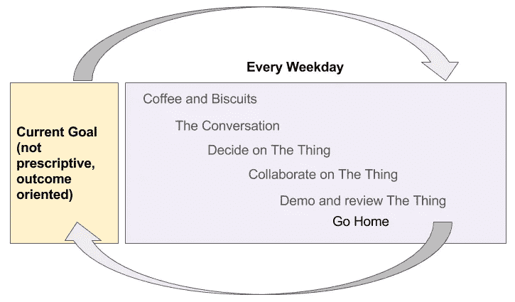

# 一天冲刺

> 原文：<https://medium.com/hackernoon/one-day-sprints-1ce1f53a08b2>

*进行对话。去做吧。复习。回家*

我最近发了一条关于一天短跑的微博。

我想我应该回答一些关于这个的问题。但是首先…一个巨大的警告。这条推文不是“道”。我没有发明它。很多团队都做类似的事情。 [Ron Jeffries](https://medium.com/u/a45b68b1ab11?source=post_page-----1ce1f53a08b2--------------------------------) 有一天我和他聊起了这件事(他对冲刺“失败”的团队的建议是，如果必要的话，把冲刺缩短到一天)。我在单批流中做过类似的事情，后来尝试了这种一次冲刺的事情，结果发现其他人在尝试中发现了一些价值(包括一个好朋友，取得了一些巨大的成功)。

你有非常非常充分的理由来解释为什么这对你来说很糟糕。

*注意:我敢肯定这里有拼写错误。我会慢慢修复它们。*

开始了…

*   你有什么建议？
    总之:一天冲刺。这并不罕见。每天都出现。进行对话。(作为一个小组)找出你能在一天结束前交付和演示的东西。如果很小也是可以的。开始吧。结对/群殴/白板/各个击破/聊天/玩得开心。让它进入一个类似生产的环境。回顾一下。回家吧。重复一遍。看起来是这样的:

*   **为什么？**
    有何不可？“为什么不”能帮助你向顾客传递价值吗？
*   没有真的自作聪明…为什么？
    第 1 部分:是一个 [*强制功能*](/@johnpcutler/forcing-functions-and-continuous-improvement-7d06e4702da0) 。对于软件产品开发团队，你有几个杠杆可以利用。它们包括:批量大小、问题分解方法、工作进度限制、多任务、工作分配策略、如何对计划工作进行批处理和调度，以及如何对检查和适应工作进行调度和批处理。您还可以选择是否通过 WIP 或某种时间增量来约束您的工作。您可以选择一个围绕优化流程效率或资源效率的总体策略。总之，这种方法彻底改变了一切。我的经验是，我们对这些杠杆的直觉通常是错误的。在这个模型中，我们探索极限以加深我们对系统的理解。
*   第二部分呢？
    第二部分:至少，你会从这个系统中学到一些东西。你可能一直在努力进行长距离冲刺。事物感觉不新鲜。也许你增加了几个新的团队成员，或者改变了一些事情，你需要重新设置。或者你正处于危机状态，似乎什么都“不起作用”。经理们开始对你进行微观管理。或者你感觉团队在“踢屁股”，但是已经达到了持续改进的局部最大值。不管是什么，你都愿意尝试新的东西。
*   **你是说这是优越？没有，但可能会有帮助。它(以及其他一些东西)可能会让你找到更好的东西。想象你是一名运动员。有时尝试不同的运动/锻炼可以开辟另一个健身领域。这是我的哲学:唯一“正确”的方法，就是使用让你发现正确方法的方法。没有一种非定制/规定的方式是针对您的情况而优化的。**
*   我们何时整理故事？
    早晨。你可以在方便的时候开始对话。你想去多久就去多久，直到你有了一天的大致计划。有时需要十五分钟，有时更长。
*   **积压的怎么样？**
    故事分解可以发生在谈话过程中。backlog 可以是更高的层次，更少的规定性。我建议使用结果驱动项目，或者高级用户故事。
*   **这个问题我们无法分解！**
    写一个失败的测试。编辑一行 CSS。移除标签。说真的……你可以把问题分解一下。
*   但是这对我们的客户来说没有价值！
    很公平。但这是你必须做的工作。此外，学习对我们的客户来说是有价值的，如果这意味着我们最终帮助他们更好地工作/生活。一天结束时，问…“我们今天学到什么了吗？”希望答案是肯定的。
*   **就一个故事？几个故事？**
    从一开始。搞定它。
*   **把这比作 Scrum。我们还能做什么？你每天都要做冲刺计划。你每天都要做一个演示。每日站立。也许每隔一两周在谈话中加入一点怀旧的元素。**
*   **这不就是任意小故事的看板吗？**
    耶。算是吧。它有点类似于单批流(一个强制函数)，但有另一个强制函数:故事大小。
*   我们曾经有个人的每日和每周目标。这有什么不同？
    你当天只有一个团队目标。这毕竟是一项团队运动。此外，你不会在 sprint 计划会议上把一大堆故事放在一起，然后掷骰子两周，把它作为你的目标。每天的目标是作为一个团队，将具有合适测试覆盖的东西投入到测试、试运行或生产中。再说一次，这并不妨碍你移动大石头和大目标…你也可以有这些目标。
*   **我们如何测量速度？！** 从容不迫。速度是≥每天一个故事，一旦你开始滚动。周期时间是 8 小时，如果你在那个度量中(并且我推荐你进入那个度量)。如果你感觉好色，给这个东西一个故事点的估计，并计算它。将其与您以前的 SP 速度和故事数进行比较。例如:在两周的冲刺中，团队完成了 30 个故事点的 10 个项目。现在，在 10 个工作日内，团队完成了 45 个故事点的 15 个项目。最重要的是，衡量重要事物的速度和进展(推动客户成果)。
*   但是我们两个星期的冲刺总是失败！为什么总有一天会成功？你的冲刺没有失败。除了最小的故事之外，你没有考虑评估的可变性、计划外的工作和易错性。你的失败在于没有正确使用冲刺长度强制功能。我们将有十次冲刺，而不是一次。那样你学得更快。
*   比尔对服务器端代码一无所知。他游手好闲！
    该开始学习了，嗯？
*   **CI 因为片面性测试要花半个下午。**
    修复测试。
*   UX 现在做什么？他们以前给过我们线框！
    好问题。我建议在谈话过程中一起解决问题，然后配对。你也可以花一整天(或者更多)来构建一个原型。
*   **这是把团队当婴儿！你完全正确…如果这是一个管理法令。他们会把同样的微观管理转移到这个实践中。让我提出另一个观点:团队尝试他们如何工作。我认为这可能最终会让你摆脱管理层。如果你能克服这个障碍——假设管理层需要决定你的过程，而你无力指明方向的障碍——那么好事在等着你。**
*   **我们提前结束了。我们该怎么办？**
    回家。明天见！
*   但是我们没有会议室可以用那么久！
    搞定那个。或者，如果管理层负担不起会议室，就在户外开会。确保你有一个大白板可用。给同楼层的其他人买些降噪耳机。博斯很好。成本低于房地产。你可能会惹恼他们，让他们有自己的工作空间。
*   我们永远不可能在下午 5 点前完成任何事情！
    不停地挑选越来越小的物品。
*   **会议太多！无论如何，你们都是为了单口相声而见面的。让对话成为一天中唯一的“正式”会议。你想说多久就说多久。**
*   如果故事如此之小，我们如何看到全局？
    再买一块白板，把小东西映射到大东西上。让它可见。保持大目标在前面和中心。将您的日常工作与大图联系起来是软件产品开发的关键挑战之一…无论您的冲刺有多长，它都不会消失。
*   **我们什么时候谈论大局？如果需要就“大局”进行更多的讨论，那么听起来你只能说得更多(对话)。上午 9:30 开始。如果是下午 3 点，仍然没有小任务，回家重复。**
*   人们无所事事地坐着。
    一对。暴徒。做一些简单的重构来打开故事。
*   **单口相声呢？** 快速办理入住手续。生产中有什么问题吗？有火吗？从技术上来说，不应该有任何东西在进行，但是有东西溜进来了。然后直接进入对话。
*   **每天给客户运东西？一些公司会这样做，并把它藏在一面特色旗帜后面。但至少，要让它进入一个测试或试运行的环境，在那里任何人都可以演示这项工作。你使用特征标志吗？这可能有助于你把它投入生产。**
*   我们如何获得顾客的反馈？有些日子不需要顾客的反馈。总有一天会。定期(也许一周两次)安排一次与用户的定期电话或会议。目标是总有东西可以展示。如果从客户那里得到反馈实际上是你的障碍…那么，这是你需要关注的事情。
*   你如何让利益相关者和更广泛的团队参与进来？普通的东西:信息辐射器、常规演示、决策日志、工作软件(他们可以在办公桌上尝试)。相信我，他们会很高兴看到事情发生，甚至会放松他们的控制方式。试着理解他们的微观管理，尤其是当团队在展示进展上有困难的时候。进步和有效的结果让怀疑者沉默。
*   我们不断被生产问题打断！
    还好。甚至更好。让每个人都集中精力去修复它们。然后减少生产问题的数量。不管怎样，当火在燃烧的时候，你也没做多少事。还有…听起来真的很重要。“不断获得”会让你的 9s 承诺大打折扣！
*   **我们不断被支持人员打断，为他们运行手动任务！**
    弄清楚他们如何能自己(安全地)运行那些。
*   需要有人在烧毁的图表上看到我们的进展，我们会把自己逼疯，因为我们的故事数量增加了两倍！
    容易。列出一个非解决方案的、可验证的、无可争议的、有顺序的目标清单(这是他们关心的事情)。把它们贴在墙上。开始核对。事情是这样的…将小而谨慎的工作需求与项目管理的大块进展结合起来总是一个坏主意(IMHO)。一个人总要受苦。最好区别对待。
*   **听起来好像这只是针对“成熟”的团队！少年队怎么样？你的意思是告诉我，五个合格的(但可能缺乏经验的)专业人士一天之内不能完成一个小故事？另外，我想你们队里有经验丰富的人可以带路，对吗？说真的！打开一个文本编辑器。和他们一起进入草丛。如果你是对的……这个团队从来都不是阻挡者。你的组织需要成熟。**
*   **听起来这只是初级团队的事。我们不需要这些东西！**
    这里的妙处在于总有东西可以学。你还在和一些阻碍做斗争吗？想象一个有 CI/CD 的组织，一个类似安全生产的环境，可以获得最新的更新。现在想象一些小故事。它开始看起来像这样。
*   我的团队是一群懒鬼。他们会拖我后腿的！我不会升职的。
    在您的组织中，人们是以这种方式受到激励的吗？也许吧。如果是这样——如果你的同事真的在偷懒——我不会因为你讨厌这样而责怪你太多。但我建议两件事:1)你可能看不到所有的东西(你可能对这个问题有一点点贡献)，2)考虑在你没有这种感觉的地方工作。为什么不在信任的环境中工作呢？最后……在这个模型中没有隐藏(但是不要告诉经理们)。
*   在团队中，我们是内向的人。社交太多！我更喜欢有几天自己的小任务。
    这是一个非常好的观点，你当然应该和你的团队讨论一下。这涉及到了人性的一面，这一点非常重要。如果你“做对了”，就不会有更多的会议。也许你可以在人们结对的时候选择一个更个性化的任务？或者一周一次安静的一天，不同节奏的任务。
*   但是我们会走得很慢！
    数据会自己说话。首先对你当前的方法进行基准测试。用故事点和故事计数来度量吞吐量。测量周期时间。衡量计划外的工作。现在试试。你看到了什么？是的，故事会更小，这将影响数据。所以你应该对你的顾客价值单位做同样的事情。记住，你的“旧”系统对人们如何界定故事范围的变化很敏感。
*   **如果有效呢？那我们就需要永远这样工作下去。**
    不是什么可怕的问题。
*   **如果没有呢？一路上你会学到很多东西。团队发现他们根本无法消除的瓶颈。但是揭示这些瓶颈可能是一种胜利。**

唷。这上面 2000 字左右。哦天啊。

回到警告。我敢肯定有一百万个理由为什么这对你不起作用。我没问题。即使作为一个思想实验，这也是值得的。