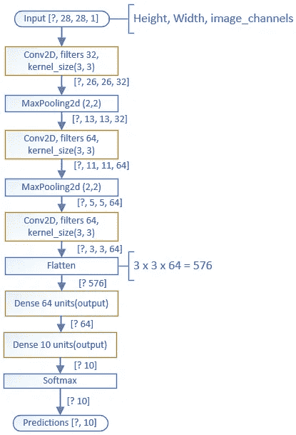
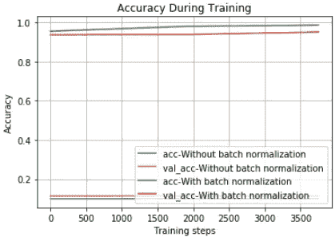
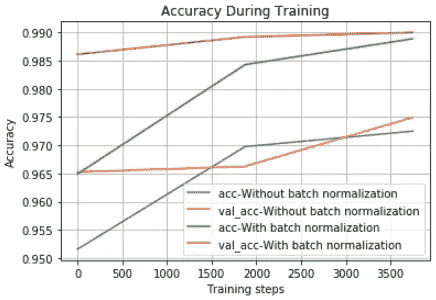

# 一个简单的技巧来训练 Keras 模型更快与批处理规范化

> 原文：<https://medium.com/hackernoon/one-simple-trick-to-train-keras-model-faster-with-batch-normalization-baa7787bf923>


【www.dlology.com】最初发表于[](https://www.dlology.com/blog/one-simple-trick-to-train-keras-model-faster-with-batch-normalization/)**。**

***免责声明**:批量归一化确实是一种帮助训练更快的优化，所以你不应该把它当成是让你的网络变得更好的一种方式。*

# *什么是批量正常化？*

*论文中首先介绍:[通过减少内部协变量移位来加速深度网络训练](https://arxiv.org/pdf/1502.03167.pdf)。*

*随着数据流经深度网络，权重和参数会调整这些值，有时会使数据再次变得过大或过小——作者将这一问题称为“内部协变量移位”。通过标准化每个小批量的数据，这个问题在很大程度上得以避免。批次标准化通过均值和方差参考对每个批次进行标准化。*

# *批量标准化的好处*

*   *网络训练越快，收敛越快，*
*   *允许更高的学习率。梯度下降通常需要较小的学习速率来使网络收敛。*
*   *使权重更容易初始化*
*   *使更多的激活功能可行。因为批量标准化调节进入每个激活函数的值，在深度网络中似乎不太适用的非线性实际上又变得可行了。*
*   *可能会产生更好的整体效果。*
*   *批量标准化照常使用权重，但是**而不是**增加了偏差项。这是因为它的计算包括伽玛和贝塔变量，使得偏差项变得不必要。在 Keras，你可以做`Dense(64, use_bias=False)`或`Conv2D(32, (3, 3), use_bias=False)`*
*   *我们在调用激活函数之前添加了规范化。*

# *启用了批量规范化的 Keras 模型*

*一个正常的**密集的**全连接层看起来像这样*

```
*model.add(layers.Dense(64, activation='relu'))*
```

*要使其批量标准化启用，我们必须告诉密集层不使用偏差，因为它不是必需的，它可以节省一些计算。同样，把激活层放在`BatchNormalization()`层之后*

```
*model.add(layers.Dense(64, use_bias=False)) model.add(layers.BatchNormalization()) model.add(Activation("relu"))*
```

# *Conv2D 层*

*正常的 Keras **Conv2D** 层可以定义为*

```
*model.add(layers.Conv2D(64, (3, 3), activation='relu'))*
```

*将其转到批量标准化的 Conv2D 层，我们添加了类似于上面的密集层的`BatchNormalization()`层*

```
*model.add(layers.Conv2D(64, (3, 3), use_bias=False)) model.add(layers.BatchNormalization()) model.add(layers.Activation("relu"))*
```

# *比较培训绩效*

*通常，模型需要足够复杂，以便训练可以从批量标准化中获得明显的好处。*

*出于演示的目的，我们选择 MNIST 手写数字数据集，因为*

*   *数据集附带 Keras，因此不需要额外下载*
*   *它的训练速度相对较快*
*   *模型架构很容易理解*

*这是一个简单的模型结构，具有 3 个堆叠的 Conv2D 层，用于从手写数字图像中提取特征。将数据从 3 维扁平化为 1 维，然后进行两次密集分层，生成最终的分类结果。*

*我们将对所有**致密**和 **Conv2D** 层进行批量归一化，并将结果与原始模型进行比较。*

**

*我们用不同的参数训练模型，并并排比较两个模型*

*   *学习率(高或低)*
*   *激活(relu 或 sigmoid)*

```
*train_and_test(learning_rate=0.001, activation='sigmoid', epochs=3, steps_per_epoch=1875)*
```

**

*正如我们所看到的，使用批次归一化的模型的验证准确度曲线略高于未使用批次归一化的原始模型。*

*让我们用 10 倍的学习率来训练这两个模型，*

```
*train_and_test(learning_rate=0.01, activation='sigmoid', epochs=3, steps_per_epoch=1875)*
```

**

*没有批量归一化的原始模型根本无法以这种学习速率进行学习。*

*如果我们使用非线性 **relu** 激活函数来代替相同的 x10 学习速率，*

```
*train_and_test(learning_rate=0.01, activation='relu', epochs=3, steps_per_epoch=1875)*
```

**

*最后，未经批量归一化的原始模型能够进行训练，而经过批量归一化的模型在训练过程中具有更高的验证精度。*

# *摘要*

*这篇文章展示了对现有的 Keras 模型应用批处理规范化是多么容易，并展示了一些训练结果，比较了有和没有批处理规范化的两个模型。值得注意的是，批量标准化在相对较大的学习速率下工作良好。*

*最后一点，批量标准化处理训练和测试是不同的，但是它在 Keras 中是自动处理的，所以你不必担心。*

*在我的 [GitHub repo](https://github.com/Tony607/BatchNormalization_Keras) 上查看这篇文章的源代码。*

# *进一步阅读*

*论文[递归批量归一化](https://arxiv.org/abs/1603.09025)*

*[批量标准化 Keras 文档](https://keras.io/layers/normalization/)*

*[用于 Tensorflow 演示](https://github.com/udacity/deep-learning/tree/master/batch-norm) —向您展示培训和测试的区别*

*[在 Tensorflow 中实现批量归一化](https://r2rt.com/implementing-batch-normalization-in-tensorflow.html)*

**像这样更实用的深度学习教程，查看*[*www.dlology.com*](https://www.dlology.com/blog/how-to-leverage-tensorflows-tfrecord-to-train-keras-model/)*。**