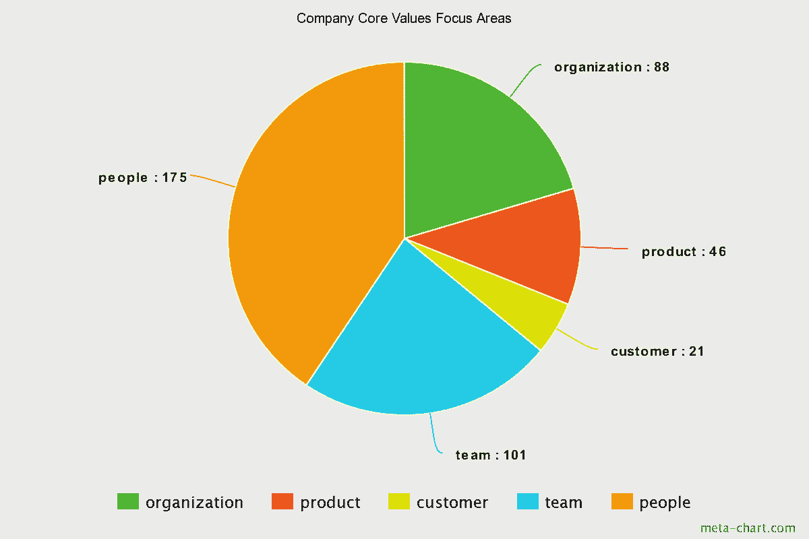

# 门户开放政策:对公司文化最懒惰和最不完整的回答

> 原文：<https://medium.com/hackernoon/open-door-policy-the-laziest-and-most-incomplete-answer-to-company-culture-fb7cdd6e01a2>

去参加任何活动，问任何一家[公司](https://hackernoon.com/tagged/company)的 CEO“你的公司[文化](https://hackernoon.com/tagged/culture)是什么？”，大多数人会努力寻找答案。作为消除疏忽的最后努力，她/他将开始挥舞“门户开放政策”。

“门户开放”本身是 ***而不是*** 一种公司文化。这仅仅是鼓励管理层和他们的员工之间不断诚实沟通的最佳实践。

事实上，任何宣称“开放政策”是公司文化的首席执行官，都表明她/他还没有搞清楚公司文化，可能的原因是，对公司文化越来越忽视:

1.  相信公司文化，但不知道如何去做
2.  经常忽略中期目标(公司文化)而倾向于短期目标(伪文化(足球桌，免费午餐，有人吗？)，立即销售等。)
3.  愿意听取员工的反馈，但希望获得不容置疑的权威来忽略或根据她/他的个人判断采取行动
4.  不相信公司文化对公司的成功有重大贡献

幸运的是，思考“门户开放政策”是一个正确的开始，因为它是一个伟大的核心价值观，而核心价值观是公司文化的基本组成部分(如阿尔弗雷德·林(红杉风险投资家，)所定义的)。

要从这里开始，首席执行官必须克服在建设公司文化方面的疏忽，按照*倒序*处理上述问题，即从最严重的问题开始。

***相信公司文化会加速公司中长期的成功***

要把这种信念灌输给每个人，在全公司会议(内部)和网站(外部)上宣布。首先，这意味着接受至少一个核心价值。事实上，“门户开放政策”是一个很好的基本核心价值，因为它鼓励通过诚实和接触反馈来迭代开发公司文化。

***凭借职位放弃权力，但通过倡导公司文化重新获得权力***

管理层经常行使不受约束的权力来决定员工提出的问题。这很难说是对公正的认可。更糟糕的是，不同经理对公平的解释不一致，导致公司文化支离破碎。

正式宣布公司文化(前一步)是管理层放弃不受约束的权力的行为；如果任何人，无论职位高低，有一个与公司文化一致的问题，她/他可以 100%保证她/他会得到明确的支持来解决它。正规化的公司文化，这是一致的，成为法律，而不是任何一个经理，谁很容易被突发奇想和政治所左右。

拥护公司文化的首席执行官表明，他不害怕被束缚在和每个人一样的公司文化中，并且会被尊为真正的权威。

***当出现与公司文化相关的问题时，放下一切***

技术型 CEO 倾向于以产品为中心，而销售型 CEO 倾向于以收入为导向。专注于推出一个功能或销售是令人满意的；它们可以在更短的时间内完成，结果是有形的，即，与抽象的公司文化相比，一个可用的功能或销售图表中的一个凸起，其回报只有在公司变大后才能实现。

为了克服这种关注短期收益的自然倾向，当务之急是，如果出现公司文化问题，每个人都要放下手头的一切，在恢复日常工作之前解决这个问题。

***发现你的文化***

如果你已经接受了公司文化，愿意将公司文化作为你公司的法律，并准备投入资源来建设它，下一步就是发现你的公司文化。这似乎是上面列表中所有项目中最令人望而生畏的。恰恰相反，这可能是最容易的，入门的坎源于相信你的公司文化是独一无二的，一旦决定就板上钉钉了；这两个都不是真的。你可以很容易地从成功公司的文化入手，并反复调整。这让你的早期员工有机会在公司早期成功的基础上建立一种文化。

**奖金**

为了支持我们的说法，即公司文化不是真正独特的，我们对 80 家公司进行了研究，核心价值观最常见的关注领域是:

你可以看到，许多公司围绕“人”打造核心价值观，这是完全可以理解的，因为“人”是公司最宝贵的资产。

五大以人为本的核心价值观围绕着:

1.  责任
2.  挑战
3.  效率
4.  诚实
5.  谦逊

围绕“责任”的核心价值观的一些例子有:

*   成为那个人
*   你打破它，你买了它
*   分担责任，独立行动
*   工作中的骄傲
*   拥有它

现在球在你的球场上，建立你的公司文化。我很想听听你的想法或者我能帮上什么忙。