# 从头开始打开源代码 node.js 包

> 原文：<https://medium.com/hackernoon/open-source-node-js-package-from-scratch-fa48242a1bbd>

在本教程中，我想展示创建 [node.js](https://nodejs.org/) 包并在 [npm](https://www.npmjs.com/) 中注册它是多么容易。我们的主要目标是看到这样的图像:

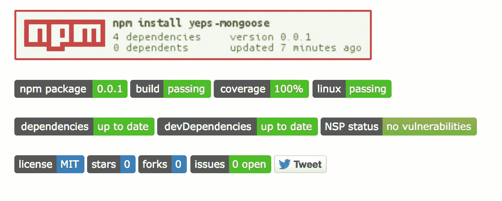

有很多开发人员使用开源代码，但从不回馈任何东西。我将展示如何简单快速地创建节点包并在 npm 中注册它。

对于本教程，我将创建 [YEPS](https://yeps.info/) 模块，并在 npm 中注册它。但是没有代码质量和测试代码覆盖率，它就不会完成。我将只使用 linux 进行测试，因为我认为 node 在 linux 环境下工作得更好，而且由于它是开源的，我们将在任何地方使用开源。而且 [MongoDB](https://www.mongodb.com/) 作为开源数据库对我们来说也是完美的。我将在[系列](/@evheniybystrov/full-stack-react-app-from-scratch-part-1-9086cacc59ac)的未来部分使用这个包。

我喜欢 idea: **不学框架。学习架构**。这就是为什么我不喜欢使用一个*大的通用框架*——与其解决业务问题，我需要花很多时间来学习这个框架，以了解所有的功能，并知道如何在一些抽象的未来问题中使用它。**喜欢过早优化**。

Node.js 是一个小软件包的平台。大多数包都有**单一责任**。它有助于解决问题，并为创建自己的应用程序甚至业务框架提供了可能性。如果您找不到符合自己需求的包，您可以创建自己的包并与其他开发人员共享。比如 [Airbnb 诚信通配置](https://www.npmjs.com/package/eslint-config-airbnb)。不要忘记测试——如果只有一个原因需要改变，那么测试就很容易。

那我们开始吧。首先，我们需要创建目录，并使用 **npm init** 命令创建 npm 项目:

```
mkdir yeps-mongoose
cd yeps-mongoose
npm init -f
```

因为它将是 YEPS 的一部分，我们需要创建一个模块来连接 mongo。为此，我们需要使用配置。让我们安装[配置包](https://www.npmjs.com/package/config):

```
npm i -S config
```

并创建文件 **config/default.json** :

```
{
  "mongoose": {
    "uri": "mongodb://localhost/test",
    "parameters": {
      "useMongoClient": **true** }
  }
}
```

这里我们设置了用于连接 MongoDB 的 uri 和一些参数。

为什么这么小的封装只有一个连接？Mongoose 帮助创建模式并将其保存为模型。但是为了保存和更新我们的数据，我们需要连接到真实的数据库。

当我们使用 node.js 作为一个 web 服务器时，我们需要处理两个流程，比如使用 [express.js](http://expressjs.com/) 或 YEPS: **应用启动**和[处理来自用户的请求事件](https://nodejs.org/en/docs/guides/anatomy-of-an-http-transaction/)。我们在运行节点进程时使用 first，它包括 JavaScript 文件，读取配置文件，连接到数据库…

在这里，我们可以使用我们的包。当第一次需要这个包时，它将读取配置文件并连接到 MongoDB。之后，我们可以创建模式，存储在文件中，并要求作为一个模块。由于 mongoose 连接到真实的数据库，我们的模型可以保存和更新数据。

接下来我们需要安装所有其他的**依赖**:[mongose](https://www.npmjs.com/package/mongoose)和 [npm-run-all](https://www.npmjs.com/package/npm-run-all) 和 [debug](https://www.npmjs.com/package/debug) :

```
npm i -S mongoose npm-run-all debug
```

和**依赖关系**:

```
npm i -D chai chai-http coveralls eslint eslint-config-airbnb-base eslint-plugin-import husky istanbul@next mocha mocha-lcov-reporter nsp rimraf yeps yeps-server yeps-error
```

和一些帮助文件:

**。编辑器配置**

```
root = true

[*]
end_of_line = lf
insert_final_newline = true

charset = utf-8

indent_style = space
indent_size = 2
```

不同 ide 中的团队拥有相同的代码标准会有所帮助。

**。eslintrc**

```
{
  "extends": "airbnb-base",
  "env": {
    "node": **true**,
    "mocha": **true** },
  "rules": {
    "no-unused-expressions": 0,
    "no-underscore-dangle": 0
  }
}
```

eslint 的配置——代码质量工具。

**.伊斯坦布尔. yml**

```
**instrumentation:
  default-excludes:** true
  **excludes:** []
  **include-all-sources:** true
```

代码覆盖工具。

**.travis.yml**

```
**sudo:** required
**language:** node_js
**node_js:** - "7"
  - "8"
**services:** - docker
**before_install:** - npm install
**script:** - docker version
  - node --version
  - npm --version
  - npm run lint
  - npm run test
  - npm run report
```

该配置有助于我们使用 [TravisCI](https://travis-ci.org/) 。我们需要使用 node.js，在 node 的最新 7 和 8 版本上测试它，我们将使用 docker 并运行几个命令进行测试:**检查版本**，**运行 lint，测试并报告**。

不要忘记我们文档中的[许可](https://github.com/evheniy/yeps-mongoose/blob/master/LICENSE)和 [README.md](https://github.com/evheniy/yeps-mongoose/blob/master/README.md) 文件。你可以在 [github](https://github.com/evheniy/yeps-mongoose) 或者 [npm](https://npmjs.org/package/yeps-mongoose) 中找到 README.md 的最新版本。

我们的主要代码是:

**index.js** :

```
const debug = require(‘debug’)(‘yeps:mongoose’);
const mongoose = require(‘mongoose’);
const config = require(‘config’); debug(config.mongoose); mongoose.connect(config.mongoose.uri, config.mongoose.parameters);
mongoose.Promise = global.Promise;
```

这里我们有调试工具，需要 mongose 包，配置和连接 mongose 到我们的 MongoDB 服务器。和小更新—从 node.js 设置 mongoose promise。

下一步是测试:

**tests/index.js**

```
require('..');
**const** App = require('yeps');
**const** srv = require('yeps-server');
**const** error = require('yeps-error');
**const** chai = require('chai');
**const** chaiHttp = require('chai-http');
**const** mongoose = require('mongoose');

**const** { Schema } = mongoose;
**const** { expect } = chai;

chai.use(chaiHttp);

**let** app;
**let** server;

**const** UserSchema = **new** Schema({
  name: {
    type: String,
    required: [**true**, 'Name is required.'],
  },
});

**const** User = mongoose.model('user', UserSchema);

describe('YEPS mysql test', () => {
  beforeEach(() => {
    app = **new** App();
    app.then(error());
    server = srv.createHttpServer(app);
  });

  afterEach(() => {
    server.close();
  });

  after(() => {
    mongoose.connection.close();
  });

  it('should test User', **async** () => {
    **let** isTestFinished1 = **false**;
    **let** isTestFinished2 = **false**;

    app.then(**async** (ctx) => {
      **const** test = **new** User({ name: 'Test' });

      **await** test.save();

      **const** users = **await** User.find({ name: 'Test' });
      expect(users[0]._id.toString()).to.be.equal(test._id.toString());

      **const** user = **await** User.findOne({ _id: test._id });
      expect(user.name).to.be.equal('Test');

      **await** test.remove();

      isTestFinished1 = **true**;

      ctx.res.writeHead(200);
      ctx.res.end(JSON.stringify(test));
    });

    **await** chai.request(server)
      .get('/')
      .send()
      .then((res) => {
        expect(res).to.have.status(200);
        isTestFinished2 = **true**;
      });

    expect(isTestFinished1).is.true;
    expect(isTestFinished2).is.true;
  });
});
```

在这里，我们创建一个简单的模式，运行 **YEPS** 服务器，并进行一些简单的操作，如创建、更新和删除数据库中的数据。

关于测试你可以在我的[上一篇文章](/@evheniybystrov/full-stack-react-app-from-scratch-part-1-9086cacc59ac)中读到。

**package.json**

```
{
  "name": "yeps-mongoose",
  "version": "0.0.1",
  "description": "YEPS Mongoose connector",
  "main": "index.js",
  "scripts": {
    "lint": "npm-run-all lint:**",
    "lint:js": "eslint index.js tests",
    "test": "npm-run-all test:**",
    "test:db:start": "npm run db:start",
    "test:db:preparing": "node -e \"setTimeout(()=>1, 1000)\"",
    "test:security": "nsp check",
    "test:code": "mocha tests --recursive",
    "test:coverage": "istanbul cover _mocha -- tests --recursive",
    "test:db:stop": "npm run db:stop",
    "report": "cat ./coverage/lcov.info | ./node_modules/.bin/coveralls",
    "clear": "rimraf coverage",
    "precommit": "npm run lint && npm test",
    "prepush": "npm run lint && npm test",
    "db:start": "docker run -d --name mongo -p 27017:27017 mongo",
    "db:stop": "docker rm -f mongo"
  },
  "repository": {
    "type": "git",
    "url": "git+https://github.com/evheniy/yeps-mongoose.git"
  },
  "keywords": [
    "promise",
    "http",
    "server",
    "rest",
    "fast",
    "async",
    "await",
    "https",
    "ssl",
    "easy",
    "mongoose",
    "mongo"
  ],
  "author": "Evheniy Bystrov",
  "license": "MIT",
  "bugs": {
    "url": "https://github.com/evheniy/yeps-mongoose/issues"
  },
  "homepage": "https://github.com/evheniy/yeps-mongoose#readme",
  "files": [
    "index.js"
  ],
  "engines": {
    "node": ">=7.6.0"
  },
  "dependencies": {
    "config": "^1.26.2",
    "debug": "^3.1.0",
    "mongoose": "^4.12.2",
    "npm-run-all": "^4.1.1"
  },
  "devDependencies": {
    "chai": "^4.1.2",
    "chai-http": "^3.0.0",
    "coveralls": "^3.0.0",
    "eslint": "^4.9.0",
    "eslint-config-airbnb-base": "^12.0.2",
    "eslint-plugin-import": "^2.7.0",
    "husky": "^0.14.3",
    "istanbul": "^1.1.0-alpha.1",
    "mocha": "^4.0.1",
    "mocha-lcov-reporter": "^1.3.0",
    "nsp": "^2.8.1",
    "rimraf": "^2.6.2",
    "yeps": "^1.0.0",
    "yeps-error": "^1.2.0",
    "yeps-server": "^1.0.0"
  }
}
```

Package.json 文件**是任何 node.js 项目中最重要的文件**之一。它的名称是 **app** 、**版本**、**关键字**、**依赖关系** …最重要的是——**它有脚本部分**，可以轻松运行任何带有 npm 的命令，如测试或启动服务器。

这里最有趣的命令是运行 docker:

```
"db:start": "docker run -d --name mongo -p 27017:27017 mongo",
"db:stop": "docker rm -f mongo"
```

这有助于在 docker 中将 mongo 作为一个打开了 27017 端口的进程来启动。要测试它，只需运行 **npm 运行数据库:启动**或 **npm 运行数据库:停止**。

测试代码后的第一步是**将它保存在 github** 中。为此，我们需要创建一个新的存储库:

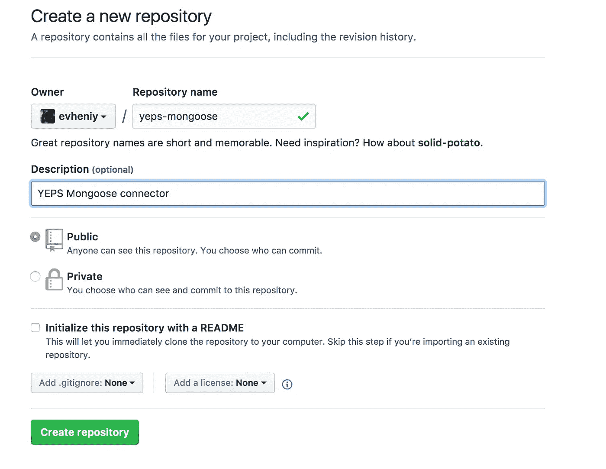

Github 帮助并显示**为此的所有步骤**:

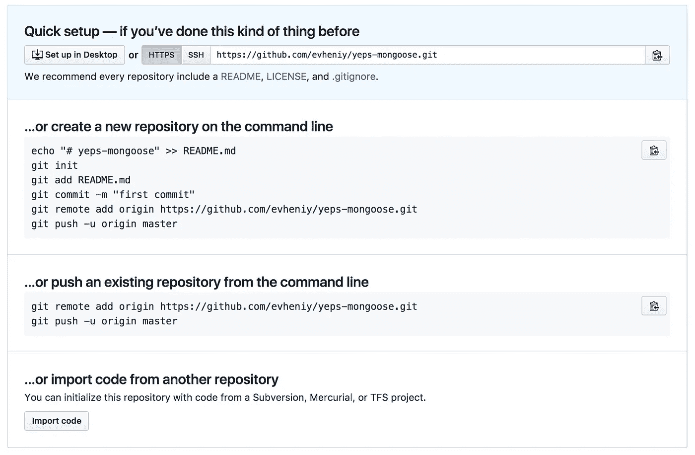

但是在保存我们的代码之前，我们需要配置 TravisCI 和[工作服](https://coveralls.io/)。打开 TravisCI 管理面板后(不要忘记创建帐户并登录)，我们需要**同步 github 库**。只需点击**同步账号**按钮:

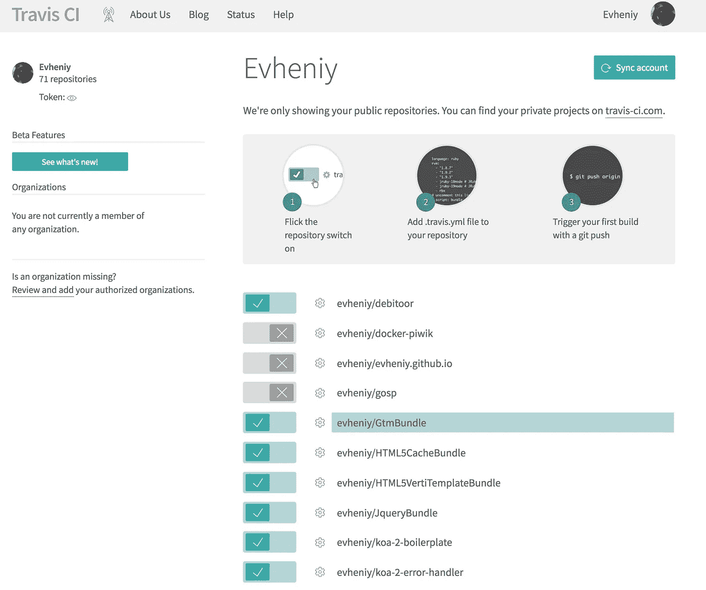

您可以看到我们的新存储库:

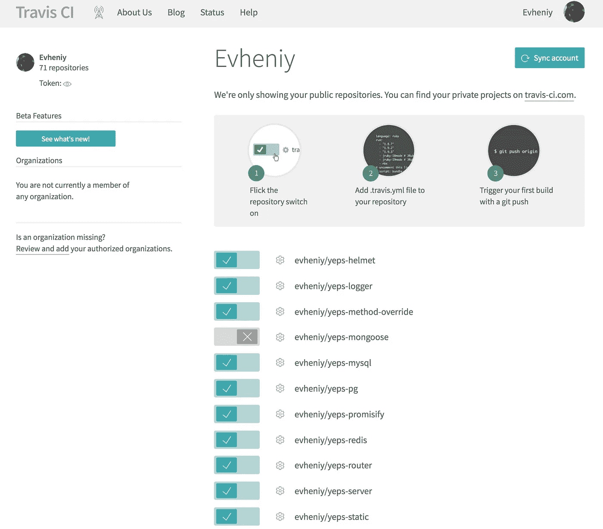

并在每次提交后启用我们的新存储库来检查和运行测试:


下一步:我们需要为**工作服**做同样的。登录并添加存储库:

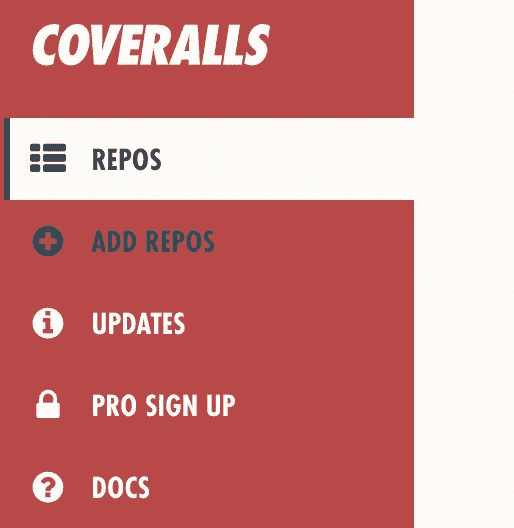

我们需要**同步 github 库**，在下一张图的底部，我们可以看到一个新的库。只需**启用**即可:

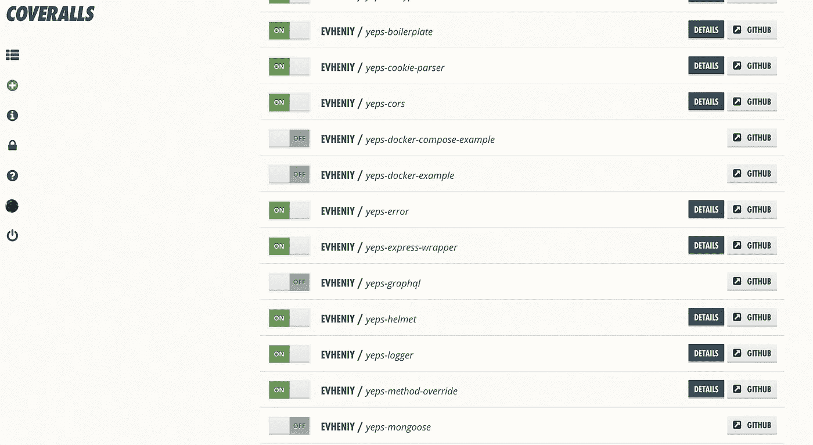

我们已经准备好进行第一次提交，并在 github repository 中看到我们所有的更改:

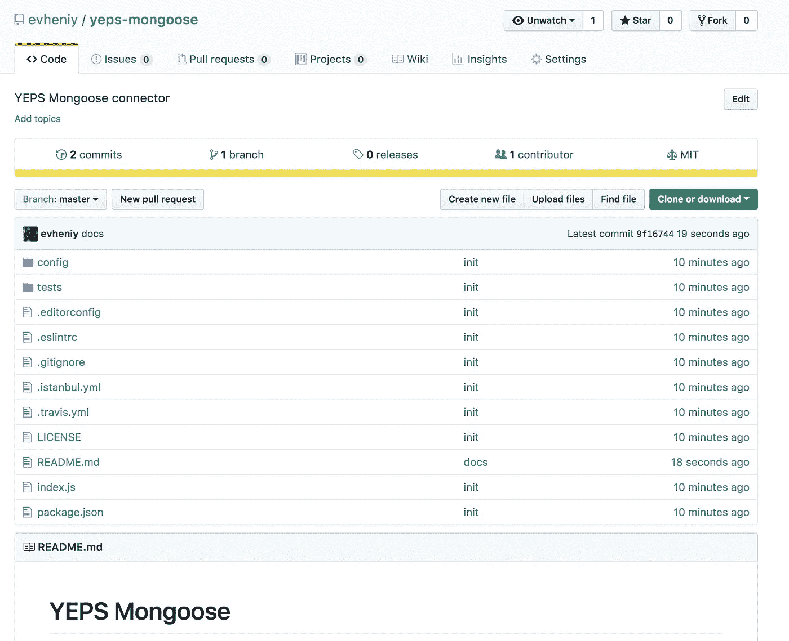

让我们打开 TravisCI 并检查**构建状态**:

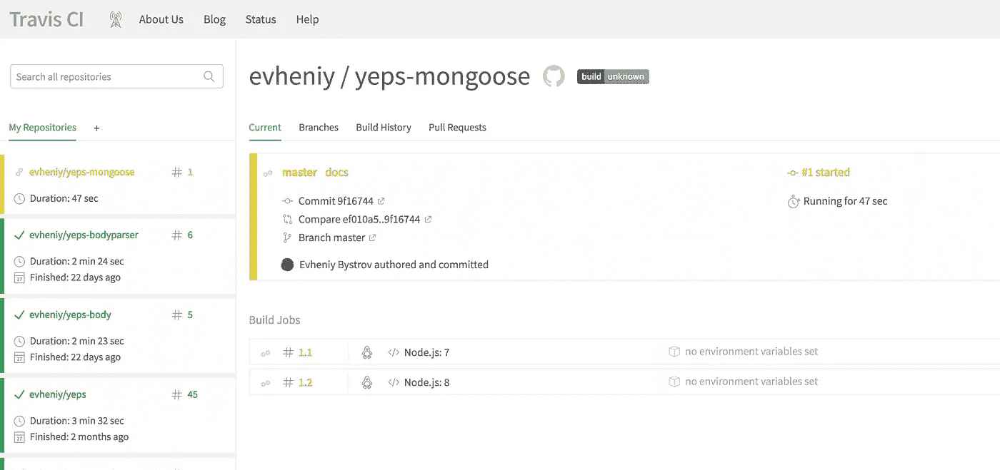

通过所有测试和检查后，我们可以看到**的绿色状态**。我们的主要目标是让它一直保持绿色:

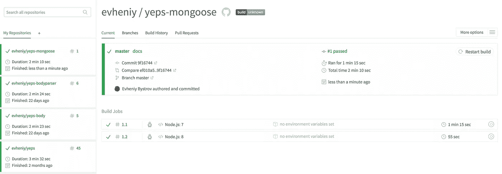

打开工作服并检查**代码覆盖率**:

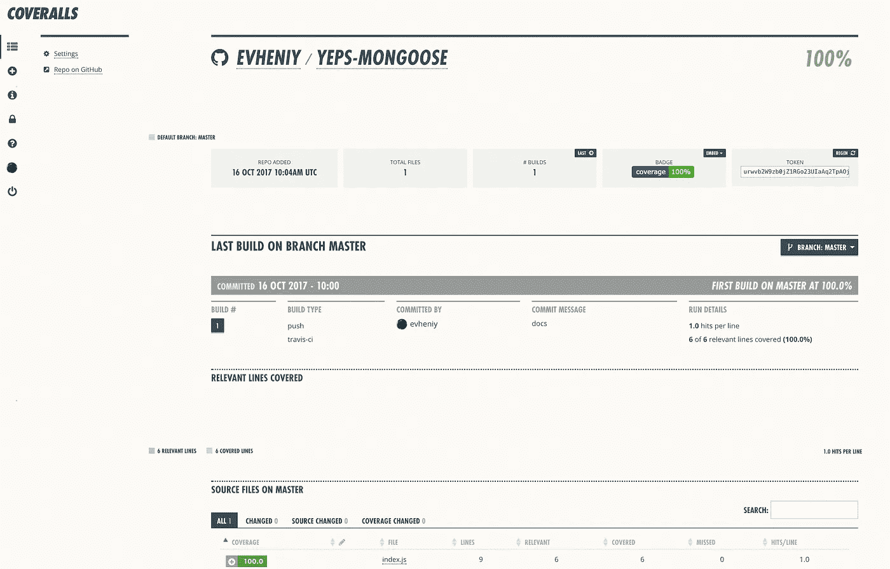

我们准备发布它。只需运行命令 **npm publish** 即可。如果 npm 要求登录，只需输入您的 npm 帐户的登录名和密码(不要忘记创建它):


我们可以在 github 中看到更新的状态:


和 npm:


所以差不多完成了。我们需要检查依赖关系，只需点击 [**依赖关系**](https://david-dm.org/evheniy/yeps-mongoose) 链接或者**徽章**:


和 [**devDependencies**](https://david-dm.org/evheniy/yeps-mongoose?type=dev) :

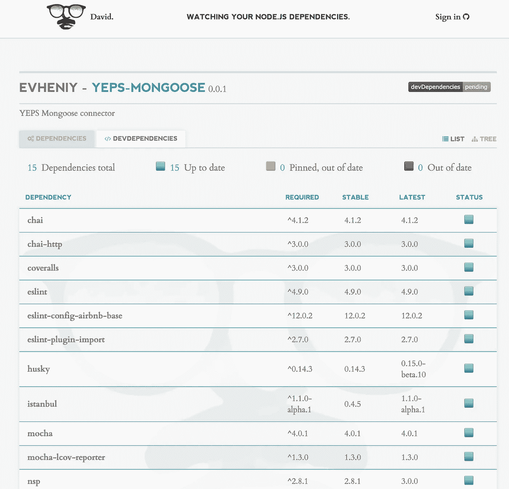

所以是最新的。不要忘记**支持**它，并在需要时更新。

别忘了添加徽章。像 TravisCI 或工作服这样的服务都有自己的徽章，或者像 http://shields.io/这样的综合服务。

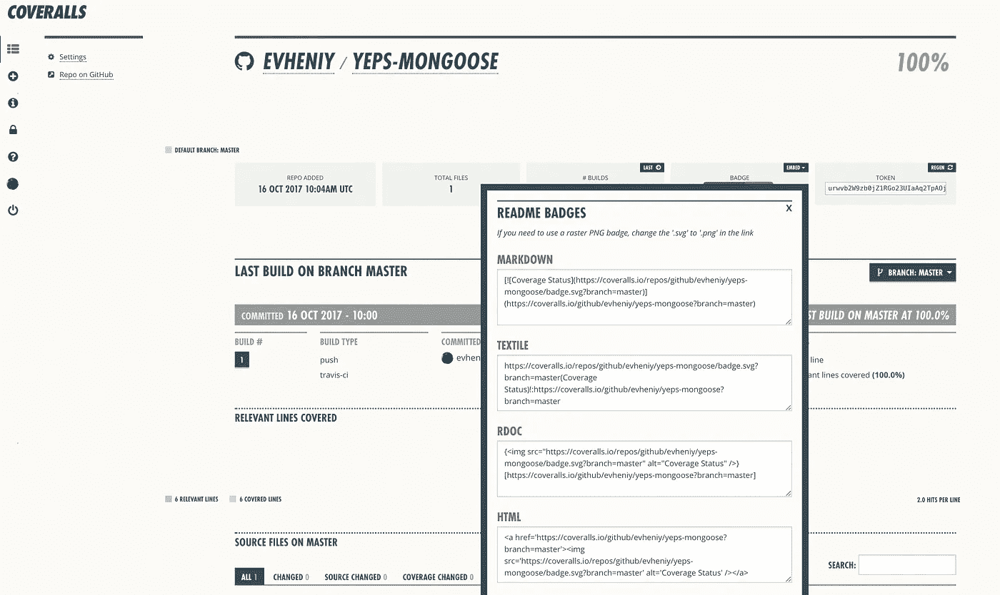

但是它们可以被缓存，所以至少 1 天后它们会被更新。


以及一些简单的规则，它们是如何组织你的代码的最佳实践。将你的整体项目分割成小的单一责任包。将代码和测试存储在 **github** 或 [bitbucket](https://bitbucket.org/) 中。

但是**只有源代码**。如果你需要用 [webpack](https://webpack.js.org/) 或者[gupp](https://gulpjs.com/)来构建，比如把 [typescript](https://www.typescriptlang.org/) 或者 [flow](https://flow.org/) 编译成 js 文件， [sass](https://www.npmjs.com/package/node-sass) / [less](https://www.npmjs.com/package/less) 转换成 css，在把 **保存到 npm** 之前先把它做成**。并将您的生产就绪代码存储在 npm 或私有存储中。**

Npm 包应该易于导入任何项目，无需准备、编译、打包...

仅此而已。现在你可以看到为开源做贡献是多么容易。