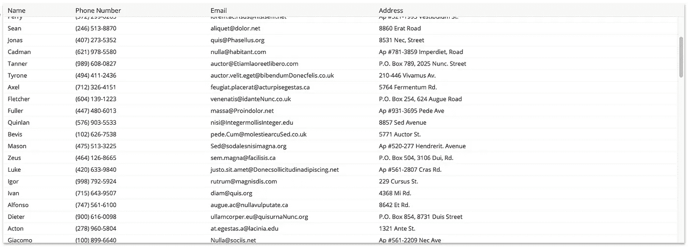

# 开源 Redux 组件

> 原文：<https://medium.com/hackernoon/open-sourcing-a-redux-component-bb82f260ff62>

这是一个关于我如何构建(在 [taco](https://github.com/taco) 不可估量的帮助下)一个 React/Redux 网格组件的故事，恰当地(并且无聊地命名为) [React-Redux-Grid](https://github.com/bencripps/react-redux-grid) 。

这是关于我们如何开始构建一个东西，它如何在过程中发生变化，我们搞砸的事情，我们学到的事情，我们将以不同方式做的事情，以及我们未来要做的事情。

# 开始建造一个东西

当时，我为一个组织工作，该组织正在改造他们的 UI 堆栈，从 Ext JS 升级到一个基于 [React](https://facebook.github.io/react/) 的更现代的平台。不用深入了解太多的背景，我们现有的应用程序是一个整体，有几十个视图，数百个丰富的 UI 组件，以及一堆意大利面条，将我们的*状态管理*概念结合在一起(稍后将详细介绍)。简而言之，我们有一堆要重建(令人兴奋！)，重构(硬！)，并重新想象。对我们来说，最大的障碍之一是我们需要一个健壮的网格组件，因为我们的大部分应用程序都是围绕显示表格数据并与之交互而构建的。尽管我们做了研究，但是我们找不到一个足够可扩展的网格来满足我们的 UI 和数据需求。我也承认，我们有在早期创造东西的嗜好，因为我们以前的应用程序大量涉及扩展 EXT 的组件，而不是构建我们自己的组件，我们感觉被这个咒语咬了一口。

很早的时候，我们就知道我们将要做出反应。社区在背后支持它，它符合我们的功能品味，并且 API 是干净的和富有表现力的。我们在选择 Redux 时有点幸运，尽管我们玩弄了[通量](https://facebook.github.io/flux/docs/overview.html)和[核](https://optimizely.github.io/nuclear-js/)，最终选择 Redux 是因为单店隐喻对我们有意义。

我没有停下来思考为什么我们的 UI 组件需要通过 Redux**连接**。现在，当然，我完全理解通过“商店”访问组件状态的便利。从组件实例中检索反应状态非常麻烦。但老实说，我不认为我当时想过这个问题。我想我只是想要一个 Redux 组件，因为这是一个有趣的问题。

不管怎样，下面是我们在构建之前提出的高级需求的简短列表:

*处理大型数据集
*开放式事件模型，其中 DOM 交互可以对应某些回调
*每一行都需要能够触发动态菜单和动作
*支持平面列表或树结构
*可调整大小/可排序的列
*单元格的自定义呈现模型
*可编辑行、验证、持久性
*经过测试。经过全面测试。
*快。非常快。
*可扩展/模块化风格

虽然我们马上遇到了一堆问题，但我只打算谈一谈最有趣的问题:

## “DOM”问题

现在我们都知道 React 把事物渲染成一棵树——这很好。通常都很棒。看看这个网格。



我们注意到了什么？我们有一个标题和一些行。简单吧？嗯，是的，也不是。这里的问题是，我们有一个可滚动的容器，其中有许多行，一个不同的标题应该与所有这些行同步。

你说有什么大不了的？让我们来看看这个假设的 DOM 结构:

```
<table>
    <thead> …headers </thead>
    <div style=”overflow-y:auto”>
        <tbody>
            <tr></tr>
            …more rows
        </tbody>
    </div>
</table>
```

我相信您现在已经猜到了，这在 React 上是行不通的。如果我们尝试这个 DOM，相信我，我们会得到下面的错误:

```
Warning: validateDOMNesting(…): <tbody> cannot appear as a child of <div>
```

这是有道理的，因为是的，这是相当大的 HTML。我还想指出，制作一个 **< tbody >** 卷轴看起来几乎不可能。但是因为我们需要能够调整列的大小，并且我们不想依赖于 [JavaScript](https://hackernoon.com/tagged/javascript) 来保持我们的标题和单元格对齐(因为总的开销)，我们需要一个新的解决方案。我们想到了下面的解决方案，因为尽管 React 使得创建无效的 [HTML](https://hackernoon.com/tagged/html) 变得不可能，但是它使得渲染 HTML 变得非常便宜和高效:

```
<div><!--overall component container ->
    <table><!--table for just our visible headers-->
       <thead>
           …headers
       </thead>
    </table>
    <div style=”overflow-y:auto”>
        <table>
            <thead style=”visbility:hidden;”>
                …copy of above headers
            </thead> <!-- invisible headers -->
            <tbody>
                <tr></tr>
                …more rows
            </tbody>
       </table>
    </div>
</div>
```

我们在这里得到了更多的 DOM，但是我们也得到了一些非常强大的东西。虽然我们有两个 Header 组件的 HTML 副本，但它们实际上是完全相同的 React 组件(因此不需要额外的代码)，由 Redux 状态的相同部分驱动(不需要额外的状态)。这非常有帮助。当其中一个可见标题被调整大小时，虽然它不会自动更新相应的单元格，但是它**会用一个新的宽度属性更新 Redux 存储。这个宽度也驱动了不可见标题的宽度，然后触发浏览器调整可滚动容器中相应的< td >的大小。**

和 *Viola* ，我们有两个不同的表通过 Redux 状态进行通信。当标题动作发生时，我们**调度**一个动作，但是我们不需要跟踪单元格宽度(这将是痛苦和昂贵的)。

这是我与 React 和 Redux 一起工作的第一个“啊哈”时刻。我不断遇到以前用 jQuery 或 Angular 解决的问题，这些问题让 React 变得更加困难(比如无效 DOM 问题)。但是当涉及到以视图为中心的核心问题时，比如必须有效地更新 DOM，或者明智地管理状态，React 只是做了这些事后的思考。我真的一点都不需要在乎，所以我没有。

## “快速制造”问题

反应很快，但总有办法优化速度。虽然我们经历了一个 **shouldComponentUpdate** 阶段，在这个阶段，我们确定了每个组件，所以它们只在需要的时候重新绘制，但我将谈谈我们是如何为我们的问题空间优化 **connect** 的。

[Connect](https://github.com/reactjs/react-redux/blob/master/docs/api.md)) 是 Redux 公开的一个装饰器，本质上是将一个组件挂接到 Redux 存储上，这样它就可以读取状态原子。还有很多(这对性能优化非常重要)，但对于我们的目的来说，这可能就足够了。我要说的另一件事是，我们会招致更多的开销，因为所有连接的组件都在“监听”状态变化，并且必须在存储更新时通过 **mapStateToProps** 运行。

我们可以从最终的 DOM 结构中看到，我们将拥有一堆组件。与其他 UI 组件相比，网格带来的问题更多的是规模。例如，在我们的应用程序中，我们经常在一个页面上有数千条记录的实例，每条记录都有几十个我们想要显示的属性。这是大量的 DOM，但也有大量的事件监听器和内存中的 JavaScript 对象，等等。

我们从连接一切开始——嘿，需要从商店读取的一切！这意味着我们的标题，滚动容器，页脚，每一行，是的，每一个单元格。它起作用了——在某种程度上。当然，它渲染，但互动太慢，重绘不是 60 帧/秒清晰。我们需要做些不同的事情。

这就是目前关于这个问题的所有细节，因为我将在“我们搞砸的事情”部分讨论这个问题。但是我只想说，我们最终的解决方案(也许我们应该重新考虑)是只有一个相连的组件——网格容器。这样，我们只需运行 **mapStateToProps** 一次，并沿着链向下传递我们的道具，让 **shouldComponentUpdate** 处理其余的。这有时会导致一些不可维护的代码，但却是一个闪电般快速的协调/渲染周期。

## “我们出口什么”的问题

这就给我们带来了一个非技术性的问题。在开始的时候，构建一个“Redux-Component”是一个相对较新的想法。有一些 React 组件公开了一个导出—组件本身。有时他们动态地捆绑 CSS，有时您需要手动导入样式表。

但是 Redux 有一点不同，因为它增加了对存储、reducers 和动作的依赖。这些需要出口吗？我们不知道。我们猜测是这样的，但说实话，直到我们自己开始使用该组件时，我们才确定。

我们最终出口了所有东西——包括演示商店。我们想让网格自己运行，这样人们就可以“克隆”并看到它自己是如何工作的，有点像 UI REPL。但是除了最简单的用法之外，我们不想强加任何模式。正是基于这种想法，我们想出了以下出口:

```
export const modules = {
    Actions,
    Grid,
    Reducers,
    applyGridConfig,
    Store
};
```

现在对我们来说很明显，动作是必要的导出，因为它们变成了网格的公共 API 如何通过 **dispatch** 将信息传递给组件。我们还公开了许多 reducerss，每个 reducer 负责自己的网格状态部分(即数据、列、编辑器、分页)。在我看来，这使得处理网格变得或重或轻，就像导入开发人员所希望的那样。但是现在我有点觉得这是组件中比较烦人的部分之一。这使得网格内部的代码更干净，但是却产生了更烦人的 API。哦，好吧，就这样。

我们还导出了几个实用程序，我认为这是我们近期努力的方向——构建更多的实用程序，使使用网格变得更简单。

我们决定在运行时动态地包含 CSS，但是让它成为可选的。默认情况下，CSS 将被附加到文档中，但是可以通过 **applyGridConfig** 函数设置一个属性来忽略。对我来说，在这个新的勇敢的 React 世界中，一个简单的乐趣是组件可以真正自给自足和沙箱化——我总是很恼火，因为我需要通过 jQuery 组件的< link rel >标签来包含 CSS。

# 我们搞砸的事情

这一部分可以也应该是这个故事中最长的部分。但不会，大概是出于自保吧。

## 使用不变量是错误的

这就把我们带回了**连接**。由于我们担心连接成本，我们简单地减少了我们创作的修饰组件的数量——减少到 1 个。这几乎让我们走完了全程，除了当数据集变大(1000 以上)时，我们看到了很大的性能滞后，这让我们很不舒服。

我们开始使用 [React Perf](https://facebook.github.io/react/docs/perf.html) 工具来诊断问题，并且看到我们几乎没有在浪费的周期中花费时间。这是 React-Perf 的读数:


什么，我们在一个有 10，000 行的网格上只浪费了 1.8 毫秒？我们没有不必要地为组件重新计算道具，也没有不必要地重新绘制。那么，有什么问题呢？

我们打开了浏览器概要文件( [Chrome 的](https://developers.google.com/web/tools/chrome-devtools/rendering-tools/)是一流的，如果你从来没有使用过它)，我们录制了一个会话，在这个会话中我们执行了几个点击事件。我们经历了我们在大数据集上一直看到的严重滞后，所以我们去分析日志，看看发生了什么。

几乎**25%的 JavaScript 运行时间都花在了垃圾收集上。更令人担忧的是，将近 **8%** 的时间花在了[不变的 ejs](https://facebook.github.io/immutable-js/)‘**到**功能上？几个点击事件？**

当我现在考虑这个问题时，很明显这是由于我们对**mapstateprops**的糟糕实现，这涉及到将不可变的数据结构大量反序列化为普通的 JavaScript 对象。然而，那时，我记得这吹我的头发回来。我记得我在想‘什么样的内存泄漏需要我们 15%的执行内存？’。“东条到底怎么了？”。以下是事件的简化版本:

```
export const mapStateToProps = (state, props) => ({
    gridData: stateGetter(state, ‘dataSource’, props.stateKey),
});export const stateGetter = (
    state, key, gridStateKey
) => state.getIn([key, gridStateKey]).toJS();
```

对于我们关心的每个属性，无论是列还是数据，我们都在将我们的不可变数据(存储在我们的 reducers 中)转换成简单的 JavaScript 对象(在 **mapStateToProps** 中),因为网格的内部是在本地对象上运行的，而不是不可变的对象(某种分离关注点的虚弱尝试)。

即使在那时，我们也知道**到**将会非常昂贵，但是我们不知道的是**mapstateprops**甚至在**component update**之前就已经运行了，这要归功于 Redux。因此，每当一个动作被触发，我们就递归地跳转到网格的整个状态节点。这解释了为什么当数据集变大时，问题会线性增长。这也解释了垃圾收集的疯狂数量，因为执行**mapstatetorops**甚至没有对新创建的本地对象做任何事情——特别是当一个事件不需要重绘时，这些新对象就被丢弃了。

在我们发现问题出在哪里和出在哪里之后，解决方案就很简单了。我们简单地移除了**到**的调用，让网格的内部使用不可变的数据。这是我们获得最大性能提升的地方。自从这个改变之后，我们根本没有遇到任何真正的性能障碍。现在回想起来，我认为这是我犯的最严重的错误，导致我改变了对开源库的整体看法。

## 需要“商店”道具

这个问题已经得到了解决，但是在 5.0.0 版本之前，Redux store 是 grid 的必备工具之一。除非明确提供存储，否则它根本不会运行。我认为这是因为网格成熟时没有分析地形。我们最终[通过简单地从**上下文**中提取商店，非常容易地解决了](https://github.com/bencripps/react-redux-grid/pull/82)这个问题，这是许多其他流行的 Redux 框架已经实现的模式。

# 我们一路上学到的东西

可能这应该是最长的一段了吧？不，很可能不是，我们一路上搞砸了很多。

## 四处看看

虽然我们在探索未知的领域(尤其是我自己)，但每当我们不知道问题的解决方案时，我们都可以仔细阅读其他流行的 GitHub repos，看看事情是如何完成的，或者使用了什么模式。这是我希望自己在人生的每一步都能做到的事情。一分钟的研究可以为你节省数周的重构时间。

## 开源是一项繁重的工作

这是值得的。但是开源项目不会变得很棒，除非你有一群人一起工作。我无法告诉你让你不认识的人(没有挑衅)在一个项目上合作是多么令人兴奋。一些最有创造性和最彻底的改变来自于对一个老问题的新的看法。

**提交拉取请求。**如果你不想，或者你不知道从哪里开始，**打开一个问题**或者问一个问题。

## 测试有回报

在网格的生命周期中，它经历了 3 次重大的重构。移除 connect 和修改组件以使用不可变对象需要对大部分源代码进行几乎完全的重写。因为我们在开始时是增加测试和检查覆盖率的坚定支持者，这些重构变得更容易，感觉负担更轻。完成重构，看着测试通过，这种感觉真的很棒。更好的是，当一对夫妇因为好的理由失败时，改正被做了，并且我们能对我们已经建立的感到自信。

## 了解您使用的工具

我一直认为图书馆是黑匣子。如果我需要一个工具/组件/东西，而且它以前已经被制造过了，为什么还要重新制造轮子呢？当然，您学习了 API，并使用该工具来解决手头的问题。但除此之外，我通常不会深入了解这个问题是如何解决的。这让我很痛苦——我对不可变的工作方式有一个根本性的误解，这导致了很多痛苦和重构。如果我学到了什么，那就是在选择你的工具之前，花点时间看看它们是如何工作的，它们是否真的适合这项工作，并确保你正确地使用它们。

# 现在为未来干杯

以下是我们希望在近期或长期内完成的事情，排名不分先后:

*实现选择器
*添加新的 UI 插件(行扩展等)
*围绕过滤数据添加更多可扩展性
*演示站点的更多实例
*实现平面数据的拖放
*更好的文档

请打开一个拉取请求并完成其中一个目标！或者想出一个更好的主意！或者去修复一些 bug，或者重构一些不必要的东西。

在撰写本文的时候，grid 是 v5.1.8。我们已经走了很长一段路，但我们希望走得更远。

> [黑客中午](http://bit.ly/Hackernoon)是黑客如何开始他们的下午。我们是 [@AMI](http://bit.ly/atAMIatAMI) 家庭的一员。我们现在[接受投稿](http://bit.ly/hackernoonsubmission)并乐意[讨论广告&赞助](mailto:partners@amipublications.com)机会。
> 
> 要了解更多信息，请[阅读我们的“关于”页面](https://goo.gl/4ofytp)、[在脸书上给我们点赞/发消息](http://bit.ly/HackernoonFB)，或者简单地说， [tweet/DM @HackerNoon。](https://goo.gl/k7XYbx)
> 
> 如果你喜欢这个故事，我们推荐你阅读我们的[最新科技故事](http://bit.ly/hackernoonlatestt)和[趋势科技故事](https://hackernoon.com/trending)。直到下一次，不要把世界的现实想当然！