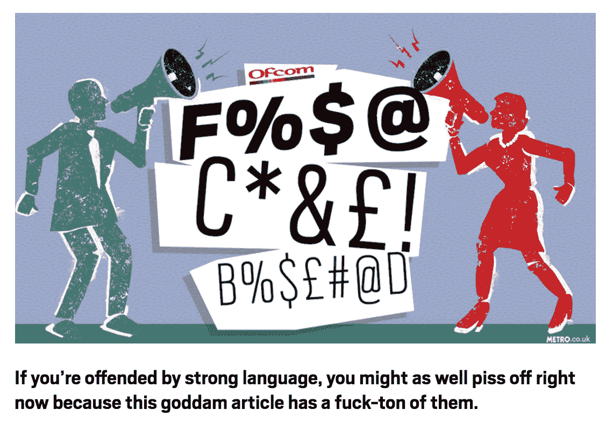
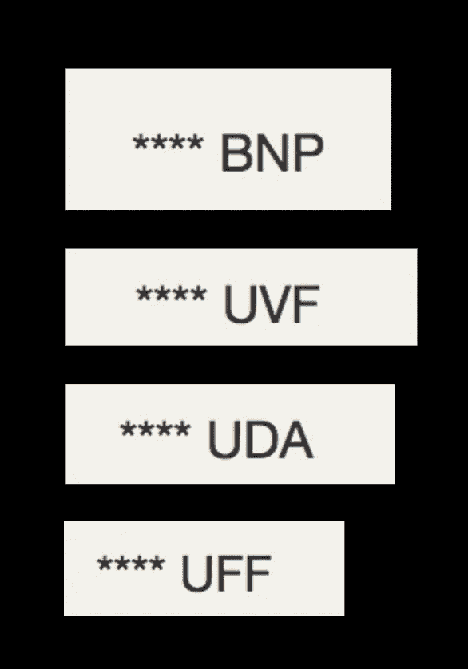
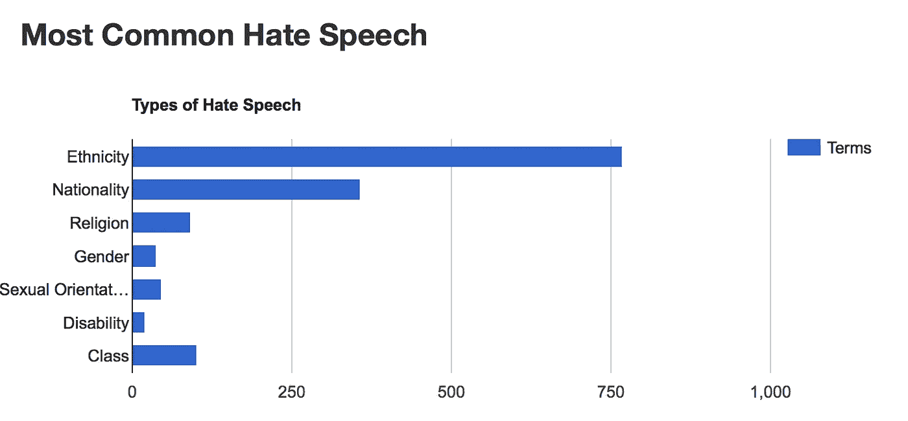
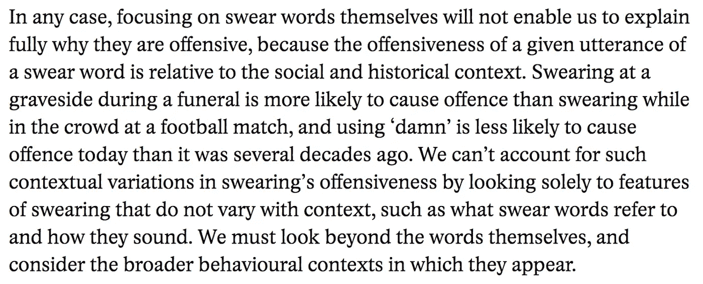
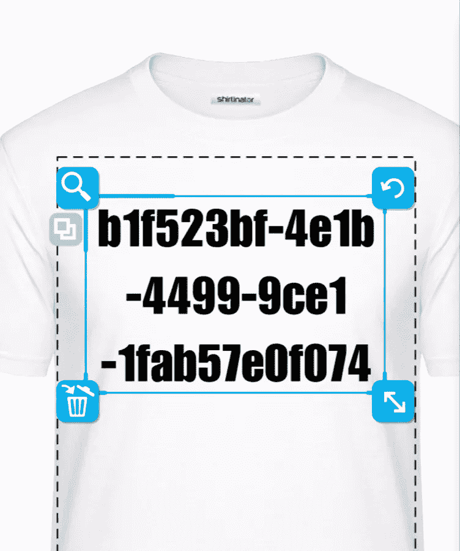
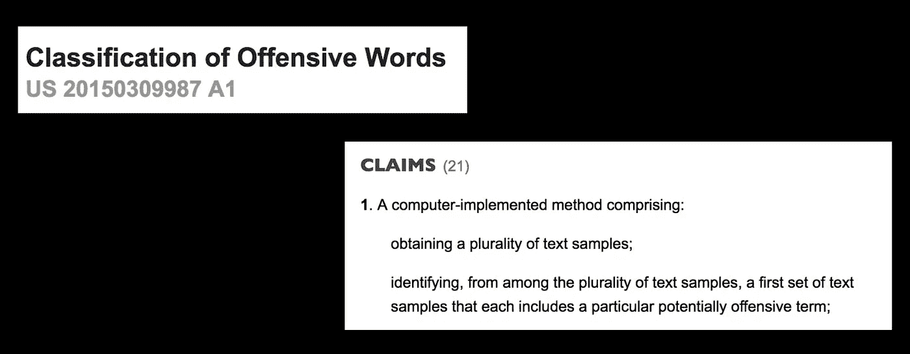

# 打开你的数据

> 原文：<https://medium.com/hackernoon/open-your-effing-data-de5b6e57f63e>

警告:此帖子包含的内容可能会冒犯某些人。

*这篇文章是我在伦敦* [*开放数据学院*](https://theodi.org) *总部举办的* [*【周五】系列讲座*](https://theodi.org/events) *上发表的演讲的版本。幻灯片和视频在文章的最后。像我的大多数演讲一样，我有点即兴发挥。这篇文章有我即兴创作的大部分材料的链接，其他的在幻灯片的末尾。它包括一些关于脏话，罗杰·梅利，民主，审查，布莱克浦足球俱乐部，人工智能，语境和向我妈妈道歉的想法。*

英国监管机构之一 Ofcom 去年委托对冒犯性语言进行研究。这项研究上了很多头条。对于报纸和网站来说，这是一个制造粗口的好机会。

A [report from the Metro on the publication of the report](http://metro.co.uk/2016/10/02/swearing-ranked-from-mild-to-strongest-6165629/).

但这也给了我一个机会，开放一些脏话数据，并利用这个例子与人们交谈，思考民主、审查、语境和人工智能等问题。我也开了一些关于脏话的玩笑。

## 数据需要上下文

Ofcom 在[一份公开授权的 126 页文件](https://www.ofcom.org.uk/__data/assets/pdf_file/0022/91624/OfcomOffensiveLanguage.pdf)和[一份 15 页的快速参考指南](https://www.ofcom.org.uk/__data/assets/pdf_file/0023/91625/OfcomQRG-AOC.pdf)中公布了这项研究。

from the [report](https://www.ofcom.org.uk/__data/assets/pdf_file/0022/91624/OfcomOffensiveLanguage.pdf) that Ipsos Mori did for Ofcom

这些报纸从 PDF 文件中提取数据来撰写他们的报道。我也提取了数据。(btw [我们在 ODI Leeds 和 Adobe 的朋友正在做的一些工作可能会让我将来的剪切和粘贴更容易](http://odileeds.org/blog/2017-04-19-Open-Data-and-PDFs) …)

不幸的是，一开始我错过了所有重要的数据背景。我通过与 Ofcom 乐于助人的团队核对我的数据发现了这个错误。

[Take a look at the data](https://peterkwells.github.io/uk-attitudes-to-offensive-language-and-gestures-data/data/list-of-swearwords-and-offensive-gestures/) or if you want to use it in a project or service there’s a [CSV in github](https://github.com/peterkwells/uk-attitudes-to-offensive-language-and-gestures-data).

在 ODI 内部和 Ofcom 的研究团队进行了一些讨论后，我们最终有了这个。与 PDF 相同的数据，但采用人类和机器可读的格式。

现在，我们在[开放数据研究所](https://theodi.org)的很大一部分工作是“将数据提供给需要的人”。通常我从问题开始，但这次我从数据开始。我的错。现在要找出谁需要它，以及他们将如何使用它。

## 人们用这些脏话数据做的一些事情

当我在推特上发布数据时，有一个背景咒语“屁股…蛋蛋…旋钮…混蛋…”办公室里传来。一个人写了一个小脚本，人们可以用它来让他们的电脑说出单词列表。很快我就能听到人类和机器的声音在咒骂。骂人的咒语很迷人，虽然有点令人不安，但我脸上带着严肃的表情。人为什么要骂人？

一些研究显示了一个[的学术说法](https://www.mcla.edu/Assets/MCLA-Files/Academics/Undergraduate/Psychology/Pragmaticsofswearing.pdf):

> 说脏话的主要目的是表达情绪，尤其是愤怒和沮丧。

似乎很公平。我怀疑很多人因为无法获得做某事所需的数据而感到沮丧。这解释了开放数据研究所办公室的背景咒语，但是数据的其他用途呢？

[Roger Mellie](https://en.wikipedia.org/wiki/Roger_Mellie), copyright Viz. Note that the swear word data might allow people to block his language, but not his gestures.

报告的内容告诉了我们一些其他用户的情况。这将有助于电视广播员和主持人了解人们对他们在广播中说的话会有什么反应，从而帮助主持人决定他们可以说什么。

例如,“bollocks”这个词如果是指睾丸，会被认为有些粗俗，但如果它被用来称呼一些“废话”,问题就不大了。

这可能意味着人们在特定的语境中说了或没说单词。这可能会导致某些内容只有在输入 PIN 解锁后才能访问。

## 这些数据是因为民主而产生的

Democratic processes can need data to be created. Image [Nick Youngson](http://nyphotographic.com/), CC-BY-SA-3.0 via [http://thebluediamondgallery.com/d/democracy.html](http://thebluediamondgallery.com/d/democracy.html)

但是这份报告的最大用户是 T4 Ofcom 自己。Ofcom 委托进行这项研究是因为通过我们的民主程序，我们已经决定在电视&广播上的言论自由是有限度的，并让 Ofcom 的[工作](https://www.ofcom.org.uk/about-ofcom/what-is-ofcom)来规范这些限度。他们需要这些数据来帮助完成这项工作，因此 Ofcom 委托 [Ipsos MORI](https://www.ipsos.com/ipsos-mori/en-uk/) 通过[焦点小组、访谈和基于一长串潜在冒犯性词语和短语的跟进来进行用户研究，从而产生这些数据。](https://www.ofcom.org.uk/__data/assets/pdf_file/0022/91624/OfcomOffensiveLanguage.pdf)

我们已经授权 Ofcom 对违反其准则的组织和个人进行罚款。通过公开发布这份报告，他们帮助广播公司了解如何使用这些权力，从而阻止违规行为。这可能会使该系统更便宜、更有效。

广播公司可能有自己的指导方针来帮助他们满足目标观众的期望。他们可以将 Ofcom 的列表与他们自己的列表合并，以帮助他们满足社会和他们自己用户的需求。

## 类似的数据在电视和广播之外的环境中维护

In Britain [Mary Whitehouse](https://en.wikipedia.org/wiki/Mary_Whitehouse) was a famous campaigner from the 1960s to the 1980s against things that she found offensive. I can imagine Mary being keen on data-driven censorship. Image fair use via Wikipedia.

该数据包括单词 ginger，表示它是“温和的语言，通常没什么关系”，但单词 ginger 也可以用来描述一种[非常美味的饼干](https://en.wikipedia.org/wiki/Ginger_snap)。一个使用脏话数据来阻止攻击性词汇的过滤器可能会禁止生姜坚果。那就糟了。这是简单数据驱动解决方案的常见问题。他们忽略了上下文。

我找不到冒犯性饼干名称的列表，但除了电视和广播之外，还有其他类似于脏话数据的集合。

## 英国有一份禁止汽车牌照的清单

英国政府 [DVLA](https://www.gov.uk/government/organisations/driver-and-vehicle-licensing-agency) 的一部分工作是维护一个不能放在汽车上的字母和数字组合列表。不幸的是，奇怪的是，这份名单并不公开发布，但有时会在信息自由请求后公布。

An extract from the suppressed car registration plate list via [Whatdotheyknow](https://www.whatdotheyknow.com/request/numberplate_blacklist#incoming-548093)

隐藏的汽车牌照列表有助于防止印刷相似的符号混淆，如 o(零)和 0 (oh)。它会阻止可能被视为冒犯性的语言，例如“*B** UMS”和“* R **猿* *”。

这份名单还明确包含了恐怖组织的名字，如 UVF、UDA 和 UFF。另一个恐怖组织，爱尔兰共和军，像其他任何以 I 开头的组织一样，已经被禁止了，因为可能会混淆 1 (one)和 I (aye)。

更有争议的是，极右翼的英国国家党(BNP)的首字母缩写也在名单上。BNP 被允许参与英国的民主选举过程。那个决定是怎么做出来的？不幸的是，就像这份名单没有公开一样，方法也没有公开。

## 语境影响哪些词是冒犯性的

英国的民主进程产生了许多令人不快的词汇。

英国议会议长可以要求政治家在与对手辩论时收回言辞，这就是所谓的“非议会语言”。单词被认为是不符合议会规则的方式还不清楚。2015 年，反对党领袖埃德·米利班德被允许称当时的首相大卫·卡梅伦为“狡猾的”，然而在 2016 年，反对党后座议员[丹尼斯·斯金纳被要求离开一场辩论，因为他称大卫·卡梅伦为“狡猾的大卫”](https://www.buzzfeed.com/emilyashton/dodgy-dave?utm_term=.rrzo4plZL#.vqY5Pz9xB)。“doggy”这个词不在 Ofcom 的名单上，在议会辩论中称一名议员“doggy”而不在电视上称他们是令人不快的。

[非议会语言名单目前还未公布。为了帮助英国政治家们更好地决定是否成为议员，我把一些例子整理成了一个列表。其他国家的议会和其他英国国家也有类似的名单。它们显示了地理环境的重要性。](https://hansard.parliament.uk/Commons/2012-10-17/debates/12101767000001/ParliamentaryLanguage)

澳大利亚议会记录显示，人们对" [suck-holing](http://www.thefreedictionary.com/suckholing) "一词颇有微词，这个词在 1977 年被认为是冒犯性的，但对大多数英国人来说毫无意义，而且[从未在英国议会使用过](https://hansard.parliament.uk/search?searchTerm=suck-holing)。我想知道一个英国议员是否会使用它而不受惩罚。

The word “Oyston” is offensive to me and my community of fans of Blackpool football club. The offensiveness is not only because of this cringeworthy picture but because of how the Oyston family treats fans.

另一个在特定语境下的冒犯性语言的例子是“Oyston”这个词。

Oyston 家族拥有我支持的足球俱乐部 Blackpool FC。因为他们对球迷的行为在布莱克浦球迷使用的[网站](http://fansonline.net/blackpool/mb/index.php)的[上被称为奥斯顿球迷是令人不快的。除了布莱克浦的球迷之外，其他人会如何发现这一点呢？](http://www.backhenrystreet.co.uk)

有一些相关的例子可以帮助我们理解如何做到这一点。

## 数据的协作维护

Hatebase 维护着一份来自世界各地的仇恨言论列表。这些数据通过自动化流程和人工交互来维护，以适应仇恨言论在不同时间和不同地点的变化。仇恨言论可被用来鼓励对人和社区的暴力行为。协作维护过程允许人们辩论哪些词是仇恨言论。

“popular” types of hate speech from [Hatebase](https://www.hatebase.org/popular).

一个有趣的实验是看看 hatebase 数据集是否有助于通过议会、报纸和社交媒体中仇恨言论的增加来预测暴力事件。如果你有钱资助这项研究，一定要和他们联系。

其他人可以从 Hatebase 的例子中学习。如果英国政客想要，并且能够掌握 github，那么他们可以[合作维护我最初列出的不适合议会的语言](https://github.com/peterkwells/unparliamentary-language/blob/gh-pages/data/a-list-of-unparliamentary-language-used-in-parliaments.csv)并创造一些东西来帮助他们理解冒犯的界限。

## 攻击性受时间、地点和社区的影响

[Rebecca Roache in Aeon magazine](https://aeon.co/essays/where-does-swearing-get-its-power-and-how-should-we-use-it).

到目前为止，在我自己的研究中，我很清楚攻击性的环境受到时间、地点和社区的影响。

当我检查的时候，我发现[骂人的哲学家当然已经意识到了这一点](https://aeon.co/essays/where-does-swearing-get-its-power-and-how-should-we-use-it)。正如经常发生的那样，我是一名技术专家，重新发现别人已经涉足的领域。但是技术也可以影响如何以及哪些词变得令人不快。

## 人们创造新的攻击性词语

Oyston 是一个例子，这个词先冒犯了一小群人，然后又冒犯了一大群人。布莱克浦的球迷有效地利用了社交媒体和媒体——哦，还有像这样的谈话和博客；)——作为让 Oyston 一家离开我们足球俱乐部的运动的一部分。这样做的一个效果是将对 Oystons 的攻击性的理解从海边传播到足球社区的更广泛的部分。一个更著名的例子是里克·桑托勒姆，他发现在丹·萨维吉领导的一场运动中，他的姓被定义为一个冒犯性的词。

这是对任何脏话列表的挑战，也是对使用脏话的人的一种风险。人们为了自己的目的创造新的攻击性词语。他们游戏系统。

A t-shirt with the [universally unique identifier for beef curtains](https://github.com/peterkwells/uk-attitudes-to-offensive-language-and-gestures-data/blob/gh-pages/data/list-of-swearwords-and-offensive-gestures.csv).

人们会玩我从 Ofcom 的列表中创建的脏话数据吗？是的，他们当然会。

我很快想起了一个例子。当我将 Ofcom 攻击性词汇列表作为公开数据发布时，根据良好惯例，我给每一个条目都赋予了一个[通用唯一标识符](https://en.wikipedia.org/wiki/Universally_unique_identifier) (UUID)。UUIDs 使机器更容易使用数据。

如果这一数据被广泛使用，那么过不了多久，人们就会穿着印有 UUID 脏话的 t 恤接受电视采访，从而绕过这个系统？也许随着时间的推移，UUIDs 或它们的一部分会变得具有攻击性？“那家伙是一个右 81cb。”他们会说。也许 UUIDs 需要被添加到列表中，因为它们变得具有攻击性？

人们会适应和改变。这是人的优点之一，也是我们在维护和使用数据时面临的最大挑战之一。我们需要建立机制，随着需求和用途的变化而改变数据集。

## 发誓说“服务”很难

很明显，脏话数据很容易建立，也很明显，维护并使其在多种上下文中有用会更加困难。

我知道，许多公司已经在维护类似的名单，就像我看到的许多其他人一样，嘲笑和逃避网站上的过滤器，由于简单和糟糕的数据驱动算法，这些网站将英国的斯肯索普镇变成了明显无害的“S***horpe”。我确实想知道这些过滤器和服务有多大用处。

我见过的许多网站过滤器都很简单，而且存在缺陷，因为它们缺乏上下文，无法适应人们不断变化的行为，但展望未来，我想知道人们是否会开始应用机器学习/人工智能(ML/AI)并创建可以自动学习新脏话的服务？也许这可以被大规模使用，以减少网络上攻击性语言造成的损害？

A couple of snippets from [this patent](https://www.google.ch/patents/US20150309987)

我知道我不会是第一个想到这个主意的人。虽然 2016 年是每个问题都可以用区块链解决的一年，但 2017 年是 ML/AI 年。

对专利库的快速搜索显示，2015 年谷歌注册了[一项专利，利用机器学习](https://www.google.ch/patents/US20150309987)对攻击性词语进行分类。不幸的是，它看起来很垃圾。训练机制在一大组文本样本上工作，它未能识别文本被使用的上下文。最终的服务可能比当前的过滤器稍好，但仍然是数据驱动的，而不是由数据提供信息。

也许，像 Hatebase 一样，如果用户训练提供服务的机器会有所帮助。毕竟，像大多数其他大型互联网公司一样，谷歌使用[成千上万的人](https://arstechnica.co.uk/features/2017/04/the-secret-lives-of-google-raters/)——包括你——来帮助培训他们的服务。我开始思考我所学到的关于攻击性语言的知识，并考虑谷歌需要给脏话评分员的任务，以训练他们的机器:

> **任务**:前往波兰格但斯克的一个足球场。向您附近的人播放此视频。在接下来的七天里，观察他们对你和对方的态度，然后对这段视频的攻击性进行分类。每三个月重复这个练习。

嗯……我很快意识到这可能是一个不切实际的任务，AI/ML 可能会提供更好的服务，但仍然只是部分服务。就不会有完美的服务。人决定什么是冒犯，而不是机器。如果服务只考虑一些环境，那么控制机器并在这些环境中训练机器的人将决定它在哪里有用。脏话数据不像公共汽车站的位置或银行账户中的交易清单。语境更重要。

这是网络以及为其提供数据和服务的挑战之一。网络无处不在。它在许多地方与物理世界相互作用。它出现在多个上下文中。我用网络看广播新闻，就像 Ofcom 规定的那样。我用它来了解最新的政治消息，在这种情况下，议会外的规则是有用的。我在留言板上谈论足球和 Oystons。我关注时事，对英国和海外的仇恨言论感到无助。我和朋友聊天，既有在 Twitter 和脸书这样的网站上公开聊天，也有在消息应用程序上私下聊天。

减少网络上攻击性内容的数据集和服务需要迎合所有这些不同的环境，甚至更多。即使他们这样做了，一些人仍然会在他们周围工作。数据和技术也许能够帮助解决这个问题，但它永远只能是解决更基本的人类问题的一部分。我们用语言表达情感的需要。

## 对不起妈妈

从我的调查中可以清楚地看到，我们可以有效地创建关于脏话的数据，即攻击性的词语。对这些数据的需求来自于那些说脏话的人，那些不想说脏话的人，以及那些试图界定什么是冒犯性的，什么是不冒犯性的社会团体。如果决定什么是冒犯的研究和规则是公开的，这将是有用的。如果人们可以合作来决定什么是冒犯性的，那么这些数据将会更加有用，因为它将迎合更多的环境。但同样清楚的是，虽然技术创造了减少冒犯的新可能性，但人们仍然会适应以实现他们想要的目标。[如此这般](https://en.wikiquote.org/wiki/Slaughterhouse-Five)。

另一件事是，我和我的听众对一些词语的敏感。对我来说，这当然是因为我最重要的背景之一:我的成长经历和我的家庭。我想以我结束演讲的方式结束这篇文章，向我的妈妈道歉。对不起妈妈。

— — — — — — — — — — — — — — — — — — — — — — — — — — — — — — -

## 观众的提问显示了语境的重要性

在 ODI 的演讲结束时，听众提出了一些演讲中没有涉及的攻击性语言，如使用种族和宗教诽谤。我已经涉及了广泛的话题。种族和宗教攻击甚至覆盖了更多领域。我不可能面面俱到。

Image from [The Wanderers](https://en.wikipedia.org/wiki/The_Wanderers_(1979_film)), based on a book by [Richard Price](https://en.wikipedia.org/wiki/Richard_Price_(writer)). The film includes [a fantastic scene](https://www.liveleak.com/view?i=29a_1427692583) in a 1960s New York school where people of different religions and ethnicity try, and fail, to remember all of the offensive names they have for each other.

我确实觉得有趣的是，房间里的观众没有听说过列表中的一些单词。特别是[巧克力冰](http://www.urbandictionary.com/define.php?term=choc+ice)、[血爪](http://www.urbandictionary.com/define.php?term=bloodclaat)和[屁股爪](http://www.urbandictionary.com/define.php?term=bum%20clat)，这些词在我——白人中产阶级，主要是英国北部和伦敦南部——的经历中，被用来反对黑人或黑人社区。在后两种情况下，更具体地说是在牙买加社区内。

人们没有听说过这些词，这说明了听众的背景。那些话可能不会被认为是冒犯性的。也许下次我谈论这个话题的时候，我应该试着从不同的语境中加入一些攻击性的语言，看看会发生什么。

## 观看演讲原文或阅读幻灯片

如果你想的话，你可以看一下这个演讲的录音(其中包括一些发誓很久的乐趣):

你也可以在 [slideshare](https://www.slideshare.net/peterkwells/open-your-effing-data-presentation-2017) 或 [google slides](https://docs.google.com/presentation/d/1R-Od3xvxTPgILY1dpbyHfHiG2ujTuP-Qc5C18xkAbBQ/edit#slide=id.g1f4b8421a4_0_0) 上观看演示，随你喜欢。

> [黑客中午](http://bit.ly/Hackernoon)是黑客如何开始他们的下午。我们是 [@AMI](http://bit.ly/atAMIatAMI) 家庭的一员。我们现在[接受投稿](http://bit.ly/hackernoonsubmission)并乐意[讨论广告&赞助](mailto:partners@amipublications.com)机会。
> 
> 如果你喜欢这个故事，我们推荐你阅读我们的[最新科技故事](http://bit.ly/hackernoonlatestt)和[趋势科技故事](https://hackernoon.com/trending)。直到下一次，不要把世界的现实想当然！

