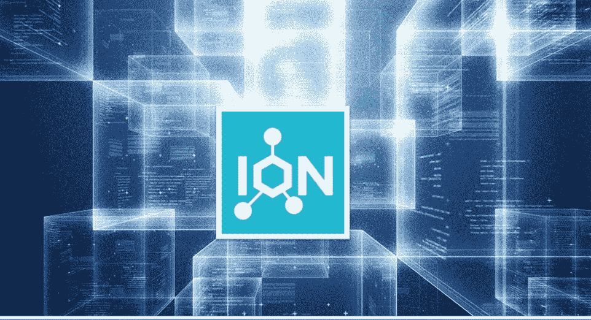

# 我们雄心勃勃地追求实时分布式系统的民主化——第二幕:ION vs JSON

> 原文：<https://medium.com/hackernoon/our-ambitious-quest-to-democratise-distributed-systems-act-2-ion-vs-json-ce69f4e5c4a9>

在我们的[上一篇文章](https://hackernoon.com/our-ambitious-quest-to-democratize-distributed-systems-act-1-protocols-b6bec5297213#.k63j9izax)中，我们讨论了分布式系统的实现给初创公司和消费者带来的巨大潜力。我们还简要提到了我们在 Nanosai.com[研发的一些工具，包括我们在 T4 的 IAP 协议](http://nanosai.com/)，旨在帮助开发者构建更智能、更通用的分布式系统。今天我们将关注 IAP 的数据格式，称为互联网异议符号(简称 ion)。

**为什么数据格式很重要？**

据估计，今天我们生活在一个平均每天产生约 2.5 万亿字节数据的世界，其中许多数据是由谷歌、脸书、亚马逊和网飞等家喻户晓的热门服务的用户产生的。事实上，思科最近的一份**[报告预测如下:](http://www.cisco.com/c/en/us/solutions/collateral/service-provider/visual-networking-index-vni/vni-hyperconnectivity-wp.html)**

**●到 2020 年，每两分钟就会有相当于所有电影的千兆字节(GB)通过全球互联网。**

**●在全球范围内，IP 流量将在 2020 年达到 511 万亿比特每秒(Tbps)，相当于 1.42 亿人每天全天同时传输互联网高清(HD)视频。**

**●2020 年全球 IP 流量将相当于每年 5040 亿张 DVD，每月 420 亿张 DVD，或每小时 5800 万张 DVD。**

**在 [Nanosai](http://nanosai.com/) 我们相信，只有随着新一代智能分布式系统的兴起，处理如此大量的数据才会有效，新一代智能分布式系统很可能会以新型数据和通信模式向我们提出挑战。特别是，这将需要一种更通用、紧凑、快速且易于处理的数据格式，既适用于小型设备，也适用于大型服务器。因此，任何先进的网络协议，如我们自己的 IAP，都需要适应这一点，以便适用于这种先进的分布式系统。**

**如今，开发人员广泛使用的最流行的数据格式无疑是 JSON。事实上，像 twitter 这样的公司只开发 JSON API。但是 JSON 有很多缺点，其中包括:**

**1.JSON 是一种文本格式。这意味着 JSON 是一种非常冗长的发送数字的方式。这也意味着 JSON 不是原始二进制数据的好格式。原始字节必须是 Base64 或十六进制编码，并作为字符串传输。Base64 编码将编码数据的大小增加到原始大小的 4/3，十六进制编码将大小增加到原始大小的 2/1。**

**2.JSON 不是那么通用，因为它不擅长建模所有类型的数据结构。例如，JSON 在用行和列(例如 CSV 文件)对相似数据的表格建模方面很弱。JSON 将这种表格数据编码为对象数组，这意味着表中的每个对象(行)的列名将重复。这显然是对数据的浪费。**

**3.由于既有文本性又冗长，JSON 不是读写最快的数据格式。由于冗长，传输速度也较慢，尤其是对于带宽有限的设备，如小型物联网设备、连接微弱的移动电话或漂浮在海洋中的船只。**

**最后，如果万物互联要成为真正的即插即用，我们不能让每一个 OEM 或开发者都经历创建他们自己的数据格式的麻烦，仅仅因为 JSON 对他们的用例来说不够合适/通用。**

****什么是离子？****

****ION** (参见 [ION 规范](http://tutorials.jenkov.com/iap/ion-design-goals.html))是 IAP 的默认二进制数据格式，它足够通用，可以编码多种数据。ION 可以模拟最常用的数据结构，例如:**

**原始字节**

**基本的原始类型，如布尔值、整数、浮点、UTF 8 文本和日期时间。**

**上述类型字段的流(无界)。**

**字段数组(有界)**

**映射(键、值对)**

**对象(具有属性名、属性值对、空值、类 id、循环引用等。)**

**包含行和列的表格。**

**复杂对象图，对象嵌套在对象中，对象嵌套在表中，表嵌套在表中，表嵌套在对象中，表和对象嵌套在数组中，反之亦然。**

**以上所有的组合。**

**ION 通常是相应 JSON 文档大小的 2/3，对于表格数据(例如对象数组)，大小可以降到 1/5(对于像 Boolean 这样非常小的数据类型甚至更小)。离子消息的读写在速度上可以和 Google 协议缓冲区竞争，如果你需要的是速度的话。ION 也是自描述的，可以在没有模式的情况下导航。**

**关于 ION 的一个有趣的事实是，尽管我们为 IAP 协议开发了它，但它实际上是独立于任何网络协议而设计的！因此开发人员能够在 IAP 协议之外使用 ION 作为 JSON、XML、YAML 等的替代数据格式。由于 ION 相当紧凑和快速，在 HTTP 上使用它可能是希望从 HTTP/JSON、SOAP/XML 等转换到 IAP 的组织的第一步。**

**最终，我们的目标是使 ION 成为 JSON 的更通用的替代品，并且能够支持更多种数据。我们相信，为了创建更加通用的互联网通信，我们确实需要一种比 JSON 更加通用的数据格式。我们的联合创始人兼首席技术官 Jakob Jenkov 写了一些“T0”ION 性能基准测试—**ION vs . JSON vs . Protobuf vs . MessagePack vs . CBOR。****

**最后，在接下来的几周和几个月里，我们会在后续的帖子中与你分享我们的旅程，即**第 3 幕**、**第 4 幕**……**第 N 幕**。与此同时，请访问我们的 [github repo](https://github.com/nanosai) 来检查我们的代码并了解我们的最新进展。**

***由*[*Zaiku*](http://www.zaiku.co.uk)*联合创始人 Bamborde 发布。推特@cloudbalde***

************

> **黑客中午是黑客如何开始他们的下午。我们是这个家庭的一员。我们现在[接受投稿](http://bit.ly/hackernoonsubmission)并乐意[讨论广告&赞助](mailto:partners@amipublications.com)机会。**
> 
> **如果你喜欢这个故事，我们推荐你阅读我们的[最新科技故事](http://bit.ly/hackernoonlatestt)和[趋势科技故事](https://hackernoon.com/trending)。直到下一次，不要把世界的现实想当然！**

****