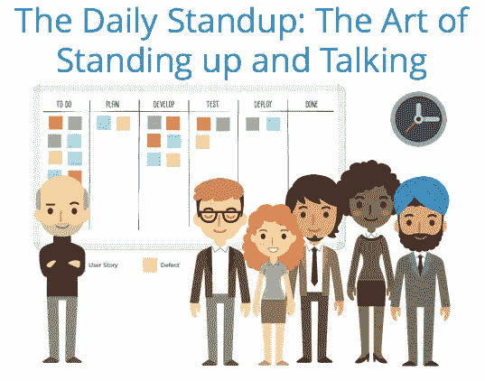

# 日常单口相声不用吸！

> 原文：<https://medium.com/hackernoon/our-daily-standups-2e8e1eda943d>

> 敏捷工作，Scrum，每日站立。我几乎在招聘人员的宾果卡上划了一行。

但是说真的，在过去的几年里，我在几家公司工作过，现在我已经做了 5 年多的单口相声了。
在这篇文章中，我将谈谈如何让日常站立训练更有效率。

这一切都是从[的莫莉](https://mollie.com/)开始的，当时我是一名 PHP 开发人员(那时候:)。每天早上，团队成员聚在一起，围着一个写满便利贴的大白板。

对每个人来说，每天的主要问题是，你昨天做了什么，你今天会做什么，你被阻止去做吗？多年来，这种日常排练一直在重复，在我工作过的所有公司，这种安排都大同小异。

我曾在非常擅长问这些问题的团队中工作过，但我也曾和反对所有 Scrum 和敏捷的团队成员一起工作过，他们认为站立是一种令人讨厌的拖延习惯。

几年后的现在，我在温室集团的 LemonPI 团队工作，我们也有每日站立，但我可以诚实地说，我们比我以前做得更好。这让我思考，这就是我们的不同之处；

> 每日站立不仅仅是问你做了什么和你是否被阻止了。而是要达到冲刺目标！

让我补充一下，我们是全 Scrum(所以不仅仅是站立，而是所有的东西，复古，计划，改进，董事会等等。)
我们看板上的通道是:
(冲刺工作前)待办事项—分析—细化—就绪—
(冲刺工作中)待办事项—评审—验收—发布就绪—完成

我们每天都在 Scrum 板上设定*目标*。我们从检查这些*日常目标*是否达到开始。我们从右到左遍历它们(因为优先级是轨道上最远的东西)。
每日目标*用非永久性记号笔写在我们黑板的顶部，这样我们在检查时会把它们擦掉。*

*接下来是为已经完成和将要完成的故事设定每日目标。那么，是否有项目等待发布，我们可以发布它们吗？将目标设置为“完成”(这意味着它们已交付生产)。
通过这种方式，我们每天谈论所有正在进行的故事，整个团队都知道正在进行的故事的进展。*

*一旦我们为连续报道设定了所有可能的*每日目标*,我们会在团队成员中进行一轮，询问他们是否已经完成了正在进行的工作，或者他们是否可以承担更多的工作。
通过这种方式，我们的业务分析师和设计师也可以分享他们正在做的事情，而且大多数情况下(我们试图让我们的故事尽可能小)，有几个工程师可以开始一些新的东西。*

*由于这个过程，所有团队成员(产品负责人、业务分析师、设计师、Scrum 蔻驰和工程师)都知道进度，每隔一天，我们也会问自己这个问题:我们是否能实现我们在冲刺计划中设定的冲刺目标。*

*有了正确定义的冲刺目标，我们就能清楚地看到我们在 2 周冲刺中完成了什么。*

*你想在这样的环境下工作吗？我们正在积极寻找工程师，所以请告诉我！*

*[帕特里克·范·马斯伯根](http://patrick.vanmarsbergen.com)(推特:[@马斯伯根](https://twitter.com/marsbergen) )
埃因霍温[温室组](http://www.greenhousegroup.com)软件工程师[莱蒙皮](http://www.lemonpi.io)*

******

> *[黑客中午](http://bit.ly/Hackernoon)是黑客如何开始他们的下午。我们是 AMI 家庭的一员。我们现在[接受投稿](http://bit.ly/hackernoonsubmission)并乐意[讨论广告&赞助](mailto:partners@amipublications.com)机会。*
> 
> *如果你喜欢这个故事，我们推荐你阅读我们的[最新科技故事](http://bit.ly/hackernoonlatestt)和[趋势科技故事](https://hackernoon.com/trending)。直到下一次，不要把世界的现实想当然！*

**