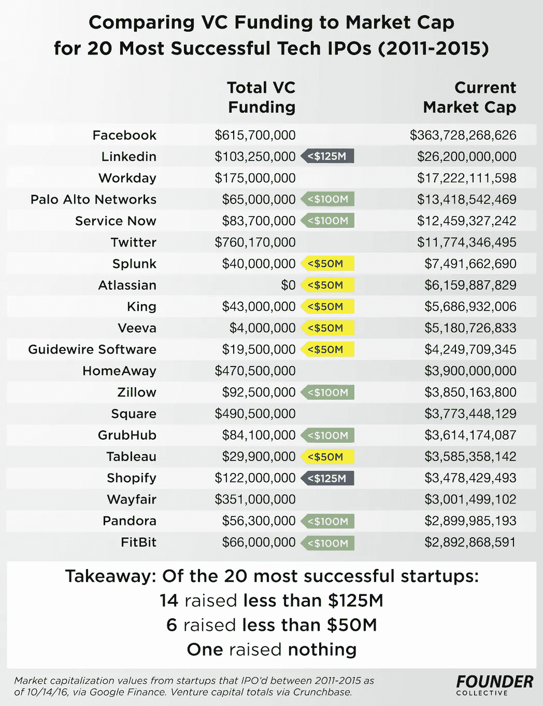
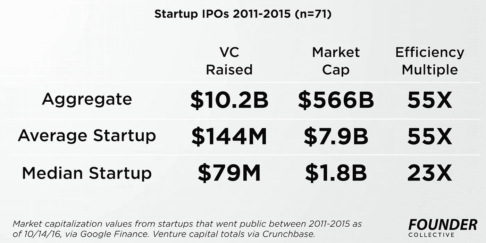
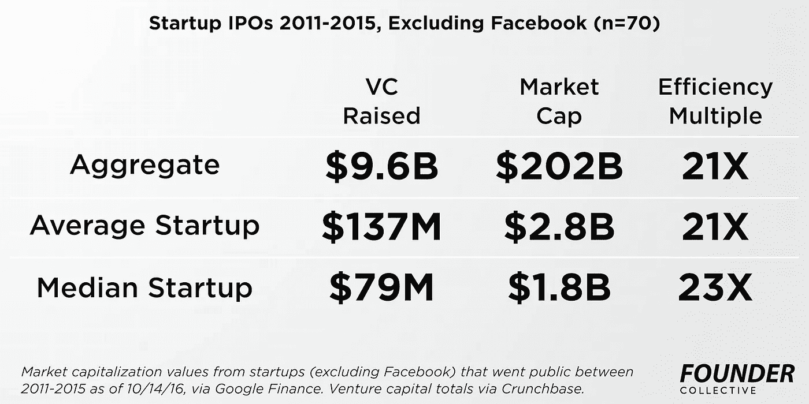
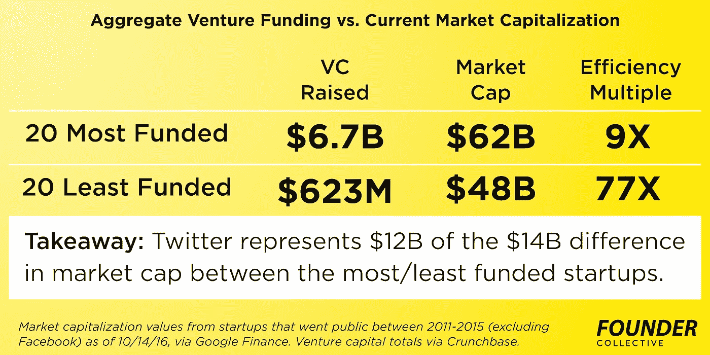
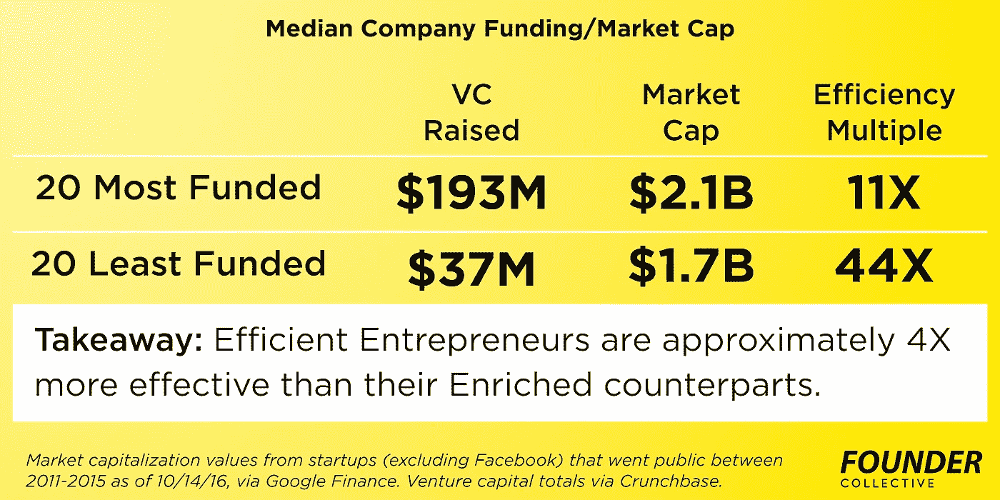
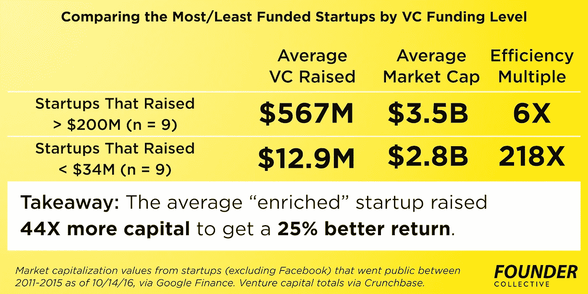

# 风险投资过度:71 次 IPO 的教训

> 原文：<https://medium.com/hackernoon/overdosing-on-vc-lessons-from-71-ipos-f247b8eb0887>

*由* [*埃里克佩利*](https://twitter.com/epaley) *&* [*约瑟夫弗莱厄蒂*](https://twitter.com/josephflaherty)

风险投资是一剂猛药。如果使用得当，它就像肾上腺素一样给过去五十年中许多最伟大的公司注入活力。如果使用不当，它会产生有毒的依赖。

创业社区的传统智慧是，当建立最好的公司时，可以利用更多的资本来加速更大的增长。但是这种“不成功便成仁”的方法经得起推敲吗？在最好的情况下，拥有大量风险资本的公司真的比那些更有效配置资本的公司表现更好吗？为了找到答案，我们查看了过去五年的 71 宗科技公司 IPO。

# 高效创业

在 [Founder Collective](http://www.foundercollective.com/) 我们一直在向我们的社区谈论我们称之为“高效创业”的优点我们最近写了大量融资的公司的负面影响，包括丧失退出选择权，以及[不可持续的烧钱速度](http://techcrunch.com/2015/02/24/after-funding-watch-burn-rates-and-beware-the-tyranny-of-incrementalism/)的危险，但是积极的风险投资看起来有什么好处呢？通过研究风险投资成功的最佳案例，我们能从筹集大量资金的好处中学到什么？

结果令人惊讶——通过检查过去五年的科技 IPO，我们发现，在 IPO 之前，*富裕的*(资本充足)公司并没有明显优于它们的*高效的*(资本不足)同行，实际上在 IPO 之后表现不佳。

筹集巨额资金是加入独角兽群体的一项要求，但仔细观察科技行业的最佳结果表明，储备充足的战争资金与成功没有关联。

在过去五年里最成功的 20 家上市公司中(以当前市值衡量)，有 14 家融资额在 1 亿美元左右或更少。6 家公司筹资不到 5000 万美元。一家根本没有筹集到资金。当你考虑到私人资助的独角兽公司已经筹集了 2 . 84 亿美元时，这是令人震惊的小数目。

# 方法学

评估初创企业的表现是一件棘手的事情。晚期公司理应保密。收购是混乱的财务事务，往往被设计成模糊交易的真实价值。IPO 市场是我们能找到的最透明的代理，尽管不完美，但它很有启发性。除了显著的例外，风险投资的大多数重大成果都是首次公开募股的结果。通过研究过去五年风险资本和 IPO 之间的关系，我们可以了解在最好的公司筹集更多资本是否与更好的结果相关。

# 数据

*   该数据包括 71 家公司，它们总共筹集了**102 亿美元的风险资本**
*   他们的总市值为**5660 亿美元，或者是投入资本的 55 倍**
*   名单上的初创公司平均从风险投资中筹集了 1 . 44 亿美元来建立一家价值**79 亿美元**的公司
*   榜单上的中值初创公司**从风险投资**中筹集了 7900 万美元，建立了一家价值**18 亿美元**的公司

总体结果相当令人兴奋！当然，这组数据反映了过去五年风险行业几乎所有的最佳成果。

# 把脸书放在一边

我们承认只有一个脸书，而且它是异常值中的异常值，因此我们将该公司排除在大部分分析之外。除去脸书，总体数字看起来仍然相当强劲，但看到一家公司扭曲总数的程度令人震惊:

*   70 家公司筹集了**96 亿美元风险资本**
*   他们的总市值为 2020 亿美元，是原始投资的 21 倍
*   普通的初创公司**筹集 1 . 37 亿美元**来建立一家价值 28 亿美元的公司
*   **名单上的中值创业公司**从风险投资**中筹集了 7900 万美元，建立了一家价值**18 亿美元**的公司**

# **不包括的项目:如接受服务项目是由投保以前已患有的疾病或伤害引致的**

**我们只研究了 2011 年至 2015 年间进行 IPO 的公司。追溯到 5 年前会很有意思，但考察什么是真正的“独角兽时代”也很有启发性。在这个时代，私营企业筹集了前所未有的资金。我们排除了成立于 2000 年之前的公司(如 GoDaddy、FirstData)，具有非正统融资途径的公司(如 Match Group、RetailMeNot)，以及亚洲和俄罗斯的公司，因为它们的融资环境明显不同。结果是一个数据集，[可用于审查](http://docs.google.com/a/foundercollective.com/spreadsheets/d/1QT-vg7OHHhO9VvSHpgo7r1yWlAP89yqVLMRj1Alzvj8/edit?usp=sharing)，其中包括 71 家公司。大部分数据取自[数据库](http://www.crunchbase.com/)，除非另有说明。**

**我们还从计算中排除了晚期私募股权、二次发行和债务，尽管它们被记录在电子表格中。我们对首次公开募股筹集的资金不太感兴趣，因为我们认为这是风险投资游戏的毕业点，在很大程度上是公司规模的直接作用。尽管我们尽了最大努力使其正确，但这些数据肯定有不完美之处，而且我们对数据集的反馈持开放态度，这也是我们将其公之于众的原因。**

# **“大风投”的最佳案例**

****

**这些数据可能表明，“要么做大，要么回家”有一定的财务意义，尤其是对投资者而言。资金最雄厚的公司确实有更大的总回报。加在一起，榜单上 20 家资金最雄厚的公司在风险投资中筹集了**67 亿**美元，总市值为**620 亿**美元，回报率为 9 倍。**

**这份名单上 20 家资金最少的公司只筹集了 6 . 23 亿美元的风险投资，却设法向投资者返还了 480 亿美元，或者说 77 倍的回报。**

**总回报相差 140 亿美元。这可不是小事，尤其是对风险投资这种资产类别而言。然而，其中约 120 亿美元的差额来自 Twitter，它筹集的风险投资略低于 10 亿美元。所以，除了脸书和推特，风险投资家们花了 50 亿美元来创造一个增量的 1B。值得注意的是，股票市场是不稳定的，在我写这篇文章的过程中，20 家最富有的公司波动剧烈。不过，这种差异通常是由一两家异常公司造成的。**

**没错，每年都会有一些新成立的公司带来大部分回报。事实上，在只有几个例外的情况下(脸书和 Twitter)，对投资者来说，大量投资最好的公司是一个成功的策略。然而，目前还不清楚风投们是否能够始终如一地发现表现最佳的公司，反而过度投资甚至是最成功的公司。**

**这不是对风险投资模式的抨击——这是一种基于风险的资产类别。我们行业中最好的公司已经展示了在许多基金中运行这种高风险剧本的能力。**

**不过，这对创业者来说应该是一个教训。像脸书和 Twitter 这样的公司对生态系统的健康至关重要，但对其他创业公司来说不是一个好的模式。除非创始人非常有信心，他们正在建立下一个脸书规模的企业，否则他们最好专注于创造更高的倍数，而不是更高的退出价值。**

# **风投有投资组合，创业者只有一次机会**

****

**为了成为划时代赢家的一部分，风险投资可以承担过度投资十几家公司的风险，但企业家只有一次机会。作为一名创始人，你愿意为即使在最好的情况下也能获得 24%溢价的东西冒 4 倍以上的风险吗？这基本上就是这个名单上的公司所做的:**

*   **这家中等富裕程度的初创公司筹集了 1 . 93 亿美元来建立一家价值 21 亿美元的公司(T2)**
*   **这家中等效率的初创公司筹集了**3700 万美元**来建立一家价值**17 亿美元**的公司**

**创始人的财务计算比看起来更糟糕。增量融资可能会带来额外的稀释，以及如果初创公司的热潮消退且未上市，将有利于风投的上市前偏好。除了规模或风险，更多的资本限制了可能的退出路径的数量。最有效率的 20 家公司的创始人可能已经成功地在他们发展的任何时候卖掉了他们的公司，获得了健康的回报。他们富裕的同行被锁定在数十亿美元的出口中，资本回报递减。**

# **这实际上是风投的最佳模式吗？**

**风险投资市场的传统观点是，投资者应该大量押注于赢家，但你是更看好回报递减的赢家，还是更看好回报有望达到 10 倍、20 倍或 30 倍的新创业公司？**

# **大卫对歌利亚**

****

**尽管这是一个小得可笑的样本，看看那些筹集了客观上大量资金的公司——比方说超过 2 亿美元的公司(这个样本中有 9 家公司),而同样数量的公司在名单的底部。结果令人震惊:**

*   **最富有的公司筹集了**5 . 67 亿美元**回报**35 亿美元**或**6 倍****
*   **最有效率的公司筹集了**1290 万美元**回报**28 亿美元**或**218 倍****
*   **最富有的公司筹集了 44 倍于 T7 的资金来获得 25%的回报**

**风险投资中的权力法则是真实存在的，但融资却不能很好地预测它们。一些伟大的公司筹集了大量的资金，但是更多的钱并不会让他们更有可能获得巨大的成功。如果你排除 Twitter 和脸书，十大最有效率的创业公司实际上比十大最富有的公司表现更好。**

# **钱少=公司好？**

**IPO 时的市场价值很重要，因为它通常是风险资本退出价值的标志，但考虑这些富裕的公司与长期有效的上市公司相比如何也是有趣的。早期灌输一种财政约束意识，即增长来自有纪律的客户获取，而不是风险资本家的支票簿，会带来更可持续的业务吗？**

**事实证明，作为上市公司，高效公司的表现明显好于富裕群体:**

****

*   **自首次公开募股以来，20 家最有效率的创业公司已经增值了 89%**
*   **同期，他们的富裕同行仅增长了 22%。**

**从模态的角度来看，这种趋势更加惊人:**

*   **20 家最富有的初创公司中，有 8 家自首次公开募股以来价值实际上已经下降**
*   **自首次公开募股以来，20 家最有效率的公司中只有 3 家市值缩水**

**我们的假设是，随着时间的推移，过多的资本创造了一种用现金代替创造力和运营纪律的文化。庞大的资产负债表让企业能够低效率地增长，掩盖员工人数和支出方面的问题，而不是直面价值创造的核心引擎。资金减少迫使管理团队在早期做出艰难的决定，并消除潜在的浪费问题，否则这些问题可能会无限期地存在。这种高效的精神特质成为了长期生产绩效文化的一部分，而这种文化很难注入那些从未以受约束的方式运营的富裕公司。**

**有一种合理的反驳观点认为，在 IPO 时，富裕人群的估值更高，而这些价值是由私人市场投资者而非公共投资者获得的。虽然这可能是真的，但企业家和风投应该考虑这一论点的含义，即公开市场投资者可能会对日益壮大的独角兽俱乐部给予大幅折扣，该俱乐部在 IPO 之前筹集了大量私人资本。**

# **不应该是正相关吗？**

**重要的是后退一步，考虑一下这个数据集到底有多令人惊讶。风险资本行业接受了一个假设，即在最好的结果下，更多的钱会加速更多的成功。有些人会说，真正的赢家几乎不可能资本过剩——毕竟，这些公司正在将资本再投资到他们成功的经济引擎中。资本让你能够在业务驱动因素上进行更多投资——人才、R&D、客户获取等。凭直觉，富裕的公司应该比资金不足的同行做得更好是有道理的。**

**我们原本期望在这些数字中看到相关性，并对我们在风险行业中假设的内在因果关系进行辩论。换句话说，我们可能会争论是不是钱导致了成功(因果关系)，但想当然地认为最成功的公司能够筹集最多的钱(因果关系不明确)。**

**令人震惊的是，数据中没有任何有意义的相关性。尽管表现最好的公司处于筹集最多资本的最佳位置，但它们并不一定会这样做。**

**除了几个关键的异常值，资金较好的公司并没有真正变得更大或表现更好，实际上变成了更差的上市公司。风险投资是一个异常的行业，一个以波动性为前提的行业，但事实是，资金雄厚的公司并没有明显超过现金有限的竞争对手，这表明即使是在最优秀的公司中，资本回报也存在递减点。数据显示，风投们很难理解这个点在哪里。风投界的格言是，每年只有 15 家公司诞生。如果作为一名风险投资人，你的游戏是向公司注资，那么在过去的 5 年里，似乎只有 2 家公司真正重要。那是一个几乎不可能玩的游戏。**

# **收购呢？**

**反对我们将收购排除在分析之外是公平的，但它们可能会加强而不是削弱结论。事实证明，最近许多 10 亿美元以上的收购都是有效利用资本的，例如 WhatsApp ( [、6025 万美元](http://www.crunchbase.com/organization/whatsapp))、Oculus ( [、93.55 万美元](http://www.crunchbase.com/organization/oculus-vr#/entity))、Nest ( [、8000 万美元](http://www.crunchbase.com/organization/nest-labs#/entity))、Instagram ( [、5050 万美元](http://www.crunchbase.com/organization/instagram#/entity))、Twitch ( [、3500 万美元](http://www.crunchbase.com/organization/twitch))、Cruise ( [、1880 万美元](http://www.crunchbase.com/organization/cruise#/entity))。mojang——《我的世界》的制造商——在以数十亿美元出售给微软之前完全跳过了融资。Beats ( [、3 亿美元](http://www.crunchbase.com/organization/beats-by-dr-dre#/entity))和 Jet ( [、5 . 65 亿美元](http://www.crunchbase.com/organization/jet))是这一群体中的例外，但就市盈率而言，这些公司的表现明显逊于同行。**

****数据不完善，结果清晰****

**我们知道这个分析是不完美的。一些在 2015 年首次公开募股的公司还没有公布四个季度的上市公司业绩，即使有风险投资，也可能有更积极的长期业绩。尽管如此，这个数据应该让创始人和风投们暂停一下。尽管在独角兽时代越来越不受欢迎，但用不到 5000 万美元的风险资本建立一家 10 亿美元的上市公司是完全可能的，甚至可能是明智的。**

**从数据来看，过去五年中表现最好的 20 家初创公司中，有 15 家从风险投资家那里融资不到 1.25 亿美元。(我们将 Wayfair 包括在内，该公司在成立的前 10 年没有筹集任何资本，其交易更类似于晚期私人股本)。第四，Atlassian、Shutterstock、Textura 和 SkullCandy 在没有任何风险投资的情况下取得了成功。Splunk 和 Palo Alto Networks 共融资约 1.05 亿美元，目前的市值超过 200 亿美元。Groupon 和 Zynga 分别融资[倍](http://www.crunchbase.com/organization/zynga#/entity)T2【1 亿多美元】和多轮，总计近 2B，目前价值约 50 亿美元。**

# **筹集的资本是一个虚荣的指标**

**筹资是一个需要仔细考虑的战略选择，就像你的产品路线图、营销策略或招聘计划一样。不幸的是，企业家倾向于投机取巧地做出融资决定，甚至更糟糕的是，出于自豪感或错误的认可。**

**如果你正在享受成功，金钱就会向你扑来。这是一种恭维，拥有强大的资产负债表可能是一件好事，但它确实限制了选择性，并创造了更困难的退出路径。资金很少是你最大的约束，也很少是你面前最大的机会。最糟糕的是，有证据表明，即使在最好的结果下，你的资产负债表对公司长期价值的帮助也是有限的。从这个角度来看，虽然富裕公司表现不佳，但与今天的独角兽相比，它们的融资规模适中。我们的中等富裕公司(资本排名前 20 位)在上市前筹集了 1.93 亿美元。如今，独角兽企业的融资中值为 2.84 亿美元，它们可能还需要筹集更多资金才能上市。我们的数据表明，这对于长期成功来说不是一个积极的信号。买家当心！**

**这样做的目的不是鼓励自举；它也不是在庆祝缓慢的增长。我们并不主张在筹集风险资本时采取“说不”的立场——毕竟我们是风险资本家。尽管有些公司根本不需要筹资就能取得巨大成功，但它们非常不寻常。创业公司不会因为试图在艰难模式下建立一家公司而获得加分。**

**这些高效创业公司的创始人和他们富裕的同行一样，都有创业的雄心和渴望。他们只是做得更好。这些效率更高的企业家正在建立真正的、价值数十亿美元的国际组织，风险要小得多，而且可能拥有更多自己的公司。这一分析中令人惊讶的是，在这一过程中，某种程度的资本约束似乎是有益的，而不是有害的。**

# **这不是对风投的攻击。这是企业家的庆典**

**企业家精神的神秘之处曾经在于从无到有的神奇行为。现在，我们赞美那些像银行一样从风险资本家那里筹集巨额资金的创始人。我们认为这是不健康的，需要改变。虽然创业市场已经被资本淹没，但创始人不需要筹集巨额资金就能成功，而且似乎即使在最有利的情况下，筹集更少的资金也能带来更好的公司。然而今天，大多数创始人说服自己采取相反的方法。**

**我们正在为有效利用风险资本进行论证，而不是反对利用风险资本。风险投资是许多创业公司成功的重要因素，在极少数情况下，增加巨额资本是合理的。但是像大多数药物一样，它们有使用的时间和地点，应该向潜在的使用者清楚地说明副作用。**

**我们的投资组合中有许多公司遵循了丰富的模式，还有一些公司效率很高，似乎是被浸透了汽油的抹布的气味所推动。对两者的建议是一样的。想想如果银行里的钱是你最后一笔钱，你会如何以不同的方式经营你的公司？这个问题的答案会让你成为亿万富翁。**

************

> **[黑客中午](http://bit.ly/Hackernoon)是黑客如何开始他们的下午。我们是 [@AMI](http://bit.ly/atAMIatAMI) 家庭的一员。我们现在[接受投稿](http://bit.ly/hackernoonsubmission)，并乐意[讨论广告&赞助](mailto:partners@amipublications.com)机会。**
> 
> **如果你喜欢这个故事，我们推荐你阅读我们的[最新科技故事](http://bit.ly/hackernoonlatestt)和[趋势科技故事](https://hackernoon.com/trending)。直到下一次，不要把世界的现实想当然！**

****