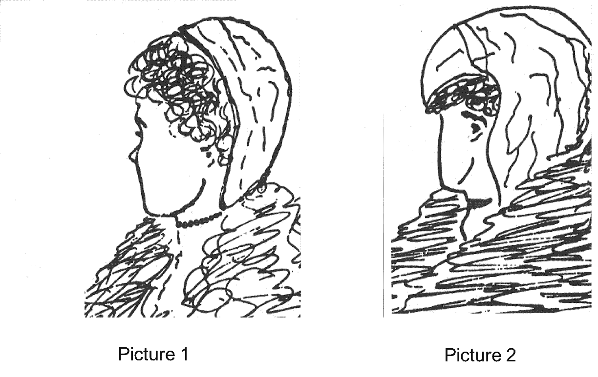

# 范式与原则:从大学到公平研究

> 原文：<https://medium.com/hackernoon/paradigms-and-principles-from-university-to-equity-research-d8f6c5092953>

> “范式转变的力量是量子变化的基本力量，无论这种转变是瞬间的还是缓慢而深思熟虑的过程”史蒂文·柯维，[高效人士的 7 个习惯](https://www.amazon.com/Habits-Highly-Effective-People-Anniversary/dp/1511317299)

在这篇文章中，我将分享一些我希望在申请研究生计划和实习之前就知道的事情，它是针对所有申请任何计划的学生的。

我将通过我的个人经历和一个非常有趣的叫做范式转换的概念来解释这一点。

**那么，老弟，你这个星期收到了多少份申请？**

在大学期间，你会考虑申请暑期实习和研究生项目。我们知道这是一个竞争非常激烈的环境，通常，建议是尽可能多做应用。

在我大学的三年里，我向不同的银行部门、专业服务部门和其他部门提交了 100 多份实习和研究生项目的正式申请。我设法获得了超过 15 次首轮面试，其中一半进入了最后阶段。

在我大学的三年里，我只收到了两个正式的邀请，提供结构性培训作为项目的一部分。

100 份申请中只有 2 份。

那时候，我觉得和那些做了很多申请却面试那么少的同行相比，我做得还算不错。我认为编写这么多应用程序是正确的做法，至少根据大学、在线论坛和我的环境的建议是这样，我周围的大多数学生也在编写大量的应用程序。

直到我毕业典礼之前，我才发现，令我吃惊的是，我在申请方面所做的一切都是彻底的失败。

在我继续解释为什么失败之前，我想解释一下启发我写这篇文章的范式转换概念。

**什么是范式转变？**

**(这部分大部分是我对《高效能人士的 7 个习惯》一书的“范例和原则”章节的总结)**

托马斯·库恩在其著作《科学革命的结构》中称之为。

他展示了在科学突破领域发生的不同范式转变，以及几乎所有的突破是如何让科学领域脱离旧的范式和思维方式并从旧的范式和思维方式中转变的。

我想把范式转变理解为经历一个“啊哈”、“哇”或“哦，我的上帝”的时刻，一个你从另一个角度以不同的方式感知和思考的时刻。稍后我会解释这一点。

众所周知，范式是指一种模型、理论或我们看待和解释世界的方式。

在他的书《高效能人士的 7 个习惯》中，史蒂文·柯维让我们将范例理解为“地图”。

“地图只是对某一地区某些方面的说明”。每张地图都试图解释一个领域，因此出现了不同的理论。

> 但是当它们把我们转向积极或消极的方向时，不管它们是瞬间的还是发展的，范式转换把我们从一种看待世界的方式转移到另一种方式。这些转变带来了巨大的变化。

史蒂文认为，我们拥有的范式是我们态度和行为的来源，所以如果我们想变得更好，我们需要首先改变我们的范式。在一个错误的范式或“地图”中改变态度和行为，不会有任何效果，因为我们在错误的基础上。

> 我们的范式，无论正确与否，都是我们态度和行为的来源，并最终决定了我们与他人的关系。

**例 1**

引用史蒂文书中的一个例子，

如果你想去芝加哥的一个特定地点，你可以使用地图。假设地图是错的…而且是底特律的地图。你能想象那种挫败感，那种试图到达目的地的无效性吗？

你可以改进你的行为，你可以更加努力，更加勤奋，加倍你的速度。但是你的努力只会让你更快地到达错误的地方。

你可以改善你的态度——你可以更积极地思考。你不会到正确的地方，但也许你不在乎。你的态度会非常积极，无论你在哪里都会很开心。

关键是，你还是会迷路。根本问题与你的行为或态度无关。这和拿错地图有很大关系。'

然后斯蒂芬指出，如果你有芝加哥的真实地图，并且遇到了障碍，那就是行为和态度发生作用的时候。为什么？如果你遇到了障碍，那么积极和坚持不懈的态度会起到至关重要的作用。

这个例子对于解释我在文章后面的失败变得非常重要。

让我们探索现实生活中更多的范式转换的例子。

**例二**

斯蒂芬提到了他在哈佛商学院遇到的一个练习。这个练习由两组学生组成，他们被要求看这两张图片中的一张 10 秒钟。

正如你所看到的，图片 1 显示了一个年轻，优雅的女人。图二是一位老妇人。

之后，教授展示了第三张图(下图)。

你能看见它吗？

他邀请学生讲述并解释他们所看到的。

这导致了教室里的一场大辩论，两个组都在辩论他们的情况。

几乎所有看过图片 1 的人都在图片 3 中看到了一个年轻优雅的女人，几乎所有看过图片 2 中一个老太太的人都在图片 3 中看到了一个老太太。

经过一场来回的辩论和无休止的争论，终于迎来了“啊哈”的时刻。两组学生现在都看到了对方的范式或“地图”。

这项研究中有趣的是，通过只看 10 秒钟的图片 1 或 2，它显示了条件反射是如何强烈地影响我们的感知和范式的。史蒂文接着说，“如果 10 秒钟就能对我们看待事物的方式产生那种影响，那一辈子的调节呢？”我们生活中的影响，如家庭、朋友和工作。

另一个需要指出的重要事情是，在这个练习中，大多数学生从来不知道另一个观点 ***实际上是存在的。***

那些勤勤恳恳地争论自己观点的学生，他们看着照片，然后回头看，没有考虑到对方的观点，这让他们更难看到“光”。只有少数人试图真正理解另一个观点，他们最终有了“啊哈”的时刻，当图像进入焦点时，看到了一个老女人和一个年轻女人。

这一点是，这些范式是我们态度和行为的来源(即，在受到不同条件作用的影响后，当两组人一起看图片 3 时，他们的行为和所见不同)。他们都从不同的范式和“地图”中运作，当我们描述我们在图片中看到的东西时，我们通过描述我们的范式和感知来模仿我们的态度和行为。如果我在第 2 组，我需要透过第 1 组的范式或地图来看，然后才能改变我的行为，并对他们的看法持开放态度，这将使我获得更大的视野。

**例三:**

这是我自己遇到的一个范式转变。

朋友的女朋友大学期间兼职。她在学习上也不是很好。我很快抓住机会说，显然她做得不好，因为她是兼职工作，这些时间可以用来学习。然后我继续解释我的学习技巧，并建议最好不要兼职。

他低下头说，我女朋友的爸爸很多年前去世了，她妈妈的工资不够养活一家四口，为了月底的账单，他女朋友不得不兼职。那一刻，我百感交集。“哦，我的上帝”那一刻发生了。

我感到难以置信的歉意和尴尬。我的态度和行为从建议她为了取得更好的成绩而放弃变成了懊悔和理解。

我完全改变了我的行为，当我通过这种不同的方式看待对方，表现出同理心，并主动提出帮助找到一个适合他女朋友的解决方案。

我从来没有注意到这个例子可以被认为是一个范式转变，直到我在史蒂文·柯维的书中看到它。在生活中，我们经历了各种形式和大小的范式转变，有时我们太无知而无法接受另一面，或者我们拥抱它，但不知不觉地经历了重大转变。

**我大学期间的失败**

现在我已经根据史蒂文·柯维的解释和研究解释了范式转变，现在我将告诉你为什么我申请研究生和实习计划的方法无效，以及我希望我在大学时就知道的事情。

在大学中途，我知道自己想在资产管理行业做股票研究/股票分析。但我也知道很难进入，所以我申请了这个行业以外的地方，因为它们看起来是好机会，也是不错的“后备”。

问题是，我慢慢地失去了注意力，却没有意识到这一点，而且我所处的环境让我相信，我申请的越多，成功的几率就越高。我和一群朋友在一起，他们总是一起做应用程序。我们申请了不同行业的这么多职位，把自己搞得太分散了。

**啊哈时刻！**

我经历的范式转变的决定性时刻是在我毕业之前。我仍然知道我想做股票研究，所以我决定试着通过网络结识业内人士。

我被介绍给了一家顶级银行的股票研究经理，幸运的是，我有机会接触并[从业内人士那里学习](https://hackernoon.com/tagged/learn)。我更进一步，采取了主动的方式，问经理，我能就你目前正在研究的一只股票发表一下我的看法吗？我这么说是因为我知道自己以前从未真正分析过一支股票，但也明白我必须从某个地方开始。

经理的回答是肯定的。

这个小小的努力让我学到了很多东西，这是一次不可思议的经历，也是我简历上的一大亮点。这最终让我在两个月后接受了一次电话采访！

与之前的例子 1 相比，在我的整个大学经历中，我在错误的模式、错误的地图上操作。无论我的行为和态度如何，也就是说，几乎每天都做一个应用程序，这都不会产生有效的结果。即使我接受了后备提议，从长远来看，我会快乐和满意吗？

就在我毕业之前，我改变了我的思维模式，从雇主和人力资源的角度看问题。在这个竞争激烈的环境中，雇主需要有经验和激情的人，所以我不得不改变我的经营模式。

我的行为和态度改变了。我没有把时间浪费在为我特别不喜欢的“备份”工作编写应用程序上，而是投身于这个行业并富有创造性。我做了一些很少有学生做的事情，这让我脱颖而出。这一次，当我在正确的地图上操作时，积极的态度得到了回报！

虽然我没有得到那份工作，但它给了我重要的一课。如果我在两个月内建立了[网络](https://hackernoon.com/tagged/network),做了一个普通的股票研究报告，然后两个月后被邀请参加面试，想象一下如果我在整个大学经历中三年都这样做，我会取得什么样的成就？

那是我的“啊哈”时刻。我从一张地图上看到，大学成功的唯一定义是在你毕业后找到一份工作，这张地图上写着专注于你喜欢做的事情，并在做这件事的时候保持创造力。

> 我不再认为获得一份稳定的朝九晚五的工作是成功的，而是认为只要我没有朝九晚五的心态，朝九晚五的工作没有什么错

在大学，我希望我知道:

a)专注和创造力有多重要(这两点我都还在努力提高)

b)范式转变的概念

**继续前进——终于理解了转变**

我决定不从事股票研究，因为我的兴趣转向了别处。然而，我在一个我感兴趣的新行业中应用了同样的原则和经验。通过人际关系网，愿意在开始时接受小的重要项目，最重要的是释放激情，这给我目前所在的行业带来了如此多的机会，这可能是大多数行业的情况。

我见过我的朋友在最后一年只申请了一个职位，但他把它作为自己唯一的关注点和目标，并且做得如此出色，以至于他最终获得了一份 offer，这份 offer 授予了 7 万名申请学生中的 60 人。他专注于他想做的事情，他的激情。

这最终让我想到，如果我们有自己的兴趣，知道自己想做什么，为什么不全力以赴呢？

为什么我不能在大学三年的每个周末都分析不同的股票？或许也写一篇关于它的文章？也许我对股票研究感兴趣，但我*真的* *感兴趣吗*？

如果你喜欢交易，你为什么不把你的课外时间用于管理一个模拟投资组合，然后把你自己的真金白银投资到真正的股票上呢？

我确信，当你处于申请贸易专业毕业生工作的阶段时，你可以很容易地证明你的经历，并且比像我这样的人更有机会获得这份工作。为什么？因为当我申请没有交易经验的交易工作时，我只提到了我对交易的兴趣。

事实是，这些毕业生计划正在寻找以前做过一些事情的雇员，在这样一个竞争激烈的环境中，其他申请人实际上以前也经营过营运基金，我怎么有机会击败他们呢？

如果你喜欢营销，为什么不试着通过数字来扩大一个小企业的规模，看看项目进展如何？如果你对它有热情，你会免费做的。

我可以继续举这些例子，但是我想说的是，尽你最大的努力关注对你来说重要的事情。探索你可能热爱的东西，随着时间的推移，你会找到你喜欢的东西。你可能需要一天，也可能需要几年。

对我来说，花了 4 年时间。

**结论**

起初，这篇文章只是打算解释我的失败，但由于我热衷于分享知识和概念，如范式转换，我认为它会继续下去，像范式转换这样的概念远远超出了大学生活。

范式转变可能是积极的，也可能是消极的。你在大学里，试着理解你可能遇到的几十种范式转变！

最后，如果你正在考虑你的理想实习或研究生工作，关键是要专注于你的兴趣。透过你潜在雇主的范式的镜头，发挥创造力，以便从成千上万的应聘者中脱颖而出。