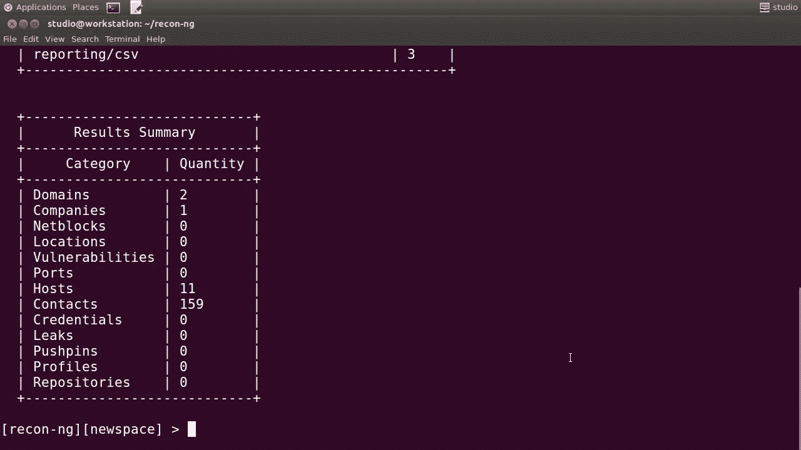
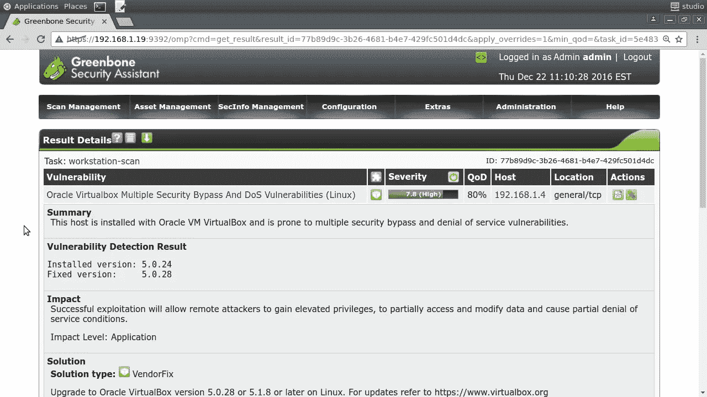
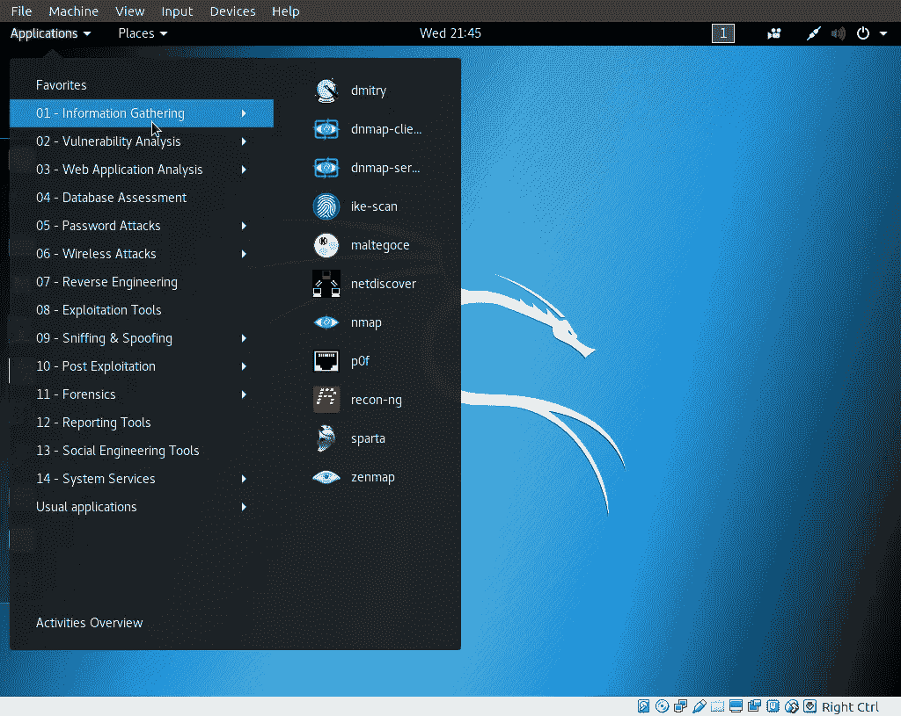

# 渗透测试:选择正确的(Linux)工具栈来修复您的 IT 安全漏洞

> 原文：<https://medium.com/hackernoon/penetration-testing-choosing-the-right-tool-stack-to-fix-your-broken-it-security-b0aa264fd485>

有 IT 基础设施吗？你知道它有多安全吗？答案可能会很伤人，但这是一个坏消息，你最好早点知道。

找出您的服务器发生了什么的唯一合理可靠的方法是应用一轮可靠的渗透测试。您的最终目标是发现任何危险的漏洞，以便锁定它们。

我所说的“危险的漏洞”是指明显的东西，比如未受保护的开放端口和未打补丁的软件。但我也指的是关于你的组织的自由可用的情报的存在，这些情报可能只是在互联网上浮动，等待被收集并反对你。

笔测试由三个非常不同的部分组成，每个部分都有自己独特的工具和协议。

*   **被动信息收集**，测试人员搜索公共互联网，寻找微妙的线索或不小心泄露的私人数据，这些数据可能会被用来反对组织。
*   **主动信息收集**，对组织的网络和服务器进行扫描，寻找潜在的漏洞。
*   **识别可能针对组织基础设施的漏洞**。

让我们一次看一个。

## 被动信息收集

假设你的公司有大约 50 名员工和一些外部承包商，他们中的每一个人很可能都活跃在职业和个人社交网络上。假设你已经有了一系列常见的企业和产品网站以及社交媒体账户(比如 LinkedIn)。

现在暂停一会儿，试着想象你是一名黑客，正在搜索关于你公司的可利用信息，他可以利用这些信息发起攻击。假设他只使用公共网络，不违反任何法律，你认为他会发现多少？

不太多？毕竟没有人会傻到把密码和账号信息发到网上吧？

也许吧。但是你不会相信使用**是什么**来计算出黑客需要的所有密码和管理信息是多么容易。不相信我？自己做一些被动的信息收集。

在可以帮助你的奇妙/可怕的信息收集工具中(也包括 Maltego 和 Shodan ),有一个很棒的基于 Linux 的开源包，名为 Recon-ng——关于它，我在 Pluralsight 上创建了一个[视频课程。](http://pluralsight.pxf.io/c/1191769/424552/7490?subId1=solving&u=https%3A%2F%2Fapp.pluralsight.com%2Fprofile%2Fauthor%2Fdavid-clinton)

你首先要提供一些关于你公司的信息，并选择你感兴趣的特定扫描。所有的艰苦工作都将由他们称为模块的工具来完成。90 多个可用模块中的每一个都是一个脚本，它从侦察数据库中读取数据，并对一些远程数据资源发起扫描操作。

根据您的选择，Recon-ng 将智能地梳理海量的 DNS、社交媒体和搜索引擎结果，以及针对新开发人员的信息丰富的职位发布和与您的目标相关的内部电子邮件地址的提示。完成后，软件会准备一份报告，保证让你大吃一惊。

A text-based report based on a few Recon-NG scans

有了这些信息，黑客所要做的就是筛选数据，并为你的攻击设定启动日期。有了这些信息，所有**你**要做的就是加强防御，并告诉你的团队在网上交流时要更加小心**很多**。

我上面用的那个 OSINT 缩写？它代表开源智能。任何人都能得到的东西。

## 主动收集信息(漏洞评估)

除了你在互联网上随意放置的所有东西，黑客可能还可以从基础设施本身了解到更多关于你的基础设施的信息。如果您的服务器在网络上，这是因为，在某种程度上，您希望将它们暴露给网络用户。但这也可能暴露你宁愿保持沉默的事情，包括你可能正在运行的软件有缺陷，容易被利用。

好消息是政府和行业参与者——像美国政府的 NIST 和他们的[国家漏洞数据库](https://nvd.nist.gov/)——几十年来一直在积极跟踪软件漏洞，他们免费提供他们的信息。坏消息是，他们的数据库包含成千上万的漏洞，这使得阅读非常枯燥。

您希望能够快速、定期地扫描您的网络和连接到网络的设备，以确保没有需要修补的东西，但手动完成这一任务是不可能的。所以忘掉人类吧。你需要软件。

漏洞扫描器是一种软件工具，可以自动扫描您的网络和服务器，查找未打补丁的软件、开放的端口、错误配置的服务和潜在的利用途径(如 SQL 注入或跨站脚本)。一般来说，该软件将处理漏洞数据，并搜索任何与您已经运行的匹配。您的工作是定义目标，设置想要运行的扫描类型，阅读从另一端出来的报告，最重要的是修复任何损坏的东西。

带有免费层的商业扫描包包括 Nessus、Nexpose 和 Burp Suite。OpenVAS 是一个成熟的、完全开源的工具，它可以处理你扔给它的任何东西。而且，最方便的是，碰巧我的 Pluralsight 收藏还包括一个使用 OpenVAS 的[视频指南。](http://pluralsight.pxf.io/c/1191769/424552/7490?subId1=solving&u=https%3A%2F%2Fapp.pluralsight.com%2Fprofile%2Fauthor%2Fdavid-clinton)

The results page of an OpenVAS scan — using their Greenbone browser interface

Kali Linux 发行版是运行各种扫描和测试的优秀平台。Kali 本身在默认情况下是高度安全的，附带几十个预配置的网络和安全软件包。OpenVAS 虽然很容易安装到 Kali 上，但由于其大小，它被排除在默认配置文件之外。

Some pen-testing-friendly software packages available in Kali Linux right out of the box

通常在像 [VirtualBox](https://hackernoon.com/virtualbox-are-you-getting-your-moneys-worth-4d7f98f3d7d2) 这样的虚拟环境中运行 Kali，而不是让它占用整个物理机器。这样，您就可以安全地将您的测试与您的常规计算活动隔离开来……更不用说为您节省大量的时间和金钱了。

## 利用(渗透)测试

这里( ***after*** 获得组织管理层的明确授权)是您的 pen 测试人员尝试实际穿透您的防御的地方，看看他们能进入多远。测试人员将利用 Metasploit 框架(通常也从 Kali Linux 上运行)之类的工具，对目标基础设施执行实时攻击。我的坏运气:我没有关于 Metasploit 的课程，但是其他的 Pluralsight 作者肯定有。

直接目标是利用在扫描过程的早期阶段发现的任何网络或操作系统漏洞。但是最终的想法，当然，是关闭你的笔测试揭示的安全漏洞。如果你不利用它来提高，世界上所有的测试都不会给你带来任何好处。

除了您将使用的纯技术黑客工具之外，pen 测试的开发阶段还可以结合一些优秀的传统社会工程。在这种情况下(获得授权后)，你可以使用电子邮件、电话和个人联系来试图欺骗员工放弃敏感信息。

这是一项繁重的工作，需要大量的训练和准备才能做好。但是如果你对你公司的 IT 资源负责，你不能把笔测试留到以后。

那么你的下一步是什么？如果你是一个自己动手型的人，那么尽一切办法，仔细浏览一些在线资源或课件，然后一头扎进去。否则，找一个你可以信任的专业人士，看看他们有什么建议。

祝你好运！

不要认为我只是某种一维的极客。除了我的 [*Pluralsight 课程*](http://pluralsight.pxf.io/c/1191769/424552/7490?subId1=solving&u=https%3A%2F%2Fapp.pluralsight.com%2Fprofile%2Fauthor%2Fdavid-clinton) *之外，我还写关于 Linux 和 AWS 的* [*书籍课程*](https://bootstrap-it.com/) *甚至还有一个叫做*[*Linux in Motion*](https://www.manning.com/livevideo/linux-in-motion?a_aid=bootstrap-it&a_bid=0c56986f&chan=motion1)*的混合课程，它由两个多小时的视频和我的*[*Linux in Action*](https://www.manning.com/books/linux-in-action?a_aid=bootstrap-it&a_bid=4ca15fc9)*的 40%的内容组成好的。所以我想我是某种一维的怪胎。*