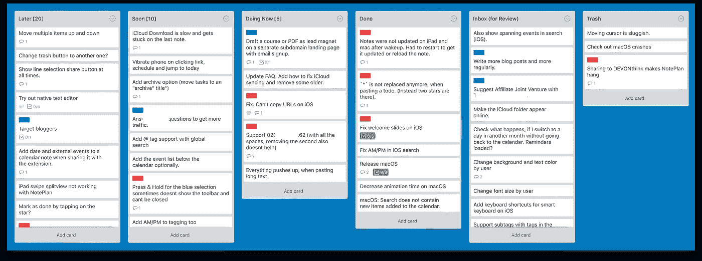
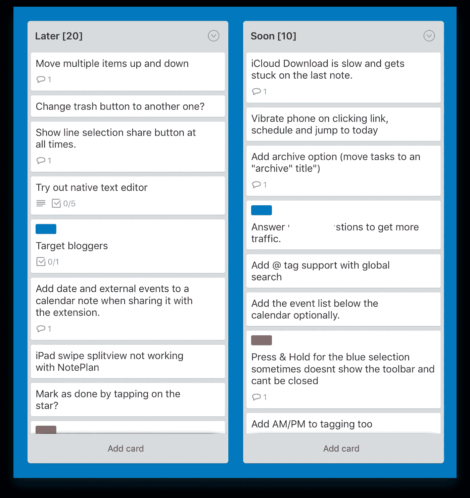
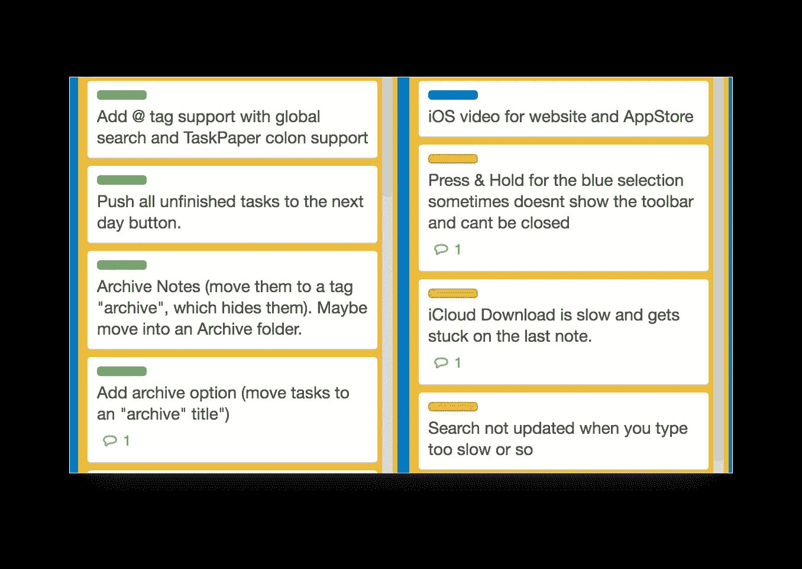

# 个人看板

> 原文：<https://medium.com/hackernoon/personal-kanban-11f6a5196b00>

看板是一种很好的计划方法，可以将简单的生产过程可视化。它不仅适用于团队，而且作为任何项目的个人板也非常有用。

开始时，你可以使用免费工具，如 [Trello](http://trello.com/) 或者甚至是带便利贴的白板。如果你正在做多个项目，我建议你创建多个董事会。每个项目一个。作为一个例外，较小的项目可以汇总到一个单一的董事会。这真的取决于你要处理的待办事项和信息的数量。当你不用太多东西填满看板时，你就能最好地利用看板——就像大多数工具一样。

开始吧！从左到右创建多个列表或栏:

*   **收件箱**(或 backlog) =在这里收集每一个想法、功能需求、bug 或所有未处理的“东西”。意味着你不必优先考虑或把它放入特定的类别。它只是一个地方，你可以把所有的东西都倒出来，供以后回顾。所以你现在不用处理。这个列表可以包含无限数量的项目。但是你应该定期检查和清理你不再真正需要的东西。
*   **下一步** =你接下来想做的所有事情。这是一种通用的动作列表。把近期对你来说很重要并且你已经确认值得做的事情写在这里。您可以将“收件箱”中的项目放入此列表。这个列表应该有 5-10 个项目的限制。
*   **现在做** =名字说出来的。把你正在做的事情留在这里。当你完成了上一步的工作后，你可以将“下一步”中的卡片拉到这个列表中。保持 1-3 张牌的严格限制。这就像一个重点行动清单。
*   **完成** =一旦任务完成，你就可以把任务拉过来停在这里。这只是下一次复习的临时场所。一旦你做了检查，你就可以将列表中的所有卡片存档。
*   这是一个放置所有变得无关紧要的卡片的地方。因为你把几乎所有的事情都记在了收件箱里，所以很多事情可能被认为是不值得做的。你可以把这些东西放在这里，直到下次检查。就像完成清单一样，定期清除这个清单。避免保留信息少、效果差的卡片。它们会在您的系统中制造噪音，使管理变得更加困难。如果将来证明它很重要，它会再次出现。然后你可以翻出你的档案或创建一张新卡。

**更大的项目**

如果你有更大的项目，你可以添加更多的列表，就像我在上面开发 NotePlan 时做的那样。我没有列出“下一个”，而是列出了两个列表:“稍后”(限制= 20)，“很快”(限制= 10)。

除了使用“稍后”和“不久”之外，这也可以分成粗略的估计，例如“本月”、“本季度”、“今年”、“某一天”等等。这要看你有多少卡，又有多少是你真正想办的。这也取决于，如果你有一个团队，在卡上工作。看板非常灵活。您可以随时添加新列表并微调您的工作流程。

例如:如果您在将软件发布上传到公众之前测试它，您可以在将卡片移动到“完成”之前添加一个列表“测试”。或者“代码评审”或者只是一个普通的“评审”，如果它不是一个软件项目的话。

如果你正在使用 Trello，我推荐 chrome 扩展 [WIP](https://chrome.google.com/webstore/detail/kanban-wip-for-trello/oekefjibcnongmmmmkdiofgeppfkmdii) 为你的列表创建一个卡片限制。

## 保持工作正常的一些要点

*   限制每个列表的卡片数量(比如 10-20 张)。也称为“进行中的工作”限制。
*   限制卡片标题的长度(比如 max。约 140 个字符)
*   如果您使用的软件支持，请在卡的描述中添加任何额外信息或作为注释。
*   定期检查你的卡片(稍后会详细介绍)。

## 对于“产品人员”:获取反馈

如果你从事任何一种产品，你都会得到客户的反馈。以原始形式复制此反馈，并将其粘贴到卡片上作为参考(例如粘贴到评论部分)。

这将在多个方面帮助你:

1.  你将大致了解谁和多少人在谈论你产品的某一部分——功能、缺陷或更普遍的问题。这给了你一个想法，比如一个特性有多重要，你应该把重点放在哪里。
2.  它帮助您的开发团队(或者您自己，如果您是开发人员的话)找到最佳解决方案，并且阅读原始反馈会更容易理解困难。此外，阅读直接来自真实客户的反馈，而不是收到经过处理的反馈，会更有激励性。原始的、不带偏见的版本对于发现复杂的声音问题的简单解决方案非常有用(一旦你发现实际问题是什么)。

## 磨尖

使用彩色标签创建任务类别。比如“bug”、“营销”、“设计”或者“支持”。

这有助于你在飞行中对卡片进行优先排序，重要的事情不会轻易淹没在不太重要的卡片之间。上面我已经标记了关键特性、缺陷和营销活动。我不在每张卡片上做标记，只标记重要的卡片。

## 复习

像在任何其他生产力系统中一样，检查卡片和清理系统以保持一个概览是很重要的。在这里，每隔 1-2 周，应对所有卡进行审查、重新排序、清理和更新。如果你不去回顾和清理，你最终会得到一打旧卡，这些旧卡永远不会结束，或者说这些旧卡不是真正可操作的，实际上属于其他地方。它们会制造噪音，让你更难关注对你至关重要的事情。最终，你可能会完全停止使用这个系统，因为它给你带来的困惑多于帮助。因此，审查所有的卡，以保持你的董事会健康。

## 基于列表的系统和看板

与纯粹基于列表的系统(带 todos 的标签列表)相比，看板可以更好地可视化工作流。在这个例子中，看板代替了开发部分的项目相关注释。但是看板真的不适合存储参考材料，比如长文本、电子表格、清单、规格等等。基本上任何有很多内容的东西或者任何会产生很多卡片的东西，都是不太具有可操作性的。如果新信息不适合你的看板工作流程，它就不适合你的看板系统。因此，保持一个基于列表的系统来存储不可操作的项目和一个看板来可视化你的工作流程是有意义的。

我个人将管理 NotePlan 的开发从简单的基于文本的列表转移到 Trello，因为我需要更动态的东西，在那里我可以更容易地移动文本块(或卡片)。也很难在列表中可视化你的工作流程。

*原载于 2017 年 5 月 6 日*[*【www.noteplan.co】*](http://www.noteplan.co/blog/personal-kanban/)*。*

> [黑客中午](http://bit.ly/Hackernoon)是黑客如何开始他们的下午。我们是 [@AMI](http://bit.ly/atAMIatAMI) 家庭的一员。我们现在[接受投稿](http://bit.ly/hackernoonsubmission)并乐意[讨论广告&赞助](mailto:partners@amipublications.com)机会。
> 
> 如果你喜欢这个故事，我们推荐你阅读我们的[最新科技故事](http://bit.ly/hackernoonlatestt)和[趋势科技故事](https://hackernoon.com/trending)。直到下一次，不要把世界的现实想当然！

